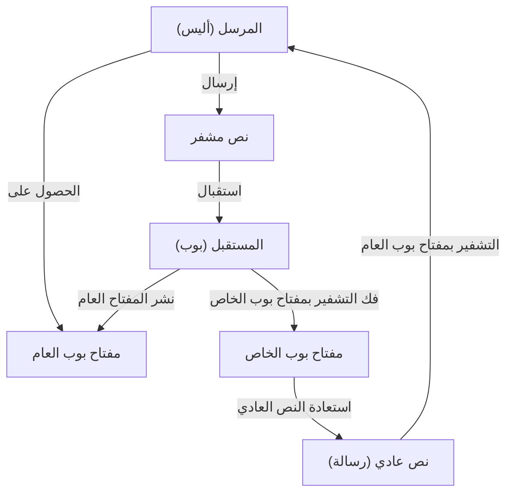
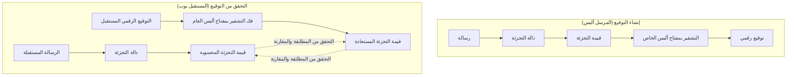
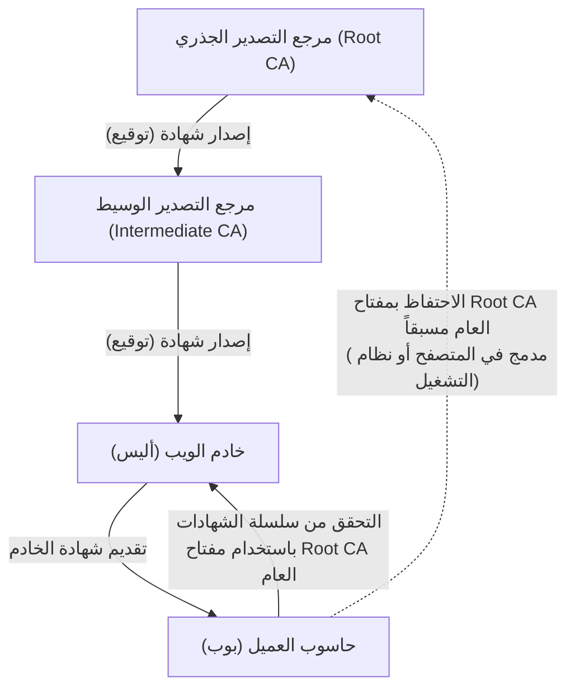

في مجتمع الإنترنت الحديث، يعتبر **أمن المعلومات** أساساً لا غنى عنه لضمان سرية وسلامة وتوافر المعلومات. الركيزة الأساسية التي تدعم ذلك هي تقنية **التشفير الحديث** . في هذه المقالة، سنشرح بشكل شامل ومفصل أساسيات التشفير الحديث: **تشفير المفتاح العام** ، **دوال التجزئة** ، و **التوقيع الرقمي** ، بدءاً من خلفيتها الرياضية وهياكل الخوارزميات المحددة، وصولاً إلى أمثلة تنفيذية باستخدام لغة بايثون.

---

## 1. تطور تقنيات التشفير: من التشفير المتماثل إلى تشفير المفتاح العام

### 1.1. التشفير المتماثل وحدوده
طريقة التشفير المستخدمة منذ القدم هي **التشفير المتماثل** (Symmetric-key cryptography) التي تستخدم نفس المفتاح لكل من التشفير وفك التشفير. من أبرز الخوارزميات المستخدمة معيار التشفير المتقدم (AES). يتميز التشفير المتماثل بسرعته العالية، ولكن نقطة ضعفه الأكبر تكمن في **مشكلة توزيع المفاتيح** (Key Distribution Problem).

يجب على كلا الطرفين اللذين يتواصلان مشاركة نفس المفتاح مسبقاً عبر قناة آمنة، ولكن توزيع المفاتيح بشكل آمن عبر شبكة مفتوحة مثل الإنترنت يُعد أمراً في غاية الصعوبة.

### 1.2. ولادة تشفير المفتاح العام
لحل مشكلة توزيع المفاتيح بنهج رياضي، تم ابتكار **تشفير المفتاح العام** (Public-key cryptography). في تشفير المفتاح العام، يتم إنشاء زوج من مفتاحين مختلفين: **المفتاح العام** (Public Key) المستخدم للتشفير، و **المفتاح الخاص** (Private Key) المستخدم لفك التشفير.

- **المفتاح العام** : مفتاح يمكن نشره لأي شخص. يُستخدم لتشفير الرسائل.
- **المفتاح الخاص** : مفتاح يحتفظ به مالكه بسرية تامة. يُستخدم لفك تشفير النصوص المشفرة.

بفضل هذا التباين، ينشر المستقبل مفتاحه العام للعالم بأسره، ويستخدم المرسل هذا المفتاح العام للتشفير. لا يمكن فك تشفير البيانات المشفرة إلا بواسطة المستقبل الذي يمتلك المفتاح الخاص المقابل.



---

## 2. الخلفية الرياضية لتشفير المفتاح العام

يعتمد أمان تشفير المفتاح العام على **الدالة أحادية الاتجاه** (One-way function)، حيث "يكون الحساب في اتجاه واحد سهلاً، ولكن الحساب العكسي يكون في غاية الصعوبة"، و **الدالة أحادية الاتجاه ذات الباب الخلفي** (Trapdoor one-way function) التي تتيح الحساب العكسي إذا كان هناك معلومات معينة (باب خلفي: Trapdoor) معروفة. هنا سنتعمق في تفاصيل تشفير RSA وتشفير المنحنيات الإهليلجية ([ECC](/ar/p/elliptic-curve-cryptography-math-cpp/)) كأمثلة بارزة.

### 2.1. كيفية عمل تشفير RSA

تم تطوير تشفير RSA في عام 1977 بواسطة رون ريفست (Ron Rivest)، عدي شامير (Adi Shamir)، وليونارد أدلمان (Leonard Adleman). يعتمد أمان تشفير RSA على **صعوبة مشكلة تحليل العوامل الأولية** . من السهل ضرب عددين أوليين ضخمين معاً، ولكن استنتاج الأعداد الأولية الأصلية من حاصل ضربهما لا يمكن حله في وقت عملي باستخدام الحواسيب الكلاسيكية الحالية.

#### 2.1.1. خوارزمية إنشاء مفتاح RSA

يتم إنشاء مفتاح RSA بالخطوات التالية:

1. اختيار عددين أوليين كبيرين جداً $p$ و $q$.
2. حساب حاصل ضربهما $N = p \times q$. ($N$ هو المعامل الذي سيتم نشره).
3. حساب دالة مؤشر أويلر $\phi(N)$.
   $ \phi(N) = (p - 1)(q - 1) $
4. اختيار عدد صحيح $e$ بحيث يكون $1 < e < \phi(N)$ ويكون أوليًا نسبيًا مع $\phi(N)$. (عادة ما يُستخدم $e = 65537$).
5. حساب $d$ الذي يحقق التطابق التالي:
   $ e \times d \equiv 1 \pmod{\phi(N)} $
   يمكن حساب ذلك باستخدام [خوارزمية إقليدس](/ar/p/euclidean-algorithm/) الممتدة.

هنا، يكون الزوج $(N, e)$ هو **المفتاح العام** ، و $d$ هو **المفتاح الخاص** (يجب إتلاف $p, q$ أو حفظهما بسرية تامة).

#### 2.1.2. معادلات التشفير وفك التشفير

لنفترض أن النص العادي هو $M$ (بحيث يكون $0 \le M < N$)، والنص المشفر هو $C$.

**التشفير** (باستخدام المفتاح العام $e, N$):
$ C \equiv M^e \pmod{N} $

**فك التشفير** (باستخدام المفتاح الخاص $d, N$):
$ M \equiv C^d \pmod{N} $

يعمل فك التشفير هذا بشكل صحيح بناءً على مبرهنة أويلر $M^{\phi(N)} \equiv 1 \pmod{N}$.
$ C^d \equiv (M^e)^d \equiv M^{ed} \equiv M^{k\phi(N) + 1} \equiv M \cdot (M^{\phi(N)})^k \equiv M \cdot 1^k \equiv M \pmod{N} $

### 2.2. تشفير المنحنى الإهليلجي (ECC: Elliptic Curve Cryptography)

يعتبر تشفير RSA آمناً، ولكن لتوفير قوة أمان كافية يتطلب الأمر استخدام طول مفتاح طويل جداً (مثلاً 2048 بت أو 4096 بت). في المقابل، يقدم **تشفير المنحنى الإهليلجي** مستوى أمان مكافئاً باستخدام مفاتيح أقصر بكثير.

#### 2.2.1. المنحنيات الإهليلجية ومشكلة اللوغاريتم المتقطع

يعتمد أمان [ECC](/ar/p/elliptic-curve-cryptography-math-cpp/) على صعوبة **مشكلة اللوغاريتم المتقطع على المنحنيات الإهليلجية** (ECDLP).
يتم تمثيل المنحنى الإهليلجي على حقل منته $\mathbb{F}_p$ المستخدم في التشفير بشكل عام بالصيغة القياسية لوايرستراس (Weierstrass):

$ y^2 \equiv x^3 + ax + b \pmod{p} $

(حيث أن $4a^3 + 27b^2 \not\equiv 0 \pmod{p}$)

يتم تعريف عملية جمع النقاط على المنحنى الإهليلجي، وعملية جمع نفس النقطة عدة مرات (الضرب القياسي).
لنفترض أن النقطة الأساسية المرجعية (Base Point) هي $G$، وأن جمعها $k$ من المرات يعطي النقطة $P$.

$ P = k \times G $

هنا، تُعرف مشكلة إيجاد القيمة القياسية $k$ عندما يكون معلوماً لدينا $G$ و $P$ بـ **مشكلة اللوغاريتم المتقطع للمنحنى الإهليلجي** . عندما تكون قيمة $k$ كبيرة بما يكفي، يكون من الصعب للغاية عكس الحساب رياضياً لإيجادها.
في [ECC](/ar/p/elliptic-curve-cryptography-math-cpp/)، يكون $k$ هو **المفتاح الخاص** ، و $P$ هو **المفتاح العام** .

### 2.3. مثال تنفيذي لتشفير المفتاح العام باستخدام بايثون

إليك مثال يوضح كيفية إنشاء مفاتيح RSA وتشفير وفك تشفير الرسائل باستخدام مكتبة `cryptography` في لغة بايثون.

```python
from cryptography.hazmat.primitives.asymmetric import rsa
from cryptography.hazmat.primitives.asymmetric import padding
from cryptography.hazmat.primitives import hashes
import base64

# 1. إنشاء زوج مفاتيح RSA
private_key = rsa.generate_private_key(
    public_exponent=65537,
    key_size=2048,
)
public_key = private_key.public_key()

# 2. تعريف الرسالة
message = "هذه رسالة سرية للغاية حول التشفير الحديث.".encode('utf-8')

# 3. التشفير باستخدام المفتاح العام (باستخدام حشوة OAEP)
ciphertext = public_key.encrypt(
    message,
    padding.OAEP(
        mgf=padding.MGF1(algorithm=hashes.SHA256()),
        algorithm=hashes.SHA256(),
        label=None
    )
)
print("النص المشفر (Base64):", base64.b64encode(ciphertext).decode('utf-8'))

# 4. فك التشفير باستخدام المفتاح الخاص
decrypted_message = private_key.decrypt(
    ciphertext,
    padding.OAEP(
        mgf=padding.MGF1(algorithm=hashes.SHA256()),
        algorithm=hashes.SHA256(),
        label=None
    )
)
print("الرسالة التي تم فك تشفيرها:", decrypted_message.decode('utf-8'))
```

---

## 3. دوال التجزئة (Hash Functions)

جنباً إلى جنب مع تشفير المفتاح العام، تمثل **دوال التجزئة المشفرة** ركيزة أخرى للتشفير الحديث. تأخذ دالة التجزئة بيانات ذات طول تعسفي كمدخل، وتخرج بيانات ذات طول ثابت تبدو كأنها عشوائية تماماً (قيمة التجزئة أو الملخص).

### 3.1. الخصائص الثلاث المطلوبة في دوال التجزئة المشفرة

لضمان الاستخدام الآمن كتقنية تشفير، يجب أن تتوافر الخصائص القوية الثلاث التالية:

1. **أحادية الاتجاه** (Pre-image resistance):
   أن يكون من الصعب حسابياً استنتاج رسالة الإدخال الأصلية $m$ من قيمة التجزئة الناتجة $h$.
2. **مقاومة التصادم الضعيفة** (Second pre-image resistance):
   عند إعطاء رسالة إدخال $m_1$، يكون من الصعب إيجاد رسالة أخرى $m_2$ ($m_1 \neq m_2$) تنتج نفس قيمة التجزئة.
3. **مقاومة التصادم القوية** (Collision resistance):
   أن يكون من الصعب العثور على أي زوج من الرسائل $(m_1, m_2)$ ينتج نفس قيمة التجزئة.

### 3.2. هيكل SHA-2 (Secure Hash Algorithm 2)

دالة التجزئة الأكثر استخداماً في الوقت الحالي هي عائلة SHA-2 (خاصة **SHA-256**). تعتمد SHA-2 على **هيكل ميركل-دامغارد** (Merkle-Damgård).

في هيكل ميركل-دامغارد، يتم تقسيم رسالة الإدخال إلى كتل ذات طول ثابت (512 بت في حالة SHA-256)، ويتم إجراء عملية حشوة (Padding) لضبط الطول. ثم يتم إدخال قيمة التجزئة الأولية (IV) والكتلة الأولى في **دالة الضغط** (Compression function)، وتُمرر المخرجات كمدخلات للكتلة التالية بشكل متسلسل.

$ H_i = f(H_{i-1}, M_i) $

يتيح هذا الهيكل المتسلسل توليد ملخص آمن ذي طول ثابت من أي رسالة بغض النظر عن طولها.

### 3.3. هيكل SHA-3 (Keccak)

البديل ومعيار الجيل التالي الذي اختاره المعهد الوطني للمعايير والتقنية (NIST) ليحل محل SHA-2 هو **SHA-3** (خوارزمية Keccak). لا يستخدم SHA-3 هيكل ميركل-دامغارد، بل يعتمد على هيكل مختلف تماماً وهو **هيكل الإسفنج** (Sponge).

يحافظ هيكل الإسفنج على حالة داخلية، ويعمل في المرحلتين التاليتين:

- **مرحلة الامتصاص (Absorb)** : يتم تطبيق عملية XOR (الجمع المنطقي الاستبعادي) بين كتل الرسائل وسلسلة بتات الحالة الداخلية بمعدل ثابت (Rate)، ومن ثم تُطبق دالة تبديل داخلية (Permutation function $f$) لامتصاص البيانات تدريجياً.
- **مرحلة العصر (Squeeze)** : بعد اكتمال امتصاص البيانات، يتم استخراج (عصر) البيانات من الحالة الداخلية بشكل منتظم، وتكرار تطبيق دالة التبديل $f$ وعملية الاستخراج حتى الوصول إلى طول المخرجات المطلوب.

بفضل هذا الهيكل، يفتخر SHA-3 بأمان قوي جداً، حيث لا تؤثر فيه أساليب الهجوم الحالية التي كانت تستهدف SHA-2 إطلاقاً.

### 3.4. مثال تنفيذي لدالة التجزئة باستخدام بايثون

```python
from cryptography.hazmat.primitives import hashes

message = "يعتمد التشفير الحديث بشكل كبير على دوال التجزئة الآمنة.".encode('utf-8')

# توليد SHA-256
digest_sha256 = hashes.Hash(hashes.SHA256())
digest_sha256.update(message)
hash_result_sha256 = digest_sha256.finalize()
print("SHA-256:", hash_result_sha256.hex())

# توليد SHA-3 (SHA3-256)
digest_sha3 = hashes.Hash(hashes.SHA3_256())
digest_sha3.update(message)
hash_result_sha3 = digest_sha3.finalize()
print("SHA3-256:", hash_result_sha3.hex())
```

---

## 4. التوقيع الرقمي (Digital Signatures)

من خلال دمج تشفير المفتاح العام ودوال التجزئة، يمكن تحقيق **التوقيع الرقمي** ، وهو المكافئ الإلكتروني لـ "الختم" أو "التوقيع" في العالم الحقيقي. يضمن التوقيع الرقمي **سلامة** الرسالة (أنها لم تُعدل)، و **مصادقة المرسل** (أنه ليس شخصاً ينتحل صفته)، بالإضافة إلى **منع التنصل** (عدم القدرة على إنكار حقيقة إرسال الرسالة).

### 4.1. كيفية عمل التوقيع الرقمي

المفهوم الأساسي للتوقيع الرقمي هو " **الاستخدام العكسي لتشفير المفتاح العام** ".

في التشفير العادي يتم "التشفير بالمفتاح العام، وفك التشفير بالمفتاح الخاص"، بينما في التوقيع الرقمي يتم " **توليد التوقيع بالمفتاح الخاص (ما يعادل التشفير)، والتحقق من التوقيع بالمفتاح العام (ما يعادل فك التشفير)** ". نظراً لأن صاحب المفتاح الخاص هو الوحيد الذي يمتلكه، فإن التوقيع المنشأ باستخدام هذا المفتاح يمثل دليلاً قاطعاً على أنه هو من أنشأه.

ولكن، تطبيق خوارزميات المفتاح العام (مثل RSA) مباشرة على البيانات بالكامل يتطلب تكلفة حسابية هائلة. لذلك، من الناحية العملية، يتم دائماً استخدام **دالة التجزئة** معها.

### 4.2. مسار إنشاء التوقيع والتحقق منه



1. **إنشاء التوقيع** : يقوم المرسل بحساب قيمة التجزئة للرسالة، ثم يشفرها بمفتاحه الخاص لإنشاء "بيانات التوقيع". يرسل بعد ذلك نص الرسالة وبيانات التوقيع إلى المستقبل.
2. **التحقق من التوقيع** : يقوم المستقبل بحساب قيمة التجزئة للرسالة المستقبلة بنفسه. في الوقت نفسه، يقوم بفك تشفير بيانات التوقيع المستلمة باستخدام المفتاح العام للمرسل لاستخراج قيمة التجزئة الأصلية. إذا تطابقت قيمتا التجزئة تماماً، ينجح التحقق.

### 4.3. مثال تنفيذي للتوقيع الرقمي باستخدام بايثون (RSA)

```python
from cryptography.hazmat.primitives.asymmetric import padding
from cryptography.hazmat.primitives import hashes
from cryptography.exceptions import InvalidSignature
import base64

# الرسالة
doc_message = "وثيقة عقد: يوافق الطرف أ على دفع 1000 دولار للطرف ب.".encode('utf-8')

# 1. إنشاء التوقيع (باستخدام المفتاح الخاص)
signature = private_key.sign(
    doc_message,
    padding.PSS(
        mgf=padding.MGF1(hashes.SHA256()),
        salt_length=padding.PSS.MAX_LENGTH
    ),
    hashes.SHA256()
)
print("التوقيع الرقمي:", base64.b64encode(signature).decode('utf-8')[:50], "...")

# 2. التحقق من التوقيع (باستخدام المفتاح العام)
try:
    public_key.verify(
        signature,
        doc_message,
        padding.PSS(
            mgf=padding.MGF1(hashes.SHA256()),
            salt_length=padding.PSS.MAX_LENGTH
        ),
        hashes.SHA256()
    )
    print("التوقيع صالح. تم التحقق من سلامة وصحة الوثيقة.")
except InvalidSignature:
    print("التوقيع غير صالح. ربما تم العبث بالوثيقة.")
```

---

## 5. البنية التحتية للمفتاح العام (PKI: Public Key Infrastructure)

في حين أن التوقيعات الرقمية توفر سلامة البيانات ومصادقة المرسل، يظل هناك نقطة ضعف قاتلة في النظام ككل. وهي مشكلة: " **هل المفتاح العام المستخدم هو حقاً المفتاح العام الصحيح للطرف المتصل (أليس)؟** ".

إذا قام المهاجم (إيف) بانتحال شخصية أليس وأعطى مفتاحه العام لبوب، واقتنع بوب بأنه "مفتاح أليس العام"، فإن إيف يمكنه انتحال شخصية أليس لفك تشفير الاتصالات المشفرة أو جعل بوب يتحقق من توقيعات مزورة. يُطلق على هذا اسم **هجوم الوسيط** (Man-in-the-Middle Attack).

لضمان شرعية المفتاح العام وبناء سلسلة من الثقة، تم إنشاء بنية تحتية اجتماعية تُعرف بـ **PKI (البنية التحتية للمفتاح العام)** .

### 5.1. مرجع التصدير (CA) والشهادات الرقمية (X.509)

يتمحور نظام PKI حول كيان طرف ثالث موثوق به يُعرف بـ **مرجع التصدير** أو سلطة الشهادات (CA: Certificate Authority). دور CA هو فحص هوية الأفراد أو ملكية النطاقات، ثم إصدار **شهادة رقمية** (شهادة مفتاح عام) تتضمن "المفتاح العام" للمستهدف موقعاً إلكترونياً بـ "المفتاح الخاص" الخاص بـ CA.

تُستخدم **X.509** على نطاق واسع كمعيار للشهادات الرقمية. تحتوي الشهادة على المعلومات التالية:
- الإصدار، الرقم التسلسلي
- خوارزمية التوقيع
- معلومات تحديد جهة الإصدار (CA)
- فترة الصلاحية
- معلومات تحديد الموضوع (الخادم أو الفرد)
- **المفتاح العام للموضوع**
- **التوقيع الرقمي من قبل CA**

### 5.2. رسم بياني لنموذج الثقة في PKI



حتى عند زيارة المواقع التي تبدأ بـ "https://" عبر المتصفح، فإن آلية PKI تعمل بكامل طاقتها في الخلفية. يتم إنشاء قناة اتصال آمنة (TLS) من خلال قيام المتصفح بالتحقق من التوقيع على الشهادة المُرسلة من الخادم باستخدام المفتاح العام لمرجع التصدير الجذري المثبت مسبقاً على المتصفح.

---

## 6. الخلاصة

يعتمد المجتمع الرقمي الحديث على مزيج متقن من **تقنيات التشفير** التي شرحناها اليوم.

- تشفير بيانات سريع باستخدام **التشفير المتماثل**
- تبادل آمن للمفاتيح وتحقيق التباين باستخدام **تشفير المفتاح العام** (RSA و [ECC](/ar/p/elliptic-curve-cryptography-math-cpp/))
- استخراج بصمات البيانات باستخدام **دوال التجزئة** (SHA-2/3)
- إثبات السلامة والمصادقة من خلال **التوقيع الرقمي**
- ضمان صحة المفاتيح العامة باستخدام **PKI ومراجع التصدير**

هذا الجمال الرياضي ونظرية الحوسبة الدقيقة تحمي خصوصيتنا وممتلكاتنا يومياً من الهجمات السيبرانية. يستمر تطور تقنيات التشفير، ويجري العمل بسرعة على الأبحاث والتوحيد القياسي لـ **تشفير ما بعد الكم** ([PQC](/ar/p/post-quantum-cryptography/): Post-Quantum Cryptography) استعداداً لظهور الحواسيب الكمومية.

يُعد الفهم الصحيح لأساسيات التشفير الخطوة الأولى نحو تصميم أنظمة وتطبيقات أكثر أماناً وقوة.

---
*المراجع والروابط ذات الصلة*
- NIST FIPS 186-4: Digital Signature Standard (DSS)
- NIST FIPS 202: SHA-3 Standard
- RFC 5280: Internet X.509 Public Key Infrastructure Certificate and Certificate Revocation List (CRL) Profile
