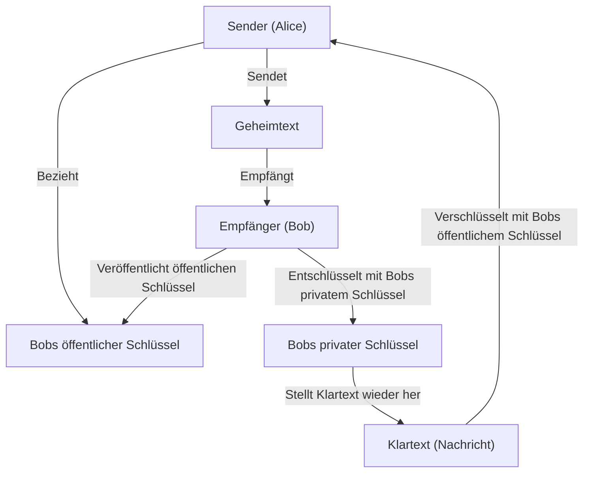
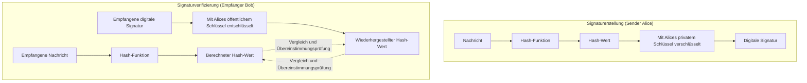

In der modernen Internetgesellschaft ist die **Informationssicherheit** zur Gewährleistung von Vertraulichkeit, Integrität und Verfügbarkeit von Informationen eine unverzichtbare Grundlage geworden. Die Basis dafür bildet die Technologie der **modernen Kryptographie**. In diesem Artikel werden die Grundlagen der modernen Kryptographie – **Public-Key-Kryptographie**, **Hash-Funktionen** und **Digitale Signaturen** – sehr detailliert und umfassend erklärt, von ihren mathematischen Hintergründen über die konkrete Struktur der Algorithmen bis hin zu Implementierungsbeispielen in Python.

---

## 1. Die Evolution der Verschlüsselungstechnologien: Von symmetrischen zu asymmetrischen Schlüsseln

### 1.1. Symmetrische Kryptographie und ihre Grenzen
Eine seit langem verwendete Verschlüsselungsmethode ist die **symmetrische Kryptographie** (Symmetric-key cryptography), bei der derselbe Schlüssel für die Ver- und Entschlüsselung verwendet wird. Ein typischer Algorithmus ist AES (Advanced Encryption Standard). Die symmetrische Kryptographie bietet den Vorteil einer hohen Verarbeitungsgeschwindigkeit, hat jedoch als größte Schwäche das **Schlüsselverteilungsproblem** (Key Distribution Problem).

Beide Kommunikationspartner müssen sich vorher über einen sicheren Kanal auf denselben Schlüssel einigen, aber es ist äußerst schwierig, Schlüssel über ein offenes Netzwerk wie das Internet sicher zu verteilen.

### 1.2. Die Geburt der Public-Key-Kryptographie
Dieses Schlüsselverteilungsproblem wurde durch einen mathematischen Ansatz mit der **Public-Key-Kryptographie** (Public-key cryptography) gelöst. Bei der Public-Key-Kryptographie wird ein Paar aus zwei verschiedenen Schlüsseln generiert: ein **öffentlicher Schlüssel** (Public Key) zur Verschlüsselung und ein **privater Schlüssel** (Private Key) zur Entschlüsselung.

- **Öffentlicher Schlüssel**: Ein Schlüssel, der jedem offengelegt werden kann. Wird verwendet, um Nachrichten zu verschlüsseln.
- **Privater Schlüssel**: Ein Schlüssel, der vom Besitzer streng geheim gehalten wird. Wird verwendet, um den Geheimtext zu entschlüsseln.

Durch diese Asymmetrie kann der Empfänger seinen öffentlichen Schlüssel der ganzen Welt zugänglich machen, und der Sender verschlüsselt mit diesem öffentlichen Schlüssel. Die verschlüsselten Daten können nur von dem Empfänger entschlüsselt werden, der den passenden privaten Schlüssel besitzt.



---

## 2. Mathematischer Hintergrund der Public-Key-Kryptographie

Die Sicherheit der Public-Key-Kryptographie beruht auf **Einwegfunktionen** (One-way functions), bei denen "eine bestimmte Berechnung einfach, aber die Umkehrung extrem schwierig ist", und auf **Einwegfunktionen mit Falltür** (Trapdoor one-way functions), bei denen die Umkehrung möglich wird, wenn man eine bestimmte Information (die Falltür) kennt. Hier betrachten wir die repräsentative RSA-Verschlüsselung und die elliptische Kurven-Kryptographie (ECC) genauer.

### 2.1. Die Funktionsweise der RSA-Verschlüsselung

Die RSA-Verschlüsselung wurde 1977 von Ron Rivest, Adi Shamir und Leonard Adleman entwickelt. Die Sicherheit von RSA beruht auf der **Schwierigkeit des Faktorisierungsproblems**. Es ist einfach, zwei riesige Primzahlen miteinander zu multiplizieren, aber es ist für aktuelle klassische Computer unmöglich, das Produkt in realistischer Zeit wieder in die ursprünglichen Primzahlen zu zerlegen.

#### 2.1.1. RSA-Schlüsselerzeugungsalgorithmus

Die Schlüsselerzeugung bei RSA erfolgt in folgenden Schritten:

1. Wähle zwei sehr große Primzahlen $p$ und $q$.
2. Berechne deren Produkt $N = p \times q$. ($N$ ist der öffentliche Modul)
3. Berechne die Eulersche Phi-Funktion $\phi(N)$.
   $ \phi(N) = (p - 1)(q - 1) $
4. Wähle eine ganze Zahl $e$, so dass $1 < e < \phi(N)$ gilt und $e$ teilerfremd zu $\phi(N)$ ist. (Meistens wird $e = 65537$ verwendet)
5. Berechne $d$, so dass die folgende Kongruenz erfüllt ist:
   $ e \times d \equiv 1 \pmod{\phi(N)} $
   Dies kann mit dem erweiterten euklidischen Algorithmus berechnet werden.

Hierbei bilden $(N, e)$ den **öffentlichen Schlüssel** und $d$ den **privaten Schlüssel** ($p$ und $q$ werden verworfen oder streng geheim gehalten).

#### 2.1.2. Mathematische Formeln für Ver- und Entschlüsselung

Sei $M$ der Klartext (wobei $0 \le M < N$) und $C$ der Geheimtext.

**Verschlüsselung** (unter Verwendung des öffentlichen Schlüssels $e, N$):
$ C \equiv M^e \pmod{N} $

**Entschlüsselung** (unter Verwendung des privaten Schlüssels $d, N$):
$ M \equiv C^d \pmod{N} $

Dass diese Entschlüsselung korrekt funktioniert, liegt am Satz von Euler $M^{\phi(N)} \equiv 1 \pmod{N}$:
$ C^d \equiv (M^e)^d \equiv M^{ed} \equiv M^{k\phi(N) + 1} \equiv M \cdot (M^{\phi(N)})^k \equiv M \cdot 1^k \equiv M \pmod{N} $

### 2.2. Elliptische Kurven-Kryptographie (ECC: Elliptic Curve Cryptography)

Die RSA-Verschlüsselung ist sicher, erfordert jedoch sehr lange Schlüssellängen (z. B. 2048 Bit oder 4096 Bit), um eine ausreichende Stärke zu gewährleisten. Im Gegensatz dazu bietet die **Elliptische Kurven-Kryptographie** bei kürzerer Schlüssellänge die gleiche Sicherheit.

#### 2.2.1. Elliptische Kurven und das diskrete Logarithmusproblem

Die Sicherheit von ECC beruht auf der Schwierigkeit des **diskreten Logarithmusproblems auf elliptischen Kurven** (ECDLP).
Eine elliptische Kurve über einem endlichen Körper $\mathbb{F}_p$, die für die Verschlüsselung verwendet wird, wird im Allgemeinen durch die Weierstraß-Normalform dargestellt:

$ y^2 \equiv x^3 + ax + b \pmod{p} $

(Wobei $4a^3 + 27b^2 \not\equiv 0 \pmod{p}$)

Auf der elliptischen Kurve sind Additionen von Punkten (Punktaddition) und die wiederholte Addition desselben Punktes (Skalarmultiplikation) definiert.
Sei $P$ der Punkt, der entsteht, wenn ein bestimmter Basispunkt $G$ $k$-mal zu sich selbst addiert wird.

$ P = k \times G $

Das Problem, den Skalarwert $k$ zu berechnen, wenn $G$ und $P$ gegeben sind, wird als **elliptisches Kurven diskretes Logarithmusproblem** bezeichnet. Wenn $k$ groß genug ist, ist es extrem schwierig, dies rechnerisch rückgängig zu machen.
Bei ECC ist $k$ der **private Schlüssel** und $P$ der **öffentliche Schlüssel**.

### 2.3. Implementierungsbeispiel der Public-Key-Kryptographie in Python

Hier ist ein Codebeispiel zur Implementierung der RSA-Schlüsselerzeugung, Verschlüsselung und Entschlüsselung mithilfe der `cryptography`-Bibliothek in Python.

```python
from cryptography.hazmat.primitives.asymmetric import rsa
from cryptography.hazmat.primitives.asymmetric import padding
from cryptography.hazmat.primitives import hashes
import base64

# 1. Generierung des RSA-Schlüsselpaares
private_key = rsa.generate_private_key(
    public_exponent=65537,
    key_size=2048,
)
public_key = private_key.public_key()

# 2. Definition der Nachricht
message = b"This is a highly confidential message about modern cryptography."

# 3. Verschlüsselung mit dem öffentlichen Schlüssel (unter Verwendung von OAEP-Padding)
ciphertext = public_key.encrypt(
    message,
    padding.OAEP(
        mgf=padding.MGF1(algorithm=hashes.SHA256()),
        algorithm=hashes.SHA256(),
        label=None
    )
)
print("Ciphertext (Base64):", base64.b64encode(ciphertext).decode('utf-8'))

# 4. Entschlüsselung mit dem privaten Schlüssel
decrypted_message = private_key.decrypt(
    ciphertext,
    padding.OAEP(
        mgf=padding.MGF1(algorithm=hashes.SHA256()),
        algorithm=hashes.SHA256(),
        label=None
    )
)
print("Decrypted Message:", decrypted_message.decode('utf-8'))
```

---

## 3. Hash-Funktionen (Hash Functions)

Neben der Public-Key-Kryptographie sind **kryptographische Hash-Funktionen** ein weiterer Grundpfeiler der modernen Kryptographie. Eine Hash-Funktion ist eine Funktion, die Daten beliebiger Länge als Eingabe annimmt und pseudo-zufällige Daten einer festen Länge (Hash-Wert, Digest) als Ausgabe liefert.

### 3.1. Die drei erforderlichen Eigenschaften von kryptographischen Hash-Funktionen

Um als kryptographische Technologie sicher eingesetzt werden zu können, sind die folgenden drei robusten Eigenschaften erforderlich:

1. **Einwegfunktion** (Pre-image resistance):
   Es muss rechnerisch unmöglich sein, aus dem ausgegebenen Hash-Wert $h$ die ursprüngliche Eingabenachricht $m$ rückzurechnen.
2. **Schwache Kollisionsresistenz** (Second pre-image resistance):
   Wenn eine bestimmte Eingabenachricht $m_1$ gegeben ist, muss es schwierig sein, eine andere Nachricht $m_2$ ($m_1 \neq m_2$) zu finden, die denselben Hash-Wert besitzt.
3. **Starke Kollisionsresistenz** (Collision resistance):
   Es muss schwierig sein, ein beliebiges Paar von zwei Nachrichten $(m_1, m_2)$ zu finden, deren Hash-Werte übereinstimmen.

### 3.2. Struktur von SHA-2 (Secure Hash Algorithm 2)

Die derzeit am weitesten verbreitete Hash-Funktion ist die SHA-2-Familie (insbesondere **SHA-256**). SHA-2 verwendet die **Merkle-Damgård-Konstruktion**.

Bei der Merkle-Damgård-Konstruktion wird die Eingabenachricht in Blöcke fester Länge (bei SHA-256 sind es 512 Bit) aufgeteilt und durch Padding in der Länge angepasst. Dann werden der initiale Hash-Wert (IV) und der erste Block in die **Kompressionsfunktion** (Compression function) eingegeben, und deren Ausgabe wird als Eingabe für den nächsten Block kettenartig verarbeitet.

$ H_i = f(H_{i-1}, M_i) $

Durch diese kettenartige Struktur kann aus einer Nachricht beliebiger Länge ein sicherer Digest fester Länge generiert werden.

### 3.3. Struktur von SHA-3 (Keccak)

Als Alternative und Standard der nächsten Generation zu SHA-2 wurde vom NIST **SHA-3** (Keccak-Algorithmus) ausgewählt. SHA-3 verwendet keine Merkle-Damgård-Konstruktion, sondern die völlig andere **Sponge-Konstruktion** (Schwammkonstruktion).

Die Sponge-Konstruktion behält einen internen [Zustand](https://kenji.blog/de/p/state-management-history-redux-context-recoil-zustand/) bei und arbeitet in den folgenden zwei Phasen:

- **Absorb-Phase (Absorbieren)**: Nachrichtenblöcke werden für jede feste Rate mit der Bitfolge des internen Zustands durch XOR (exklusives ODER) verknüpft, und eine interne Permutationsfunktion $f$ wird angewendet, um die Daten zu absorbieren.
- **Squeeze-Phase (Auspressen)**: Nachdem die Datenabsorption abgeschlossen ist, werden Daten kontinuierlich aus dem internen Zustand entnommen (herausgepresst), und die Anwendung der Permutationsfunktion $f$ sowie die Extraktion werden wiederholt, bis die erforderliche Ausgabelänge erreicht ist.

Dank dieser Konstruktion bietet es eine robuste Sicherheit, bei der bestehende Angriffsmethoden gegen SHA-2 absolut wirkungslos sind.

### 3.4. Implementierungsbeispiel von Hash-Funktionen in Python

```python
from cryptography.hazmat.primitives import hashes

message = b"Modern cryptography heavily relies on secure hash functions."

# Generierung von SHA-256
digest_sha256 = hashes.Hash(hashes.SHA256())
digest_sha256.update(message)
hash_result_sha256 = digest_sha256.finalize()
print("SHA-256:", hash_result_sha256.hex())

# Generierung von SHA-3 (SHA3-256)
digest_sha3 = hashes.Hash(hashes.SHA3_256())
digest_sha3.update(message)
hash_result_sha3 = digest_sha3.finalize()
print("SHA3-256:", hash_result_sha3.hex())
```

---

## 4. Digitale Signaturen (Digital Signatures)

Durch die Kombination von Public-Key-Kryptographie und Hash-Funktionen lassen sich **digitale Signaturen** realisieren, die einem "Siegel" oder einer "Unterschrift" in der realen Welt entsprechen. Digitale Signaturen garantieren die **Integrität** einer Nachricht (dass sie nicht manipuliert wurde), die **Authentifizierung des Senders** (dass es sich nicht um Spoofing handelt) sowie die **Nichtabstreitbarkeit** (dass die Tatsache des Sendens nicht geleugnet werden kann).

### 4.1. Funktionsweise digitaler Signaturen

Das grundlegende Konzept einer digitalen Signatur ist die "**Rückwärtsnutzung der Public-Key-Kryptographie**".

Bei der normalen Verschlüsselung "verschlüsselt man mit dem öffentlichen Schlüssel und entschlüsselt mit dem privaten Schlüssel", aber bei digitalen Signaturen "**erzeugt man die Signatur mit dem privaten Schlüssel (entspricht der Verschlüsselung) und verifiziert die Signatur mit dem öffentlichen Schlüssel (entspricht der Entschlüsselung)**". Da nur die betreffende Person den privaten Schlüssel besitzt, ist eine mit diesem privaten Schlüssel erzeugte Signatur ein unwiderlegbarer Beweis dafür, dass die Person sie erstellt hat.

Wenn jedoch die gesamten Daten direkt mit einem Public-Key-Algorithmus (wie RSA) verarbeitet würden, wären die Rechenkosten enorm. Aus diesem Grund werden in der Praxis immer **Hash-Funktionen** in Kombination verwendet.

### 4.2. Ablauf der Signaturerstellung und -verifizierung



1. **Signaturerstellung**: Der Sender berechnet den Hash-Wert der Nachricht und verschlüsselt diesen mit seinem eigenen privaten Schlüssel, um die "Signaturdaten" zu erstellen. Er sendet die eigentliche Nachricht und die Signaturdaten an den Empfänger.
2. **Signaturverifizierung**: Der Empfänger berechnet selbst den Hash-Wert der empfangenen Nachricht. Gleichzeitig entschlüsselt er die empfangenen Signaturdaten mit dem öffentlichen Schlüssel des Senders, um den ursprünglichen Hash-Wert zu extrahieren. Wenn beide Hash-Werte vollständig übereinstimmen, ist die Verifizierung erfolgreich.

### 4.3. Implementierungsbeispiel einer digitalen Signatur in Python (RSA)

```python
from cryptography.hazmat.primitives.asymmetric import padding
from cryptography.hazmat.primitives import hashes
from cryptography.exceptions import InvalidSignature

# Nachricht
doc_message = b"Contract document: Party A agrees to pay Party B $1000."

# 1. Signaturerstellung (mit privatem Schlüssel)
signature = private_key.sign(
    doc_message,
    padding.PSS(
        mgf=padding.MGF1(hashes.SHA256()),
        salt_length=padding.PSS.MAX_LENGTH
    ),
    hashes.SHA256()
)
print("Digital Signature:", base64.b64encode(signature).decode('utf-8')[:50], "...")

# 2. Signaturverifizierung (mit öffentlichem Schlüssel)
try:
    public_key.verify(
        signature,
        doc_message,
        padding.PSS(
            mgf=padding.MGF1(hashes.SHA256()),
            salt_length=padding.PSS.MAX_LENGTH
        ),
        hashes.SHA256()
    )
    print("Signature is VALID. Document integrity and authenticity are verified.")
except InvalidSignature:
    print("Signature is INVALID. Document may be tampered with.")
```

---

## 5. Public Key Infrastructure (PKI)

Obwohl digitale Signaturen Datenintegrität und Senderauthentifizierung ermöglichen, bleibt eine fatale Schwachstelle im Gesamtsystem bestehen. Es ist das Problem: "**Ist der verwendete öffentliche Schlüssel wirklich der richtige öffentliche Schlüssel des Kommunikationspartners (Alice)?**"

Wenn ein Angreifer (Eve) vorgibt, Alice zu sein, und Bob ihren eigenen öffentlichen Schlüssel übergibt, und Bob glaubt, es sei "Alices öffentlicher Schlüssel", kann Eve sich als Alice ausgeben, die verschlüsselte Kommunikation entschlüsseln oder gefälschte Signaturen verifizieren lassen. Dies wird als **Man-in-the-Middle-Angriff** (Man-in-the-Middle Attack) bezeichnet.

Die **PKI (Public Key Infrastructure)** ist die soziale Infrastruktur zur Sicherstellung der Gültigkeit dieses öffentlichen Schlüssels und zum Aufbau einer Vertrauenskette.

### 5.1. Zertifizierungsstellen (CA) und digitale Zertifikate (X.509)

Das Herzstück der PKI ist eine vertrauenswürdige dritte Partei, die **Zertifizierungsstelle** (CA: Certificate Authority). Die Rolle der CA besteht darin, die Identität einer Person oder den Besitz einer Domain zu überprüfen und ein **digitales Zertifikat** (Public Key Certificate) auszustellen, indem sie den "öffentlichen Schlüssel" der betreffenden Person mit dem "privaten Schlüssel" der CA elektronisch signiert.

**X.509** ist der am weitesten verbreitete Standard für digitale Zertifikate. Ein Zertifikat enthält die folgenden Informationen:
- Version, Seriennummer
- Signaturalgorithmus
- Identifikationsinformationen des Ausstellers (CA)
- Gültigkeitsdauer
- Identifikationsinformationen des Subjekts (Server oder Person)
- **Der öffentliche Schlüssel des Subjekts**
- **Digitale Signatur durch die CA**

### 5.2. PKI-Vertrauensmodell-Diagramm

```mermaid
graph TD
    CA["Stammzertifizierungsstelle (Root CA)"]
    SubCA["Zwischenzertifizierungsstelle (Intermediate CA)"]
    Server["Webserver (Alice)"]
    Client["Client-PC (Bob)"]

    CA -->|"Stellt Zertifikat aus (Signatur)"| SubCA
    SubCA -->|"Stellt Zertifikat aus (Signatur)"| Server
    Server -->|"Präsentiert Serverzertifikat"| Client
    Client -.->|"Hält öffentlichen Schlüssel der Root CA im Voraus\n("In Browser oder Betriebssystem integriert")"| CA
    Client -->|"Überprüft die Zertifikatskette\nNutzt den öffentlichen Schlüssel der Root CA"| Server
```

Auch beim Zugriff auf eine Website mit "https://" im Browser arbeitet dieses PKI-System vollständig im Hintergrund. Durch die Überprüfung der Signatur des vom Server gesendeten Zertifikats mithilfe des öffentlichen Schlüssels der vorinstallierten Stammzertifizierungsstelle im Browser wird ein sicherer Kommunikationskanal (TLS) aufgebaut.

---

## 6. Zusammenfassung

Die moderne digitale Gesellschaft basiert auf der perfekten Kombination der in diesem Artikel erläuterten **Kryptographietechnologien**.

- Schnelle Datenverschlüsselung durch **symmetrische Kryptographie**
- Sicherer Schlüsselaustausch und Asymmetrie durch **Public-Key-Kryptographie** (RSA und ECC)
- Extrahieren von Daten-Fingerabdrücken durch **Hash-Funktionen** (SHA-2/3)
- Nachweis der Integrität und Authentifizierung durch **digitale Signaturen**
- Gewährleistung der Authentizität öffentlicher Schlüssel durch **PKI und Zertifizierungsstellen**

Diese mathematische Schönheit und strenge Berechnungstheorie schützen täglich unsere Privatsphäre und unser Eigentum vor Cyberangriffen. Die Entwicklung kryptographischer Technologien geht weiter, und die Forschung und Standardisierung der **Post-Quanten-Kryptographie** (PQC: Post-Quantum Cryptography) zur Vorbereitung auf den Aufstieg von Quantencomputern schreiten ebenfalls rasant voran.

Ein korrektes Verständnis der Grundlagen der Kryptographie wird der erste Schritt zum Entwurf sichererer und robusterer Systeme und Anwendungen sein.

---
*Referenzen und weiterführende Links*
- NIST FIPS 186-4: Digital Signature Standard (DSS)
- NIST FIPS 202: SHA-3 Standard
- RFC 5280: Internet X.509 Public Key Infrastructure Certificate and Certificate Revocation List (CRL) Profile
