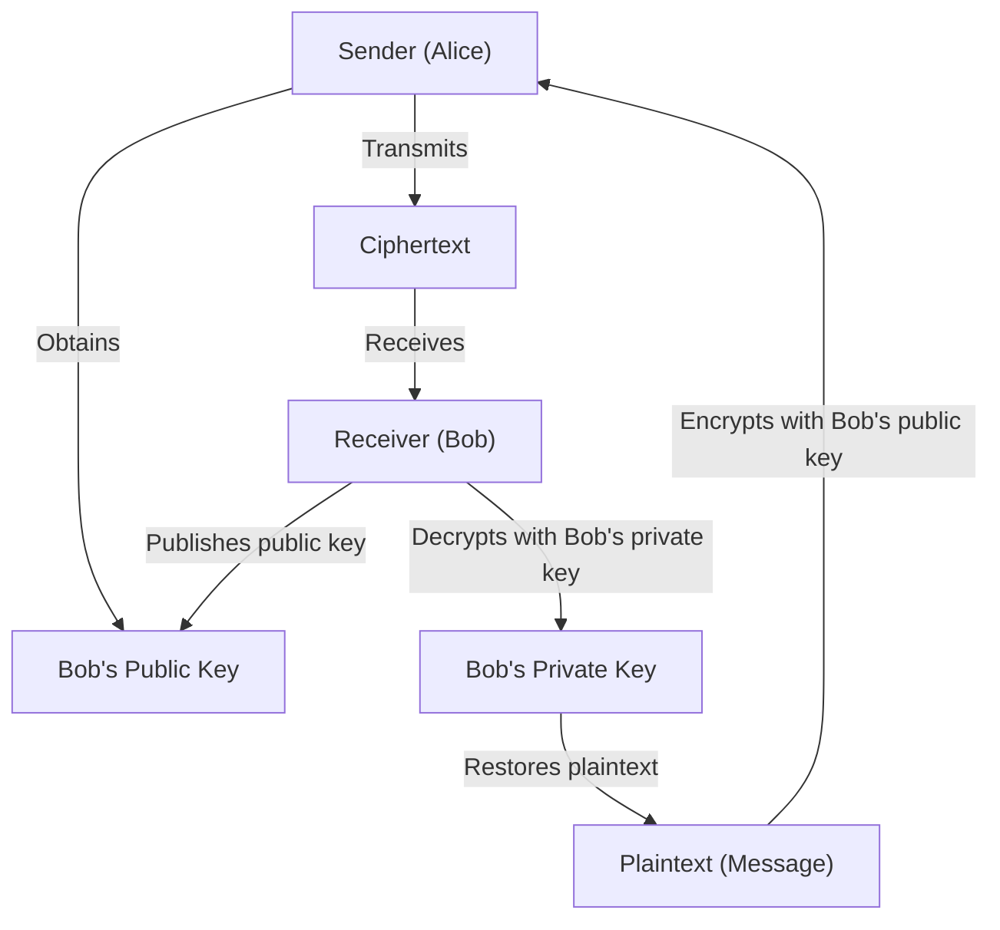
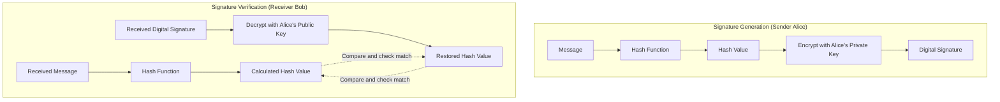
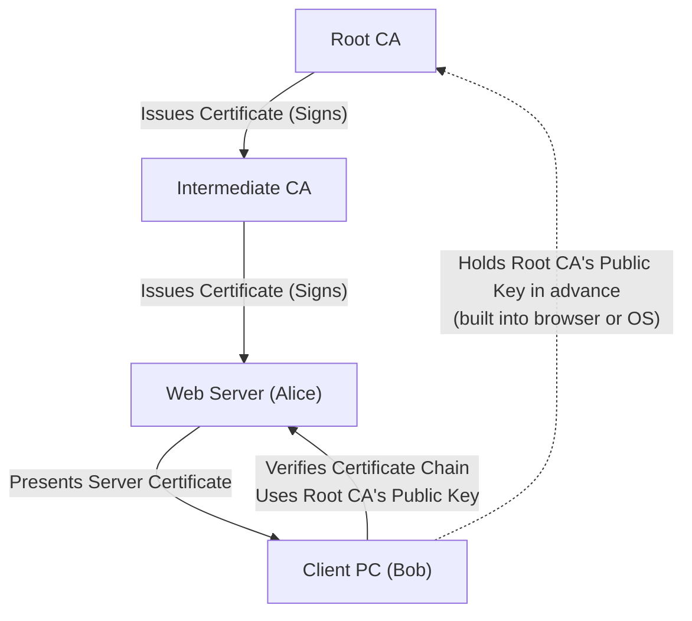

In modern internet society, **information security** to ensure the confidentiality, integrity, and availability of information has become an indispensable foundation. The core of this is supported by **modern cryptography** technologies. In this article, we will thoroughly and comprehensively explain the basics of modern cryptography: **public-key cryptography**, **hash functions**, and **digital signatures**, covering their mathematical backgrounds, specific algorithm structures, and implementation examples using Python.

---

## 1. Evolution of Cryptography: From Symmetric-key to Public-key Cryptography

### 1.1. Symmetric-key Cryptography and Its Limitations
The cryptographic method that has been used since ancient times is **symmetric-key cryptography**, which uses the same key for encryption and decryption. A representative algorithm is AES (Advanced Encryption Standard). While symmetric-key cryptography has the advantage of fast processing speeds, its biggest weakness is the **Key Distribution Problem**.

The two communicating parties must share the same key in advance via a secure channel, but securely distributing keys over an open network like the internet is extremely difficult.

### 1.2. The Birth of Public-key Cryptography
The mathematical approach that solved this key distribution problem is **public-key cryptography**. In public-key cryptography, a pair of two different keys is generated: a **public key** used for encryption, and a **private key** used for decryption.

- **Public Key**: A key that can be published to anyone. Used to encrypt messages.
- **Private Key**: A key strictly kept only by the owner. Used to decrypt ciphertexts.

Because of this asymmetry, the receiver publishes their public key to the world, and the sender uses that public key to encrypt. The encrypted data can only be decrypted by the receiver who holds the corresponding private key.



---

## 2. Mathematical Background of Public-key Cryptography

The security of public-key cryptography relies on a **one-way function**, meaning "a certain calculation is easy, but its reverse is extremely difficult," and a **trapdoor one-way function**, which allows the reverse calculation if you know specific information (a trapdoor). Here we will delve into the representative RSA cryptography and [Elliptic Curve Cryptography (ECC)](/en/p/elliptic-curve-cryptography-math-cpp/).

### 2.1. Mechanism of RSA Cryptography

RSA cryptography was developed in 1977 by Ron Rivest, Adi Shamir, and Leonard Adleman. The security of RSA depends on the **difficulty of the prime factorization problem**. Multiplying two huge prime numbers is easy, but factoring the original primes from their product cannot be solved in realistic time by current classical computers.

#### 2.1.1. RSA Key Generation Algorithm

RSA key generation is performed in the following steps.

1. Choose two very large prime numbers $p$ and $q$.
2. Calculate their product $N = p \times q$. ($N$ is the published modulus)
3. Calculate Euler's totient function $\phi(N)$.
   $ \phi(N) = (p - 1)(q - 1) $
4. Choose an integer $e$ such that $1 < e < \phi(N)$ and $e$ is coprime to $\phi(N)$. (Usually, $e = 65537$ is commonly used)
5. Calculate $d$ that satisfies the following congruence:
   $ e \times d \equiv 1 \pmod{\phi(N)} $
   This can be calculated using the extended [Euclidean algorithm](/en/p/euclidean-algorithm/).

Here, $(N, e)$ is the **public key** and $d$ is the **private key** ($p$ and $q$ are either discarded or strictly kept secret).

#### 2.1.2. Encryption and Decryption Formulas

Let the plaintext be $M$ (where $0 \le M < N$) and the ciphertext be $C$.

**Encryption** (using public key $e, N$):
$ C \equiv M^e \pmod{N} $

**Decryption** (using private key $d, N$):
$ M \equiv C^d \pmod{N} $

This decryption works correctly due to Euler's theorem $M^{\phi(N)} \equiv 1 \pmod{N}$:
$ C^d \equiv (M^e)^d \equiv M^{ed} \equiv M^{k\phi(N) + 1} \equiv M \cdot (M^{\phi(N)})^k \equiv M \cdot 1^k \equiv M \pmod{N} $

### 2.2. Elliptic Curve Cryptography (ECC)

RSA cryptography is secure, but to have sufficient strength, the key length must be very long (for example, 2048 bits or 4096 bits). In contrast, **Elliptic Curve Cryptography** provides equivalent security with a much shorter key length.

#### 2.2.1. Elliptic Curves and the Discrete Logarithm Problem

The security of [ECC](/en/p/elliptic-curve-cryptography-math-cpp/) depends on the difficulty of the **Elliptic Curve Discrete Logarithm Problem** (ECDLP).
An elliptic curve over a finite field $\mathbb{F}_p$ used in cryptography is generally represented in Weierstrass normal form:

$ y^2 \equiv x^3 + ax + b \pmod{p} $

(where $4a^3 + 27b^2 \not\equiv 0 \pmod{p}$)

Addition of points on the elliptic curve (point addition) and the operation of adding the same point multiple times (scalar multiplication) are defined.
Let a point obtained by adding a base point $G$ together $k$ times be $P$:

$ P = k \times G $

Here, given $G$ and $P$, the problem of finding the scalar value $k$ is called the **elliptic curve discrete logarithm problem**. If $k$ is sufficiently large, reverse-calculating it is extremely difficult.
In [ECC](/en/p/elliptic-curve-cryptography-math-cpp/), $k$ becomes the **private key**, and $P$ becomes the **public key**.

### 2.3. Public-key Cryptography Implementation Example in Python

Here is a code example implementing RSA key generation, encryption, and decryption using Python's `cryptography` library.

```python
from cryptography.hazmat.primitives.asymmetric import rsa
from cryptography.hazmat.primitives.asymmetric import padding
from cryptography.hazmat.primitives import hashes
import base64

# 1. Generate RSA key pair
private_key = rsa.generate_private_key(
    public_exponent=65537,
    key_size=2048,
)
public_key = private_key.public_key()

# 2. Define the message
message = b"This is a highly confidential message about modern cryptography."

# 3. Encrypt using the public key (using OAEP padding)
ciphertext = public_key.encrypt(
    message,
    padding.OAEP(
        mgf=padding.MGF1(algorithm=hashes.SHA256()),
        algorithm=hashes.SHA256(),
        label=None
    )
)
print("Ciphertext (Base64):", base64.b64encode(ciphertext).decode('utf-8'))

# 4. Decrypt using the private key
decrypted_message = private_key.decrypt(
    ciphertext,
    padding.OAEP(
        mgf=padding.MGF1(algorithm=hashes.SHA256()),
        algorithm=hashes.SHA256(),
        label=None
    )
)
print("Decrypted Message:", decrypted_message.decode('utf-8'))
```

---

## 3. Hash Functions

Along with public-key cryptography, **cryptographic hash functions** are a cornerstone of modern cryptography. A hash function takes data of any length as input and outputs fixed-length pseudorandom data (hash value, digest).

### 3.1. Three Properties Required for Cryptographic Hash Functions

To be used securely as a cryptographic technology, the following three robust properties are necessary:

1. **Pre-image resistance**:
   It is computationally difficult to reverse-calculate the original input message $m$ from the output hash value $h$.
2. **Second pre-image resistance**:
   Given an input message $m_1$, it is difficult to find another message $m_2$ ($m_1 \neq m_2$) that has the same hash value.
3. **Collision resistance**:
   It is difficult to find any pair of two messages $(m_1, m_2)$ that produce the same hash value.

### 3.2. Structure of SHA-2 (Secure Hash Algorithm 2)

The most widely used hash function today is the SHA-2 family (especially **SHA-256**). SHA-2 adopts the **Merkle-Damgård structure**.

In the Merkle-Damgård structure, the input message is divided into fixed-length blocks (512 bits for SHA-256) and padded to adjust the length. Then, the initial hash value (IV) and the first block are input into a **compression function**, and its output is sequentially processed as the input for the next block.

$ H_i = f(H_{i-1}, M_i) $

Through this sequential structure, a secure digest of a fixed length can be generated from a message of any length.

### 3.3. Structure of SHA-3 (Keccak)

**SHA-3** (the Keccak algorithm) was selected by NIST as the alternative and next-generation standard to SHA-2. SHA-3 does not use the Merkle-Damgård structure, but adopts a completely different **Sponge structure**.

The sponge structure maintains an internal state and operates in the following two phases:

- **Absorb phase**: Message blocks are XORed (exclusive OR) with the internal state bit strings at a certain rate, and an internal permutation function $f$ is applied to absorb the data.
- **Squeeze phase**: After the data absorption is complete, data is steadily extracted (squeezed out) from the internal state, repeating the application of the permutation function $f$ and extraction until the required output length is reached.

Due to this structure, it boasts robust security where existing attack methods against SHA-2 are completely ineffective.

### 3.4. Hash Function Implementation Example in Python

```python
from cryptography.hazmat.primitives import hashes

message = b"Modern cryptography heavily relies on secure hash functions."

# Generate SHA-256
digest_sha256 = hashes.Hash(hashes.SHA256())
digest_sha256.update(message)
hash_result_sha256 = digest_sha256.finalize()
print("SHA-256:", hash_result_sha256.hex())

# Generate SHA-3 (SHA3-256)
digest_sha3 = hashes.Hash(hashes.SHA3_256())
digest_sha3.update(message)
hash_result_sha3 = digest_sha3.finalize()
print("SHA3-256:", hash_result_sha3.hex())
```

---

## 4. Digital Signatures

By combining public-key cryptography and hash functions, we can realize **digital signatures** equivalent to "seals" and "signatures" in the real world. Digital signatures guarantee the **integrity** of the message (that it has not been tampered with), **sender authentication** (that it is not spoofed), and **non-repudiation** (that the fact of sending cannot be denied).

### 4.1. Mechanism of Digital Signatures

The basic concept of digital signatures is " **the reverse use of public-key cryptography** ".

In normal encryption, we "encrypt with a public key and decrypt with a private key", but in digital signatures, we " **generate a signature with a private key (equivalent to encryption) and verify the signature with a public key (equivalent to decryption)** ". Since only the principal has the private key, a signature generated by that private key is firm evidence created by the principal.

However, processing the entire data directly with a public-key algorithm (like RSA) incurs massive computational costs. Therefore, practically, a **hash function** is always used together.

### 4.2. Flow of Signature Generation and Verification



1. **Signature Generation**: The sender calculates the hash value of the message and encrypts it with their own private key to create "signature data". The message body and signature data are sent to the receiver.
2. **Signature Verification**: The receiver calculates the hash value of the received message themselves. Simultaneously, they decrypt the received signature data with the sender's public key to extract the original hash value. If both hash values match completely, verification is successful.

### 4.3. Digital Signature Implementation Example in Python (RSA)

```python
from cryptography.hazmat.primitives.asymmetric import padding
from cryptography.hazmat.primitives import hashes
from cryptography.exceptions import InvalidSignature

# Message
doc_message = b"Contract document: Party A agrees to pay Party B $1000."

# 1. Generate signature (using private key)
signature = private_key.sign(
    doc_message,
    padding.PSS(
        mgf=padding.MGF1(hashes.SHA256()),
        salt_length=padding.PSS.MAX_LENGTH
    ),
    hashes.SHA256()
)
print("Digital Signature:", base64.b64encode(signature).decode('utf-8')[:50], "...")

# 2. Verify signature (using public key)
try:
    public_key.verify(
        signature,
        doc_message,
        padding.PSS(
            mgf=padding.MGF1(hashes.SHA256()),
            salt_length=padding.PSS.MAX_LENGTH
        ),
        hashes.SHA256()
    )
    print("Signature is VALID. Document integrity and authenticity are verified.")
except InvalidSignature:
    print("Signature is INVALID. Document may be tampered with.")
```

---

## 5. Public Key Infrastructure (PKI)

Although digital signatures enabled data integrity and sender authentication, one fatal weakness remains in the system as a whole. That is the problem: " **Is the public key being used really the correct public key of the communicating party (Alice)?** "

If an attacker (Eve) pretends to be Alice and gives their own public key to Bob, and Bob believes it is "Alice's public key", Eve can spoof Alice to decrypt encrypted communications or make Bob verify forged signatures. This is called a **Man-in-the-Middle Attack**.

The social infrastructure to guarantee the validity of these public keys and build a chain of trust is the **PKI (Public Key Infrastructure)**.

### 5.1. Certificate Authority (CA) and Digital Certificates (X.509)

The core of PKI is a trusted third-party organization, the **Certificate Authority** (CA). The role of the CA is to verify the identity of individuals or domain ownership and issue a **digital certificate** (public key certificate), applying a digital signature with the CA's own "private key" to the subject's "public key".

**X.509** is widely used as a standard for digital certificates. A certificate contains the following information:
- Version, Serial Number
- Signature Algorithm
- Issuer (CA) Identification Information
- Validity Period
- Subject (Server or Individual) Identification Information
- **Subject's Public Key**
- **CA's Digital Signature**

### 5.2. Trust Model Configuration Diagram of PKI



Even when accessing "https://" sites in a browser, this PKI mechanism is operating fully in the background. By verifying the signature of the certificate sent from the server using the public key of the Root CA pre-installed in the browser, a secure communication channel (TLS) is established.

---

## 6. Conclusion

Modern digital society is built upon the exquisite combination of the **cryptographic technologies** explained this time.

- Fast data encryption via **symmetric-key cryptography**
- Secure key exchange and asymmetry realization via **public-key cryptography** (RSA and [ECC](/en/p/elliptic-curve-cryptography-math-cpp/))
- Data fingerprint extraction via **hash functions** (SHA-2/3)
- Proof of integrity and authentication via **digital signatures**
- Guaranteeing the authenticity of public keys via **PKI and CAs**

These mathematical beauties and rigorous computational theories protect our privacy and assets from cyber attacks every day. The evolution of cryptography is still ongoing, and research and standardization of **Post-Quantum Cryptography** (PQC) in preparation for the rise of quantum computers are also rapidly progressing.

Correctly understanding the foundations of cryptography will be the first step in designing more secure and robust systems and applications.

---
*References and Related Links*
- NIST FIPS 186-4: Digital Signature Standard (DSS)
- NIST FIPS 202: SHA-3 Standard
- RFC 5280: Internet X.509 Public Key Infrastructure Certificate and Certificate Revocation List (CRL) Profile
