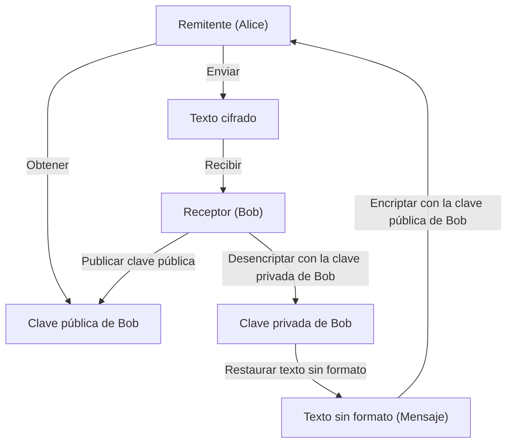
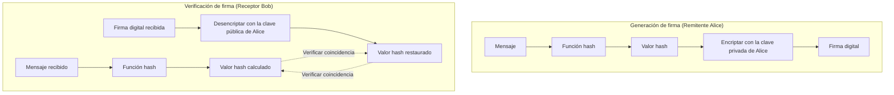

En la sociedad de Internet moderna, la **seguridad de la información** para garantizar la confidencialidad, integridad y disponibilidad de la información se ha convertido en una base esencial. La base de esto es la tecnología de la **criptografía moderna**. En este artículo, explicaremos de forma exhaustiva y muy detallada los fundamentos de la criptografía moderna: **criptografía de clave pública**, **funciones hash** y **firmas digitales**, desde sus antecedentes matemáticos hasta las estructuras de algoritmos específicos y ejemplos de implementación en Python.

---

## 1. Evolución de la tecnología criptográfica: de la criptografía de clave simétrica a la de clave pública

### 1.1. La criptografía de clave simétrica y sus limitaciones
El método de encriptación utilizado desde la antigüedad es la **criptografía de clave simétrica** (Symmetric-key cryptography), que utiliza la misma clave para la encriptación y desencriptación. Un algoritmo representativo es el AES (Advanced Encryption Standard). La criptografía de clave simétrica tiene la ventaja de una alta velocidad de procesamiento, pero su mayor debilidad es el **problema de distribución de claves** (Key Distribution Problem).

Ambas partes que se comunican deben compartir la misma clave de antemano a través de un canal seguro, pero es extremadamente difícil distribuir claves de forma segura en una red abierta como Internet.

### 1.2. El nacimiento de la criptografía de clave pública
El **criptografía de clave pública** (Public-key cryptography) resolvió este problema de distribución de claves utilizando un enfoque matemático. En la criptografía de clave pública, se generan dos claves diferentes: una **clave pública** (Public Key) utilizada para la encriptación, y una **clave privada** (Private Key) utilizada para la desencriptación.

- **Clave pública**: Una clave que puede ser revelada a cualquiera. Se usa para encriptar mensajes.
- **Clave privada**: Una clave estrictamente guardada solo por el propietario. Se usa para desencriptar el texto cifrado.

Debido a esta asimetría, el receptor publica su clave pública al mundo entero y el remitente encripta utilizando esa clave pública. Los datos encriptados solo pueden ser desencriptados por el receptor que tiene la clave privada correspondiente.



---

## 2. Antecedentes matemáticos de la criptografía de clave pública

La seguridad de la criptografía de clave pública se basa en las **funciones unidireccionales** (One-way function), donde "un cierto cálculo es fácil, pero el cálculo inverso es muy difícil", y las **funciones unidireccionales con trampa** (Trapdoor one-way function), que permiten el cálculo inverso si se conoce cierta información (la trampa). Aquí profundizaremos en el representativo cifrado RSA y la criptografía de curva elíptica (ECC).

### 2.1. El mecanismo de la criptografía RSA

La criptografía RSA fue desarrollada en 1977 por Ron Rivest, Adi Shamir y Leonard Adleman. La seguridad del RSA se basa en la **dificultad del problema de factorización de enteros**. Multiplicar dos números primos gigantes es fácil, pero averiguar los números primos originales a partir de su producto no se puede resolver en un tiempo realista con las computadoras clásicas actuales.

#### 2.1.1. Algoritmo de generación de claves de RSA

La generación de claves RSA se realiza en los siguientes pasos.

1. Seleccionar dos números primos muy grandes $p$ y $q$.
2. Calcular su producto $N = p \times q$. ($N$ es el módulo público)
3. Calcular la función indicatriz de Euler $\phi(N)$.
   $ \phi(N) = (p - 1)(q - 1) $
4. Elegir un entero $e$ que cumpla $1 < e < \phi(N)$ y que sea coprimo con $\phi(N)$. (Generalmente, se utiliza a menudo $e = 65537$)
5. Calcular $d$ que satisfaga la siguiente congruencia.
   $ e \times d \equiv 1 \pmod{\phi(N)} $
   Esto se puede calcular utilizando el algoritmo de Euclides extendido.

Aquí, $(N, e)$ es la **clave pública**, y $d$ es la **clave privada** ($p$ y $q$ se descartan o se mantienen estrictamente en secreto).

#### 2.1.2. Fórmulas de encriptación y desencriptación

Sea $M$ el texto sin formato (donde $0 \le M < N$) y $C$ el texto cifrado.

**Encriptación** (usando la clave pública $e, N$):
$ C \equiv M^e \pmod{N} $

**Desencriptación** (usando la clave privada $d, N$):
$ M \equiv C^d \pmod{N} $

Esta desencriptación funciona correctamente gracias al teorema de Euler $M^{\phi(N)} \equiv 1 \pmod{N}$.
$ C^d \equiv (M^e)^d \equiv M^{ed} \equiv M^{k\phi(N) + 1} \equiv M \cdot (M^{\phi(N)})^k \equiv M \cdot 1^k \equiv M \pmod{N} $

### 2.2. Criptografía de curva elíptica (ECC: Elliptic Curve Cryptography)

La criptografía RSA es segura, pero requiere una longitud de clave muy larga (por ejemplo, 2048 bits o 4096 bits) para tener suficiente resistencia. Por otro lado, la **criptografía de curva elíptica** proporciona una seguridad equivalente con una longitud de clave más corta.

#### 2.2.1. Curvas elípticas y el problema del logaritmo discreto

La seguridad de ECC depende de la dificultad del **problema del logaritmo discreto sobre curvas elípticas** (ECDLP).
Una curva elíptica sobre un cuerpo finito $\mathbb{F}_p$ utilizada para criptografía se expresa generalmente en la forma normal de Weierstrass.

$ y^2 \equiv x^3 + ax + b \pmod{p} $

(siempre que $4a^3 + 27b^2 \not\equiv 0 \pmod{p}$)

Se definen la suma de puntos en la curva elíptica (suma de puntos) y la operación de sumar el mismo punto varias veces (multiplicación escalar).
Sea $P$ el punto resultante de sumar un punto base de referencia $G$ consigo mismo $k$ veces.

$ P = k \times G $

Aquí, el problema de encontrar el valor escalar $k$ dados $G$ y $P$ se llama el **problema del logaritmo discreto de curva elíptica**. Si $k$ es lo suficientemente grande, es extremadamente difícil calcularlo a la inversa.
En ECC, $k$ es la **clave privada** y $P$ es la **clave pública**.

### 2.3. Ejemplo de implementación de criptografía de clave pública en Python

A continuación se muestra un ejemplo de código para generar claves RSA y realizar la encriptación/desencriptación utilizando la biblioteca `cryptography` de Python.

```python
from cryptography.hazmat.primitives.asymmetric import rsa
from cryptography.hazmat.primitives.asymmetric import padding
from cryptography.hazmat.primitives import hashes
import base64

# 1. Generación de un par de claves RSA
private_key = rsa.generate_private_key(
    public_exponent=65537,
    key_size=2048,
)
public_key = private_key.public_key()

# 2. Definición del mensaje
message = b"This is a highly confidential message about modern cryptography."

# 3. Encriptación usando la clave pública (utilizando el padding OAEP)
ciphertext = public_key.encrypt(
    message,
    padding.OAEP(
        mgf=padding.MGF1(algorithm=hashes.SHA256()),
        algorithm=hashes.SHA256(),
        label=None
    )
)
print("Texto cifrado (Base64):", base64.b64encode(ciphertext).decode('utf-8'))

# 4. Desencriptación usando la clave privada
decrypted_message = private_key.decrypt(
    ciphertext,
    padding.OAEP(
        mgf=padding.MGF1(algorithm=hashes.SHA256()),
        algorithm=hashes.SHA256(),
        label=None
    )
)
print("Mensaje desencriptado:", decrypted_message.decode('utf-8'))
```

---

## 3. Funciones Hash (Hash Functions)

Junto con la criptografía de clave pública, una piedra angular de la criptografía moderna es la **función hash criptográfica**. Una función hash es una función que toma datos de cualquier longitud como entrada y genera datos de longitud fija, similares a números pseudoaleatorios (valor hash, resumen).

### 3.1. Tres propiedades requeridas para las funciones hash criptográficas

Para usarse de forma segura como tecnología criptográfica, se requieren las siguientes tres propiedades sólidas.

1. **Unidireccionalidad** (Pre-image resistance):
   Debe ser computacionalmente difícil calcular el mensaje de entrada original $m$ a partir del valor hash de salida $h$.
2. **Resistencia a colisiones débiles** (Second pre-image resistance):
   Dado un mensaje de entrada $m_1$, debe ser difícil encontrar otro mensaje $m_2$ ($m_1 \neq m_2$) que tenga el mismo valor hash.
3. **Resistencia a colisiones fuertes** (Collision resistance):
   Debe ser difícil encontrar cualquier par de mensajes $(m_1, m_2)$ cuyos valores hash coincidan.

### 3.2. Estructura de SHA-2 (Secure Hash Algorithm 2)

La función hash más utilizada en la actualidad es la familia SHA-2 (especialmente **SHA-256**). SHA-2 adopta la **construcción de Merkle-Damgård**.

En la construcción de Merkle-Damgård, el mensaje de entrada se divide en bloques de longitud fija (512 bits en el caso de SHA-256) y se ajusta la longitud mediante relleno (padding). Luego, el valor hash inicial (IV) y el primer bloque se ingresan en una **función de compresión** (Compression function), y su salida se procesa de manera secuencial como la entrada del siguiente bloque.

$ H_i = f(H_{i-1}, M_i) $

Mediante esta estructura secuencial, se puede generar un resumen seguro de longitud fija a partir de un mensaje de cualquier longitud.

### 3.3. Estructura de SHA-3 (Keccak)

Seleccionado por el NIST como estándar de próxima generación para reemplazar a SHA-2 está **SHA-3** (algoritmo Keccak). SHA-3 no utiliza la construcción de Merkle-Damgård, sino que adopta una **construcción de esponja** (Sponge) completamente diferente.

La construcción de esponja mantiene un estado interno y opera en las siguientes dos fases:

- **Fase de absorción (Absorb)**: Toma el XOR (OR exclusivo) de los bloques de mensajes y la cadena de bits del estado interno para cada tasa (Rate) fija, y aplica una función de permutación interna ($f$) para absorber los datos.
- **Fase de compresión (Squeeze)**: Después de completar la absorción de los datos, extrae constantemente datos del estado interno y repite la aplicación de la función de permutación $f$ y la extracción hasta que se alcanza la longitud de salida necesaria.

Gracias a esta estructura, cuenta con una seguridad sólida contra la cual los métodos de ataque existentes para SHA-2 son completamente inútiles.

### 3.4. Ejemplo de implementación de funciones hash en Python

```python
from cryptography.hazmat.primitives import hashes

message = b"Modern cryptography heavily relies on secure hash functions."

# Generación de SHA-256
digest_sha256 = hashes.Hash(hashes.SHA256())
digest_sha256.update(message)
hash_result_sha256 = digest_sha256.finalize()
print("SHA-256:", hash_result_sha256.hex())

# Generación de SHA-3 (SHA3-256)
digest_sha3 = hashes.Hash(hashes.SHA3_256())
digest_sha3.update(message)
hash_result_sha3 = digest_sha3.finalize()
print("SHA3-256:", hash_result_sha3.hex())
```

---

## 4. Firmas Digitales (Digital Signatures)

Combinando la criptografía de clave pública y las funciones hash, podemos realizar **firmas digitales**, que son equivalentes a un "sello" o "firma" en el mundo real. Las firmas digitales garantizan la **integridad** del mensaje (que no ha sido alterado), la **autenticación del remitente** (que no es una suplantación de identidad) y el **no repudio** (que no se puede negar el hecho de haberlo enviado).

### 4.1. Mecanismo de las firmas digitales

El concepto básico de las firmas digitales es "el uso inverso de la criptografía de clave pública".

En la encriptación normal, "se encripta con la clave pública y se desencripta con la clave privada", pero en las firmas digitales, "se genera una firma con la clave privada (equivalente a la encriptación) y se verifica la firma con la clave pública (equivalente a la desencriptación)". Como solo el titular posee la clave privada, una firma generada con esa clave privada es una prueba irrefutable de que fue creada por el titular.

Sin embargo, procesar todos los datos directamente con un algoritmo de clave pública (como RSA) requiere un costo computacional enorme. Por lo tanto, en la práctica siempre se utiliza en conjunto con una **función hash**.

### 4.2. Flujo de generación y verificación de firmas



1. **Generación de firma**: El remitente calcula el valor hash del mensaje y lo encripta con su propia clave privada para crear los "datos de firma". Envía el cuerpo del mensaje y los datos de la firma al receptor.
2. **Verificación de firma**: El receptor calcula por sí mismo el valor hash del mensaje recibido. Al mismo tiempo, desencripta los datos de firma recibidos con la clave pública del remitente para extraer el valor hash original. Si ambos valores hash coinciden por completo, la verificación es exitosa.

### 4.3. Ejemplo de implementación de firmas digitales en Python (RSA)

```python
from cryptography.hazmat.primitives.asymmetric import padding
from cryptography.hazmat.primitives import hashes
from cryptography.exceptions import InvalidSignature

# Mensaje
doc_message = b"Contract document: Party A agrees to pay Party B $1000."

# 1. Generación de firma (usando la clave privada)
signature = private_key.sign(
    doc_message,
    padding.PSS(
        mgf=padding.MGF1(hashes.SHA256()),
        salt_length=padding.PSS.MAX_LENGTH
    ),
    hashes.SHA256()
)
print("Firma Digital:", base64.b64encode(signature).decode('utf-8')[:50], "...")

# 2. Verificación de la firma (usando la clave pública)
try:
    public_key.verify(
        signature,
        doc_message,
        padding.PSS(
            mgf=padding.MGF1(hashes.SHA256()),
            salt_length=padding.PSS.MAX_LENGTH
        ),
        hashes.SHA256()
    )
    print("La firma es VÁLIDA. Se ha verificado la integridad y autenticidad del documento.")
except InvalidSignature:
    print("La firma es INVÁLIDA. El documento puede haber sido manipulado.")
```

---

## 5. Infraestructura de clave pública (PKI: Public Key Infrastructure)

Las firmas digitales han hecho posible la integridad de los datos y la autenticación del remitente, pero sigue habiendo una debilidad fatal en el sistema en su conjunto. Esa es la cuestión de: "**¿Es la clave pública que estoy utilizando realmente la clave pública correcta de mi interlocutor (Alice)?**".

Si un atacante (Eve) se hace pasar por Alice y le da su propia clave pública a Bob, y Bob cree que es la "clave pública de Alice", Eve puede hacerse pasar por Alice para descifrar las comunicaciones encriptadas o hacer que se verifiquen firmas falsificadas. Esto se llama un **ataque de intermediario** (Man-in-the-Middle Attack).

La infraestructura social para garantizar la validez de esta clave pública y construir una cadena de confianza es la **PKI (Infraestructura de Clave Pública)**.

### 5.1. Autoridad de Certificación (CA) y Certificado Digital (X.509)

En el centro de la PKI está la **Autoridad de Certificación** (CA: Certificate Authority), que es una organización de terceros de confianza. El papel de la CA es revisar la identidad de un individuo o la propiedad de un dominio y emitir un **certificado digital** (certificado de clave pública) que contiene una firma digital realizada con la "clave privada" de la propia CA sobre la "clave pública" del sujeto.

El estándar más utilizado para certificados digitales es **X.509**. El certificado incluye la siguiente información:
- Versión, número de serie
- Algoritmo de firma
- Información de identificación del emisor (CA)
- Período de validez
- Información de identificación del sujeto (servidor o individuo)
- **Clave pública del sujeto**
- **Firma digital de la CA**

### 5.2. Diagrama de la estructura del modelo de confianza de PKI

```mermaid
graph TD
    CA["Autoridad de certificación raíz (Root CA)"]
    SubCA["Autoridad de certificación intermedia (Intermediate CA)"]
    Server["Servidor Web (Alice)"]
    Client["PC cliente (Bob)"]

    CA -->|"Emitir certificado (Firma)"| SubCA
    SubCA -->|"Emitir certificado (Firma)"| Server
    Server -->|"Presentar certificado del servidor"| Client
    Client -.->|"Mantiene la clave pública de la Root CA de antemano\n("Incorporada en el navegador o SO")"| CA
    Client -->|"Verificar cadena de certificados\nUsando la clave pública de la Root CA"| Server
```

Incluso al acceder a sitios "https://" con un navegador, este mecanismo PKI está funcionando plenamente en segundo plano. La firma del certificado enviado desde el servidor se verifica utilizando la clave pública de la autoridad de certificación raíz preinstalada en el navegador, estableciendo así un canal de comunicación seguro (TLS).

---

## 6. Conclusión

La sociedad digital moderna se basa en una combinación exquisita de las **tecnologías criptográficas** explicadas esta vez.

- Encriptación de datos a alta velocidad con **criptografía de clave simétrica**
- Intercambio seguro de claves y realización de asimetría con **criptografía de clave pública** (RSA y ECC)
- Extracción de huellas digitales de datos con **funciones hash** (SHA-2/3)
- Prueba de integridad y autenticación con **firmas digitales**
- Garantía de la autenticidad de las claves públicas con **PKI y autoridades de certificación**

La belleza matemática y la rigurosa teoría computacional de estas tecnologías protegen nuestra privacidad y nuestros activos de los ciberataques todos los días. La evolución de la tecnología criptográfica continúa hoy en día, y la investigación y la estandarización de la **criptografía poscuántica** (PQC: Post-Quantum Cryptography) en preparación para el surgimiento de las computadoras cuánticas también están avanzando rápidamente.

Comprender correctamente los fundamentos de la criptografía será el primer paso en el diseño de sistemas y aplicaciones más seguros y robustos.

---
*Referencias y enlaces relacionados*
- NIST FIPS 186-4: Digital Signature Standard (DSS)
- NIST FIPS 202: SHA-3 Standard
- RFC 5280: Internet X.509 Public Key Infrastructure Certificate and Certificate Revocation List (CRL) Profile
