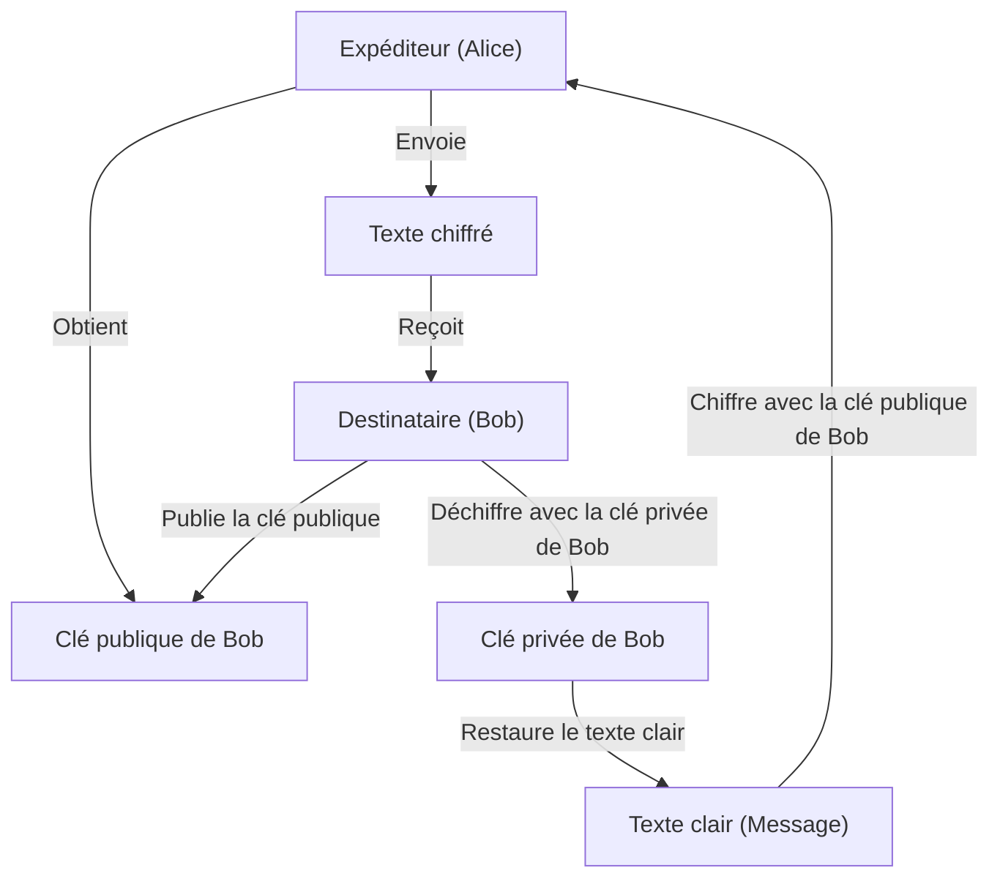
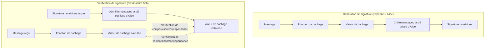

Dans la société Internet d'aujourd'hui, la **sécurité de l'information** est devenue une infrastructure indispensable pour garantir la confidentialité, l'intégrité et la disponibilité des informations. La technologie de **cryptographie moderne** est à la base de tout cela. Cet article fournit une explication très détaillée et exhaustive des fondements de la cryptographie moderne : la **cryptographie à clé publique** , les **fonctions de hachage** et les **signatures numériques** , allant de leur contexte mathématique à la structure d'algorithmes spécifiques et à des exemples d'implémentation utilisant Python.

---

## 1. Évolution des technologies de cryptographie : de la cryptographie à clé symétrique à la cryptographie à clé publique

### 1.1. La cryptographie à clé symétrique et ses limites
La méthode de cryptographie traditionnellement utilisée est la **cryptographie à clé symétrique** (Symmetric-key cryptography), qui utilise la même clé pour le chiffrement et le déchiffrement. Un algorithme représentatif est l'AES (Advanced Encryption Standard). La cryptographie à clé symétrique a l'avantage d'avoir des vitesses de traitement rapides, mais sa plus grande faiblesse est le **problème de distribution des clés** (Key Distribution Problem).

Les deux parties communicantes doivent partager la même clé à l'avance via un canal sécurisé, mais il est extrêmement difficile de distribuer en toute sécurité des clés sur un réseau ouvert comme Internet.

### 1.2. La naissance de la cryptographie à clé publique
Le problème de distribution des clés a été résolu par une approche mathématique avec la **cryptographie à clé publique** (Public-key cryptography). Dans la cryptographie à clé publique, deux clés différentes sont générées en paire : une **clé publique** (Public Key) utilisée pour le chiffrement, et une **clé privée** (Private Key) utilisée pour le déchiffrement.

- **Clé publique** : Une clé qui peut être révélée à tout le monde. Utilisée pour chiffrer les messages.
- **Clé privée** : Une clé gardée strictement secrète par son propriétaire. Utilisée pour déchiffrer les textes chiffrés.

Grâce à cette asymétrie, le destinataire publie sa clé publique dans le monde entier et l'expéditeur utilise cette clé publique pour le chiffrement. Les données chiffrées ne peuvent être déchiffrées que par le destinataire qui possède la clé privée correspondante.



---

## 2. Contexte mathématique de la cryptographie à clé publique

La sécurité de la cryptographie à clé publique repose sur les **fonctions à sens unique** (One-way function), où « un certain calcul est facile, mais le calcul inverse est extrêmement difficile », et les **fonctions à sens unique avec trappe** , où le calcul inverse devient possible si l'on connaît des informations spécifiques (trappe : Trapdoor). Nous allons explorer ici en détail le chiffrement RSA et la cryptographie sur les courbes elliptiques (ECC), qui en sont représentatifs.

### 2.1. Le fonctionnement du chiffrement RSA

Le chiffrement RSA a été développé en 1977 par Ron Rivest, Adi Shamir et Leonard Adleman. La sécurité du RSA repose sur la **difficulté du problème de factorisation en nombres premiers** . Il est facile de multiplier deux très grands nombres premiers, mais trouver les nombres premiers originaux à partir de leur produit ne peut être résolu dans un temps réaliste par les ordinateurs classiques actuels.

#### 2.1.1. Algorithme de génération de clés RSA

La génération de clés RSA s'effectue selon les étapes suivantes.

1. Sélectionner deux très grands nombres premiers $p$ et $q$.
2. Calculer leur produit $N = p \times q$. ($N$ est le module public).
3. Calculer la fonction indicatrice d'Euler $\phi(N)$.
   $ \phi(N) = (p - 1)(q - 1) $
4. Choisir un entier $e$ tel que $1 < e < \phi(N)$ et qui soit premier avec $\phi(N)$. (Généralement, $e = 65537$ est souvent utilisé).
5. Calculer $d$ satisfaisant la congruence suivante.
   $ e \times d \equiv 1 \pmod{\phi(N)} $
   Cela peut être calculé à l'aide de l'algorithme d'Euclide étendu.

Ici, $(N, e)$ devient la **clé publique** , et $d$ devient la **clé privée** ($p$ et $q$ sont détruits ou gardés strictement secrets).

#### 2.1.2. Formules de chiffrement et de déchiffrement

Soit $M$ le texte clair (avec $0 \le M < N$) et $C$ le texte chiffré.

**Chiffrement** (en utilisant la clé publique $e, N$) :
$ C \equiv M^e \pmod{N} $

**Déchiffrement** (en utilisant la clé privée $d, N$) :
$ M \equiv C^d \pmod{N} $

Ce déchiffrement fonctionne correctement grâce au théorème d'Euler $M^{\phi(N)} \equiv 1 \pmod{N}$.
$ C^d \equiv (M^e)^d \equiv M^{ed} \equiv M^{k\phi(N) + 1} \equiv M \cdot (M^{\phi(N)})^k \equiv M \cdot 1^k \equiv M \pmod{N} $

### 2.2. Cryptographie sur les courbes elliptiques (ECC: Elliptic Curve Cryptography)

Bien que le chiffrement RSA soit sécurisé, il nécessite des longueurs de clé très importantes (par exemple 2048 ou 4096 bits) pour fournir une résistance suffisante. En revanche, la **cryptographie sur les courbes elliptiques** offre une sécurité équivalente avec des longueurs de clé beaucoup plus courtes.

#### 2.2.1. Courbes elliptiques et problème du logarithme discret

La sécurité de l'ECC repose sur la difficulté du **problème du logarithme discret sur les courbes elliptiques** (ECDLP).
Une courbe elliptique sur un corps fini $\mathbb{F}_p$ utilisé en cryptographie est généralement exprimée sous la forme standard de Weierstrass.

$ y^2 \equiv x^3 + ax + b \pmod{p} $

(à condition que $4a^3 + 27b^2 \not\equiv 0 \pmod{p}$)

L'addition entre des points de la courbe elliptique (addition de points) et l'opération d'ajouter le même point de nombreuses fois (multiplication scalaire) sont définies.
Soit $P$ le point obtenu en ajoutant un point de base de référence $G$ un total de $k$ fois.

$ P = k \times G $

Ici, le problème de trouver la valeur scalaire $k$ lorsque $G$ et $P$ sont donnés est appelé le **problème du logarithme discret sur les courbes elliptiques** . Si $k$ est suffisamment grand, il est extrêmement difficile de le calculer par rétro-ingénierie.
Dans l'ECC, $k$ est la **clé privée** , et $P$ est la **clé publique** .

### 2.3. Exemple d'implémentation de la cryptographie à clé publique en Python

Voici un exemple de code implémentant la génération de clés RSA, le chiffrement et le déchiffrement à l'aide de la bibliothèque Python `cryptography`.

```python
from cryptography.hazmat.primitives.asymmetric import rsa
from cryptography.hazmat.primitives.asymmetric import padding
from cryptography.hazmat.primitives import hashes
import base64

# 1. Génération de la paire de clés RSA
private_key = rsa.generate_private_key(
    public_exponent=65537,
    key_size=2048,
)
public_key = private_key.public_key()

# 2. Définition du message
message = b"Ceci est un message hautement confidentiel sur la cryptographie moderne."

# 3. Chiffrement à l'aide de la clé publique (utilisation du remplissage OAEP)
ciphertext = public_key.encrypt(
    message,
    padding.OAEP(
        mgf=padding.MGF1(algorithm=hashes.SHA256()),
        algorithm=hashes.SHA256(),
        label=None
    )
)
print("Texte chiffre (Base64) :", base64.b64encode(ciphertext).decode('utf-8'))

# 4. Déchiffrement à l'aide de la clé privée
decrypted_message = private_key.decrypt(
    ciphertext,
    padding.OAEP(
        mgf=padding.MGF1(algorithm=hashes.SHA256()),
        algorithm=hashes.SHA256(),
        label=None
    )
)
print("Message dechiffre :", decrypted_message.decode('utf-8'))
```

---

## 3. Fonctions de hachage (Hash Functions)

Les **fonctions de hachage cryptographiques** constituent, avec la cryptographie à clé publique, la pierre angulaire de la cryptographie moderne. Une fonction de hachage est une fonction qui prend en entrée des données de longueur arbitraire et produit en sortie des données de type pseudo-aléatoire (valeur de hachage, empreinte) de longueur fixe.

### 3.1. Trois propriétés requises pour les fonctions de hachage cryptographiques

Pour être utilisées en toute sécurité en tant que technologie cryptographique, les trois propriétés robustes suivantes sont requises.

1. **Résistance à la préimage** (Pre-image resistance) :
   Il doit être informatiquement difficile de retrouver le message d'entrée original $m$ à partir de la valeur de hachage de sortie $h$.
2. **Résistance à la seconde préimage** (Second pre-image resistance) :
   Étant donné un message d'entrée $m_1$, il doit être difficile de trouver un autre message $m_2$ ($m_1 \neq m_2$) ayant la même valeur de hachage.
3. **Résistance aux collisions** (Collision resistance) :
   Il doit être difficile de trouver une paire arbitraire de deux messages $(m_1, m_2)$ dont les valeurs de hachage sont identiques.

### 3.2. Structure de SHA-2 (Secure Hash Algorithm 2)

La fonction de hachage la plus largement utilisée aujourd'hui est la famille SHA-2 (en particulier **SHA-256** ). SHA-2 adopte la **construction de Merkle-Damgård** .

Dans la construction de Merkle-Damgård, le message d'entrée est divisé en blocs de longueur fixe (512 bits dans le cas de SHA-256), et un remplissage (padding) est effectué pour ajuster la longueur. Ensuite, la valeur de hachage initiale (IV) et le premier bloc sont introduits dans la **fonction de compression** (Compression function), et la sortie de celle-ci est traitée en chaîne comme entrée du bloc suivant.

$ H_i = f(H_{i-1}, M_i) $

Grâce à cette structure en chaîne, une empreinte sécurisée de longueur fixe peut être générée à partir d'un message de n'importe quelle longueur.

### 3.3. Structure de SHA-3 (Keccak)

**SHA-3** (algorithme Keccak) a été sélectionné par le NIST comme norme de nouvelle génération et alternative à SHA-2. SHA-3 n'utilise pas la construction de Merkle-Damgård, mais adopte une **construction en éponge** (Sponge) totalement différente.

La construction en éponge maintient un état interne et fonctionne en deux phases :

- **Phase d'absorption** (Absorb) : Le bloc de message subit un OU exclusif (XOR) avec une chaîne de bits de l'état interne à un certain débit (Rate), et une fonction de permutation interne (Permutation function $f$) est appliquée pour absorber les données.
- **Phase d'essorage** (Squeeze) : Une fois l'absorption des données terminée, les données sont extraites en continu de l'état interne (essorage), et l'application et l'extraction de la fonction de permutation $f$ sont répétées jusqu'à ce que la longueur de sortie requise soit atteinte.

Grâce à cette structure, il offre une sécurité si robuste que les méthodes d'attaque existantes contre SHA-2 sont totalement inefficaces.

### 3.4. Exemple d'implémentation de fonctions de hachage en Python

```python
from cryptography.hazmat.primitives import hashes

message = b"La cryptographie moderne s'appuie fortement sur des fonctions de hachage securisees."

# Génération SHA-256
digest_sha256 = hashes.Hash(hashes.SHA256())
digest_sha256.update(message)
hash_result_sha256 = digest_sha256.finalize()
print("SHA-256 :", hash_result_sha256.hex())

# Génération SHA-3 (SHA3-256)
digest_sha3 = hashes.Hash(hashes.SHA3_256())
digest_sha3.update(message)
hash_result_sha3 = digest_sha3.finalize()
print("SHA3-256 :", hash_result_sha3.hex())
```

---

## 4. Signatures numériques (Digital Signatures)

En combinant la cryptographie à clé publique et les fonctions de hachage, il est possible de réaliser des **signatures numériques** , qui sont l'équivalent des « sceaux » ou des « signatures » dans le monde réel. Les signatures numériques garantissent l'**intégrité** du message (il n'a pas été altéré), l'**authentification de l'expéditeur** (ce n'est pas une usurpation d'identité) et la **non-répudiation** (le fait de l'avoir envoyé ne peut être nié).

### 4.1. Le fonctionnement des signatures numériques

Le concept fondamental d'une signature numérique est « **l'utilisation de la cryptographie à clé publique dans le sens inverse** ».

Dans un chiffrement normal, on « chiffre avec la clé publique et on déchiffre avec la clé privée », mais dans une signature numérique, on « **génère une signature avec la clé privée (équivalent au chiffrement) et on vérifie la signature avec la clé publique (équivalent au déchiffrement)** ». Puisque seule la personne elle-même possède la clé privée, une signature générée avec cette clé privée constitue une preuve irréfutable créée par la personne elle-même.

Cependant, traiter directement l'ensemble des données avec un algorithme à clé publique (comme RSA) entraînerait des coûts de calcul énormes. C'est pourquoi, en pratique, on utilise toujours une **fonction de hachage** en combinaison.

### 4.2. [Flux](https://kenji.blog/fr/p/state-management-history-redux-context-recoil-zustand/) de génération et de vérification de signature



1. **Génération de signature** : L'expéditeur calcule la valeur de hachage du message et la chiffre avec sa propre clé privée pour créer les « données de signature ». Il envoie le corps du message et les données de signature au destinataire.
2. **Vérification de signature** : Le destinataire calcule lui-même la valeur de hachage du message reçu. En même temps, il déchiffre les données de signature reçues avec la clé publique de l'expéditeur pour extraire la valeur de hachage d'origine. Si les deux valeurs de hachage correspondent parfaitement, la vérification est réussie.

### 4.3. Exemple d'implémentation de signature numérique en Python (RSA)

```python
from cryptography.hazmat.primitives.asymmetric import padding
from cryptography.hazmat.primitives import hashes
from cryptography.exceptions import InvalidSignature
import base64

# Message
doc_message = b"Document de contrat : La partie A accepte de payer 1000 $ a la partie B."

# 1. Génération de la signature (utilisation de la clé privée)
signature = private_key.sign(
    doc_message,
    padding.PSS(
        mgf=padding.MGF1(hashes.SHA256()),
        salt_length=padding.PSS.MAX_LENGTH
    ),
    hashes.SHA256()
)
print("Signature numerique :", base64.b64encode(signature).decode('utf-8')[:50], "...")

# 2. Vérification de la signature (utilisation de la clé publique)
try:
    public_key.verify(
        signature,
        doc_message,
        padding.PSS(
            mgf=padding.MGF1(hashes.SHA256()),
            salt_length=padding.PSS.MAX_LENGTH
        ),
        hashes.SHA256()
    )
    print("La signature est VALIDE. L'integrite et l'authenticite du document sont verifiees.")
except InvalidSignature:
    print("La signature est INVALIDE. Le document a peut-etre ete altere.")
```

---

## 5. Infrastructure à clé publique (PKI: Public Key Infrastructure)

Bien que les signatures numériques permettent de garantir l'intégrité des données et l'authentification de l'expéditeur, il reste une faille critique dans le système global. C'est le problème de savoir si « **la clé publique utilisée est bien la véritable clé publique de la partie communicante (Alice) ?** ».

Si un attaquant (Eve) se fait passer pour Alice, donne sa propre clé publique à Bob, et que Bob croit que c'est « la clé publique d'Alice », Eve peut usurper l'identité d'Alice pour déchiffrer des communications chiffrées ou faire vérifier de fausses signatures. C'est ce qu'on appelle une **attaque de l'homme du milieu** (Man-in-the-Middle Attack).

L'infrastructure sociale destinée à garantir la validité de ces clés publiques et à construire une chaîne de confiance est l' **Infrastructure à clé publique (PKI)** .

### 5.1. Autorité de certification (CA) et Certificat numérique (X.509)

Au cœur de la PKI se trouve une organisation tierce de confiance appelée **Autorité de certification** (CA: Certificate Authority). Le rôle de la CA est d'examiner l'identité des personnes ou la propriété des domaines, et d'émettre un **certificat numérique** (certificat à clé publique) dans lequel la « clé publique » de la cible est signée numériquement avec la « clé privée » de la CA elle-même.

**X.509** est largement utilisé comme norme pour les certificats numériques. Le certificat comprend les informations suivantes :
- Version, numéro de série
- Algorithme de signature
- Informations d'identification de l'émetteur (CA)
- Période de validité
- Informations d'identification du sujet (serveur ou individu)
- **La clé publique du sujet**
- **La signature numérique de la CA**

### 5.2. Diagramme de la structure du modèle de confiance de la PKI

```mermaid
graph TD
    CA["Autorité de certification racine (Root CA)"]
    SubCA["Autorité de certification intermédiaire (Intermediate CA)"]
    Server["Serveur Web (Alice)"]
    Client["PC Client (Bob)"]

    CA -->|"Émet le certificat (Signature)"| SubCA
    SubCA -->|"Émet le certificat (Signature)"| Server
    Server -->|"Présente le certificat du serveur"| Client
    Client -.->|"Conserve la clé publique de la Root CA à l'avance\n("intégrée au navigateur ou à l'OS")"| CA
    Client -->|"Vérifie la chaîne de certificats\nUtilise la clé publique de la Root CA"| Server
```

Même lors de l'accès à un site « https:// » avec un navigateur, ce mécanisme de PKI fonctionne à plein régime en arrière-plan. Un canal de communication sécurisé (TLS) est établi en vérifiant la signature du certificat envoyé par le serveur à l'aide de la clé publique de l'autorité de certification racine préinstallée dans le navigateur.

---

## 6. Résumé

La société numérique moderne repose sur la combinaison exquise des **technologies de cryptographie** expliquées cette fois-ci.

- Chiffrement rapide des données grâce à la **cryptographie à clé symétrique**
- Échange de clés sécurisé et réalisation de l'asymétrie grâce à la **cryptographie à clé publique** (RSA, ECC)
- Extraction de l'empreinte des données grâce aux **fonctions de hachage** (SHA-2/3)
- Preuve d'intégrité et authentification grâce aux **signatures numériques**
- Garantie de l'authenticité des clés publiques grâce à la **PKI et aux autorités de certification**

La beauté mathématique et la théorie du calcul rigoureuse de ces éléments protègent au quotidien notre vie privée et nos biens contre les cyberattaques. L'évolution des technologies de cryptographie se poursuit toujours, et la recherche et la standardisation de la **cryptographie post-quantique** (PQC: Post-Quantum Cryptography) pour se préparer à l'avènement des ordinateurs quantiques progressent rapidement.

Une bonne compréhension des bases de la cryptographie constituera la première étape vers la conception de systèmes et d'applications plus sûrs et plus robustes.

---
*Références et liens utiles*
- NIST FIPS 186-4: Digital Signature Standard (DSS)
- NIST FIPS 202: SHA-3 Standard
- RFC 5280: Internet X.509 Public Key Infrastructure Certificate and Certificate Revocation List (CRL) Profile
