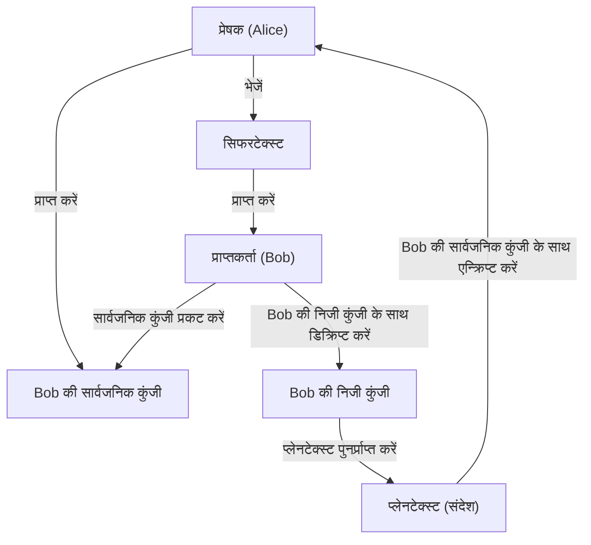
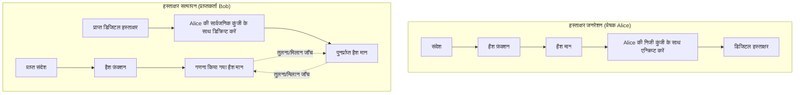

आधुनिक इंटरनेट समाज में, सूचना की गोपनीयता, अखंडता और उपलब्धता सुनिश्चित करने के लिए **सूचना सुरक्षा** एक आवश्यक आधार बन गई है। इसका मुख्य आधार **आधुनिक क्रिप्टोग्राफी** तकनीक है। यह लेख आधुनिक क्रिप्टोग्राफी के मूल सिद्धांतों जैसे **सार्वजनिक कुंजी क्रिप्टोग्राफी** , **हैश फ़ंक्शन** , और **डिजिटल हस्ताक्षर** के गणितीय पृष्ठभूमि, विशिष्ट एल्गोरिदम संरचनाओं और पायथन (Python) का उपयोग करके कार्यान्वयन के उदाहरणों की बहुत विस्तृत और व्यापक व्याख्या प्रदान करता है।

---

## 1. क्रिप्टोग्राफ़िक तकनीक का विकास: सममित-कुंजी क्रिप्टोग्राफी से सार्वजनिक-कुंजी क्रिप्टोग्राफी तक

### 1.1. सममित-कुंजी क्रिप्टोग्राफी और इसकी सीमाएँ
प्राचीन काल से उपयोग की जाने वाली एन्क्रिप्शन विधि **सममित-कुंजी क्रिप्टोग्राफी** (Symmetric-key cryptography) है, जो एन्क्रिप्शन और डिक्रिप्शन के लिए एक ही कुंजी का उपयोग करती है। इसका एक विशिष्ट एल्गोरिदम AES (Advanced Encryption Standard) है। यद्यपि सममित-कुंजी क्रिप्टोग्राफी की प्रसंस्करण गति तेज़ होने का लाभ है, लेकिन इसकी सबसे बड़ी कमजोरी **कुंजी वितरण समस्या** (Key Distribution Problem) है।

संचार करने वाले दोनों पक्षों को पहले से ही एक सुरक्षित चैनल पर समान कुंजी साझा करनी चाहिए, लेकिन इंटरनेट जैसे खुले नेटवर्क पर कुंजियों को सुरक्षित रूप से वितरित करना बेहद मुश्किल है।

### 1.2. सार्वजनिक-कुंजी क्रिप्टोग्राफी का जन्म
इस कुंजी वितरण समस्या को गणितीय दृष्टिकोण से हल करने का तरीका **सार्वजनिक-कुंजी क्रिप्टोग्राफी** (Public-key cryptography) है। सार्वजनिक-कुंजी क्रिप्टोग्राफी में, कुंजियों के दो अलग-अलग जोड़े उत्पन्न होते हैं: एन्क्रिप्शन के लिए उपयोग की जाने वाली **सार्वजनिक कुंजी** (Public Key) और डिक्रिप्शन के लिए उपयोग की जाने वाली **निजी कुंजी** (Private Key)।

- **सार्वजनिक कुंजी** : एक कुंजी जिसे किसी के भी सामने प्रकट किया जा सकता है। इसका उपयोग संदेशों को एन्क्रिप्ट करने के लिए किया जाता है।
- **निजी कुंजी** : एक कुंजी जिसे केवल मालिक द्वारा ही सुरक्षित रूप से रखा जाता है। इसका उपयोग सिफरटेक्स्ट (एन्क्रिप्टेड टेक्स्ट) को डिक्रिप्ट करने के लिए किया जाता है।

इस विषमता के कारण, प्राप्तकर्ता अपनी सार्वजनिक कुंजी को दुनिया के सामने प्रकट करता है, और प्रेषक उस सार्वजनिक कुंजी का उपयोग करके एन्क्रिप्ट करता है। एन्क्रिप्टेड डेटा को केवल उस प्राप्तकर्ता द्वारा डिक्रिप्ट किया जा सकता है जिसके पास संबंधित निजी कुंजी है।



---

## 2. सार्वजनिक-कुंजी क्रिप्टोग्राफी की गणितीय पृष्ठभूमि

सार्वजनिक-कुंजी क्रिप्टोग्राफी की सुरक्षा **एकतरफ़ा फ़ंक्शन** (One-way function), जिसका अर्थ है "एक निश्चित गणना आसान है, लेकिन विपरीत गणना बहुत कठिन है", और एक **ट्रैपडोर एकतरफ़ा फ़ंक्शन** पर निर्भर करती है जो विशिष्ट जानकारी (ट्रैपडोर) ज्ञात होने पर रिवर्स गणना की अनुमति देता है। यहाँ, हम विशिष्ट RSA एन्क्रिप्शन और इलिप्टिक कर्व क्रिप्टोग्राफी ([ECC](/hi/p/elliptic-curve-cryptography-math-cpp/)) के बारे में गहराई से जानेंगे।

### 2.1. RSA एन्क्रिप्शन कैसे काम करता है

RSA एन्क्रिप्शन 1977 में Ron Rivest, Adi Shamir और Leonard Adleman द्वारा विकसित किया गया था। RSA की सुरक्षा **अभाज्य गुणनखंडन समस्या की कठिनाई** पर निर्भर करती है। दो बहुत बड़ी अभाज्य संख्याओं का गुणा करना आसान है, लेकिन वर्तमान शास्त्रीय कंप्यूटरों के लिए उचित समय के भीतर उनके गुणनफल से मूल अभाज्य संख्याओं का पता लगाना यथार्थवादी रूप से संभव नहीं है।

#### 2.1.1. RSA कुंजी जनरेशन एल्गोरिदम

RSA कुंजी जनरेशन निम्नलिखित चरणों में किया जाता है:

1. दो बहुत बड़ी अभाज्य संख्याएँ $p$ और $q$ चुनें।
2. उनके गुणनफल $N = p \times q$ की गणना करें। ($N$ सार्वजनिक किया जाने वाला मॉड्यूलस है)
3. यूलर (Euler) के टॉटिएंट फ़ंक्शन $\phi(N)$ की गणना करें।
   $ \phi(N) = (p - 1)(q - 1) $
4. एक पूर्णांक $e$ चुनें जो $1 < e < \phi(N)$ हो और $\phi(N)$ के साथ सह-अभाज्य (co-prime) हो। (आमतौर पर, $e = 65537$ का अक्सर उपयोग किया जाता है)
5. $d$ की गणना करें जो निम्नलिखित सर्वांगसमता (congruence) संबंध को संतुष्ट करता हो।
   $ e \times d \equiv 1 \pmod{\phi(N)} $
   इसकी गणना विस्तारित यूक्लिडियन एल्गोरिदम का उपयोग करके की जा सकती है।

यहाँ, $(N, e)$ **सार्वजनिक कुंजी** है, और $d$ **निजी कुंजी** है ($p, q$ को नष्ट कर दिया जाता है या कड़ाई से गुप्त रखा जाता है)।

#### 2.1.2. एन्क्रिप्शन और डिक्रिप्शन के गणितीय सूत्र

मान लीजिए कि प्लेनटेक्स्ट $M$ है (जहाँ $0 \le M < N$), और सिफरटेक्स्ट $C$ है।

**एन्क्रिप्शन** (सार्वजनिक कुंजी $e, N$ का उपयोग करते हुए):
$ C \equiv M^e \pmod{N} $

**डिक्रिप्शन** (निजी कुंजी $d, N$ का उपयोग करते हुए):
$ M \equiv C^d \pmod{N} $

यह डिक्रिप्शन यूलर के प्रमेय $M^{\phi(N)} \equiv 1 \pmod{N}$ के कारण सही ढंग से कार्य करता है।
$ C^d \equiv (M^e)^d \equiv M^{ed} \equiv M^{k\phi(N) + 1} \equiv M \cdot (M^{\phi(N)})^k \equiv M \cdot 1^k \equiv M \pmod{N} $

### 2.2. इलिप्टिक कर्व क्रिप्टोग्राफी (ECC: Elliptic Curve Cryptography)

RSA एन्क्रिप्शन सुरक्षित है, लेकिन पर्याप्त सुरक्षा सुनिश्चित करने के लिए कुंजी की लंबाई बहुत लंबी (उदाहरण के लिए, 2048 बिट्स या 4096 बिट्स) होनी चाहिए। इसके विपरीत, **इलिप्टिक कर्व क्रिप्टोग्राफी** छोटी कुंजी लंबाई के साथ समान स्तर की सुरक्षा प्रदान करती है।

#### 2.2.1. इलिप्टिक कर्व और असतत लघुगणक समस्या (Discrete Logarithm Problem)

[ECC](/hi/p/elliptic-curve-cryptography-math-cpp/) की सुरक्षा **इलिप्टिक कर्व पर असतत लघुगणक समस्या** (ECDLP) की कठिनाई पर निर्भर करती है।
क्रिप्टोग्राफी में उपयोग किए जाने वाले परिमित क्षेत्र $\mathbb{F}_p$ पर इलिप्टिक कर्व को आम तौर पर वीयरस्ट्रैस (Weierstrass) मानक रूप में दर्शाया जाता है।

$ y^2 \equiv x^3 + ax + b \pmod{p} $

(जहाँ $4a^3 + 27b^2 \not\equiv 0 \pmod{p}$)

इलिप्टिक कर्व पर बिंदुओं के बीच जोड़ (बिंदु जोड़) और एक ही बिंदु को कई बार जोड़ने का संचालन (अदिश गुणन या scalar multiplication) परिभाषित किया गया है।
मान लें कि किसी आधार बिंदु (base point) $G$ को $k$ बार जोड़ने पर प्राप्त बिंदु $P$ है।

$ P = k \times G $

यहाँ, जब $G$ और $P$ दिए गए हों, तो अदिश मान $k$ को खोजने की समस्या को **इलिप्टिक कर्व असतत लघुगणक समस्या** कहा जाता है। यदि $k$ काफी बड़ा है, तो गणना द्वारा इसकी विपरीत गणना करना बेहद मुश्किल है।
[ECC](/hi/p/elliptic-curve-cryptography-math-cpp/) में, $k$ **निजी कुंजी** है और $P$ **सार्वजनिक कुंजी** है।

### 2.3. पायथन का उपयोग करके सार्वजनिक-कुंजी क्रिप्टोग्राफी कार्यान्वयन का उदाहरण

यह पायथन की `cryptography` लाइब्रेरी का उपयोग करके RSA कुंजियाँ उत्पन्न करने और एन्क्रिप्ट/डिक्रिप्ट करने के लिए कोड का एक उदाहरण है।

```python
from cryptography.hazmat.primitives.asymmetric import rsa
from cryptography.hazmat.primitives.asymmetric import padding
from cryptography.hazmat.primitives import hashes
import base64

# 1. RSA कुंजी जोड़ी उत्पन्न करना
private_key = rsa.generate_private_key(
    public_exponent=65537,
    key_size=2048,
)
public_key = private_key.public_key()

# 2. संदेश को परिभाषित करना
message = b"This is a highly confidential message about modern cryptography."

# 3. सार्वजनिक कुंजी का उपयोग करके एन्क्रिप्शन (OAEP पैडिंग का उपयोग करके)
ciphertext = public_key.encrypt(
    message,
    padding.OAEP(
        mgf=padding.MGF1(algorithm=hashes.SHA256()),
        algorithm=hashes.SHA256(),
        label=None
    )
)
print("Ciphertext (Base64):", base64.b64encode(ciphertext).decode('utf-8'))

# 4. निजी कुंजी का उपयोग करके डिक्रिप्शन
decrypted_message = private_key.decrypt(
    ciphertext,
    padding.OAEP(
        mgf=padding.MGF1(algorithm=hashes.SHA256()),
        algorithm=hashes.SHA256(),
        label=None
    )
)
print("Decrypted Message:", decrypted_message.decode('utf-8'))
```

---

## 3. हैश फ़ंक्शन (Hash Functions)

सार्वजनिक-कुंजी क्रिप्टोग्राफी के साथ-साथ, **क्रिप्टोग्राफ़िक हैश फ़ंक्शन** आधुनिक क्रिप्टोग्राफी की नींव हैं। हैश फ़ंक्शन ऐसे फ़ंक्शन होते हैं जो किसी भी लंबाई का डेटा इनपुट के रूप में लेते हैं और एक निश्चित लंबाई का छद्म-यादृच्छिक (pseudo-random) डेटा (हैश मान, डाइजेस्ट) आउटपुट करते हैं।

### 3.1. क्रिप्टोग्राफ़िक हैश फ़ंक्शन के लिए आवश्यक 3 गुण

क्रिप्टोग्राफ़िक तकनीक के रूप में सुरक्षित रूप से उपयोग किए जाने के लिए, निम्नलिखित तीन मजबूत गुणों की आवश्यकता होती है:

1. **एकतरफ़ा गुण** (Pre-image resistance):
   आउटपुट किए गए हैश मान $h$ से मूल इनपुट संदेश $m$ की विपरीत गणना करना कम्प्यूटेशनल रूप से कठिन होना चाहिए।
2. **कमजोर टकराव प्रतिरोध** (Second pre-image resistance):
   जब एक इनपुट संदेश $m_1$ दिया गया हो, तो समान हैश मान वाले किसी अन्य संदेश $m_2$ ($m_1 \neq m_2$) को खोजना कठिन होना चाहिए।
3. **मजबूत टकराव प्रतिरोध** (Collision resistance):
   ऐसे किसी भी दो संदेशों की जोड़ी $(m_1, m_2)$ को खोजना कठिन होना चाहिए जिनका हैश मान मेल खाता हो।

### 3.2. SHA-2 (Secure Hash Algorithm 2) की संरचना

वर्तमान में सबसे व्यापक रूप से उपयोग किया जाने वाला हैश फ़ंक्शन SHA-2 परिवार (विशेष रूप से **SHA-256**) है। SHA-2 **मर्कल-डैमगार्ड (Merkle-Damgård) संरचना** का उपयोग करता है।

मर्कल-डैमगार्ड संरचना में, इनपुट संदेश को निश्चित लंबाई के ब्लॉक (SHA-256 के मामले में 512 बिट्स) में विभाजित किया जाता है, और लंबाई को समायोजित करने के लिए पैडिंग की जाती है। फिर, प्रारंभिक हैश मान (IV) और पहले ब्लॉक को एक **संपीड़न फ़ंक्शन** (Compression function) में इनपुट किया जाता है, और इसका आउटपुट क्रमिक रूप से अगले ब्लॉक के इनपुट के रूप में संसाधित किया जाता है।

$ H_i = f(H_{i-1}, M_i) $

इस श्रृंखला जैसी संरचना के कारण, किसी भी लंबाई के संदेश से एक निश्चित लंबाई का सुरक्षित डाइजेस्ट उत्पन्न किया जा सकता है।

### 3.3. SHA-3 (Keccak) की संरचना

SHA-2 के विकल्प और अगली पीढ़ी के मानक के रूप में NIST द्वारा **SHA-3** (Keccak एल्गोरिदम) को चुना गया था। SHA-3 मर्कल-डैमगार्ड संरचना के बजाय पूरी तरह से अलग **स्पंज (Sponge) संरचना** का उपयोग करता है।

स्पंज संरचना आंतरिक स्थिति को बनाए रखती है और निम्नलिखित दो चरणों में संचालित होती है:

- **अवशोषण (Absorb) चरण** : संदेश ब्लॉक को एक निश्चित दर (Rate) पर आंतरिक स्थिति के बिट अनुक्रम के साथ XOR (Exclusive OR) किया जाता है, और डेटा को अवशोषित करने के लिए एक आंतरिक क्रमपरिवर्तन फ़ंक्शन (Permutation function $f$) लागू किया जाता है।
- **निचोड़ने (Squeeze) चरण** : डेटा अवशोषण पूरा होने के बाद, डेटा को लगातार आंतरिक स्थिति से निकाला जाता है (निचोड़ा जाता है), और आवश्यक आउटपुट लंबाई तक पहुंचने तक क्रमपरिवर्तन फ़ंक्शन $f$ का अनुप्रयोग और निष्कर्षण दोहराया जाता है।

इस संरचना के कारण, यह मजबूत सुरक्षा का दावा करता है जिससे SHA-2 के खिलाफ मौजूदा हमले के तरीके पूरी तरह से अप्रभावी हो जाते हैं।

### 3.4. पायथन का उपयोग करके हैश फ़ंक्शन कार्यान्वयन का उदाहरण

```python
from cryptography.hazmat.primitives import hashes

message = b"Modern cryptography heavily relies on secure hash functions."

# SHA-256 उत्पन्न करना
digest_sha256 = hashes.Hash(hashes.SHA256())
digest_sha256.update(message)
hash_result_sha256 = digest_sha256.finalize()
print("SHA-256:", hash_result_sha256.hex())

# SHA-3 (SHA3-256) उत्पन्न करना
digest_sha3 = hashes.Hash(hashes.SHA3_256())
digest_sha3.update(message)
hash_result_sha3 = digest_sha3.finalize()
print("SHA3-256:", hash_result_sha3.hex())
```

---

## 4. डिजिटल हस्ताक्षर (Digital Signatures)

सार्वजनिक-कुंजी क्रिप्टोग्राफी और हैश फ़ंक्शन को जोड़कर, **डिजिटल हस्ताक्षर** प्राप्त किए जा सकते हैं, जो वास्तविक दुनिया में "मुहर" या "हस्ताक्षर" के बराबर हैं। डिजिटल हस्ताक्षर संदेश की **अखंडता** (यह सुनिश्चित करना कि इसके साथ छेड़छाड़ नहीं की गई है), **प्रेषक का प्रमाणीकरण** (यह सुनिश्चित करना कि यह प्रतिरूपण नहीं है), और **अस्वीकृति-विरोधी गुण** (Non-repudiation: भेजने के तथ्य को अस्वीकार करने से रोकना) की गारंटी देते हैं।

### 4.1. डिजिटल हस्ताक्षर कैसे काम करते हैं

डिजिटल हस्ताक्षर की मूल अवधारणा " **विपरीत दिशा में सार्वजनिक-कुंजी क्रिप्टोग्राफी का उपयोग** " है।

सामान्य एन्क्रिप्शन में, हम "सार्वजनिक कुंजी के साथ एन्क्रिप्ट करते हैं और निजी कुंजी के साथ डिक्रिप्ट करते हैं," लेकिन डिजिटल हस्ताक्षर में, हम " **निजी कुंजी के साथ एक हस्ताक्षर उत्पन्न करते हैं (एन्क्रिप्शन के बराबर) और सार्वजनिक कुंजी के साथ हस्ताक्षर को सत्यापित करते हैं (डिक्रिप्शन के बराबर)** ।" चूँकि केवल उसी व्यक्ति के पास निजी कुंजी है, उस निजी कुंजी से उत्पन्न हस्ताक्षर इस बात का पुख्ता सबूत है कि इसे उसी व्यक्ति ने बनाया है।

हालाँकि, यदि पूरे डेटा को सीधे सार्वजनिक कुंजी एल्गोरिदम (जैसे RSA) से संसाधित किया जाता है, तो गणना लागत बहुत अधिक होगी। इसलिए, व्यवहार में हमेशा एक **हैश फ़ंक्शन** का उपयोग इसके साथ किया जाता है।

### 4.2. हस्ताक्षर जनरेशन और सत्यापन प्रवाह



1. **हस्ताक्षर जनरेशन** : प्रेषक संदेश के हैश मान की गणना करता है और "हस्ताक्षर डेटा" बनाने के लिए अपनी निजी कुंजी के साथ इसे एन्क्रिप्ट करता है। यह मूल संदेश और हस्ताक्षर डेटा प्राप्तकर्ता को भेजता है।
2. **हस्ताक्षर सत्यापन** : प्राप्तकर्ता प्राप्त संदेश के हैश मान की स्वयं गणना करता है। साथ ही, यह मूल हैश मान को पुनर्प्राप्त करने के लिए प्रेषक की सार्वजनिक कुंजी का उपयोग करके प्राप्त हस्ताक्षर डेटा को डिक्रिप्ट करता है। यदि दोनों हैश मान पूरी तरह से मेल खाते हैं, तो सत्यापन सफल होता है।

### 4.3. पायथन का उपयोग करके डिजिटल हस्ताक्षर कार्यान्वयन का उदाहरण (RSA)

```python
from cryptography.hazmat.primitives.asymmetric import padding
from cryptography.hazmat.primitives import hashes
from cryptography.exceptions import InvalidSignature

# संदेश
doc_message = b"Contract document: Party A agrees to pay Party B $1000."

# 1. हस्ताक्षर उत्पन्न करना (निजी कुंजी का उपयोग करके)
signature = private_key.sign(
    doc_message,
    padding.PSS(
        mgf=padding.MGF1(hashes.SHA256()),
        salt_length=padding.PSS.MAX_LENGTH
    ),
    hashes.SHA256()
)
print("Digital Signature:", base64.b64encode(signature).decode('utf-8')[:50], "...")

# 2. हस्ताक्षर का सत्यापन (सार्वजनिक कुंजी का उपयोग करके)
try:
    public_key.verify(
        signature,
        doc_message,
        padding.PSS(
            mgf=padding.MGF1(hashes.SHA256()),
            salt_length=padding.PSS.MAX_LENGTH
        ),
        hashes.SHA256()
    )
    print("Signature is VALID. Document integrity and authenticity are verified.")
except InvalidSignature:
    print("Signature is INVALID. Document may be tampered with.")
```

---

## 5. सार्वजनिक कुंजी अवसंरचना (PKI: Public Key Infrastructure)

डिजिटल हस्ताक्षर डेटा की अखंडता और प्रेषक प्रमाणीकरण को सक्षम करते हैं, लेकिन समग्र प्रणाली में एक महत्वपूर्ण कमजोरी बनी रहती है। वह यह समस्या है: " **क्या उपयोग की जा रही सार्वजनिक कुंजी वास्तव में संचार भागीदार (Alice) की सही सार्वजनिक कुंजी है?** "

यदि कोई हमलावर (Eve) Alice होने का नाटक करता है और अपनी सार्वजनिक कुंजी Bob को देता है, और Bob यह मानता है कि यह "Alice की सार्वजनिक कुंजी है," तो Eve, Alice का रूप धारण कर सकती है और एन्क्रिप्टेड संचार को डिक्रिप्ट कर सकती है, या जाली हस्ताक्षरों को सत्यापित करवा सकती है। इसे **मैन-इन-द-मिडिल अटैक** (Man-in-the-Middle Attack) कहा जाता है।

सार्वजनिक कुंजियों की वैधता की गारंटी देने और विश्वास की एक श्रृंखला (chain of trust) बनाने के लिए सामाजिक ढांचा **PKI (सार्वजनिक कुंजी अवसंरचना)** है।

### 5.1. प्रमाणन प्राधिकरण (CA) और डिजिटल प्रमाणपत्र (X.509)

PKI के केंद्र में एक विश्वसनीय तृतीय-पक्ष एजेंसी है जिसे **प्रमाणन प्राधिकरण** (CA: Certificate Authority) कहा जाता है। CA की भूमिका व्यक्ति की पहचान या डोमेन के स्वामित्व को सत्यापित करना और एक **डिजिटल प्रमाणपत्र** (सार्वजनिक कुंजी प्रमाणपत्र) जारी करना है जो CA की अपनी "निजी कुंजी" के साथ विषय की "सार्वजनिक कुंजी" पर डिजिटल रूप से हस्ताक्षरित होता है।

डिजिटल प्रमाणपत्रों के लिए मानक के रूप में **X.509** का व्यापक रूप से उपयोग किया जाता है। प्रमाणपत्र में निम्नलिखित जानकारी शामिल होती है:
- संस्करण, सीरियल नंबर
- हस्ताक्षर एल्गोरिदम
- जारीकर्ता (CA) की पहचान जानकारी
- वैधता अवधि
- विषय (सर्वर या व्यक्ति) की पहचान जानकारी
- **विषय की सार्वजनिक कुंजी**
- **CA द्वारा डिजिटल हस्ताक्षर**

### 5.2. PKI विश्वास मॉडल का संरचना आरेख

```mermaid
graph TD
    CA["रूट प्रमाणन प्राधिकरण (Root CA)"]
    SubCA["मध्यवर्ती प्रमाणन प्राधिकरण (Intermediate CA)"]
    Server["वेब सर्वर (Alice)"]
    Client["क्लाइंट पीसी (Bob)"]

    CA -->|"प्रमाणपत्र जारी करें (हस्ताक्षर)"| SubCA
    SubCA -->|"प्रमाणपत्र जारी करें (हस्ताक्षर)"| Server
    Server -->|"सर्वर प्रमाणपत्र प्रस्तुत करें"| Client
    Client -.->|"रूट CA की सार्वजनिक कुंजी पहले से रखें\n("ब्राउज़र या OS में निर्मित")"| CA
    Client -->|"प्रमाणपत्र श्रृंखला सत्यापित करें\nरूट CA की सार्वजनिक कुंजी का उपयोग करें"| Server
```

जब आप किसी ब्राउज़र में "https://" साइट पर जाते हैं, तो PKI की यह प्रणाली पृष्ठभूमि में पूरी तरह से चालू होती है। सर्वर से भेजे गए प्रमाणपत्र के हस्ताक्षर को ब्राउज़र में पहले से इंस्टॉल किए गए रूट प्रमाणन प्राधिकरण की सार्वजनिक कुंजी का उपयोग करके सत्यापित किया जाता है, जिससे एक सुरक्षित संचार चैनल (TLS) स्थापित होता है।

---

## 6. निष्कर्ष

आधुनिक डिजिटल समाज इस लेख में चर्चा की गई **क्रिप्टोग्राफ़िक तकनीकों** के शानदार संयोजन पर बनाया गया है।

- **सममित-कुंजी क्रिप्टोग्राफी** द्वारा हाई-स्पीड डेटा एन्क्रिप्शन
- **सार्वजनिक-कुंजी क्रिप्टोग्राफी** (RSA और [ECC](/hi/p/elliptic-curve-cryptography-math-cpp/)) द्वारा सुरक्षित कुंजी विनिमय और विषमता की प्राप्ति
- **हैश फ़ंक्शन** (SHA-2/3) द्वारा डेटा का फिंगरप्रिंट निष्कर्षण
- **डिजिटल हस्ताक्षर** द्वारा अखंडता का प्रमाण और प्रमाणीकरण
- **PKI और प्रमाणन प्राधिकरणों** द्वारा सार्वजनिक कुंजी की प्रामाणिकता की गारंटी

ये गणितीय सुंदरता और कठोर कम्प्यूटेशनल सिद्धांत हर दिन साइबर हमलों से हमारी गोपनीयता और संपत्ति की रक्षा करते हैं। क्रिप्टोग्राफ़िक तकनीक का विकास जारी है, और क्वांटम कंप्यूटरों के उदय की तैयारी के लिए **पोस्ट-क्वांटम क्रिप्टोग्राफी** (PQC: Post-Quantum Cryptography) का अनुसंधान और मानकीकरण भी तेजी से आगे बढ़ रहा है।

क्रिप्टोग्राफी के मूल सिद्धांतों को सही ढंग से समझना सुरक्षित और अधिक मजबूत सिस्टम और एप्लिकेशन डिजाइन करने की दिशा में पहला कदम होगा।

---
*संदर्भ और संबंधित लिंक*
- NIST FIPS 186-4: Digital Signature Standard (DSS)
- NIST FIPS 202: SHA-3 Standard
- RFC 5280: Internet X.509 Public Key Infrastructure Certificate and Certificate Revocation List (CRL) Profile
