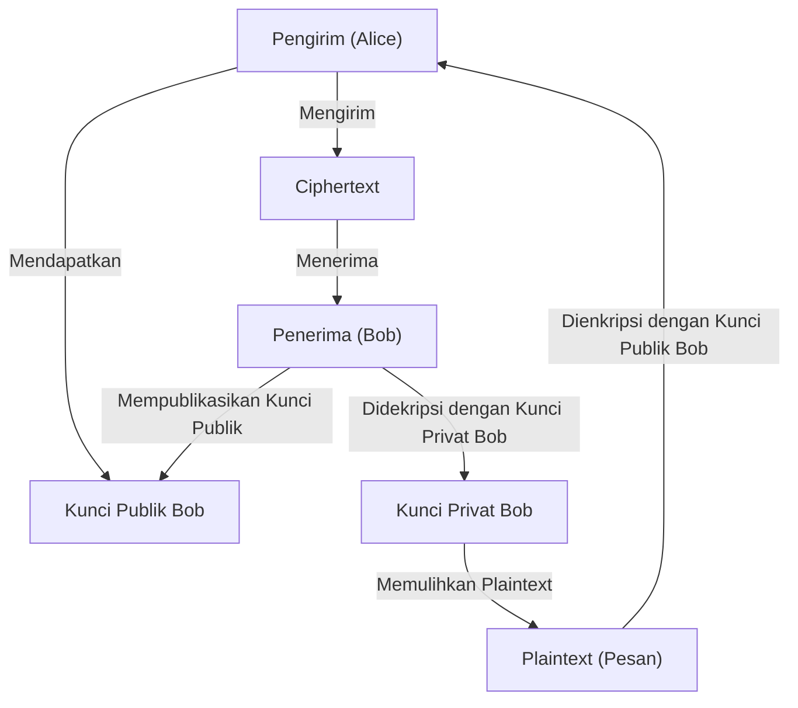
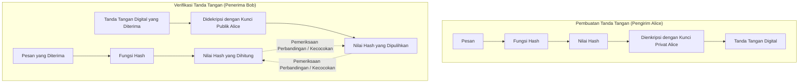

Di masyarakat internet modern, **keamanan informasi** untuk menjamin kerahasiaan, integritas, dan ketersediaan informasi telah menjadi fondasi yang sangat penting. Inti dari hal tersebut didukung oleh teknologi **kriptografi modern**. Dalam artikel ini, kita akan membahas dasar-dasar kriptografi modern, yaitu **kriptografi kunci publik**, **fungsi hash**, dan **tanda tangan digital**, secara sangat detail dan komprehensif, mulai dari latar belakang matematisnya, struktur algoritma spesifik, hingga contoh implementasi menggunakan Python.

---

## 1. Evolusi Teknologi Kriptografi: Dari Kriptografi Kunci Simetris ke Kriptografi Kunci Publik

### 1.1. Kriptografi Kunci Simetris dan Keterbatasannya
Metode kriptografi yang telah digunakan sejak lama adalah **kriptografi kunci simetris** (Symmetric-key cryptography), yang menggunakan kunci yang sama untuk enkripsi dan dekripsi. Algoritma perwakilannya termasuk AES (Advanced Encryption Standard). Kriptografi kunci simetris memiliki keuntungan berupa kecepatan pemrosesan yang tinggi, tetapi kelemahan terbesarnya adalah adanya **masalah distribusi kunci** (Key Distribution Problem).

Kedua pihak yang berkomunikasi harus membagikan kunci yang sama secara aman terlebih dahulu melalui saluran yang aman, namun mendistribusikan kunci secara aman melalui jaringan terbuka seperti internet sangatlah sulit.

### 1.2. Lahirnya Kriptografi Kunci Publik
**Kriptografi kunci publik** (Public-key cryptography) memecahkan masalah distribusi kunci ini melalui pendekatan matematis. Dalam kriptografi kunci publik, dihasilkan dua pasangan kunci yang berbeda: **kunci publik** (Public Key) yang digunakan untuk enkripsi, dan **kunci privat** (Private Key) yang digunakan untuk dekripsi.

- **Kunci publik**: Kunci yang boleh dipublikasikan kepada siapa saja. Digunakan untuk mengenkripsi pesan.
- **Kunci privat**: Kunci yang disimpan dengan sangat rahasia hanya oleh pemiliknya. Digunakan untuk mendekripsi ciphertext (teks rahasia).

Karena asimetri ini, penerima mempublikasikan kunci publiknya ke seluruh dunia, dan pengirim menggunakan kunci publik tersebut untuk mengenkripsi. Data yang dienkripsi hanya dapat didekripsi oleh penerima yang memiliki kunci privat pasangan tersebut.



---

## 2. Latar Belakang Matematis Kriptografi Kunci Publik

Keamanan kriptografi kunci publik bergantung pada **fungsi satu arah** (One-way function), di mana "suatu perhitungan mudah dilakukan, tetapi perhitungan kebalikannya sangat sulit", dan **fungsi satu arah dengan trapdoor** (Trapdoor one-way function), di mana perhitungan terbalik menjadi mungkin jika seseorang mengetahui informasi tertentu (trapdoor/pintu jebakan). Di sini, kita akan membahas lebih dalam tentang kriptografi RSA yang paling representatif dan Kriptografi Kurva Eliptik (ECC).

### 2.1. Cara Kerja Kriptografi RSA

Kriptografi RSA dikembangkan pada tahun 1977 oleh Ron Rivest, Adi Shamir, dan Leonard Adleman. Keamanan RSA bergantung pada **kesulitan masalah faktorisasi prima**. Mengalikan dua bilangan prima raksasa itu mudah, tetapi menemukan bilangan prima aslinya dari hasil kali tersebut tidak dapat diselesaikan dalam waktu yang realistis oleh komputer klasik saat ini.

#### 2.1.1. Algoritma Pembuatan Kunci RSA

Pembuatan kunci RSA dilakukan melalui langkah-langkah berikut:

1. Pilih dua bilangan prima yang sangat besar $p$ dan $q$.
2. Hitung hasil kalinya $N = p \times q$. ($N$ adalah modulus yang dipublikasikan)
3. Hitung fungsi Totient Euler $\phi(N)$.
   $ \phi(N) = (p - 1)(q - 1) $
4. Pilih bilangan bulat $e$ sedemikian rupa sehingga $1 < e < \phi(N)$, dan $e$ saling prima (koprima) terhadap $\phi(N)$. (Biasanya, $e = 65537$ sering digunakan)
5. Hitung $d$ yang memenuhi persamaan kongruensi berikut:
   $ e \times d \equiv 1 \pmod{\phi(N)} $
   Ini dapat dihitung menggunakan Algoritma Euclidean yang Diperluas.

Di sini, $(N, e)$ adalah **kunci publik**, dan $d$ adalah **kunci privat** ($p, q$ dibuang atau dirahasiakan dengan ketat).

#### 2.1.2. Rumus Enkripsi dan Dekripsi

Misalkan plaintext adalah $M$ (dengan $0 \le M < N$), dan ciphertext adalah $C$.

**Enkripsi** (menggunakan kunci publik $e, N$):
$ C \equiv M^e \pmod{N} $

**Dekripsi** (menggunakan kunci privat $d, N$):
$ M \equiv C^d \pmod{N} $

Fakta bahwa dekripsi ini berfungsi dengan benar didasarkan pada Teorema Euler $M^{\phi(N)} \equiv 1 \pmod{N}$.
$ C^d \equiv (M^e)^d \equiv M^{ed} \equiv M^{k\phi(N) + 1} \equiv M \cdot (M^{\phi(N)})^k \equiv M \cdot 1^k \equiv M \pmod{N} $

### 2.2. Kriptografi Kurva Eliptik (ECC: Elliptic Curve Cryptography)

Kriptografi RSA aman, tetapi untuk memberikan kekuatan yang cukup, panjang kunci harus sangat panjang (misalnya, 2048 bit atau 4096 bit). Sebaliknya, **Kriptografi Kurva Eliptik** memberikan tingkat keamanan yang setara dengan panjang kunci yang jauh lebih pendek.

#### 2.2.1. Kurva Eliptik dan Masalah Logaritma Diskrit

Keamanan ECC bergantung pada kesulitan **masalah logaritma diskrit pada kurva eliptik** (ECDLP).
Kurva eliptik pada lapangan berhingga (finite field) $\mathbb{F}_p$ yang digunakan untuk kriptografi umumnya dinyatakan dalam bentuk standar Weierstrass.

$ y^2 \equiv x^3 + ax + b \pmod{p} $

(dengan syarat $4a^3 + 27b^2 \not\equiv 0 \pmod{p}$)

Penambahan antar titik pada kurva eliptik (penambahan titik) dan operasi menambahkan titik yang sama berulang kali (perkalian skalar) telah didefinisikan.
Misalkan titik $P$ adalah hasil penjumlahan titik referensi (base point) $G$ sebanyak $k$ kali.

$ P = k \times G $

Di sini, ketika diberikan $G$ dan $P$, masalah mencari nilai skalar $k$ disebut **masalah logaritma diskrit kurva eliptik**. Jika $k$ cukup besar, menghitungnya secara terbalik adalah hal yang sangat sulit.
Dalam ECC, $k$ adalah **kunci privat**, dan $P$ adalah **kunci publik**.

### 2.3. Contoh Implementasi Kriptografi Kunci Publik dengan Python

Berikut adalah contoh kode untuk mengimplementasikan pembuatan kunci RSA beserta enkripsi dan dekripsi menggunakan pustaka `cryptography` di Python.

```python
from cryptography.hazmat.primitives.asymmetric import rsa
from cryptography.hazmat.primitives.asymmetric import padding
from cryptography.hazmat.primitives import hashes
import base64

# 1. Pembuatan pasangan kunci RSA
private_key = rsa.generate_private_key(
    public_exponent=65537,
    key_size=2048,
)
public_key = private_key.public_key()

# 2. Definisi pesan
message = b"This is a highly confidential message about modern cryptography."

# 3. Enkripsi menggunakan kunci publik (menggunakan padding OAEP)
ciphertext = public_key.encrypt(
    message,
    padding.OAEP(
        mgf=padding.MGF1(algorithm=hashes.SHA256()),
        algorithm=hashes.SHA256(),
        label=None
    )
)
print("Ciphertext (Base64):", base64.b64encode(ciphertext).decode('utf-8'))

# 4. Dekripsi menggunakan kunci privat
decrypted_message = private_key.decrypt(
    ciphertext,
    padding.OAEP(
        mgf=padding.MGF1(algorithm=hashes.SHA256()),
        algorithm=hashes.SHA256(),
        label=None
    )
)
print("Decrypted Message:", decrypted_message.decode('utf-8'))
```

---

## 3. Fungsi Hash (Hash Functions)

Sejalan dengan kriptografi kunci publik, fondasi lain dari kriptografi modern adalah **fungsi hash kriptografis**. Fungsi hash adalah fungsi yang menerima data dengan panjang sembarang sebagai input dan menghasilkan data pseudo-acak dengan panjang tetap (nilai hash, intisari/digest) sebagai output.

### 3.1. 3 Sifat yang Dibutuhkan untuk Fungsi Hash Kriptografis

Agar dapat digunakan secara aman sebagai teknologi kriptografi, tiga sifat kuat berikut sangat diperlukan:

1. **Satu arah** (Pre-image resistance):
   Secara komputasi harus sulit untuk membalikkan perhitungan dari nilai hash output $h$ ke pesan input asli $m$.
2. **Ketahanan kolisi lemah** (Second pre-image resistance):
   Diberikan pesan input $m_1$, harus sulit untuk menemukan pesan lain $m_2$ ($m_1 \neq m_2$) yang memiliki nilai hash yang sama.
3. **Ketahanan kolisi kuat** (Collision resistance):
   Harus sulit untuk menemukan dua pesan sembarang $(m_1, m_2)$ yang nilai hashnya identik.

### 3.2. Struktur SHA-2 (Secure Hash Algorithm 2)

Fungsi hash yang paling banyak digunakan saat ini adalah keluarga SHA-2 (khususnya **SHA-256**). SHA-2 mengadopsi **struktur Merkle-Damgård**.

Dalam struktur Merkle-Damgård, pesan input dibagi menjadi blok-blok berukuran tetap (512 bit untuk SHA-256), dan padding dilakukan untuk menyesuaikan panjangnya. Kemudian, nilai hash awal (IV) dan blok pertama dimasukkan ke dalam **fungsi kompresi** (Compression function), dan outputnya digunakan sebagai input untuk blok berikutnya, diproses secara berantai.

$ H_i = f(H_{i-1}, M_i) $

Melalui struktur rantai ini, ringkasan (digest) aman dengan panjang tetap dapat dihasilkan dari pesan dengan panjang sembarang.

### 3.3. Struktur SHA-3 (Keccak)

**SHA-3** (Algoritma Keccak) dipilih oleh NIST sebagai alternatif dan standar generasi berikutnya untuk SHA-2. SHA-3 tidak menggunakan struktur Merkle-Damgård, melainkan mengadopsi **struktur Sponge** yang sama sekali berbeda.

Struktur Sponge mempertahankan keadaan internal (internal state) dan beroperasi dalam dua fase berikut:

- **Fase Absorb (Menyerap)**: Blok pesan di-XOR (exclusive OR) dengan string bit dari keadaan internal pada setiap kecepatan (Rate) tertentu, dan data diserap dengan menerapkan fungsi permutasi internal ($f$).
- **Fase Squeeze (Memeras)**: Setelah penyerapan data selesai, data terus-menerus diambil (diperas) dari keadaan internal, dan penerapan fungsi permutasi $f$ serta ekstraksi diulang hingga mencapai panjang output yang diperlukan.

Dengan struktur ini, SHA-3 menawarkan keamanan yang kuat di mana metode serangan yang ada terhadap SHA-2 sama sekali tidak efektif.

### 3.4. Contoh Implementasi Fungsi Hash dengan Python

```python
from cryptography.hazmat.primitives import hashes

message = b"Modern cryptography heavily relies on secure hash functions."

# Pembuatan SHA-256
digest_sha256 = hashes.Hash(hashes.SHA256())
digest_sha256.update(message)
hash_result_sha256 = digest_sha256.finalize()
print("SHA-256:", hash_result_sha256.hex())

# Pembuatan SHA-3 (SHA3-256)
digest_sha3 = hashes.Hash(hashes.SHA3_256())
digest_sha3.update(message)
hash_result_sha3 = digest_sha3.finalize()
print("SHA3-256:", hash_result_sha3.hex())
```

---

## 4. Tanda Tangan Digital (Digital Signatures)

Dengan menggabungkan kriptografi kunci publik dan fungsi hash, kita dapat mewujudkan **tanda tangan digital** yang setara dengan "stempel" atau "tanda tangan" di dunia nyata. Tanda tangan digital menjamin **integritas** pesan (bahwa pesan tersebut tidak diubah), **otentikasi pengirim** (bukan peniruan identitas), dan **nir-penyangkalan** (Non-repudiation, pengirim tidak dapat menyangkal fakta pengiriman).

### 4.1. Cara Kerja Tanda Tangan Digital

Konsep dasar tanda tangan digital adalah "**penggunaan terbalik dari kriptografi kunci publik**".

Dalam enkripsi biasa, kita "mengenkripsi dengan kunci publik dan mendekripsi dengan kunci privat", tetapi dalam tanda tangan digital, kita "**membuat tanda tangan dengan kunci privat (setara dengan enkripsi) dan memverifikasi tanda tangan dengan kunci publik (setara dengan dekripsi)**". Karena hanya individu tersebut yang memiliki kunci privat, tanda tangan yang dihasilkan dengan kunci privat tersebut merupakan bukti kuat bahwa individu itulah yang membuatnya.

Namun, memproses seluruh data secara langsung menggunakan algoritma kunci publik (seperti RSA) memerlukan biaya komputasi yang sangat besar. Oleh karena itu, dalam praktiknya, **fungsi hash** selalu digunakan bersamaan.

### 4.2. Alur Pembuatan dan Verifikasi Tanda Tangan



1. **Pembuatan Tanda Tangan**: Pengirim menghitung nilai hash pesan, lalu mengenkripsinya dengan kunci privatnya sendiri untuk membuat "data tanda tangan". Isi pesan dan data tanda tangan dikirim ke penerima.
2. **Verifikasi Tanda Tangan**: Penerima menghitung sendiri nilai hash dari pesan yang diterima. Pada saat yang sama, ia mendekripsi data tanda tangan yang diterima menggunakan kunci publik pengirim untuk mengambil nilai hash asli. Jika kedua nilai hash benar-benar cocok, verifikasi berhasil.

### 4.3. Contoh Implementasi Tanda Tangan Digital dengan Python (RSA)

```python
from cryptography.hazmat.primitives.asymmetric import padding
from cryptography.hazmat.primitives import hashes
from cryptography.exceptions import InvalidSignature

# Pesan
doc_message = b"Contract document: Party A agrees to pay Party B $1000."

# 1. Pembuatan Tanda Tangan (Menggunakan kunci privat)
signature = private_key.sign(
    doc_message,
    padding.PSS(
        mgf=padding.MGF1(hashes.SHA256()),
        salt_length=padding.PSS.MAX_LENGTH
    ),
    hashes.SHA256()
)
print("Digital Signature:", base64.b64encode(signature).decode('utf-8')[:50], "...")

# 2. Verifikasi Tanda Tangan (Menggunakan kunci publik)
try:
    public_key.verify(
        signature,
        doc_message,
        padding.PSS(
            mgf=padding.MGF1(hashes.SHA256()),
            salt_length=padding.PSS.MAX_LENGTH
        ),
        hashes.SHA256()
    )
    print("Signature is VALID. Document integrity and authenticity are verified.")
except InvalidSignature:
    print("Signature is INVALID. Document may be tampered with.")
```

---

## 5. Infrastruktur Kunci Publik (PKI: Public Key Infrastructure)

Meskipun tanda tangan digital memungkinkan integritas data dan otentikasi pengirim, satu kelemahan fatal tetap ada dalam sistem secara keseluruhan. Itu adalah masalah: "**Apakah kunci publik yang digunakan benar-benar kunci publik yang sah dari pihak yang berkomunikasi (Alice)?**"

Jika penyerang (Eve) menyamar sebagai Alice, memberikan kunci publiknya sendiri kepada Bob, dan Bob mempercayai bahwa itu adalah "kunci publik Alice", Eve dapat menyamar sebagai Alice untuk mendekripsi komunikasi terenkripsi atau membuat verifikasi tanda tangan palsu yang dianggap sah. Ini disebut **Serangan Man-in-the-Middle** (Man-in-the-Middle Attack).

Infrastruktur sosial untuk menjamin validitas kunci publik ini dan membangun rantai kepercayaan adalah **PKI (Infrastruktur Kunci Publik)**.

### 5.1. Otoritas Sertifikat (CA) dan Sertifikat Digital (X.509)

Pusat dari PKI adalah **Otoritas Sertifikat** (CA: Certificate Authority), sebuah organisasi pihak ketiga yang tepercaya. Peran CA adalah untuk memeriksa identitas individu atau kepemilikan domain, dan menerbitkan **sertifikat digital** (sertifikat kunci publik) di mana "kunci publik" subjek telah diberi tanda tangan digital menggunakan "kunci privat" milik CA sendiri.

Standar yang banyak digunakan untuk sertifikat digital adalah **X.509**. Sertifikat ini memuat informasi berikut:
- Versi, Nomor Seri
- Algoritma Tanda Tangan
- Informasi Identitas Penerbit (CA)
- Masa Berlaku
- Informasi Identitas Subjek (Server atau Individu)
- **Kunci Publik Subjek**
- **Tanda Tangan Digital oleh CA**

### 5.2. Diagram Struktur Model Kepercayaan PKI

```mermaid
graph TD
    CA["Otoritas Sertifikat Akar (Root CA)"]
    SubCA["Otoritas Sertifikat Menengah (Intermediate CA)"]
    Server["Server Web (Alice)"]
    Client["PC Klien (Bob)"]

    CA -->|"Menerbitkan Sertifikat (Tanda Tangan)"| SubCA
    SubCA -->|"Menerbitkan Sertifikat (Tanda Tangan)"| Server
    Server -->|"Menyajikan Sertifikat Server"| Client
    Client -.->|"Menyimpan Kunci Publik Root CA Sebelumnya\n("Bawaan Browser atau OS")"| CA
    Client -->|"Memverifikasi Rantai Sertifikat\nMenggunakan Kunci Publik Root CA"| Server
```

Bahkan saat mengakses situs web "https://" dengan browser, mekanisme PKI ini beroperasi penuh di latar belakang. Dengan memverifikasi tanda tangan sertifikat yang dikirim dari server menggunakan kunci publik otoritas sertifikat akar yang telah diinstal sebelumnya di browser, saluran komunikasi aman (TLS) dapat dibangun.

---

## 6. Kesimpulan

Masyarakat digital modern dibangun di atas kombinasi luar biasa dari **teknologi kriptografi** yang dibahas kali ini.

- Enkripsi data berkecepatan tinggi dengan **Kriptografi Kunci Simetris**
- Pertukaran kunci yang aman dan realisasi asimetri dengan **Kriptografi Kunci Publik** (RSA dan ECC)
- Ekstraksi sidik jari data dengan **Fungsi Hash** (SHA-2/3)
- Bukti integritas dan otentikasi dengan **Tanda Tangan Digital**
- Jaminan keaslian kunci publik dengan **PKI dan Otoritas Sertifikat**

Keindahan matematis dan teori komputasi yang ketat ini melindungi privasi dan aset kita setiap hari dari serangan siber. Evolusi teknologi kriptografi terus berlanjut, dan penelitian serta standardisasi **Kriptografi Pasca-Kuantum** (PQC: Post-Quantum Cryptography) sebagai persiapan menghadapi kebangkitan komputer kuantum berkembang pesat.

Memahami dasar-dasar kriptografi dengan benar akan menjadi langkah pertama yang bagus dalam merancang sistem dan aplikasi yang lebih aman dan tangguh.

---
*Referensi & Tautan Terkait*
- NIST FIPS 186-4: Digital Signature Standard (DSS)
- NIST FIPS 202: SHA-3 Standard
- RFC 5280: Internet X.509 Public Key Infrastructure Certificate and Certificate Revocation List (CRL) Profile
