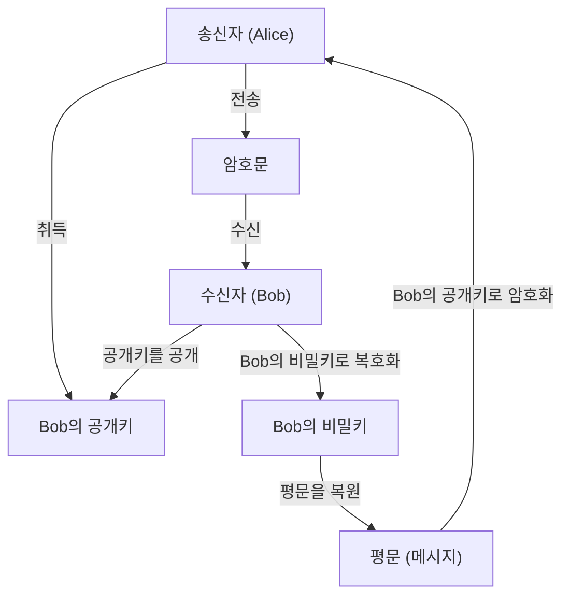
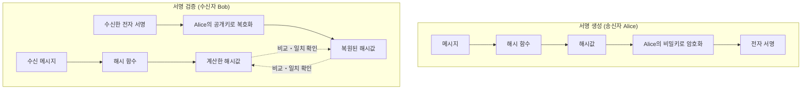
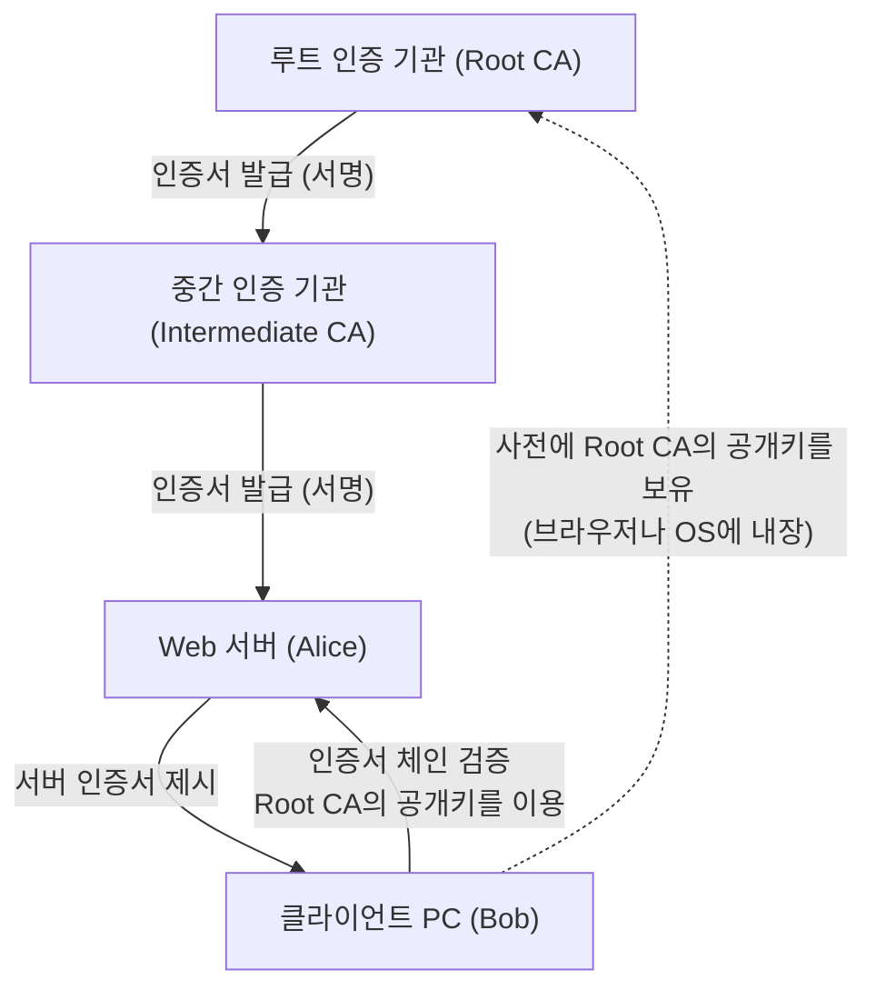

현대의 인터넷 사회에서 정보의 기밀성, 무결성, 가용성을 보장하기 위한 **정보 보안** 은 필수적인 기반이 되었습니다. 그 근간을 지탱하는 것이 **현대 암호** 기술입니다. 본 기사에서는 현대 암호의 기초인 **공개키 암호** , **해시 함수** , 그리고 **전자 서명** 에 대해 수학적 배경부터 구체적인 알고리즘의 구조, 그리고 Python을 이용한 구현 예시까지 매우 상세하고 포괄적으로 해설합니다.

---

## 1. 암호 기술의 진화: 공통키 암호에서 공개키 암호로

### 1.1. 공통키 암호와 그 한계
예전부터 사용되어 온 암호 방식은 암호화와 복호화에 동일한 키를 사용하는 **공통키 암호** (Symmetric-key cryptography)입니다. 대표적인 알고리즘으로 AES(Advanced Encryption Standard)가 있습니다. 공통키 암호는 처리 속도가 빠르다는 장점이 있지만, 가장 큰 약점으로 **키 분배 문제** (Key Distribution Problem)가 존재합니다.

통신을 수행하는 양측이 사전에 안전한 경로로 동일한 키를 공유해야 하지만, 인터넷과 같은 오픈된 네트워크 상에서 안전하게 키를 분배하는 것은 매우 어렵습니다.

### 1.2. 공개키 암호의 탄생
이 키 분배 문제를 수학적인 접근으로 해결한 것이 **공개키 암호** (Public-key cryptography)입니다. 공개키 암호에서는 암호화에 사용하는 **공개키** (Public Key)와 복호화에 사용하는 **비밀키** (Private Key)라는 서로 다른 두 개의 키 쌍을 생성합니다.

- **공개키** : 누구에게나 공개해도 되는 키. 메시지를 암호화하기 위해 사용한다.
- **비밀키** : 소유자만이 엄격하게 보관하는 키. 암호문을 복호화하기 위해 사용한다.

이 비대칭성으로 인해 수신자는 자신의 공개키를 전 세계에 공개하고, 송신자는 그 공개키를 사용하여 암호화합니다. 암호화된 데이터는 쌍을 이루는 비밀키를 가진 수신자만이 복호화할 수 있습니다.



---

## 2. 공개키 암호의 수학적 배경

공개키 암호의 안전성은 "어떤 계산은 쉽지만 그 역계산은 매우 어렵다"는 **일방향 함수** (One-way function)와, 특정 정보(트랩도어: Trapdoor)를 알고 있으면 역계산이 가능해지는 **트랩도어 일방향 함수** 에 의존하고 있습니다. 여기서는 대표적인 RSA 암호와 타원곡선 암호(ECC)에 대해 깊이 파헤쳐 봅니다.

### 2.1. RSA 암호의 원리

RSA 암호는 1977년에 Ron Rivest, Adi Shamir, Leonard Adleman 세 사람에 의해 개발되었습니다. RSA의 안전성은 **소인수분해 문제의 어려움** 에 의존하고 있습니다. 거대한 두 개의 소수를 곱하는 것은 간단하지만, 그 곱에서 원래의 소수를 찾아내는 것은 현재의 고전 컴퓨터로는 현실적인 시간 내에 풀 수 없습니다.

#### 2.1.1. RSA의 키 생성 알고리즘

RSA의 키 생성은 다음 단계를 거쳐 이루어집니다.

1. 매우 큰 두 개의 소수 $p$ 와 $q$ 를 선택한다.
2. 그 곱 $N = p \times q$ 를 계산한다. ($N$ 은 공개되는 모듈러스)
3. 오일러의 피 함수 $\phi(N)$ 을 계산한다.
   $ \phi(N) = (p - 1)(q - 1) $
4. $1 < e < \phi(N)$ 이며, $\phi(N)$ 과 서로소인 정수 $e$ 를 선택한다. (보통 $e = 65537$ 이 자주 사용된다)
5. 다음 합동식을 만족하는 $d$ 를 계산한다.
   $ e \times d \equiv 1 \pmod{\phi(N)} $
   이는 확장 유클리드 호제법을 사용하여 계산할 수 있다.

여기서 $(N, e)$ 가 **공개키** , $d$ 가 **비밀키** 가 됩니다. ($p, q$ 는 파기하거나 엄격하게 기밀로 유지합니다).

#### 2.1.2. 암호화와 복호화의 수식

평문을 $M$ (단, $0 \le M < N$), 암호문을 $C$ 라고 합니다.

**암호화** (공개키 $e, N$ 을 사용):
$ C \equiv M^e \pmod{N} $

**복호화** (비밀키 $d, N$ 을 사용):
$ M \equiv C^d \pmod{N} $

이 복호화가 제대로 작동하는 것은 오일러의 정리 $M^{\phi(N)} \equiv 1 \pmod{N}$ 에 의한 것입니다.
$ C^d \equiv (M^e)^d \equiv M^{ed} \equiv M^{k\phi(N) + 1} \equiv M \cdot (M^{\phi(N)})^k \equiv M \cdot 1^k \equiv M \pmod{N} $

### 2.2. 타원곡선 암호 (ECC: Elliptic Curve Cryptography)

RSA 암호는 안전하지만, 충분한 강도를 가지게 하려면 키 길이를 매우 길게(예를 들어 2048비트나 4096비트로) 해야 합니다. 이에 반해 더 짧은 키 길이로 동등한 안전성을 제공하는 것이 **타원곡선 암호** 입니다.

#### 2.2.1. 타원곡선과 이산대수 문제

ECC의 안전성은 **타원곡선 상의 이산대수 문제** (ECDLP)의 어려움에 의존하고 있습니다.
암호에 사용되는 유한체 $\mathbb{F}_p$ 상의 타원곡선은 일반적으로 바이어슈트라스(Weierstrass)의 표준형으로 표현됩니다.

$ y^2 \equiv x^3 + ax + b \pmod{p} $

(단, $4a^3 + 27b^2 \not\equiv 0 \pmod{p}$)

타원곡선 상의 점들 간의 덧셈(점 덧셈)이나 동일한 점을 여러 번 더하는 연산(스칼라 곱셈)이 정의됩니다.
어떤 기준이 되는 점(베이스 포인트) $G$ 를 $k$ 번 더한 점을 $P$ 라고 합니다.

$ P = k \times G $

여기서 $G$ 와 $P$ 가 주어졌을 때, 스칼라 값 $k$ 를 구하는 문제를 **타원곡선 이산대수 문제** 라고 부릅니다. $k$ 가 충분히 큰 경우, 이를 계산을 통해 역산하는 것은 매우 어렵습니다.
ECC에서는 $k$ 가 **비밀키** , $P$ 가 **공개키** 가 됩니다.

### 2.3. Python을 이용한 공개키 암호 구현 예시

Python의 `cryptography` 라이브러리를 사용하여 RSA 키 생성과 암호화・복호화를 구현하는 코드 예시입니다.

```python
from cryptography.hazmat.primitives.asymmetric import rsa
from cryptography.hazmat.primitives.asymmetric import padding
from cryptography.hazmat.primitives import hashes
import base64

# 1. RSA 키 쌍 생성
private_key = rsa.generate_private_key(
    public_exponent=65537,
    key_size=2048,
)
public_key = private_key.public_key()

# 2. 메시지 정의
message = b"이것은 현대 암호학에 대한 매우 기밀성이 높은 메시지입니다."

# 3. 공개키를 이용한 암호화 (OAEP 패딩 사용)
ciphertext = public_key.encrypt(
    message,
    padding.OAEP(
        mgf=padding.MGF1(algorithm=hashes.SHA256()),
        algorithm=hashes.SHA256(),
        label=None
    )
)
print("암호문 (Base64):", base64.b64encode(ciphertext).decode('utf-8'))

# 4. 비밀키를 이용한 복호화
decrypted_message = private_key.decrypt(
    ciphertext,
    padding.OAEP(
        mgf=padding.MGF1(algorithm=hashes.SHA256()),
        algorithm=hashes.SHA256(),
        label=None
    )
)
print("복호화된 메시지:", decrypted_message.decode('utf-8'))
```

---

## 3. 해시 함수 (Hash Functions)

공개키 암호와 더불어 현대 암호의 핵심이 되는 것이 **암호학적 해시 함수** 입니다. 해시 함수는 임의의 길이의 데이터를 입력으로 받아 고정된 길이의 의사 난수적인 데이터(해시값, 다이제스트)를 출력하는 함수입니다.

### 3.1. 암호학적 해시 함수에 요구되는 3가지 성질

암호 기술로서 안전하게 이용하기 위해서는 다음의 3가지 강력한 성질이 필요합니다.

1. **일방향성** (Pre-image resistance):
   출력된 해시값 $h$ 로부터 원래의 입력 메시지 $m$ 을 역산하는 것이 계산상 어려울 것.
2. **약한 충돌 내성** (Second pre-image resistance):
   어떤 입력 메시지 $m_1$ 이 주어졌을 때, 동일한 해시값을 가지는 다른 메시지 $m_2$ ($m_1 \neq m_2$) 를 찾는 것이 어려울 것.
3. **강한 충돌 내성** (Collision resistance):
   해시값이 일치하는 임의의 두 메시지 쌍 $(m_1, m_2)$ 를 찾는 것이 어려울 것.

### 3.2. SHA-2 (Secure Hash Algorithm 2) 의 구조

현재 가장 널리 사용되고 있는 해시 함수가 SHA-2 제품군(특히 **SHA-256** )입니다. SHA-2는 **Merkle-Damgård(머클-담고르) 구조** 를 채택하고 있습니다.

Merkle-Damgård 구조에서는 입력 메시지를 고정 길이의 블록(SHA-256의 경우 512비트)으로 분할하고 패딩을 수행하여 길이를 조정합니다. 그리고 초기 해시값(IV)과 첫 번째 블록을 **압축 함수** (Compression function)에 입력하고, 그 출력을 다음 블록의 입력으로 연쇄적으로 처리해 나갑니다.

$ H_i = f(H_{i-1}, M_i) $

이 연쇄적인 구조를 통해 임의의 길이의 메시지로부터 고정된 길이의 안전한 다이제스트를 생성할 수 있습니다.

### 3.3. SHA-3 (Keccak) 의 구조

SHA-2의 대체 및 차세대 표준으로 NIST에 의해 선정된 것이 **SHA-3** (Keccak 알고리즘)입니다. SHA-3은 Merkle-Damgård 구조가 아닌 완전히 다른 **Sponge(스펀지) 구조** 를 채택하고 있습니다.

스펀지 구조는 내부 상태를 유지하며 다음의 두 가지 페이즈로 동작합니다.

- **Absorb(흡수) 페이즈** : 메시지 블록을 일정한 레이트(Rate)마다 내부 상태의 비트열과 XOR(배타적 논리합)을 취하고, 내부의 치환 함수(Permutation function $f$)를 적용하여 데이터를 흡수해 나갑니다.
- **Squeeze(짜내기) 페이즈** : 데이터의 흡수가 완료된 후, 내부 상태에서 지속적으로 데이터를 꺼내며(짜내기), 필요한 출력 길이에 도달할 때까지 치환 함수 $f$ 의 적용과 추출을 반복합니다.

이 구조를 통해 SHA-2에 대한 기존의 공격 기법이 전혀 통하지 않는 강력한 안전성을 자랑합니다.

### 3.4. Python을 이용한 해시 함수 구현 예시

```python
from cryptography.hazmat.primitives import hashes

message = b"현대 암호학은 안전한 해시 함수에 크게 의존합니다."

# SHA-256 생성
digest_sha256 = hashes.Hash(hashes.SHA256())
digest_sha256.update(message)
hash_result_sha256 = digest_sha256.finalize()
print("SHA-256:", hash_result_sha256.hex())

# SHA-3 (SHA3-256) 생성
digest_sha3 = hashes.Hash(hashes.SHA3_256())
digest_sha3.update(message)
hash_result_sha3 = digest_sha3.finalize()
print("SHA3-256:", hash_result_sha3.hex())
```

---

## 4. 전자 서명 (Digital Signatures)

공개키 암호와 해시 함수를 조합함으로써 현실 세계의 "도장"이나 "서명"에 해당하는 **전자 서명** 을 구현할 수 있습니다. 전자 서명은 메시지의 **무결성** (변조되지 않았음)과 **송신자 인증** (위장이 아님), 그리고 **부인 방지** (전송한 사실을 부정할 수 없음)를 보장합니다.

### 4.1. 전자 서명의 원리

전자 서명의 기본적인 개념은 " **공개키 암호의 역방향 이용** "입니다.

일반적인 암호화에서는 "공개키로 암호화하고 비밀키로 복호화"하지만, 전자 서명에서는 " **비밀키로 서명을 생성(암호화에 해당)하고 공개키로 서명을 검증(복호화에 해당)** "합니다. 비밀키를 가지고 있는 것은 본인뿐이므로, 그 비밀키로 생성된 서명은 본인이 작성했다는 확실한 증거가 됩니다.

단, 데이터 전체를 직접 공개키 알고리즘(RSA 등)으로 처리하면 계산 비용이 막대해집니다. 따라서 실용적으로는 반드시 **해시 함수** 를 병용합니다.

### 4.2. 서명 생성과 검증 플로우



1. **서명 생성** : 송신자는 메시지의 해시값을 계산하고, 이를 자신의 비밀키로 암호화하여 "서명 데이터"를 작성한다. 메시지 본문과 서명 데이터를 수신자에게 보낸다.
2. **서명 검증** : 수신자는 받은 메시지의 해시값을 스스로 계산한다. 동시에 받은 서명 데이터를 송신자의 공개키로 복호화하여 원래의 해시값을 꺼낸다. 두 해시값이 완전히 일치하면 검증 성공이 된다.

### 4.3. Python을 이용한 전자 서명 구현 예시 (RSA)

```python
from cryptography.hazmat.primitives.asymmetric import padding
from cryptography.hazmat.primitives import hashes
from cryptography.exceptions import InvalidSignature

# 메시지
doc_message = b"계약서: A는 B에게 1000달러를 지불하는 데 동의합니다."

# 1. 서명 생성 (비밀키 사용)
signature = private_key.sign(
    doc_message,
    padding.PSS(
        mgf=padding.MGF1(hashes.SHA256()),
        salt_length=padding.PSS.MAX_LENGTH
    ),
    hashes.SHA256()
)
print("전자 서명:", base64.b64encode(signature).decode('utf-8')[:50], "...")

# 2. 서명 검증 (공개키 사용)
try:
    public_key.verify(
        signature,
        doc_message,
        padding.PSS(
            mgf=padding.MGF1(hashes.SHA256()),
            salt_length=padding.PSS.MAX_LENGTH
        ),
        hashes.SHA256()
    )
    print("서명이 유효합니다. 문서의 무결성과 진정성이 검증되었습니다.")
except InvalidSignature:
    print("서명이 유효하지 않습니다. 문서가 변조되었을 수 있습니다.")
```

---

## 5. 공개키 기반 구조 (PKI: Public Key Infrastructure)

전자 서명에 의해 데이터의 무결성과 송신자 인증이 가능해졌지만, 시스템 전체로서 한 가지 치명적인 약점이 남아 있습니다. 그것은 " **사용하고 있는 공개키가 정말로 통신 상대(Alice)의 올바른 공개키인가?** "라는 문제입니다.

만약 공격자(Eve)가 Alice인 척하며 자신의 공개키를 Bob에게 건네주고, Bob이 이를 "Alice의 공개키다"라고 믿어 버린다면, Eve는 Alice로 위장하여 암호 통신을 해독하거나 위조된 서명을 검증하게 만들 수 있습니다. 이를 **중간자 공격** (Man-in-the-Middle Attack)이라고 부릅니다.

이 공개키의 정당성을 보장하고 신뢰의 사슬을 구축하기 위한 사회적인 인프라가 **PKI (공개키 기반 구조)** 입니다.

### 5.1. 인증 기관 (CA) 과 디지털 인증서 (X.509)

PKI의 중심이 되는 것은 신뢰할 수 있는 제3자 기관인 **인증 기관** (CA: Certificate Authority)입니다. CA의 역할은 개인의 신원이나 도메인의 소유권을 심사하고, 대상자의 "공개키"에 대해 CA 자신의 "비밀키"로 전자 서명을 한 **디지털 인증서** (퍼블릭 키 인증서)를 발급하는 것입니다.

디지털 인증서의 표준 규격으로 **X.509** 가 널리 이용되고 있습니다. 인증서에는 다음 정보가 포함됩니다.
- 버전, 일련번호
- 서명 알고리즘
- 발급자 (CA) 의 식별 정보
- 유효 기간
- 주체자 (서버나 개인) 의 식별 정보
- **주체자의 공개키**
- **CA에 의한 전자 서명**

### 5.2. PKI의 신뢰 모델 구성도



브라우저에서 "https://" 사이트에 접속할 때도 이면에서는 이 PKI의 구조가 풀가동하고 있습니다. 서버로부터 전달받은 인증서의 서명을 브라우저에 사전 설치되어 있는 루트 인증 기관의 공개키를 사용하여 검증함으로써, 안전한 통신 채널(TLS)을 확립하고 있습니다.

---

## 6. 요약

현대의 디지털 사회는 이번에 해설한 **암호 기술** 의 절묘한 조합 위에 성립되어 있습니다.

- **공통키 암호** 에 의한 고속 데이터 암호화
- **공개키 암호** (RSA나 ECC)에 의한 안전한 키 교환과 비대칭성의 실현
- **해시 함수** (SHA-2/3)에 의한 데이터의 지문 추출
- **전자 서명** 에 의한 무결성 증명과 인증
- **PKI와 인증 기관** 에 의한 공개키의 진정성 보장

이러한 수학적인 아름다움과 엄밀한 계산 이론이 우리의 프라이버시와 재산을 매일 사이버 공격으로부터 지켜주고 있습니다. 암호 기술의 진화는 현재도 계속되고 있으며, 양자 컴퓨터의 대두에 대비한 **양자 내성 암호** (PQC: Post-Quantum Cryptography)의 연구 및 표준화도 급속히 진전되고 있습니다.

암호의 기초를 올바르게 이해하는 것은 보다 안전하고 견고한 시스템이나 애플리케이션을 설계하는 데 있어 첫걸음이 될 것입니다.

---
*참고 문헌 및 관련 링크*
- NIST FIPS 186-4: Digital Signature Standard (DSS)
- NIST FIPS 202: SHA-3 Standard
- RFC 5280: Internet X.509 Public Key Infrastructure Certificate and Certificate Revocation List (CRL) Profile
