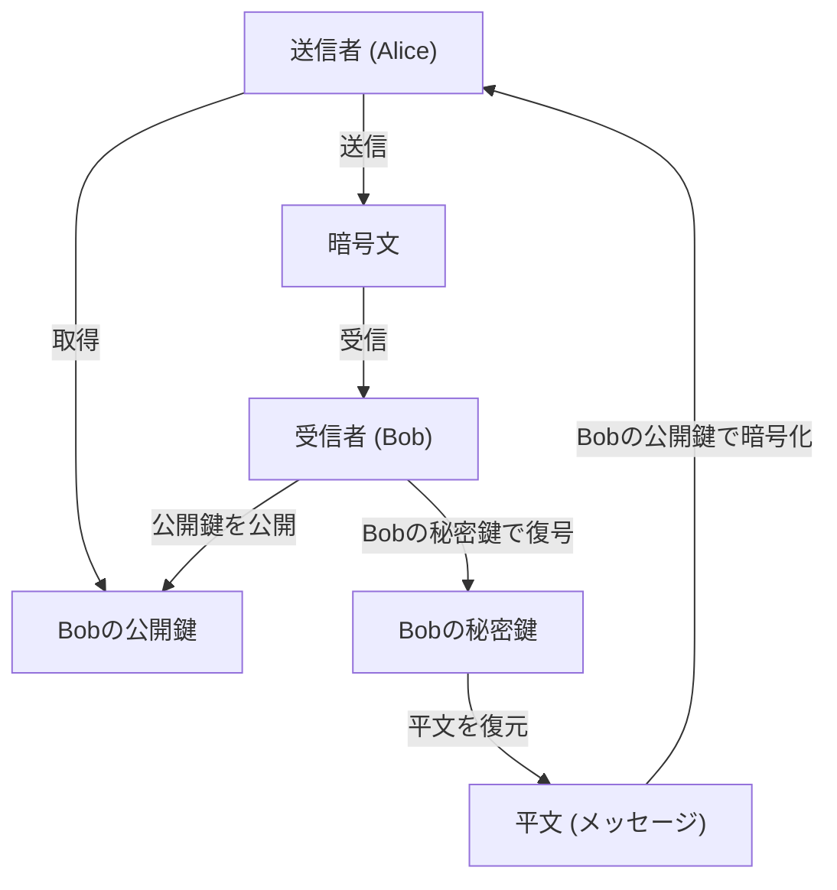
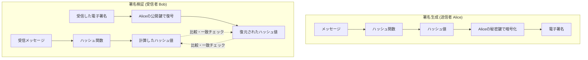
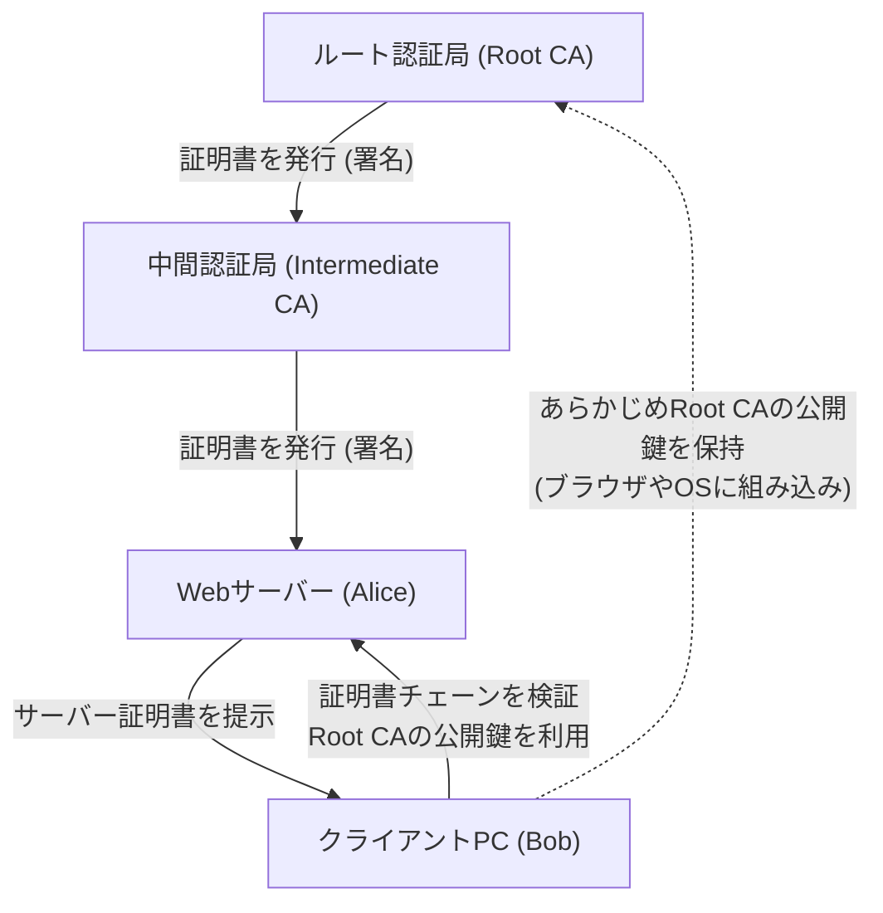

現代のインターネット社会において、情報の機密性、完全性、可用性を担保するための **情報セキュリティ** は不可欠な基盤となっています。その根幹を支えるのが **現代暗号** の技術です。本記事では、現代暗号の基礎である **公開鍵暗号** 、 **ハッシュ関数** 、そして **電子署名** について、その数学的背景から具体的なアルゴリズムの構造、そしてPythonを用いた実装例まで、非常に詳細かつ網羅的に解説します。

---

## 1. 暗号技術の進化：共通鍵暗号から公開鍵暗号へ

### 1.1. 共通鍵暗号とその限界
古くから用いられてきた暗号方式は、暗号化と復号に同一の鍵を使用する **共通鍵暗号** （Symmetric-key cryptography）です。代表的なアルゴリズムとしてAES（Advanced Encryption Standard）があります。共通鍵暗号は処理速度が高速であるという利点がありますが、最大の弱点として **鍵配送問題** （Key Distribution Problem）が存在します。

通信を行う両者が事前に安全な経路で同じ鍵を共有しなければなりませんが、インターネットのようなオープンなネットワーク上で安全に鍵を配送することは極めて困難です。

### 1.2. 公開鍵暗号の誕生
この鍵配送問題を数学的なアプローチで解決したのが **公開鍵暗号** （Public-key cryptography）です。公開鍵暗号では、暗号化に用いる **公開鍵** （Public Key）と、復号に用いる **秘密鍵** （Private Key）という異なる2つの鍵のペアを生成します。

- **公開鍵** ：誰にでも公開してよい鍵。メッセージを暗号化するために使う。
- **秘密鍵** ：所有者だけが厳重に保管する鍵。暗号文を復号するために使う。

この非対称性により、受信者は自身の公開鍵を世界中に公開し、送信者はその公開鍵を使って暗号化します。暗号化されたデータは、対となる秘密鍵を持つ受信者だけが復号できます。



---

## 2. 公開鍵暗号の数学的背景

公開鍵暗号の安全性は、「ある計算は容易だが、その逆の計算は非常に困難である」という **一方向性関数** （One-way function）と、特定の情報（落とし戸：Trapdoor）を知っていれば逆計算が可能になる **落とし戸付き一方向性関数** に依存しています。ここでは代表的なRSA暗号と楕円曲線暗号（ECC）について深掘りします。

### 2.1. RSA暗号の仕組み

RSA暗号は、1977年にRon Rivest、Adi Shamir、Leonard Adlemanの3氏によって開発されました。RSAの安全性は **素因数分解問題の困難性** に依存しています。巨大な2つの素数を掛け合わせることは簡単ですが、その積から元の素数を割り出すことは、現在の古典コンピュータでは現実的な時間内に解くことができません。

#### 2.1.1. RSAの鍵生成アルゴリズム

RSAの鍵生成は以下のステップで行われます。

1. 非常に大きな2つの素数 $p$ と $q$ を選択する。
2. その積 $N = p \times q$ を計算する。（$N$ は公開されるモジュラス）
3. オイラーのトーティエント関数 $\phi(N)$ を計算する。
   $$ \phi(N) = (p - 1)(q - 1) $$
4. $1 < e < \phi(N)$ であり、かつ $\phi(N)$ と互いに素である整数 $e$ を選ぶ。（通常、$e = 65537$ がよく使われる）
5. 次の合同式を満たす $d$ を計算する。
   $$ e \times d \equiv 1 \pmod{\phi(N)} $$
   これは、拡張ユークリッドの互除法を用いて計算できる。

ここで、$(N, e)$ が **公開鍵** 、 $d$ が **秘密鍵** となります（$p, q$ は破棄するか厳重に秘匿します）。

#### 2.1.2. 暗号化と復号の数式

平文を $M$ （ただし $0 \le M < N$）、暗号文を $C$ とします。

**暗号化** （公開鍵 $e, N$ を使用）：
$$ C \equiv M^e \pmod{N} $$

**復号** （秘密鍵 $d, N$ を使用）：
$$ M \equiv C^d \pmod{N} $$

この復号が正しく機能するのは、オイラーの定理 $M^{\phi(N)} \equiv 1 \pmod{N}$ によるものです。
$$ C^d \equiv (M^e)^d \equiv M^{ed} \equiv M^{k\phi(N) + 1} \equiv M \cdot (M^{\phi(N)})^k \equiv M \cdot 1^k \equiv M \pmod{N} $$

### 2.2. 楕円曲線暗号 (ECC: Elliptic Curve Cryptography)

RSA暗号は安全ですが、十分な強度を持たせるためには鍵長を非常に長く（例えば2048ビットや4096ビットに）する必要があります。これに対し、より短い鍵長で同等の安全性を提供するのが **楕円曲線暗号** です。

#### 2.2.1. 楕円曲線と離散対数問題

ECCの安全性は **楕円曲線上の離散対数問題** （ECDLP）の困難性に依存しています。
暗号に用いられる有限体 $\mathbb{F}_p$ 上の楕円曲線は、一般的にワイエルシュトラス（Weierstrass）の標準形で表されます。

$$ y^2 \equiv x^3 + ax + b \pmod{p} $$

（ただし $4a^3 + 27b^2 \not\equiv 0 \pmod{p}$）

楕円曲線上の点どうしの足し算（点加算）や、同じ点を何度も足す操作（スカラー倍算）が定義されます。
ある基準となる点（ベースポイント） $G$ を $k$ 回足し合わせた点を $P$ とします。

$$ P = k \times G $$

ここで、$G$ と $P$ が与えられたときに、スカラー値 $k$ を求める問題を **楕円曲線離散対数問題** と呼びます。$k$ が十分に大きい場合、これを計算によって逆算することは極めて困難です。
ECCでは、$k$ が **秘密鍵** 、 $P$ が **公開鍵** となります。

### 2.3. Pythonによる公開鍵暗号の実装例

Pythonの `cryptography` ライブラリを使用して、RSA鍵の生成と暗号化・復号を実装するコード例です。

```python
from cryptography.hazmat.primitives.asymmetric import rsa
from cryptography.hazmat.primitives.asymmetric import padding
from cryptography.hazmat.primitives import hashes
import base64

# 1. RSA鍵ペアの生成
private_key = rsa.generate_private_key(
    public_exponent=65537,
    key_size=2048,
)
public_key = private_key.public_key()

# 2. メッセージの定義
message = b"This is a highly confidential message about modern cryptography."

# 3. 公開鍵を用いた暗号化 (OAEPパディングを使用)
ciphertext = public_key.encrypt(
    message,
    padding.OAEP(
        mgf=padding.MGF1(algorithm=hashes.SHA256()),
        algorithm=hashes.SHA256(),
        label=None
    )
)
print("Ciphertext (Base64):", base64.b64encode(ciphertext).decode('utf-8'))

# 4. 秘密鍵を用いた復号
decrypted_message = private_key.decrypt(
    ciphertext,
    padding.OAEP(
        mgf=padding.MGF1(algorithm=hashes.SHA256()),
        algorithm=hashes.SHA256(),
        label=None
    )
)
print("Decrypted Message:", decrypted_message.decode('utf-8'))
```

---

## 3. ハッシュ関数 (Hash Functions)

公開鍵暗号と並んで現代暗号の要となるのが **暗号学的ハッシュ関数** です。ハッシュ関数は、任意の長さのデータを入力として受け取り、固定長の疑似乱数的なデータ（ハッシュ値、ダイジェスト）を出力する関数です。

### 3.1. 暗号学的ハッシュ関数に求められる3つの性質

暗号技術として安全に利用するためには、以下の3つの強固な性質が必要です。

1. **一方向性** （Pre-image resistance）：
   出力されたハッシュ値 $h$ から、元の入力メッセージ $m$ を逆算することが計算上困難であること。
2. **弱衝突耐性** （Second pre-image resistance）：
   ある入力メッセージ $m_1$ が与えられたとき、同じハッシュ値を持つ別のメッセージ $m_2$ ($m_1 \neq m_2$) を見つけることが困難であること。
3. **強衝突耐性** （Collision resistance）：
   ハッシュ値が一致する任意の2つのメッセージのペア $(m_1, m_2)$ を見つけることが困難であること。

### 3.2. SHA-2 (Secure Hash Algorithm 2) の構造

現在最も広く使われているハッシュ関数がSHA-2ファミリ（特に **SHA-256** ）です。SHA-2は **Merkle-Damgård（マークル・ダンゴード）構造** を採用しています。

Merkle-Damgård構造では、入力メッセージを固定長のブロック（SHA-256の場合は512ビット）に分割し、パディングを行って長さを調整します。そして、初期ハッシュ値（IV）と最初のブロックを **圧縮関数** （Compression function）に入力し、その出力を次のブロックの入力として連鎖的に処理していきます。

$$ H_i = f(H_{i-1}, M_i) $$

この連鎖的な構造により、任意の長さのメッセージから固定長の安全なダイジェストを生成できます。

### 3.3. SHA-3 (Keccak) の構造

SHA-2の代替・次世代規格としてNISTにより選定されたのが **SHA-3** （Keccakアルゴリズム）です。SHA-3はMerkle-Damgård構造ではなく、全く異なる **Sponge（スポンジ）構造** を採用しています。

スポンジ構造は、内部状態を保持し、以下の2つのフェーズで動作します。

- **Absorb（吸収）フェーズ** ：メッセージブロックを一定のレート（Rate）ごとに内部状態のビット列とXOR（排他的論理和）を取り、内部の置換関数（Permutation function $f$）を適用してデータを吸収していきます。
- **Squeeze（絞り出し）フェーズ** ：データの吸収が完了した後、内部状態から定常的にデータを取り出し（絞り出し）、必要な出力長に達するまで置換関数 $f$ の適用と抽出を繰り返します。

この構造により、SHA-2に対する既存の攻撃手法が全く通用しないという強固な安全性を誇ります。

### 3.4. Pythonによるハッシュ関数の実装例

```python
from cryptography.hazmat.primitives import hashes

message = b"Modern cryptography heavily relies on secure hash functions."

# SHA-256の生成
digest_sha256 = hashes.Hash(hashes.SHA256())
digest_sha256.update(message)
hash_result_sha256 = digest_sha256.finalize()
print("SHA-256:", hash_result_sha256.hex())

# SHA-3 (SHA3-256)の生成
digest_sha3 = hashes.Hash(hashes.SHA3_256())
digest_sha3.update(message)
hash_result_sha3 = digest_sha3.finalize()
print("SHA3-256:", hash_result_sha3.hex())
```

---

## 4. 電子署名 (Digital Signatures)

公開鍵暗号とハッシュ関数を組み合わせることで、現実世界の「印鑑」や「サイン」に相当する **電子署名** を実現できます。電子署名は、メッセージの **完全性** （改ざんされていないこと）と **送信者の[認証](https://kenji.blog/p/oauth2-oidc-authentication-authorization-difference/)** （なりすましではないこと）、そして **否認防止** （送信した事実を否定できないこと）を保証します。

### 4.1. 電子署名の仕組み

電子署名の基本的な概念は「 **公開鍵暗号の逆方向の利用** 」です。

通常の暗号化では「公開鍵で暗号化し、秘密鍵で復号」しますが、電子署名では「 **秘密鍵で署名を生成（暗号化に相当）し、公開鍵で署名を検証（復号に相当）** 」します。秘密鍵を持っているのは本人だけなので、その秘密鍵で生成された署名は、本人が作成した確固たる証拠となります。

ただし、データ全体を直接公開鍵アルゴリズム（RSAなど）で処理すると計算コストが膨大になります。そのため、実用上は必ず **ハッシュ関数** を併用します。

### 4.2. 署名の生成と検証のフロー



1. **署名生成** : 送信者はメッセージのハッシュ値を計算し、それを自身の秘密鍵で暗号化して「署名データ」を作成する。メッセージ本体と署名データを受信者に送る。
2. **署名検証** : 受信者は受け取ったメッセージのハッシュ値を自分で計算する。同時に、受け取った署名データを送信者の公開鍵で復号して元のハッシュ値を取り出す。両方のハッシュ値が完全に一致すれば、検証成功となる。

### 4.3. Pythonによる電子署名の実装例 (RSA)

```python
from cryptography.hazmat.primitives.asymmetric import padding
from cryptography.hazmat.primitives import hashes
from cryptography.exceptions import InvalidSignature

# メッセージ
doc_message = b"Contract document: Party A agrees to pay Party B $1000."

# 1. 署名の生成 (秘密鍵を使用)
signature = private_key.sign(
    doc_message,
    padding.PSS(
        mgf=padding.MGF1(hashes.SHA256()),
        salt_length=padding.PSS.MAX_LENGTH
    ),
    hashes.SHA256()
)
print("Digital Signature:", base64.b64encode(signature).decode('utf-8')[:50], "...")

# 2. 署名の検証 (公開鍵を使用)
try:
    public_key.verify(
        signature,
        doc_message,
        padding.PSS(
            mgf=padding.MGF1(hashes.SHA256()),
            salt_length=padding.PSS.MAX_LENGTH
        ),
        hashes.SHA256()
    )
    print("Signature is VALID. Document integrity and authenticity are verified.")
except InvalidSignature:
    print("Signature is INVALID. Document may be tampered with.")
```

---

## 5. 公開鍵基盤 (PKI: Public Key Infrastructure)

電子署名によってデータの完全性と送信者の[認証](https://kenji.blog/p/oauth2-oidc-authentication-authorization-difference/)が可能になりましたが、システム全体として一つ致命的な弱点が残っています。それは「 **使っている公開鍵が、本当に通信相手（Alice）の正しい公開鍵であるか？** 」という問題です。

もし攻撃者（Eve）が、Aliceのふりをして自身の公開鍵をBobに渡し、Bobがそれを「Aliceの公開鍵だ」と信じてしまった場合、EveはAliceになりすまして暗号通信を解読したり、偽造した署名を検証させたりできてしまいます。これを **中間者攻撃** （Man-in-the-Middle Attack）と呼びます。

この公開鍵の正当性を担保し、信頼の連鎖を構築するための社会的なインフラが **PKI (公開鍵基盤)** です。

### 5.1. 認証局 (CA) と デジタル証明書 (X.509)

PKIの中心となるのは、信頼できる第三者機関である **認証局** （CA: Certificate Authority）です。CAの役割は、個人の身元やドメインの所有権を審査し、対象者の「公開鍵」に対してCA自身の「秘密鍵」で電子署名を施した **デジタル証明書** （パブリックキー証明書）を発行することです。

デジタル証明書の標準規格として **X.509** が広く利用されています。証明書には以下の情報が含まれます。
- バージョン、シリアル番号
- 署名アルゴリズム
- 発行者 (CA) の識別情報
- 有効期間
- 主体者 (サーバーや個人) の識別情報
- **主体者の公開鍵**
- **CAによる電子署名**

### 5.2. PKIの信頼モデル構成図



ブラウザで「https://」のサイトにアクセスする際も、裏側ではこのPKIの仕組みがフル稼働しています。サーバーから送られてきた証明書の署名を、ブラウザに事前インストールされているルート[認証](https://kenji.blog/p/oauth2-oidc-authentication-authorization-difference/)局の公開鍵を使って検証することで、安全な通信チャネル（TLS）を確立しています。

---

## 6. まとめ

現代のデジタル社会は、今回解説した **暗号技術** の絶妙な組み合わせの上に成り立っています。

- **共通鍵暗号** による高速なデータ暗号化
- **公開鍵暗号** （RSAやECC）による安全な鍵交換と非対称性の実現
- **ハッシュ関数** （SHA-2/3）によるデータの指紋抽出
- **電子署名** による完全性の証明と認証
- **PKIと認証局** による公開鍵の真正性の担保

これらの数学的な美しさと厳密な計算理論が、私たちのプライバシーと財産を日々サイバー攻撃から守っています。暗号技術の進化は現在も続いており、量子コンピュータの台頭に備えた **耐量子計算機暗号** （PQC: Post-Quantum Cryptography）の研究・標準化も急速に進展しています。

暗号の基礎を正しく理解することは、より安全で強牢なシステムやアプリケーションを設計する上での第一歩となるでしょう。

---
*参考文献・関連リンク*
- NIST FIPS 186-4: Digital Signature Standard (DSS)
- NIST FIPS 202: SHA-3 Standard
- RFC 5280: Internet X.509 Public Key Infrastructure Certificate and Certificate Revocation List (CRL) Profile
