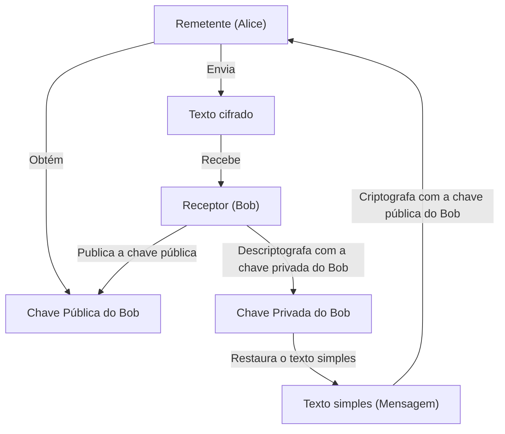
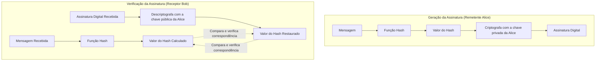

Na sociedade da internet de hoje, a **segurança da informação** é uma base indispensável para garantir a confidencialidade, integridade e disponibilidade das informações. O que sustenta essa base é a tecnologia da **criptografia moderna** . Neste artigo, explicaremos de forma muito detalhada e abrangente os fundamentos da criptografia moderna: **criptografia de chave pública** , **funções hash** e **assinaturas digitais** , desde os seus fundamentos matemáticos até a estrutura de algoritmos específicos e exemplos de implementação em Python.

---

## 1. Evolução da Criptografia: Da Chave Simétrica à Chave Pública

### 1.1. Criptografia de Chave Simétrica e Suas Limitações
O método de criptografia usado desde os tempos antigos é a **criptografia de chave simétrica** (Symmetric-key cryptography), que utiliza a mesma chave para criptografar e descriptografar. Um algoritmo representativo é o AES (Advanced Encryption Standard). A criptografia de chave simétrica tem a vantagem de ser rápida no processamento, mas sua maior fraqueza é a existência do **problema de distribuição de chaves** (Key Distribution Problem).

Ambas as partes envolvidas na comunicação devem compartilhar a mesma chave com antecedência através de um canal seguro, mas distribuir chaves com segurança em uma rede aberta como a internet é extremamente difícil.

### 1.2. O Nascimento da Criptografia de Chave Pública
A **criptografia de chave pública** (Public-key cryptography) resolveu esse problema de distribuição de chaves por meio de uma abordagem matemática. Na criptografia de chave pública, é gerado um par de duas chaves diferentes: uma **chave pública** (Public Key) usada para criptografar, e uma **chave privada** (Private Key) usada para descriptografar.

- **Chave pública** : Uma chave que pode ser publicada para qualquer pessoa. Usada para criptografar mensagens.
- **Chave privada** : Uma chave que deve ser mantida estritamente em segredo apenas pelo seu proprietário. Usada para descriptografar textos cifrados.

Devido a essa assimetria, o receptor publica sua chave pública para o mundo inteiro, e o remetente usa essa chave pública para criptografar. Os dados criptografados só podem ser descriptografados pelo receptor, que possui a chave privada correspondente.



---

## 2. Fundamentos Matemáticos da Criptografia de Chave Pública

A segurança da criptografia de chave pública depende de **funções de mão única** (One-way function), que significam "um certo cálculo é fácil, mas o cálculo inverso é extremamente difícil", e de **funções de mão única com alçapão** (Trapdoor one-way function), onde o cálculo inverso se torna possível se uma informação específica (o alçapão) for conhecida. Aqui, exploraremos em detalhes a criptografia RSA e a criptografia de curva elíptica (ECC), que são algoritmos representativos.

### 2.1. Como Funciona a Criptografia RSA

A criptografia RSA foi desenvolvida em 1977 por Ron Rivest, Adi Shamir e Leonard Adleman. A segurança do RSA depende da **dificuldade do problema de fatoração de inteiros** . É fácil multiplicar dois números primos gigantescos, mas descobrir os números primos originais a partir do seu produto não pode ser resolvido em um tempo realista pelos computadores clássicos atuais.

#### 2.1.1. Algoritmo de Geração de Chaves do RSA

A geração de chaves do RSA é realizada nas seguintes etapas:

1. Selecionar dois números primos muito grandes, $p$ e $q$.
2. Calcular o produto $N = p \times q$. ($N$ é o módulo público)
3. Calcular a função totiente de Euler $\phi(N)$.
   $ \phi(N) = (p - 1)(q - 1) $
4. Escolher um número inteiro $e$ tal que $1 < e < \phi(N)$ e $e$ seja co-primo de $\phi(N)$. (Normalmente, $e = 65537$ é frequentemente usado)
5. Calcular $d$ que satisfaça a seguinte congruência.
   $ e \times d \equiv 1 \pmod{\phi(N)} $
   Isso pode ser calculado usando o algoritmo de Euclides estendido.

Aqui, $(N, e)$ torna-se a **chave pública** e $d$ torna-se a **chave privada** (os valores $p$ e $q$ são descartados ou mantidos estritamente em segredo).

#### 2.1.2. Fórmulas de Criptografia e Descriptografia

Seja $M$ o texto simples (onde $0 \le M < N$) e $C$ o texto cifrado.

**Criptografia** (usando a chave pública $e, N$):
$ C \equiv M^e \pmod{N} $

**Descriptografia** (usando a chave privada $d, N$):
$ M \equiv C^d \pmod{N} $

Esta descriptografia funciona corretamente devido ao teorema de Euler $M^{\phi(N)} \equiv 1 \pmod{N}$.
$ C^d \equiv (M^e)^d \equiv M^{ed} \equiv M^{k\phi(N) + 1} \equiv M \cdot (M^{\phi(N)})^k \equiv M \cdot 1^k \equiv M \pmod{N} $

### 2.2. Criptografia de Curva Elíptica (ECC: Elliptic Curve Cryptography)

A criptografia RSA é segura, mas para ter resistência suficiente, o tamanho da chave precisa ser muito longo (por exemplo, 2048 bits ou 4096 bits). Em contrapartida, a **criptografia de curva elíptica** oferece segurança equivalente com tamanhos de chave mais curtos.

#### 2.2.1. Curvas Elípticas e o Problema do Logaritmo Discreto

A segurança da ECC depende da dificuldade do **problema do logaritmo discreto sobre curvas elípticas** (ECDLP).
Uma curva elíptica sobre um corpo finito $\mathbb{F}_p$ usada em criptografia é geralmente expressa na forma padrão de Weierstrass:

$ y^2 \equiv x^3 + ax + b \pmod{p} $

(onde $4a^3 + 27b^2 \not\equiv 0 \pmod{p}$)

São definidas operações de adição entre pontos na curva elíptica (adição de pontos) e a operação de adicionar o mesmo ponto várias vezes (multiplicação escalar).
Seja $G$ um ponto de referência (ponto base) e $P$ o ponto obtido pela adição de $G$ a si mesmo $k$ vezes.

$ P = k \times G $

Aqui, quando $G$ e $P$ são dados, o problema de encontrar o valor escalar $k$ é chamado de **problema do logaritmo discreto em curvas elípticas** . Se $k$ for suficientemente grande, é extremamente difícil calculá-lo de forma reversa.
Na ECC, $k$ é a **chave privada** e $P$ é a **chave pública** .

### 2.3. Exemplo de Implementação de Criptografia de Chave Pública em Python

Aqui está um exemplo de código que usa a biblioteca `cryptography` do Python para gerar chaves RSA, criptografar e descriptografar.

```python
from cryptography.hazmat.primitives.asymmetric import rsa
from cryptography.hazmat.primitives.asymmetric import padding
from cryptography.hazmat.primitives import hashes
import base64

# 1. Geração do par de chaves RSA
private_key = rsa.generate_private_key(
    public_exponent=65537,
    key_size=2048,
)
public_key = private_key.public_key()

# 2. Definição da mensagem
message = b"This is a highly confidential message about modern cryptography."

# 3. Criptografia usando a chave pública (usando preenchimento OAEP)
ciphertext = public_key.encrypt(
    message,
    padding.OAEP(
        mgf=padding.MGF1(algorithm=hashes.SHA256()),
        algorithm=hashes.SHA256(),
        label=None
    )
)
print("Ciphertext (Base64):", base64.b64encode(ciphertext).decode('utf-8'))

# 4. Descriptografia usando a chave privada
decrypted_message = private_key.decrypt(
    ciphertext,
    padding.OAEP(
        mgf=padding.MGF1(algorithm=hashes.SHA256()),
        algorithm=hashes.SHA256(),
        label=None
    )
)
print("Decrypted Message:", decrypted_message.decode('utf-8'))
```

---

## 3. Funções Hash (Hash Functions)

Junto com a criptografia de chave pública, a **função hash criptográfica** é outro pilar da criptografia moderna. Uma função hash é uma função que aceita dados de qualquer tamanho como entrada e produz dados pseudoaleatórios de tamanho fixo (valor de hash, digest) como saída.

### 3.1. 3 Propriedades Exigidas de Funções Hash Criptográficas

Para serem usadas com segurança na tecnologia de criptografia, as seguintes três fortes propriedades são necessárias:

1. **Resistência à pré-imagem (One-wayness)** (Pre-image resistance):
   A partir de um valor de hash de saída $h$, deve ser computacionalmente difícil calcular a mensagem original de entrada $m$.
2. **Resistência à segunda pré-imagem** (Second pre-image resistance):
   Dada uma mensagem de entrada $m_1$, deve ser difícil encontrar outra mensagem $m_2$ ($m_1 \neq m_2$) que tenha o mesmo valor de hash.
3. **Resistência à colisão** (Collision resistance):
   Deve ser difícil encontrar qualquer par de mensagens diferentes $(m_1, m_2)$ que resultem no mesmo valor de hash.

### 3.2. Estrutura do SHA-2 (Secure Hash Algorithm 2)

A função hash mais usada atualmente é a família SHA-2 (especialmente o **SHA-256** ). O SHA-2 adota a **construção Merkle-Damgård** .

Na construção Merkle-Damgård, a mensagem de entrada é dividida em blocos de tamanho fixo (512 bits para SHA-256) e ajustada por preenchimento (padding). Em seguida, um valor de hash inicial (IV) e o primeiro bloco são inseridos em uma **função de compressão** (Compression function), e essa saída é passada como entrada para o próximo bloco, sendo processada em cadeia.

$ H_i = f(H_{i-1}, M_i) $

Graças a essa estrutura em cadeia, um digest seguro e de tamanho fixo pode ser gerado a partir de uma mensagem de qualquer tamanho.

### 3.3. Estrutura do SHA-3 (Keccak)

O **SHA-3** (algoritmo Keccak) foi selecionado pelo NIST como padrão de próxima geração ou alternativa ao SHA-2. O SHA-3 não usa a construção Merkle-Damgård, mas adota uma estrutura completamente diferente chamada de **construção de esponja** (Sponge).

A construção de esponja mantém um estado interno e opera nas duas fases a seguir:

- **Fase de Absorção (Absorb)** : Em intervalos definidos (Rate), blocos de mensagem sofrem XOR (ou exclusivo) com a sequência de bits do estado interno e, em seguida, uma função de permutação interna (Permutation function $f$) é aplicada para absorver os dados.
- **Fase de Espremer (Squeeze)** : Após a conclusão da absorção dos dados, os dados são constantemente extraídos (espremidos) do estado interno, e a extração continua com a aplicação da função de permutação $f$ até que o comprimento de saída desejado seja atingido.

Devido a essa estrutura, ele possui uma segurança robusta em que os métodos de ataque existentes contra o SHA-2 não têm nenhum efeito.

### 3.4. Exemplo de Implementação de Funções Hash em Python

```python
from cryptography.hazmat.primitives import hashes

message = b"Modern cryptography heavily relies on secure hash functions."

# Geração do SHA-256
digest_sha256 = hashes.Hash(hashes.SHA256())
digest_sha256.update(message)
hash_result_sha256 = digest_sha256.finalize()
print("SHA-256:", hash_result_sha256.hex())

# Geração do SHA-3 (SHA3-256)
digest_sha3 = hashes.Hash(hashes.SHA3_256())
digest_sha3.update(message)
hash_result_sha3 = digest_sha3.finalize()
print("SHA3-256:", hash_result_sha3.hex())
```

---

## 4. Assinaturas Digitais (Digital Signatures)

Ao combinar a criptografia de chave pública com funções hash, podemos realizar **assinaturas digitais** , que são equivalentes a "carimbos" e "assinaturas" no mundo real. Uma assinatura digital garante a **integridade** (que a mensagem não foi adulterada), a **autenticação do remetente** (que não é uma falsificação de identidade) e o **não-repúdio** (o remetente não pode negar o fato de ter enviado a mensagem) de uma mensagem.

### 4.1. Como Funciona a Assinatura Digital

O conceito básico da assinatura digital é " **o uso da criptografia de chave pública no sentido inverso** ".

Na criptografia normal, "criptografamos com a chave pública e descriptografamos com a chave privada", mas na assinatura digital " **geramos a assinatura com a chave privada (equivalente a criptografar) e verificamos a assinatura com a chave pública (equivalente a descriptografar)** ". Como apenas a própria pessoa possui a chave privada, a assinatura gerada por essa chave privada é a prova incontestável de que ela a criou.

No entanto, o custo computacional seria enorme se processássemos os dados inteiros diretamente com um algoritmo de chave pública (como RSA). Por essa razão, uma **função hash** é sempre usada em conjunto na prática.

### 4.2. Fluxo de Geração e Verificação de Assinatura



1. **Geração da Assinatura** : O remetente calcula o valor de hash da mensagem e criptografa-o com sua própria chave privada para criar os "dados de assinatura". O corpo da mensagem e os dados da assinatura são enviados ao receptor.
2. **Verificação da Assinatura** : O receptor calcula de forma independente o valor de hash da mensagem recebida. Ao mesmo tempo, ele descriptografa os dados de assinatura recebidos usando a chave pública do remetente para recuperar o valor de hash original. Se os dois valores de hash coincidirem perfeitamente, a verificação será bem-sucedida.

### 4.3. Exemplo de Implementação de Assinatura Digital em Python (RSA)

```python
from cryptography.hazmat.primitives.asymmetric import padding
from cryptography.hazmat.primitives import hashes
from cryptography.exceptions import InvalidSignature

# Mensagem
doc_message = b"Contract document: Party A agrees to pay Party B $1000."

# 1. Geração da assinatura (usando chave privada)
signature = private_key.sign(
    doc_message,
    padding.PSS(
        mgf=padding.MGF1(hashes.SHA256()),
        salt_length=padding.PSS.MAX_LENGTH
    ),
    hashes.SHA256()
)
print("Digital Signature:", base64.b64encode(signature).decode('utf-8')[:50], "...")

# 2. Verificação da assinatura (usando chave pública)
try:
    public_key.verify(
        signature,
        doc_message,
        padding.PSS(
            mgf=padding.MGF1(hashes.SHA256()),
            salt_length=padding.PSS.MAX_LENGTH
        ),
        hashes.SHA256()
    )
    print("Signature is VALID. Document integrity and authenticity are verified.")
except InvalidSignature:
    print("Signature is INVALID. Document may be tampered with.")
```

---

## 5. Infraestrutura de Chaves Públicas (PKI: Public Key Infrastructure)

Embora as assinaturas digitais tenham tornado possível garantir a integridade dos dados e autenticar os remetentes, um ponto fraco fatal permanece em todo o sistema. Trata-se da questão: " **A chave pública sendo usada é realmente a chave pública correta da pessoa com quem estou me comunicando (Alice)?** ".

Se um atacante (Eve) fingir ser Alice, entregar sua própria chave pública a Bob e Bob acreditar que ela é "a chave pública de Alice", Eve pode se passar por Alice para interceptar a comunicação criptografada ou forçar a verificação de uma assinatura forjada. Isso é chamado de ataque **Man-in-the-Middle** (Ataque de intermediário).

Para garantir a validade desta chave pública e construir uma infraestrutura social para uma rede de confiança, usamos a **PKI (Infraestrutura de Chaves Públicas)** .

### 5.1. Autoridade de Certificação (CA) e Certificados Digitais (X.509)

A peça central da PKI é a **Autoridade de Certificação** (CA: Certificate Authority), uma organização terceirizada e confiável. O papel da CA é examinar a identidade do indivíduo ou a propriedade do domínio e emitir um **certificado digital** (certificado de chave pública) para a "chave pública" do indivíduo aplicando a assinatura digital da CA gerada com a "chave privada" da própria CA.

O **X.509** é amplamente utilizado como o padrão para certificados digitais. O certificado inclui as seguintes informações:
- Versão e número de série
- Algoritmo de assinatura
- Informações de identificação do emissor (CA)
- Período de validade
- Informações de identificação do titular (servidor ou indivíduo)
- **Chave pública do titular**
- **Assinatura digital da CA**

### 5.2. Diagrama da Estrutura do Modelo de Confiança da PKI

```mermaid
graph TD
    CA["Autoridade de Certificação Raiz (Root CA)"]
    SubCA["Autoridade de Certificação Intermediária (Intermediate CA)"]
    Server["Servidor Web (Alice)"]
    Client["PC do Cliente (Bob)"]

    CA -->|"Emite certificado (Assina)"| SubCA
    SubCA -->|"Emite certificado (Assina)"| Server
    Server -->|"Apresenta certificado de servidor"| Client
    Client -.->|"Mantém a chave pública da Root CA com antecedência\n("Embutida no SO ou navegador")"| CA
    Client -->|"Verifica a cadeia de certificados\nUsando a chave pública da Root CA"| Server
```

Até mesmo ao acessar um site com "https://" pelo navegador, esse mecanismo da PKI está operando totalmente nos bastidores. A assinatura do certificado enviado pelo servidor é verificada pela chave pública da autoridade de certificação raiz pré-instalada no navegador, estabelecendo assim um canal de comunicação seguro (TLS).

---

## 6. Conclusão

A sociedade digital moderna baseia-se na incrível combinação das **tecnologias de criptografia** aqui explicadas.

- Criptografia rápida de dados por **criptografia de chave simétrica**
- Troca de chaves segura e assimetria alcançadas pela **criptografia de chave pública** (RSA, ECC)
- Extração de impressões digitais dos dados pelas **funções hash** (SHA-2/3)
- Comprovação de integridade e autenticação com **assinaturas digitais**
- Garantia da autenticidade das chaves públicas por meio de **PKI e Autoridades de Certificação**

Essa beleza matemática e o rigor computacional da teoria protegem a nossa privacidade e propriedade diariamente contra ataques cibernéticos. A evolução da tecnologia de criptografia continua, e a pesquisa e padronização da **criptografia pós-quântica** (PQC: Post-Quantum Cryptography) para se preparar contra a ascensão dos computadores quânticos também está avançando rapidamente.

Ter um entendimento correto dos fundamentos da criptografia servirá como o primeiro passo para o projeto de sistemas e aplicativos mais seguros e robustos.

---
*Referências e Links Relacionados*
- NIST FIPS 186-4: Digital Signature Standard (DSS)
- NIST FIPS 202: SHA-3 Standard
- RFC 5280: Internet X.509 Public Key Infrastructure Certificate and Certificate Revocation List (CRL) Profile
