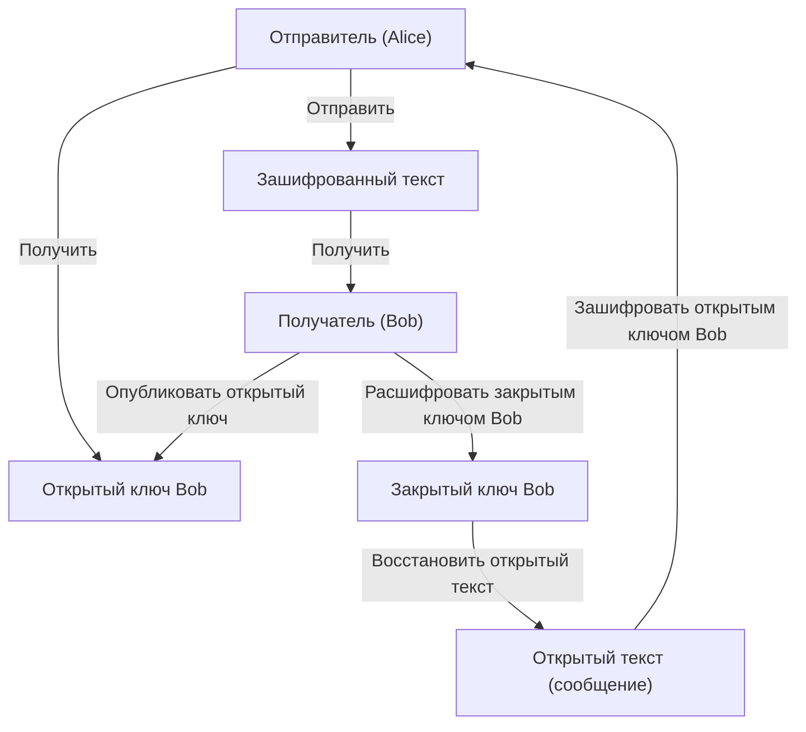
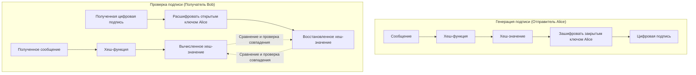

В современном интернет-обществе **информационная безопасность** стала важнейшей основой для обеспечения конфиденциальности, целостности и доступности информации. Ее фундамент опирается на технологии **современной криптографии**. В этой статье мы подробно и всесторонне рассмотрим основы современной криптографии: **криптографию с открытым ключом**, **хеш-функции** и **цифровые подписи**, от их математической основы до структуры конкретных алгоритмов и примеров реализации на Python.

---

## 1. Эволюция криптографических технологий: от симметричных ключей к открытым

### 1.1. Симметричная криптография и ее ограничения
Издавна используемый метод шифрования — это **симметричная криптография** (Symmetric-key cryptography), при которой для шифрования и расшифровки используется один и тот же ключ. Типичным алгоритмом является AES (Advanced Encryption Standard). Хотя симметричная криптография обладает преимуществом в виде высокой скорости обработки, ее самым большим недостатком является **проблема распределения ключей** (Key Distribution Problem).

Обе стороны связи должны заранее поделиться одним и тем же ключом по безопасному каналу, но безопасное распределение ключей через открытые сети, такие как Интернет, крайне сложно.

### 1.2. Появление криптографии с открытым ключом
Эта проблема распределения ключей была решена математическим подходом в **криптографии с открытым ключом** (Public-key cryptography). В криптографии с открытым ключом генерируется пара из двух разных ключей: **открытого ключа** (Public Key), используемого для шифрования, и **закрытого ключа** (Private Key), используемого для расшифровки.

- **Открытый ключ** : Ключ, который можно открыть кому угодно. Используется для шифрования сообщений.
- **Закрытый ключ** : Ключ, который строго хранится только у владельца. Используется для расшифровки зашифрованного текста.

Благодаря этой асимметрии получатель публикует свой открытый ключ для всего мира, а отправитель использует этот открытый ключ для шифрования. Зашифрованные данные может расшифровать только получатель, владеющий соответствующим закрытым ключом.



---

## 2. Математическая основа криптографии с открытым ключом

Безопасность криптографии с открытым ключом опирается на **односторонние функции** (One-way function), в которых «определенные вычисления выполнить легко, а обратные вычисления крайне сложны», и **односторонние функции с потайным входом** (Trapdoor one-way function), где обратные вычисления становятся возможными при знании определенной информации (Trapdoor). Здесь мы углубимся в типичные алгоритмы RSA и криптографию на эллиптических кривых (ECC).

### 2.1. Механизм шифрования RSA

Алгоритм RSA был разработан в 1977 году Роном Ривестом (Ron Rivest), Ади Шамиром (Adi Shamir) и Леонардом Адлеманом (Leonard Adleman). Безопасность RSA зависит от **сложности задачи факторизации целых чисел**. Перемножить два огромных простых числа легко, но определить исходные простые числа из их произведения невозможно за разумное время на современных классических компьютерах.

#### 2.1.1. Алгоритм генерации ключей RSA

Генерация ключей RSA состоит из следующих шагов:

1. Выбрать два очень больших простых числа $p$ и $q$.
2. Вычислить их произведение $N = p \times q$. ($N$ — открытый модуль)
3. Вычислить функцию Эйлера $\phi(N)$.
   $ \phi(N) = (p - 1)(q - 1) $
4. Выбрать целое число $e$, такое что $1 < e < \phi(N)$ и $e$ взаимно просто с $\phi(N)$. (Обычно используется $e = 65537$)
5. Вычислить $d$, удовлетворяющее следующему сравнению:
   $ e \times d \equiv 1 \pmod{\phi(N)} $
   Это можно вычислить с помощью расширенного алгоритма Евклида.

Здесь $(N, e)$ становится **открытым ключом**, а $d$ — **закрытым ключом** ($p$ и $q$ уничтожаются или строго скрываются).

#### 2.1.2. Математические формулы шифрования и расшифровки

Пусть открытый текст — это $M$ (где $0 \le M < N$), а зашифрованный текст — $C$.

**Шифрование** (используется открытый ключ $e, N$):
$ C \equiv M^e \pmod{N} $

**Расшифровка** (используется закрытый ключ $d, N$):
$ M \equiv C^d \pmod{N} $

Эта расшифровка работает корректно благодаря теореме Эйлера $M^{\phi(N)} \equiv 1 \pmod{N}$:
$ C^d \equiv (M^e)^d \equiv M^{ed} \equiv M^{k\phi(N) + 1} \equiv M \cdot (M^{\phi(N)})^k \equiv M \cdot 1^k \equiv M \pmod{N} $

### 2.2. Криптография на эллиптических кривых (ECC: Elliptic Curve Cryptography)

Шифрование RSA безопасно, но для обеспечения достаточной стойкости требуется очень длинный ключ (например, 2048 бит или 4096 бит). В отличие от этого, **криптография на эллиптических кривых** обеспечивает аналогичную безопасность при гораздо меньшей длине ключа.

#### 2.2.1. Эллиптические кривые и проблема дискретного логарифмирования

Безопасность ECC зависит от сложности **проблемы дискретного логарифмирования на эллиптической кривой** (ECDLP).
Эллиптическая кривая над конечным полем $\mathbb{F}_p$, используемая в криптографии, обычно выражается в канонической форме Вейерштрасса (Weierstrass).

$ y^2 \equiv x^3 + ax + b \pmod{p} $

(При условии, что $4a^3 + 27b^2 \not\equiv 0 \pmod{p}$)

Определены операции сложения точек на эллиптической кривой (сложение точек) и многократного прибавления одной и той же точки (скалярное умножение).
Пусть точка $P$ получается путем сложения базовой точки (base point) $G$ с самой собой $k$ раз.

$ P = k \times G $

Здесь проблема нахождения скалярного значения $k$ по заданным $G$ и $P$ называется **проблемой дискретного логарифма на эллиптической кривой**. Если $k$ достаточно велико, выполнить обратные вычисления крайне сложно.
В ECC $k$ становится **закрытым ключом**, а $P$ — **открытым ключом**.

### 2.3. Пример реализации криптографии с открытым ключом на Python

Вот пример кода для генерации ключей RSA, шифрования и расшифровки с использованием библиотеки `cryptography` в Python.

```python
from cryptography.hazmat.primitives.asymmetric import rsa
from cryptography.hazmat.primitives.asymmetric import padding
from cryptography.hazmat.primitives import hashes
import base64

# 1. Генерация пары ключей RSA
private_key = rsa.generate_private_key(
    public_exponent=65537,
    key_size=2048,
)
public_key = private_key.public_key()

# 2. Определение сообщения
message = b"This is a highly confidential message about modern cryptography."

# 3. Шифрование с использованием открытого ключа (с использованием OAEP паддинга)
ciphertext = public_key.encrypt(
    message,
    padding.OAEP(
        mgf=padding.MGF1(algorithm=hashes.SHA256()),
        algorithm=hashes.SHA256(),
        label=None
    )
)
print("Ciphertext (Base64):", base64.b64encode(ciphertext).decode('utf-8'))

# 4. Расшифровка с использованием закрытого ключа
decrypted_message = private_key.decrypt(
    ciphertext,
    padding.OAEP(
        mgf=padding.MGF1(algorithm=hashes.SHA256()),
        algorithm=hashes.SHA256(),
        label=None
    )
)
print("Decrypted Message:", decrypted_message.decode('utf-8'))
```

---

## 3. Хеш-функции (Hash Functions)

Наряду с криптографией с открытым ключом краеугольным камнем современной криптографии являются **криптографические хеш-функции**. Хеш-функция — это функция, которая принимает на вход данные произвольной длины и выводит псевдослучайные данные фиксированной длины (хеш-значение, дайджест).

### 3.1. Три свойства, необходимые для криптографических хеш-функций

Для безопасного использования в качестве криптографической технологии требуются следующие три строгих свойства:

1. **Односторонность** (Pre-image resistance):
   Должно быть вычислительно сложно восстановить исходное входное сообщение $m$ из выходного хеш-значения $h$.
2. **Стойкость к коллизиям первого рода** (Second pre-image resistance):
   При заданном входном сообщении $m_1$ должно быть сложно найти другое сообщение $m_2$ ($m_1 \neq m_2$), имеющее такое же хеш-значение.
3. **Стойкость к коллизиям второго рода** (Collision resistance):
   Должно быть сложно найти любую пару сообщений $(m_1, m_2)$, хеш-значения которых совпадают.

### 3.2. Структура SHA-2 (Secure Hash Algorithm 2)

В настоящее время наиболее широко используемой хеш-функцией является семейство SHA-2 (в частности, **SHA-256**). SHA-2 использует **структуру Меркла-Дамгорда (Merkle-Damgård)**.

В структуре Меркла-Дамгорда входное сообщение разбивается на блоки фиксированной длины (512 бит для SHA-256), и выполняется паддинг для выравнивания длины. Затем начальное хеш-значение (IV) и первый блок подаются в **функцию сжатия** (Compression function), а ее выходные данные используются как входные для следующего блока в виде цепочки.

$ H_i = f(H_{i-1}, M_i) $

Благодаря этой цепной структуре из сообщения произвольной длины можно сгенерировать безопасный дайджест фиксированной длины.

### 3.3. Структура SHA-3 (Keccak)

В качестве альтернативы и стандарта следующего поколения после SHA-2 NIST выбрал **SHA-3** (алгоритм Keccak). SHA-3 использует не структуру Меркла-Дамгорда, а совершенно иную **структуру «Губка» (Sponge)**.

Структура губки сохраняет внутреннее состояние и работает в две следующие фазы:

- **Фаза абсорбции (Впитывание)** : Блоки сообщения с определенной скоростью (Rate) объединяются операцией XOR (исключающее ИЛИ) с битовой строкой внутреннего состояния, затем применяется внутренняя функция перестановки (Permutation function $f$) для поглощения данных.
- **Фаза сжатия (Выжимание)** : После завершения абсорбции данных, данные постоянно извлекаются (выжимаются) из внутреннего состояния, и процесс применения функции перестановки $f$ и извлечения повторяется до достижения необходимой длины вывода.

Благодаря этой структуре обеспечивается высокая безопасность, при которой существующие методы атак на SHA-2 совершенно неэффективны.

### 3.4. Пример реализации хеш-функций на Python

```python
from cryptography.hazmat.primitives import hashes

message = b"Modern cryptography heavily relies on secure hash functions."

# Генерация SHA-256
digest_sha256 = hashes.Hash(hashes.SHA256())
digest_sha256.update(message)
hash_result_sha256 = digest_sha256.finalize()
print("SHA-256:", hash_result_sha256.hex())

# Генерация SHA-3 (SHA3-256)
digest_sha3 = hashes.Hash(hashes.SHA3_256())
digest_sha3.update(message)
hash_result_sha3 = digest_sha3.finalize()
print("SHA3-256:", hash_result_sha3.hex())
```

---

## 4. Цифровые подписи (Digital Signatures)

Комбинируя криптографию с открытым ключом и хеш-функции, можно реализовать **цифровые подписи**, эквивалентные печатям и физическим подписям в реальном мире. Цифровые подписи гарантируют **целостность** сообщения (то, что оно не было изменено), **аутентификацию отправителя** (защита от подмены) и **неотказуемость** (невозможность отрицать факт отправки).

### 4.1. Механизм цифровых подписей

Основная концепция цифровых подписей — это «**использование криптографии с открытым ключом в обратном направлении**».

При обычном шифровании происходит «шифрование открытым ключом и расшифровка закрытым ключом», в то время как в цифровых подписях происходит «**генерация подписи (аналогично шифрованию) закрытым ключом и проверка подписи (аналогично расшифровке) открытым ключом**». Поскольку закрытый ключ есть только у самого человека, подпись, созданная этим закрытым ключом, является твердым доказательством того, что ее создал именно он.

Однако прямая обработка всех данных с помощью алгоритма открытого ключа (например, RSA) потребует огромных вычислительных затрат. Поэтому на практике всегда используется **хеш-функция**.

### 4.2. Процесс генерации и проверки подписи



1. **Генерация подписи**: Отправитель вычисляет хеш-значение сообщения и шифрует его своим закрытым ключом для создания «данных подписи». Само сообщение и данные подписи отправляются получателю.
2. **Проверка подписи**: Получатель самостоятельно вычисляет хеш-значение полученного сообщения. Одновременно получатель расшифровывает полученные данные подписи с помощью открытого ключа отправителя, чтобы извлечь исходное хеш-значение. Если оба хеш-значения полностью совпадают, проверка считается успешной.

### 4.3. Пример реализации цифровой подписи на Python (RSA)

```python
from cryptography.hazmat.primitives.asymmetric import padding
from cryptography.hazmat.primitives import hashes
from cryptography.exceptions import InvalidSignature

# Сообщение
doc_message = b"Contract document: Party A agrees to pay Party B $1000."

# 1. Генерация подписи (с использованием закрытого ключа)
signature = private_key.sign(
    doc_message,
    padding.PSS(
        mgf=padding.MGF1(hashes.SHA256()),
        salt_length=padding.PSS.MAX_LENGTH
    ),
    hashes.SHA256()
)
print("Digital Signature:", base64.b64encode(signature).decode('utf-8')[:50], "...")

# 2. Проверка подписи (с использованием открытого ключа)
try:
    public_key.verify(
        signature,
        doc_message,
        padding.PSS(
            mgf=padding.MGF1(hashes.SHA256()),
            salt_length=padding.PSS.MAX_LENGTH
        ),
        hashes.SHA256()
    )
    print("Signature is VALID. Document integrity and authenticity are verified.")
except InvalidSignature:
    print("Signature is INVALID. Document may be tampered with.")
```

---

## 5. Инфраструктура открытых ключей (PKI: Public Key Infrastructure)

Хотя цифровые подписи обеспечивают целостность данных и аутентификацию отправителя, в системе в целом остается одна фатальная уязвимость. Это проблема: «**Действительно ли используемый открытый ключ является правильным открытым ключом собеседника (Alice)?**».

Если злоумышленник (Eve) выдаст себя за Alice и передаст свой открытый ключ Bob, а Bob поверит, что это «открытый ключ Alice», то Eve сможет расшифровывать зашифрованные сообщения от имени Alice или заставить систему проверять поддельные подписи. Это называется **атакой «человек посередине»** (Man-in-the-Middle Attack).

Социальная инфраструктура, предназначенная для обеспечения подлинности открытых ключей и построения цепочки доверия, называется **PKI (Инфраструктура открытых ключей)**.

### 5.1. Удостоверяющий центр (CA) и цифровые сертификаты (X.509)

В центре PKI находится **удостоверяющий центр** (CA: Certificate Authority), который является надежной третьей стороной. Роль CA заключается в проверке личности лиц или права собственности на домены и выдаче **цифровых сертификатов** (сертификатов открытого ключа), в которых CA ставит электронную подпись на «открытом ключе» субъекта, используя свой «закрытый ключ».

В качестве стандарта для цифровых сертификатов широко используется **X.509**. Сертификат содержит следующую информацию:
- Версия, серийный номер
- Алгоритм подписи
- Идентификационная информация издателя (CA)
- Срок действия
- Идентификационная информация субъекта (сервера или физического лица)
- **Открытый ключ субъекта**
- **Цифровая подпись от CA**

### 5.2. Схема модели доверия PKI

```mermaid
graph TD
    CA["Корневой удостоверяющий центр (Root CA)"]
    SubCA["Промежуточный удостоверяющий центр (Intermediate CA)"]
    Server["Веб-сервер (Alice)"]
    Client["ПК клиента (Bob)"]

    CA -->|"Выдает сертификат (подпись)"| SubCA
    SubCA -->|"Выдает сертификат (подпись)"| Server
    Server -->|"Предоставляет сертификат сервера"| Client
    Client -.->|"Заранее хранит открытый ключ Root CA\n("встроен в браузер или ОС")"| CA
    Client -->|"Проверяет цепочку сертификатов\nИспользует открытый ключ Root CA"| Server
```

Когда вы обращаетесь к сайту через «https://» в своем браузере, в фоновом режиме на полную мощность работает этот механизм PKI. Безопасный канал связи (TLS) устанавливается путем проверки подписи сертификата, отправленного с сервера, с использованием открытого ключа корневого центра сертификации, предварительно установленного в браузере.

---

## 6. Заключение

Современное цифровое общество построено на тонком сочетании **криптографических технологий**, описанных в этой статье.

- Быстрое шифрование данных с помощью **симметричной криптографии**
- Безопасный обмен ключами и реализация асимметрии с помощью **криптографии с открытым ключом** (RSA и ECC)
- Извлечение «отпечатков» данных с помощью **хеш-функций** (SHA-2/3)
- Доказательство целостности и аутентификация с помощью **цифровых подписей**
- Обеспечение подлинности открытых ключей с помощью **PKI и удостоверяющих центров**

Эта математическая красота и строгая вычислительная теория ежедневно защищают нашу конфиденциальность и имущество от кибератак. Эволюция криптографических технологий продолжается, и в преддверии появления квантовых компьютеров быстро продвигаются исследования и стандартизация **постквантовой криптографии** (PQC: Post-Quantum Cryptography).

Правильное понимание основ криптографии станет первым шагом в проектировании более безопасных и надежных систем и приложений.

---
*Литература и полезные ссылки*
- NIST FIPS 186-4: Digital Signature Standard (DSS)
- NIST FIPS 202: SHA-3 Standard
- RFC 5280: Internet X.509 Public Key Infrastructure Certificate and Certificate Revocation List (CRL) Profile
