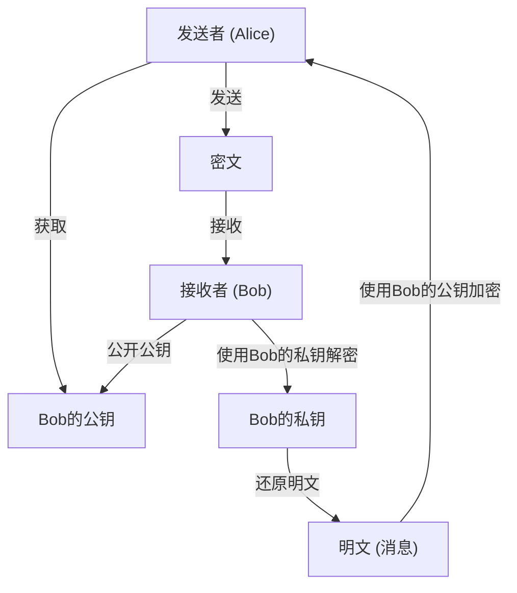
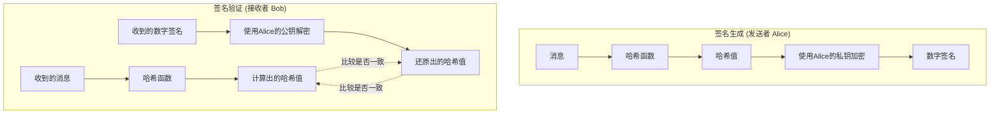
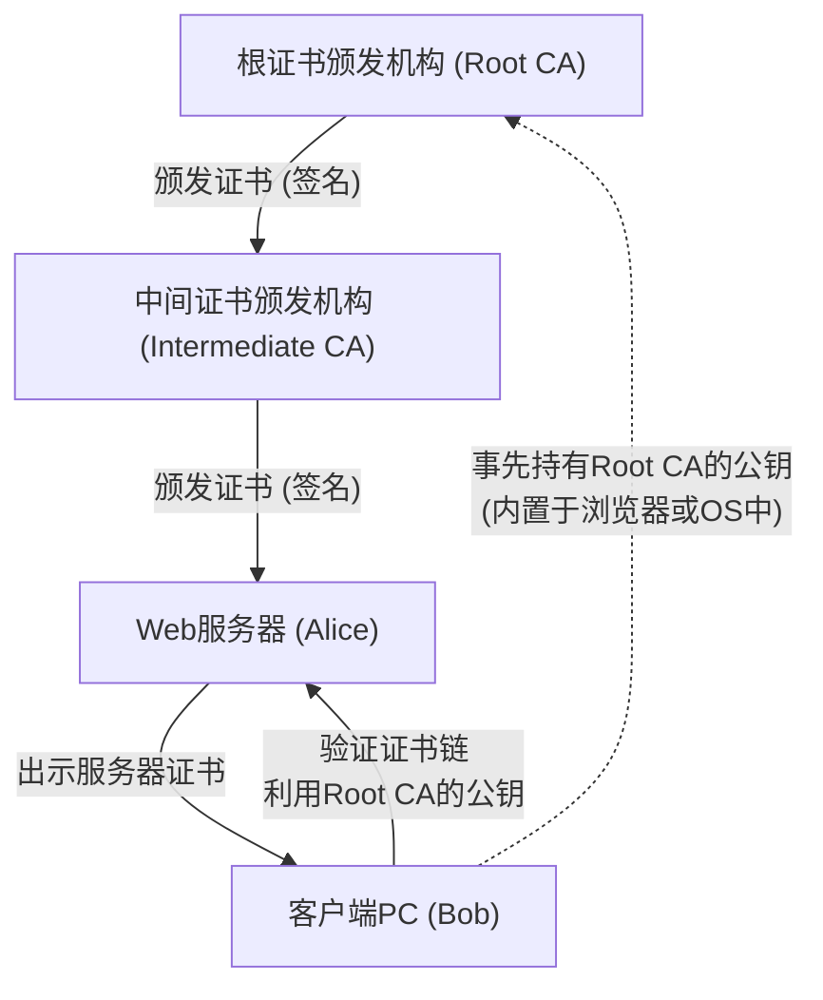

在现代互联网社会中，为了保障信息的机密性、完整性和可用性， **信息安全** 已成为不可或缺的基础。而支撑其核心的正是 **现代密码学** 技术。本文将对现代密码学的基础—— **公钥密码** 、 **哈希函数** 以及 **数字签名** ，从其数学背景到具体的算法结构，再到使用 Python 的代码实现，进行极其详细且全面的讲解。

---

## 1. 密码技术的演进：从对称密码到公钥密码

### 1.1. 对称密码及其局限性
自古以来被广泛使用的密码方式是，加密和解密使用同一把密钥的 **对称密码** （Symmetric-key cryptography）。其代表性算法有 AES（Advanced Encryption Standard）。对称密码具有处理速度快的优点，但其最大的弱点在于存在 **密钥分发问题** （Key Distribution Problem）。

通信双方必须事先通过安全的途径共享同一把密钥，但在像互联网这样开放的网络上，安全地分发密钥是极其困难的。

### 1.2. 公钥密码的诞生
通过数学方法解决这一密钥分发问题的，便是 **公钥密码** （Public-key cryptography）。在公钥密码中，会生成一对不同的密钥：用于加密的 **公钥** （Public Key）和用于解密的 **私钥** （Private Key）。

- **公钥** ：可以向任何人公开的密钥。用于对消息进行加密。
- **私钥** ：仅由所有者严格保管的密钥。用于对密文进行解密。

由于这种非对称性，接收者可以将自己的公钥向全世界公开，发送者则使用该公钥进行加密。加密后的数据，只有拥有对应私钥的接收者才能解密。



---

## 2. 公钥密码的数学背景

公钥密码的安全性，依赖于“正向计算容易，但反向计算极其困难”的 **单向函数** （One-way function），以及只要知道特定信息（陷门：Trapdoor）就能进行逆向计算的 **陷门单向函数** 。这里我们将深入探讨具有代表性的 RSA 密码和椭圆曲线密码（ECC）。

### 2.1. RSA 密码的原理

RSA 密码由 Ron Rivest、Adi Shamir 和 Leonard Adleman 三人于 1977 年开发。RSA 的安全性依赖于 **大整数分解问题的困难度** 。将两个巨大的素数相乘是很简单的，但要从其乘积推导出原来的素数，在目前的经典计算机上是无法在现实时间内求解的。

#### 2.1.1. RSA 的密钥生成算法

RSA 的密钥生成按以下步骤进行。

1. 选择两个非常大的素数 $p$ 和 $q$。
2. 计算它们的乘积 $N = p \times q$。（$N$ 是公开的模数）
3. 计算欧拉函数 $\phi(N)$。
   $ \phi(N) = (p - 1)(q - 1) $
4. 选择一个满足 $1 < e < \phi(N)$ 且与 $\phi(N)$ 互素的整数 $e$。（通常经常使用 $e = 65537$）
5. 计算满足以下同余式的 $d$。
   $ e \times d \equiv 1 \pmod{\phi(N)} $
   这可以使用扩展欧几里得算法来计算。

这里，$(N, e)$ 即为 **公钥** ， $d$ 即为 **私钥** （$p, q$ 将被销毁或严格保密）。

#### 2.1.2. 加密与解密的数学公式

设明文为 $M$ （且 $0 \le M < N$），密文为 $C$。

**加密** （使用公钥 $e, N$）：
$ C \equiv M^e \pmod{N} $

**解密** （使用私钥 $d, N$）：
$ M \equiv C^d \pmod{N} $

该解密过程能够正确运作，是基于欧拉定理 $M^{\phi(N)} \equiv 1 \pmod{N}$。
$ C^d \equiv (M^e)^d \equiv M^{ed} \equiv M^{k\phi(N) + 1} \equiv M \cdot (M^{\phi(N)})^k \equiv M \cdot 1^k \equiv M \pmod{N} $

### 2.2. 椭圆曲线密码 (ECC: Elliptic Curve Cryptography)

RSA 密码很安全，但为了拥有足够的强度，必须将密钥长度设置得很长（例如 2048 位或 4096 位）。与此相对，能以更短的密钥长度提供同等安全性的，就是 **椭圆曲线密码** 。

#### 2.2.1. 椭圆曲线与离散对数问题

ECC 的安全性依赖于 **椭圆曲线上的离散对数问题** （ECDLP）的困难度。
用于密码学的有限域 $\mathbb{F}_p$ 上的椭圆曲线，通常用维尔斯特拉斯（Weierstrass）标准型表示。

$ y^2 \equiv x^3 + ax + b \pmod{p} $

（其中 $4a^3 + 27b^2 \not\equiv 0 \pmod{p}$）

定义了椭圆曲线上点与点之间的加法（点加运算），以及将同一个点相加多次的操作（标量乘法运算）。
设将某个作为基准的点（基点） $G$ 相加 $k$ 次得到的点为 $P$。

$ P = k \times G $

这里，在已知 $G$ 和 $P$ 的情况下，求标量值 $k$ 的问题被称为 **椭圆曲线离散对数问题** 。当 $k$ 足够大时，通过计算逆推求出 $k$ 是极其困难的。
在 ECC 中，$k$ 即为 **私钥** ， $P$ 即为 **公钥** 。

### 2.3. 使用 Python 实现公钥密码的示例

以下是使用 Python 的 `cryptography` 库来生成 RSA 密钥以及进行加密、解密的示例代码。

```python
from cryptography.hazmat.primitives.asymmetric import rsa
from cryptography.hazmat.primitives.asymmetric import padding
from cryptography.hazmat.primitives import hashes
import base64

# 1. 生成 RSA 密钥对
private_key = rsa.generate_private_key(
    public_exponent=65537,
    key_size=2048,
)
public_key = private_key.public_key()

# 2. 定义消息
message = b"This is a highly confidential message about modern cryptography."

# 3. 使用公钥进行加密 (使用 OAEP 填充)
ciphertext = public_key.encrypt(
    message,
    padding.OAEP(
        mgf=padding.MGF1(algorithm=hashes.SHA256()),
        algorithm=hashes.SHA256(),
        label=None
    )
)
print("Ciphertext (Base64):", base64.b64encode(ciphertext).decode('utf-8'))

# 4. 使用私钥进行解密
decrypted_message = private_key.decrypt(
    ciphertext,
    padding.OAEP(
        mgf=padding.MGF1(algorithm=hashes.SHA256()),
        algorithm=hashes.SHA256(),
        label=None
    )
)
print("Decrypted Message:", decrypted_message.decode('utf-8'))
```

---

## 3. 哈希函数 (Hash Functions)

与公钥密码并列为现代密码学核心的，是 **密码学哈希函数** 。哈希函数是一种接收任意长度的数据作为输入，并输出固定长度的伪随机数据（哈希值、摘要）的函数。

### 3.1. 密码学哈希函数需具备的3个特性

为了能安全地作为密码技术使用，需要具备以下3种强大的特性。

1. **单向性** （Pre-image resistance）：
   从输出的哈希值 $h$ 逆向推导出原始输入消息 $m$，在计算上是困难的。
2. **弱抗碰撞性** （Second pre-image resistance）：
   给定某个输入消息 $m_1$，找到拥有相同哈希值的另一个消息 $m_2$ ($m_1 \neq m_2$)，是困难的。
3. **强抗碰撞性** （Collision resistance）：
   找到任意两个哈希值相同的消息对 $(m_1, m_2)$，是困难的。

### 3.2. SHA-2 (Secure Hash Algorithm 2) 的结构

目前被最广泛使用的哈希函数是 SHA-2 系列（尤其是 **SHA-256** ）。SHA-2 采用了 **Merkle-Damgård（默克尔-丹高德）结构** 。

在 Merkle-Damgård 结构中，将输入消息分割成固定长度的块（对于 SHA-256 为 512 位），并进行填充以调整长度。然后，将初始哈希值（IV）和第一个块输入到 **压缩函数** （Compression function）中，并将其输出作为下一个块的输入，如此连锁地进行处理。

$ H_i = f(H_{i-1}, M_i) $

通过这种连锁结构，可以从任意长度的消息生成固定长度且安全的摘要。

### 3.3. SHA-3 (Keccak) 的结构

被 NIST 选定为 SHA-2 的替代及下一代标准的，是 **SHA-3** （Keccak 算法）。SHA-3 并没有采用 Merkle-Damgård 结构，而是采用了完全不同的 **Sponge（海绵）结构** 。

海绵结构会保持内部状态，并按以下两个阶段运行。

- **吸收（Absorb）阶段** ：将消息块按照一定的速率（Rate）与内部状态的比特串进行异或（XOR）运算，并应用内部的置换函数（Permutation function $f$）来逐渐吸收数据。
- **挤出（Squeeze）阶段** ：数据吸收完成后，从内部状态中持续提取数据（挤出），并重复应用置换函数 $f$ 和提取操作，直到达到所需的输出长度。

凭借这种结构，它拥有极强的安全性，现有的针对 SHA-2 的攻击手法对其完全无效。

### 3.4. 使用 Python 实现哈希函数的示例

```python
from cryptography.hazmat.primitives import hashes

message = b"Modern cryptography heavily relies on secure hash functions."

# 生成 SHA-256
digest_sha256 = hashes.Hash(hashes.SHA256())
digest_sha256.update(message)
hash_result_sha256 = digest_sha256.finalize()
print("SHA-256:", hash_result_sha256.hex())

# 生成 SHA-3 (SHA3-256)
digest_sha3 = hashes.Hash(hashes.SHA3_256())
digest_sha3.update(message)
hash_result_sha3 = digest_sha3.finalize()
print("SHA3-256:", hash_result_sha3.hex())
```

---

## 4. 数字签名 (Digital Signatures)

通过将公钥密码与哈希函数相结合，可以实现相当于现实世界中“印章”或“签名”的 **数字签名** 。数字签名能够保证消息的 **完整性** （未被篡改）、 **发送者身份认证** （非伪造身份），以及 **不可否认性** （无法否认发送过该消息的事实）。

### 4.1. 数字签名的原理

数字签名的基本概念是“ **公钥密码的逆向使用** ”。

在普通的加密中，是“使用公钥加密，使用私钥解密”；而在数字签名中，则是“ **使用私钥生成签名（相当于加密），使用公钥验证签名（相当于解密）** ”。因为只有本人才拥有私钥，所以用该私钥生成的签名，就成为了本人制作的确凿证据。

但是，如果直接用公钥算法（如 RSA）处理整个数据，计算成本将非常巨大。因此，在实际应用中一定会结合 **哈希函数** 来使用。

### 4.2. 签名生成与验证的流程



1. **签名生成** : 发送者计算消息的哈希值，并将其用自己的私钥进行加密，从而创建出“签名数据”。将消息主体和签名数据一起发送给接收者。
2. **签名验证** : 接收者自己计算所收到消息的哈希值。同时，使用发送者的公钥对收到的签名数据进行解密，提取出原来的哈希值。如果两个哈希值完全一致，则验证成功。

### 4.3. 使用 Python 实现数字签名的示例 (RSA)

```python
from cryptography.hazmat.primitives.asymmetric import padding
from cryptography.hazmat.primitives import hashes
from cryptography.exceptions import InvalidSignature

# 消息
doc_message = b"Contract document: Party A agrees to pay Party B $1000."

# 1. 生成签名 (使用私钥)
signature = private_key.sign(
    doc_message,
    padding.PSS(
        mgf=padding.MGF1(hashes.SHA256()),
        salt_length=padding.PSS.MAX_LENGTH
    ),
    hashes.SHA256()
)
print("Digital Signature:", base64.b64encode(signature).decode('utf-8')[:50], "...")

# 2. 验证签名 (使用公钥)
try:
    public_key.verify(
        signature,
        doc_message,
        padding.PSS(
            mgf=padding.MGF1(hashes.SHA256()),
            salt_length=padding.PSS.MAX_LENGTH
        ),
        hashes.SHA256()
    )
    print("Signature is VALID. Document integrity and authenticity are verified.")
except InvalidSignature:
    print("Signature is INVALID. Document may be tampered with.")
```

---

## 5. 公钥基础设施 (PKI: Public Key Infrastructure)

虽然数字签名实现了数据的完整性和发送者认证，但整个系统还留下了一个致命的弱点。那就是“ **正在使用的公钥，真的是通信对象（Alice）正确的公钥吗？** ”的问题。

如果攻击者（Eve）伪装成 Alice，将自己的公钥交给了 Bob，而 Bob 误信这就是“Alice的公钥”，那么 Eve 就能冒充 Alice 解密加密通信，或者让 Bob 验证伪造的签名。这被称为 **中间人攻击** （Man-in-the-Middle Attack）。

为了保证这个公钥的合法性并建立信任链，社会性的基础设施 **PKI (公钥基础设施)** 应运而生。

### 5.1. 证书颁发机构 (CA) 与数字证书 (X.509)

PKI 的核心是作为可信第三方机构的 **证书颁发机构** （CA: Certificate Authority）。CA 的职责是审查个人的身份或域名的所有权，并使用 CA 自身的“私钥”对目标对象的“公钥”进行数字签名，从而颁发 **数字证书** （公钥证书）。

作为数字证书的标准规范， **X.509** 被广泛使用。证书中包含以下信息：
- 版本、序列号
- 签名算法
- 颁发者 (CA) 的识别信息
- 有效期
- 主体 (服务器或个人) 的识别信息
- **主体的公钥**
- **CA 的数字签名**

### 5.2. PKI 信任模型结构图



在使用浏览器访问“https://”的网站时，在后台这套 PKI 机制也在全面运作。浏览器通过使用预安装的根证书颁发机构的公钥，来验证服务器发送过来的证书签名，从而建立起安全的通信信道（TLS）。

---

## 6. 总结

现代的数字社会，正是建立在本文所讲解的 **密码技术** 的绝妙组合之上的。

- 依靠 **对称密码** 实现高速的数据加密
- 依靠 **公钥密码** （RSA 或 ECC）实现安全的密钥交换与非对称性
- 依靠 **哈希函数** （SHA-2/3）实现数据的指纹提取
- 依靠 **数字签名** 实现完整性的证明与身份认证
- 依靠 **PKI 和证书颁发机构** 保证公钥的真实性

这些数学上的美感与严密的计算理论，每天都在保护我们的隐私与财产免受网络攻击。密码技术的演进至今仍在继续，为了应对量子计算机的崛起， **抗量子计算密码** （PQC: Post-Quantum Cryptography）的研究与标准化也在飞速发展。

正确理解密码学的基础，将是设计出更加安全、坚固的系统和应用程序的第一步。

---
*参考文献与相关链接*
- NIST FIPS 186-4: Digital Signature Standard (DSS)
- NIST FIPS 202: SHA-3 Standard
- RFC 5280: Internet X.509 Public Key Infrastructure Certificate and Certificate Revocation List (CRL) Profile
