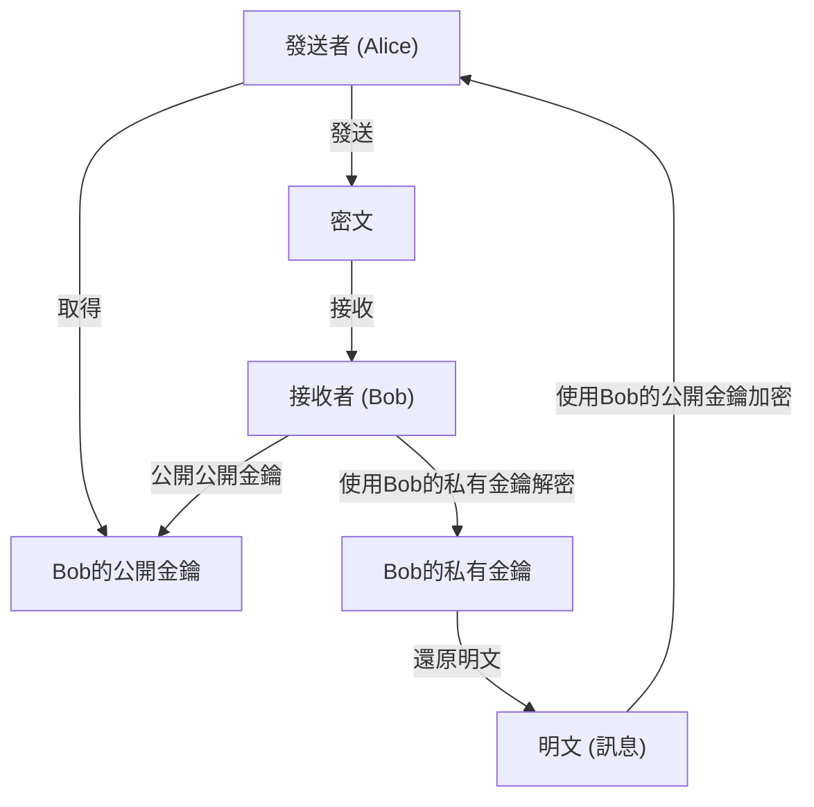
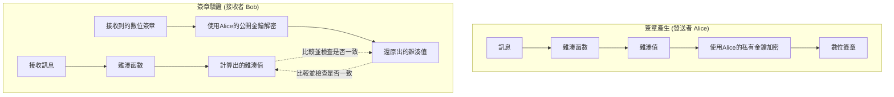

在現代網際網路社會中，為了確保資訊的機密性、完整性與可用性， **資訊安全** 已成為不可或缺的基礎。而支撐其核心的正是 **現代密碼學** 技術。本文將針對現代密碼學的基礎，即 **公開金鑰密碼** 、 **雜湊函數** 以及 **數位簽章** ，從數學背景到具體的演算法結構，再到使用 Python 的實作範例，進行非常詳細且全面的解說。

---

## 1. 密碼技術的演進：從對稱金鑰密碼到公開金鑰密碼

### 1.1. 對稱金鑰密碼及其侷限性
自古以來使用的密碼系統是加密和解密使用相同金鑰的 **對稱金鑰密碼** （Symmetric-key cryptography）。代表性的演算法有 AES（Advanced Encryption Standard）。對稱金鑰密碼具有處理速度快的優點，但最大的弱點是存在 **金鑰配送問題** （Key Distribution Problem）。

通訊雙方必須事先透過安全的管道共享相同的金鑰，但在網際網路這樣開放的網路上安全地配送金鑰是極度困難的。

### 1.2. 公開金鑰密碼的誕生
以數學方法解決此金鑰配送問題的便是 **公開金鑰密碼** （Public-key cryptography）。在公開金鑰密碼中，會產生一對不同的金鑰：用於加密的 **公開金鑰** （Public Key）與用於解密的 **私有金鑰** （Private Key）。

- **公開金鑰** ：可以向任何人公開的金鑰。用來加密訊息。
- **私有金鑰** ：僅由擁有者嚴密保管的金鑰。用來解密密文。

由於這種不對稱性，接收者可以將自己的公開金鑰向全世界公開，而發送者則使用該公開金鑰進行加密。加密後的資料只有擁有對應私有金鑰的接收者才能解密。



---

## 2. 公開金鑰密碼的數學背景

公開金鑰密碼的安全性依賴於「某個計算很容易，但其反向計算卻非常困難」的 **單向函數** （One-way function），以及如果知道特定資訊（陷門：Trapdoor）就能進行反向計算的 **具陷門單向函數** 。這裡將深入探討具代表性的 RSA 密碼與橢圓曲線密碼（ECC）。

### 2.1. RSA 密碼的原理

RSA 密碼於 1977 年由 Ron Rivest、Adi Shamir 與 Leonard Adleman 三人開發。RSA 的安全性依賴於 **質因數分解問題的困難度** 。將兩個巨大的質數相乘很簡單，但要從其乘積反推回原本的質數，在目前的古典電腦上是無法在合理時間內解出的。

#### 2.1.1. RSA 的金鑰產生演算法

RSA 的金鑰產生透過以下步驟進行：

1. 選擇兩個非常大的質數 $p$ 與 $q$。
2. 計算其乘積 $N = p \times q$。（$N$ 是會被公開的模數）
3. 計算尤拉商數函數 $\phi(N)$。
   $ \phi(N) = (p - 1)(q - 1) $
4. 選擇一個整數 $e$，使得 $1 < e < \phi(N)$ 且與 $\phi(N)$ 互質。（通常常使用 $e = 65537$）
5. 計算滿足以下同餘式的 $d$。
   $ e \times d \equiv 1 \pmod{\phi(N)} $
   這可以使用擴展歐幾里得演算法來計算。

在這裡，$(N, e)$ 即為 **公開金鑰** ，而 $d$ 即為 **私有金鑰** （$p, q$ 會被銷毀或嚴密隱藏）。

#### 2.1.2. 加密與解密的數學式

設明文為 $M$ （其中 $0 \le M < N$），密文為 $C$。

**加密** （使用公開金鑰 $e, N$）：
$ C \equiv M^e \pmod{N} $

**解密** （使用私有金鑰 $d, N$）：
$ M \equiv C^d \pmod{N} $

這個解密能夠正確運作，是基於尤拉定理 $M^{\phi(N)} \equiv 1 \pmod{N}$。
$ C^d \equiv (M^e)^d \equiv M^{ed} \equiv M^{k\phi(N) + 1} \equiv M \cdot (M^{\phi(N)})^k \equiv M \cdot 1^k \equiv M \pmod{N} $

### 2.2. 橢圓曲線密碼 (ECC: Elliptic Curve Cryptography)

RSA 密碼雖然安全，但為了具備足夠的強度，必須使用非常長的金鑰長度（例如 2048 位元或 4096 位元）。相對地，能以較短的金鑰長度提供同等安全性的便是 **橢圓曲線密碼** 。

#### 2.2.1. 橢圓曲線與離散對數問題

ECC 的安全性依賴於 **橢圓曲線上的離散對數問題** （ECDLP）的困難度。
用於密碼學的有限體 $\mathbb{F}_p$ 上的橢圓曲線，通常以維爾斯特拉斯（Weierstrass）標準式來表示：

$ y^2 \equiv x^3 + ax + b \pmod{p} $

（其中 $4a^3 + 27b^2 \not\equiv 0 \pmod{p}$）

橢圓曲線上的點之間定義了加法（點加法），以及將同一個點相加多次的操作（純量乘法）。
將某個作為基準的點（基點） $G$ 相加 $k$ 次所得到的點設為 $P$。

$ P = k \times G $

在此，當給定 $G$ 與 $P$ 時，求出純量值 $k$ 的問題稱為 **橢圓曲線離散對數問題** 。當 $k$ 足夠大時，要透過計算反推是非常困難的。
在 ECC 中，$k$ 即為 **私有金鑰** ，而 $P$ 即為 **公開金鑰** 。

### 2.3. 使用 Python 的公開金鑰密碼實作範例

以下是使用 Python 的 `cryptography` 函式庫，實作 RSA 金鑰產生與加密、解密的程式碼範例。

```python
from cryptography.hazmat.primitives.asymmetric import rsa
from cryptography.hazmat.primitives.asymmetric import padding
from cryptography.hazmat.primitives import hashes
import base64

# 1. 產生RSA金鑰對
private_key = rsa.generate_private_key(
    public_exponent=65537,
    key_size=2048,
)
public_key = private_key.public_key()

# 2. 定義訊息
message = b"This is a highly confidential message about modern cryptography."

# 3. 使用公開金鑰進行加密 (使用OAEP填充)
ciphertext = public_key.encrypt(
    message,
    padding.OAEP(
        mgf=padding.MGF1(algorithm=hashes.SHA256()),
        algorithm=hashes.SHA256(),
        label=None
    )
)
print("Ciphertext (Base64):", base64.b64encode(ciphertext).decode('utf-8'))

# 4. 使用私有金鑰進行解密
decrypted_message = private_key.decrypt(
    ciphertext,
    padding.OAEP(
        mgf=padding.MGF1(algorithm=hashes.SHA256()),
        algorithm=hashes.SHA256(),
        label=None
    )
)
print("Decrypted Message:", decrypted_message.decode('utf-8'))
```

---

## 3. 雜湊函數 (Hash Functions)

與公開金鑰密碼並列為現代密碼學關鍵的是 **密碼學雜湊函數** 。雜湊函數是將任意長度的資料作為輸入，並輸出固定長度的偽隨機資料（雜湊值、摘要）的函數。

### 3.1. 密碼學雜湊函數必備的三個特性

為了能作為密碼技術安全地利用，必須具備以下三個強大的特性：

1. **單向性** （Pre-image resistance）：
   從輸出的雜湊值 $h$，要在計算上困難地反推出原始的輸入訊息 $m$。
2. **弱抗碰撞性** （Second pre-image resistance）：
   當給定某個輸入訊息 $m_1$ 時，要找到擁有相同雜湊值的另一個訊息 $m_2$ ($m_1 \neq m_2$) 是困難的。
3. **強抗碰撞性** （Collision resistance）：
   要找到雜湊值一致的任意兩個訊息配對 $(m_1, m_2)$ 是困難的。

### 3.2. SHA-2 (Secure Hash Algorithm 2) 的結構

目前最被廣泛使用的雜湊函數是 SHA-2 系列（特別是 **SHA-256** ）。SHA-2 採用了 **Merkle-Damgård 結構** 。

在 Merkle-Damgård 結構中，會將輸入訊息分割為固定長度的區塊（以 SHA-256 為例是 512 位元），並進行填充以調整長度。然後，將初始雜湊值（IV）與第一個區塊輸入至 **壓縮函數** （Compression function），並將其輸出作為下一個區塊的輸入，如此連鎖地進行處理。

$ H_i = f(H_{i-1}, M_i) $

透過這種連鎖結構，可以從任意長度的訊息中產生出固定長度的安全摘要。

### 3.3. SHA-3 (Keccak) 的結構

作為 SHA-2 的替代與次世代標準，由 NIST 選定的是 **SHA-3** （Keccak 演算法）。SHA-3 並非採用 Merkle-Damgård 結構，而是採用了完全不同的 **海綿結構** （Sponge 結構）。

海綿結構會保持內部狀態，並以下列兩個階段運作：

- **吸收階段 (Absorb)** ：將訊息區塊以一定的速率（Rate）與內部狀態的位元字串進行 XOR（互斥或），並套用內部的排列函數（Permutation function $f$）來吸收資料。
- **擠出階段 (Squeeze)** ：在資料吸收完成後，從內部狀態穩定地取出（擠出）資料，並重複套用排列函數 $f$ 與萃取，直到達到所需的輸出長度。

由於此結構，現有針對 SHA-2 的攻擊手法完全無法起作用，擁有極高的安全性。

### 3.4. 使用 Python 的雜湊函數實作範例

```python
from cryptography.hazmat.primitives import hashes

message = b"Modern cryptography heavily relies on secure hash functions."

# 產生SHA-256
digest_sha256 = hashes.Hash(hashes.SHA256())
digest_sha256.update(message)
hash_result_sha256 = digest_sha256.finalize()
print("SHA-256:", hash_result_sha256.hex())

# 產生SHA-3 (SHA3-256)
digest_sha3 = hashes.Hash(hashes.SHA3_256())
digest_sha3.update(message)
hash_result_sha3 = digest_sha3.finalize()
print("SHA3-256:", hash_result_sha3.hex())
```

---

## 4. 數位簽章 (Digital Signatures)

結合公開金鑰密碼與雜湊函數，就能實現相當於現實世界中「印章」或「簽名」的 **數位簽章** 。數位簽章保證了訊息的 **完整性** （未被竄改）與 **發送者身分驗證** （非冒名頂替），以及 **不可否認性** （無法否認曾發送過的事實）。

### 4.1. 數位簽章的原理

數位簽章的基本概念是「 **反向使用公開金鑰密碼** 」。

一般的加密是「使用公開金鑰加密，使用私有金鑰解密」，而在數位簽章中則是「 **使用私有金鑰產生簽章（相當於加密），使用公開金鑰驗證簽章（相當於解密）** 」。由於只有本人擁有私有金鑰，因此使用該私有金鑰產生的簽章，就成為本人建立的確鑿證據。

然而，若直接以公開金鑰演算法（如 RSA）處理整個資料，計算成本會非常龐大。因此在實務上，必定會搭配 **雜湊函數** 使用。

### 4.2. 簽章產生與驗證的流程



1. **簽章產生** : 發送者計算訊息的雜湊值，並使用自己的私有金鑰對其加密，建立出「簽章資料」。將訊息本體與簽章資料傳送給接收者。
2. **簽章驗證** : 接收者自行計算收到的訊息的雜湊值。同時，使用發送者的公開金鑰解密收到的簽章資料，取出原本的雜湊值。若兩者的雜湊值完全一致，則驗證成功。

### 4.3. 使用 Python 的數位簽章實作範例 (RSA)

```python
from cryptography.hazmat.primitives.asymmetric import padding
from cryptography.hazmat.primitives import hashes
from cryptography.exceptions import InvalidSignature

# 訊息
doc_message = b"Contract document: Party A agrees to pay Party B $1000."

# 1. 產生簽章 (使用私有金鑰)
signature = private_key.sign(
    doc_message,
    padding.PSS(
        mgf=padding.MGF1(hashes.SHA256()),
        salt_length=padding.PSS.MAX_LENGTH
    ),
    hashes.SHA256()
)
print("Digital Signature:", base64.b64encode(signature).decode('utf-8')[:50], "...")

# 2. 驗證簽章 (使用公開金鑰)
try:
    public_key.verify(
        signature,
        doc_message,
        padding.PSS(
            mgf=padding.MGF1(hashes.SHA256()),
            salt_length=padding.PSS.MAX_LENGTH
        ),
        hashes.SHA256()
    )
    print("Signature is VALID. Document integrity and authenticity are verified.")
except InvalidSignature:
    print("Signature is INVALID. Document may be tampered with.")
```

---

## 5. 公開金鑰基礎建設 (PKI: Public Key Infrastructure)

雖然數位簽章能實現資料的完整性與發送者的身分驗證，但以整體系統而言，仍留下了一個致命的弱點。那就是「 **目前使用的公開金鑰，真的是通訊對象（Alice）正確的公開金鑰嗎？** 」的問題。

如果攻擊者（Eve）假冒 Alice 將自己的公開金鑰交給 Bob，而 Bob 相信「這就是 Alice 的公開金鑰」的話，Eve 就能冒充 Alice 解密加密通訊，或是讓 Bob 驗證偽造簽章。這被稱為 **中間人攻擊** （Man-in-the-Middle Attack）。

為了擔保公開金鑰的正當性並建立信任鏈，社會性的基礎建設便是 **PKI (公開金鑰基礎建設)** 。

### 5.1. 憑證授權中心 (CA) 與數位憑證 (X.509)

PKI 的核心是受信任的第三方機構 **憑證授權中心** （CA: Certificate Authority）。CA 的職責是審查個人的身分或網域的所有權，並針對對象的「公開金鑰」使用 CA 自己的「私有金鑰」施加數位簽章，進而核發 **數位憑證** （公開金鑰憑證）。

數位憑證的標準規格廣泛採用 **X.509** 。憑證中包含以下資訊：
- 版本、序號
- 簽章演算法
- 發行者 (CA) 的識別資訊
- 有效期限
- 主體 (伺服器或個人) 的識別資訊
- **主體的公開金鑰**
- **CA的數位簽章**

### 5.2. PKI 的信任模型架構圖

```mermaid
graph TD
    CA["根憑證授權中心 (Root CA)"]
    SubCA["中介憑證授權中心 (Intermediate CA)"]
    Server["Web伺服器 (Alice)"]
    Client["客戶端PC (Bob)"]

    CA -->|"核發憑證 (簽章)"| SubCA
    SubCA -->|"核發憑證 (簽章)"| Server
    Server -->|"出示伺服器憑證"| Client
    Client -.->|"預先持有Root CA的公開金鑰\n("內建於瀏覽器或OS")"| CA
    Client -->|"驗證憑證鏈\n使用Root CA的公開金鑰"| Server
```

當在瀏覽器中存取「https://」的網站時，背後也是這套 PKI 機制在全速運作。透過使用事先安裝在瀏覽器內的根憑證授權中心的公開金鑰，來驗證伺服器傳來的憑證簽章，藉此建立安全的通訊通道（TLS）。

---

## 6. 總結

現代的數位社會，是建立在本次解說的 **密碼技術** 的絕妙組合之上。

- 透過 **對稱金鑰密碼** 進行高速的資料加密
- 透過 **公開金鑰密碼** （RSA 或 ECC）實現安全的金鑰交換與不對稱性
- 透過 **雜湊函數** （SHA-2/3）提取資料的數位指紋
- 透過 **數位簽章** 證明完整性並進行身分驗證
- 透過 **PKI與憑證授權中心** 擔保公開金鑰的真實性

這些數學之美與嚴謹的運算理論，每天都在保護我們的隱私與財產免受網路攻擊。密碼技術的演進至今仍在持續，為了應對量子電腦的崛起， **後量子密碼學** （PQC: Post-Quantum Cryptography）的研究與標準化也在快速進展中。

正確理解密碼學的基礎，將是設計出更安全、更強健的系統與應用程式的第一步。

---
*參考文獻與相關連結*
- NIST FIPS 186-4: Digital Signature Standard (DSS)
- NIST FIPS 202: SHA-3 Standard
- RFC 5280: Internet X.509 Public Key Infrastructure Certificate and Certificate Revocation List (CRL) Profile
