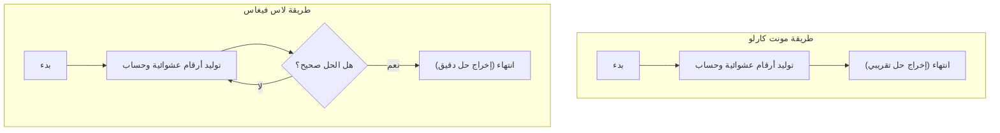

في علوم الكمبيوتر، تُسمى الخوارزمية التي تستخدم الأرقام العشوائية لحل مشكلة بـ **الخوارزمية الاحتمالية** (Randomized Algorithm). باستخدام الأرقام العشوائية، هناك العديد من الحالات التي يمكن فيها الحصول على حل بشكل أسرع من الخوارزميات الحتمية (الخوارزميات التي تُرجع دائمًا نفس النتيجة بنفس الإجراء)، أو تصبح عملية التنفيذ بسيطة للغاية.

ومن أبرز هذه المناهج **طريقة مونت كارلو** (Monte Carlo algorithm) و **طريقة لاس فيغاس** (Las Vegas algorithm). على الرغم من أن كليهما يحمل أسماء مدن الكازينو الشهيرة، إلا أن خصائصهما تختلف بشكل كبير.

في هذه المقالة، سنشرح بالتفصيل آلية عمل هاتين الخوارزميتين، مع أمثلة عملية للتنفيذ، والاختلافات بينهما، باستخدام الرسوم التوضيحية والصيغ الرياضية.

## 1. طريقة مونت كارلو (Monte Carlo Algorithm)

طريقة مونت كارلو هي خوارزمية **"وقت التنفيذ فيها ثابت ومحدود دائمًا، ولكن من المحتمل أن يكون الحل الناتج غير صحيح احتماليًا"**. يمكن تقليل احتمالية الخطأ إلى أي مستوى من خلال زيادة عدد المحاولات $N$.

### الخصائص
- **وقت التنفيذ**: يوجد دائمًا حد أقصى حتمي.
- **الصحة**: قد تُرجع إجابة غير صحيحة باحتمال معين (بما في ذلك الحصول على حل تقريبي).

### المفاضلة بين وقت التنفيذ والدقة
الميزة الأكبر لطريقة مونت كارلو هي القدرة على تحديد وقت التنفيذ. في عمليات المحاكاة أو الحسابات العددية، إذا كان هناك متطلب "أريد الحصول على النتيجة الأكثر منطقية في غضون ساعة واحدة"، فيمكنك التأكد من الحصول على النتيجة ضمن الوقت المحدد بمجرد تعديل عدد التكرارات.
ومع ذلك، وبسبب خطر الوقوع في خطأ احتمالي، لا ينبغي استخدامها بمفردها في الأنظمة التي تكون فيها القرارات الخاطئة قاتلة (على سبيل المثال، التحكم في الأجهزة الطبية التي يجب ألا تفشل أبدًا، أو المعالجة النهائية للمعاملات المالية).

### مثال 1: الحساب التقريبي لـ $\pi$ (باي)

المثال الأكثر شهرة لطريقة مونت كارلو هو الحساب التقريبي لقيمة $\pi$ (باي).
لنفترض أن هناك دائرة نصف قطرها 1 محاطة بمربع طول ضلعه 2. مساحة المربع هي $2 \times 2 = 4$، ومساحة الدائرة هي $\pi \times 1^2 = \pi$.

إذا رمينا سهامًا عشوائيًا (وضعنا نقاطًا) داخل هذا المربع، وحسبنا نسبة النقاط التي سقطت داخل الدائرة، فسنحصل على تقريب لنسبة المساحة $\frac{\pi}{4}$.

إذا كان إجمالي عدد النقاط هو $N_{total}$، وعدد النقاط داخل الدائرة هو $N_{in}$، فستكون الصيغة التالية صحيحة:

$$
\frac{N_{in}}{N_{total}} \approx \frac{\pi}{4} \implies \pi \approx 4 \times \frac{N_{in}}{N_{total}}
$$

#### مثال تنفيذي بلغة Python

```python
import random

def estimate_pi(num_samples: int) -> float:
    points_inside_circle = 0
    
    for _ in range(num_samples):
        # إنشاء إحداثيات عشوائية x و y في نطاق -1.0 إلى 1.0
        x = random.uniform(-1.0, 1.0)
        y = random.uniform(-1.0, 1.0)
        
        # إذا كانت المسافة من نقطة الأصل أقل من أو تساوي 1، فهي داخل الدائرة
        if x**2 + y**2 <= 1.0:
            points_inside_circle += 1
            
    return 4 * points_inside_circle / num_samples

# محاولة مليون مرة
pi_approx = estimate_pi(1_000_000)
print(f"القيمة التقريبية لـ pi: {pi_approx}")
```

كلما زاد عدد المحاولات `num_samples`، حصلت على قيمة أكثر دقة لـ $\pi$، ولكن لا يوجد ضمان بأنها ستكون القيمة الدقيقة تمامًا.

### مثال 2: اختبار ميلر-رابين للأولية

هذه خوارزمية سريعة لتحديد ما إذا كان رقم ضخم هو رقم أولي أم لا. عند إنشاء مفاتيح في تشفير RSA وغيره، نحتاج إلى أعداد أولية مكونة من مئات الأرقام. إذا فعلنا ذلك باستخدام طريقة القسمة التجريبية الحتمية (قسمة الرقم على $2, 3, 5, \dots$ على التوالي)، فلن ينتهي الأمر حتى نهاية عمر الكون.

هنا نستخدم طريقة مونت كارلو تسمى **اختبار ميلر-رابين للأولية** (Miller-Rabin primality test).
للرقم المراد اختباره $n$، يتم اختيار أساس عشوائي $a$، واختبار ما إذا كان يفي بشرط معين يعتمد على تمديد مبرهنة فيرما الصغرى.

إذا تم تحديد "أنه رقم مركب" في اختبار واحد، فإن هذا الرقم مركب بالتأكيد. ولكن إذا تم تحديد "أنه قد يكون رقمًا أوليًا"، فهناك احتمال أقصى يبلغ $\frac{1}{4}$ أن يكون الرقم مركبًا في الواقع ولكن تم الحكم عليه خطأً على أنه أولي.

ومع ذلك، إذا كررنا هذا الاختبار $k$ مرات بأساسات $a$ عشوائية مختلفة، فإن احتمال الحكم الخاطئ في جميع المرات يصبح $(\frac{1}{4})^k$. على سبيل المثال، إذا عينا $k=50$، فإن احتمال الحكم الخاطئ يصبح $4^{-50}$، وهو مستوى من الدقة يُعتبر عمليًا "رقمًا أوليًا بالتأكيد" دون أي مشكلة.

## 2. طريقة لاس فيغاس (Las Vegas Algorithm)

طريقة لاس فيغاس هي خوارزمية **"النتيجة التي تم الحصول عليها صحيحة بنسبة 100% دائمًا، ولكن وقت التنفيذ يتقلب بشكل احتمالي (في أسوأ الحالات، قد لا ينتهي إلى الأبد)"**.

### الخصائص
- **وقت التنفيذ**: متغير عشوائي، ويمكن أن يستغرق وقتًا طويلاً جدًا إذا كان الحظ سيئًا.
- **الصحة**: عندما تنتهي الخوارزمية، تكون إجابتها صحيحة دائمًا.

### تباين التعقيد الحسابي والقيمة المتوقعة
تكمن قوة طريقة لاس فيغاس في موثوقيتها المتمثلة في أنها "لا تُرجع نتائج خاطئة". لذلك، فهي فعالة في المواقف التي تكون فيها دقة النتائج مطلوبة بشكل مطلق.
بالمقابل، يعتمد الوقت المستغرق حتى انتهاء الخوارزمية على الأرقام العشوائية. حتى لو كان "وقت التنفيذ المتوقع (متوسط التعقيد الحسابي)" صغيرًا جدًا، لا يمكن استبعاد الاحتمال النظري للوصول إلى أسوأ تعقيد حسابي أو الوقوع في حلقة لانهائية في حالة الحظ السيئ للغاية.
ومع ذلك، من الناحية العملية، فإن احتمال وقوع "حالة حظ سيء للغاية" منخفض فلكيًا، لذا فهي في كثير من الأحيان تعمل بشكل أسرع من الخوارزميات الحتمية في التطبيق العملي وتُستخدم على نطاق واسع.

### مثال 1: الفرز السريع العشوائي (Randomized QuickSort)

في الفرز السريع (QuickSort)، وهو أبرز خوارزميات الفرز، يُعد اختيار النقطة المحورية (Pivot) بشكل عشوائي مثالاً نموذجيًا لطريقة لاس فيغاس.

في الفرز السريع العادي، يتم استخدام إستراتيجية ثابتة مثل اختيار العنصر الأخير في المصفوفة كمحور دائمًا. ومع ذلك، في هذه الحالة، إذا تم إعطاء مصفوفة مفرزة مسبقًا، فسيصبح التعقيد الحسابي في أسوأ الحالات $O(n^2)$.

في **الفرز السريع العشوائي**، يتم اختيار المحور عشوائيًا من المصفوفة. نتيجة لذلك، يتم ضمان رياضيًا أن متوسط التعقيد الحسابي سيصبح $O(n \log n)$ لأي بيانات إدخال. النتيجة الناتجة عن الفرز ستكون دائمًا صحيحة تمامًا.

إذا كانت المصفوفة المراد فرزها تحتوي على مئات الملايين من العناصر، وكانت مفرزة بالكامل تقريبًا من البداية، فقد يؤدي الفرز السريع العادي إلى تجاوز سعة المكدس (Stack Overflow) أو زيادة كبيرة في وقت الحساب. ومع ذلك، باستخدام الفرز السريع العشوائي، فإنه يوفر أداءً سريعًا ومستقرًا حتى ضد بيانات الإدخال الخبيثة (نوع من هجمات DoS) التي تحاول التسبب في أسوأ الحالات عمدًا. بهذه الطريقة، تُعد طريقة لاس فيغاس مفيدة أيضًا في تحسين الأمان وقوة النظام.

#### مثال تنفيذي بلغة Python

```python
import random

def randomized_quicksort(arr: list) -> list:
    if len(arr) <= 1:
        return arr
    
    # اختيار المحور بشكل عشوائي
    pivot_idx = random.randint(0, len(arr) - 1)
    pivot = arr[pivot_idx]
    
    # فرز العناصر الأخرى غير المحور إلى اليمين واليسار
    left = [x for i, x in enumerate(arr) if x <= pivot and i != pivot_idx]
    right = [x for i, x in enumerate(arr) if x > pivot and i != pivot_idx]
    
    # الفرز العودي (الرجعي) والدمج
    return randomized_quicksort(left) + [pivot] + randomized_quicksort(right)

data = [3, 1, 4, 1, 5, 9, 2, 6, 5, 3, 5]
sorted_data = randomized_quicksort(data)
print(f"نتيجة الفرز: {sorted_data}")
```

في هذا التنفيذ، من المستحيل مطلقًا أن تكون نتيجة الفرز غير صحيحة. ومع ذلك، إذا كانت الأرقام العشوائية سيئة للغاية وتم اختيار القيم القصوى أو الدنيا دائمًا كمحور، فسيزداد وقت الحساب بشكل كبير.

### مثال 2: إنشاء جداول التجزئة (Hash Tables)

مثال آخر على طريقة لاس فيغاس هو إنشاء دالة تجزئة مثالية (Perfect Hash Function).
بالنسبة لمجموعة بيانات معينة، نريد إنشاء دالة تجزئة لا ينتج عنها أي تصادمات (حيث تحصل بيانات مختلفة على نفس قيمة التجزئة).

في هذا الوقت، يتم اتباع النهج التالي: "اختر دالة تجزئة عشوائيًا، وحاول وضع جميع البيانات في جدول التجزئة. إذا حدث تصادم واحد على الأقل، اختر دالة تجزئة أخرى عشوائيًا وابدأ من جديد".

نظرًا لأن هذه الطريقة تتكرر حتى يتم الوصول إلى حالة مثالية خالية من التصادمات (الحل الصحيح)، فهي طريقة لاس فيغاس نموذجية. من الناحية النظرية، قد تستمر التصادمات إلى الأبد، ولكن إذا أعددت مجموعة مناسبة من دوال التجزئة، يمكنك العثور على دالة تجزئة خالية من التصادمات بعد عدة محاولات.

## 3. مقارنة بين طريقة مونت كارلو وطريقة لاس فيغاس

لنجري مقارنة واضحة للاختلافات بين الخوارزميتين.

| الخوارزمية | وقت التنفيذ | دقة النتيجة | أمثلة الاستخدامات الرئيسية |
| --- | --- | --- | --- |
| **طريقة مونت كارلو** | ثابت دائمًا (يوجد حد أقصى) | قد تكون خاطئة احتماليًا | حساب $\pi$، اختبار الأولية، المحاكاة الفيزيائية |
| **طريقة لاس فيغاس** | يتقلب احتماليًا (أسوأ الحالات لانهائي) | صحيحة 100% دائمًا | الفرز السريع العشوائي، بناء جداول التجزئة |

كما أن كلاهما يقعان في طرفي نقيض من حيث ما يتم تثبيته: "الوقت" أم "الدقة". يمكن القول إن طريقة مونت كارلو تثبت الوقت وتضحي بالدقة، بينما طريقة لاس فيغاس تثبت الدقة وتضحي بالوقت.

يُمثل مخطط Mermaid التالي اختلاف تدفق العمل بين الاثنين بطريقة بصرية.



تنتهي طريقة مونت كارلو دائمًا إذا قمت بالحساب لعدد محدد من المرات، بينما تحتوي طريقة لاس فيغاس على هيكل حلقة يتكرر حتى يتم الحصول على "الحل الصحيح".

## 4. العلاقة والتحويل بين الاثنين

من المثير للاهتمام أنه يمكن في بعض المواقف تحويل هاتين الخوارزميتين إلى بعضهما البعض.

### من لاس فيغاس $\rightarrow$ إلى مونت كارلو
يمكن تحويل طريقة لاس فيغاس إلى طريقة مونت كارلو بوضع القيد التالي: **"إذا مر وقت معين، قم بإيقاف العملية قسريًا وأرجع قيمة مناسبة (أو خطأ)"**.
يضمن هذا وقت التنفيذ، ولكن إذا تم إيقافه، فسوف يُرجع إجابة خاطئة.

### من مونت كارلو $\rightarrow$ إلى لاس فيغاس
إذا كان من الممكن **التحقق بسرعة فائقة مما إذا كانت الإجابة التي أخرجتها طريقة مونت كارلو صحيحة أم لا**، فيمكن تحويلها إلى طريقة لاس فيغاس.
قم بتنفيذ طريقة مونت كارلو، وتمرير إجابتها إلى جهاز التحقق. وإذا كانت الإجابة خاطئة، قم بتشغيل طريقة مونت كارلو مرة أخرى. بإنشاء هذه الحلقة، ستحصل في النهاية على طريقة لاس فيغاس تخرج الإجابة الصحيحة دائمًا (على الرغم من عدم القدرة على تحديد وقت التنفيذ).

## 5. الخلاصة

في هذه المقالة، قمنا بشرح نموذجين قويين للخوارزميات باستخدام الأرقام العشوائية.

- **طريقة مونت كارلو** : تلتزم بالوقت، ولكنها قد تخطئ أحيانًا. (أمثلة: الحسابات التقريبية، اختبار الأولية، إلخ)
- **طريقة لاس فيغاس** : لا تخطئ أبدًا، ولكنها قد لا تلتزم بالوقت أحيانًا. (أمثلة: الفرز السريع العشوائي، إنشاء جداول التجزئة، إلخ)

في مجال تطوير الأنظمة الحقيقية وعلوم البيانات، يختلف النهج الذي يجب تبنيه اعتمادًا على ما إذا كانت الدقة الصارمة مطلوبة أم الأداء في الوقت الفعلي (الحد الأقصى لوقت الحساب). في بعض الأحيان يتم تبني نهج هجين يجمع بين الاثنين.

الأرقام العشوائية ليست مجرد "قيم عشوائية"، بل هي أداة قوية في علوم الكمبيوتر. عندما تواجه مشكلة يصعب حلها بخوارزمية حتمية، فكر بالتأكيد في استخدام **الخوارزميات الاحتمالية**.
