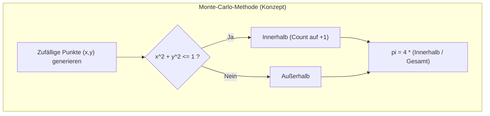
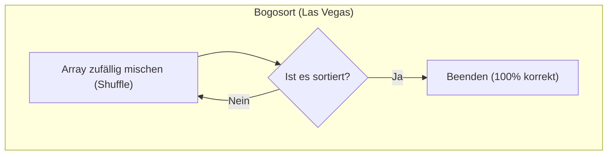

In der Welt der Algorithmen gibt es die Kategorie der **„randomisierten Algorithmen (Randomized Algorithms)“**, die intern Zufallszahlen verwenden, um ein Problem zu lösen. Randomisierte Algorithmen weisen oft eine weitaus bessere durchschnittliche Zeitkomplexität auf und sind einfacher zu implementieren als deterministische Algorithmen.

Diese randomisierten Algorithmen werden grob in zwei repräsentative Paradigmen unterteilt: **Monte-Carlo-Algorithmen** (Monte Carlo algorithm) und **Las-Vegas-Algorithmen** (Las Vegas algorithm).

Diese beiden haben sehr kontrastreiche Eigenschaften bezüglich „Geschwindigkeit“ und „Korrektheit der Lösung“. In diesem Artikel werden wir die Unterschiede zwischen den beiden, repräsentative Beispiele und Code-Beispiele verständlich erläutern.

## 1. Monte-Carlo-Algorithmus (Monte Carlo Algorithm)

### Konzept

Ein Monte-Carlo-Algorithmus ist ein Algorithmus, der **in einer bestimmten Zeit (schnell) ein Ergebnis ausgibt, dieses Ergebnis jedoch mit einer gewissen Wahrscheinlichkeit falsch sein kann**.

- **Ausführungszeit**: Garantiert deterministisch (oft sehr schnell).
- **Korrektheit der Lösung**: Nicht zu 100% garantiert. Mit einer bestimmten Wahrscheinlichkeit tritt ein Fehler auf.

Der Name leitet sich von Monte Carlo ab, einem Stadtteil von Monaco, der für seine Casinos bekannt ist und als Metapher für „ein Glücksspiel, bei dem das Ergebnis vom Zufall abhängt“, dient.

Um die Wahrscheinlichkeit einer falschen Lösung zu verringern, besteht der grundlegende Ansatz darin, **„den Algorithmus mehrmals mit verschiedenen Zufallszahlen zu wiederholen und die Mehrheitsentscheidung zu nehmen oder das beste Ergebnis auszuwählen“**.

### Repräsentative Anwendungsbeispiele

#### Monte-Carlo-Methode zur Pi-Berechnung ($\pi$)

Eine der bekanntesten Anwendungen ist die Methode zur Annäherung an den Wert von Pi.
Man generiert zufällige Punkte in einem Quadrat der Seitenlänge 1 und zählt, wie viele davon in den eingeschriebenen Viertelkreis (Radius 1) fallen.
Das Verhältnis von der „Gesamtzahl der Punkte“ zur „Anzahl der Punkte im Viertelkreis“ nähert sich „Quadratfläche (1)“ zu „Viertelkreisfläche ($\pi/4$)“ an.



Dies ist kein Algorithmus zur Ermittlung der korrekten Lösung (der absolut exakten Stellen von Pi), aber er gibt „in der festgelegten Anzahl von Iterationen immer einen angenäherten Wert (eine Antwort, die möglicherweise einen Fehler enthält)“ zurück.

#### Miller-Rabin-Primzahltest

Bei der Generierung von Schlüsseln in der RSA-Kryptografie ist es notwendig festzustellen, ob eine riesige Zahl $n$ (mit hunderten von Stellen) eine Primzahl ist. Die deterministische Überprüfung würde eine astronomische Zeit in Anspruch nehmen.
Daher wird der **Miller-Rabin-Primzahltest** verwendet.

Dieser Algorithmus wählt zufällig eine Basis $a$ und führt Berechnungen durch.
- Wenn er „Zusammengesetzte Zahl“ zurückgibt, ist $n$ **zu 100% eine zusammengesetzte Zahl**.
- Wenn er „Wahrscheinlich Primzahl“ zurückgibt, besteht eine **Wahrscheinlichkeit von 1/4**, dass es sich um einen Fehler (Pseudoprimzahl) handelt.

Indem man diesen Test $k$-mal mit verschiedenen zufälligen Basen $a$ wiederholt, kann die Fehlerwahrscheinlichkeit auf $(1/4)^k$ reduziert werden. Wenn man es z. B. 40-mal wiederholt, beträgt die Wahrscheinlichkeit eines Fehlers $(1/4)^{40} \approx 1.2 \times 10^{-24}$, was praktisch ignoriert werden kann. Er hält immer schnell an, liefert aber (in extrem seltenen Fällen) möglicherweise die falsche Antwort; somit ist er ein typischer Monte-Carlo-Algorithmus.

```python
# Python-Pseudocode: Konzept des Miller-Rabin-Primzahltests
def is_prime_monte_carlo(n, k=40):
    if n <= 1: return False
    for _ in range(k):
        a = random.randint(2, n - 2)
        if not passes_miller_rabin_test(n, a):
            return False # Zu 100% eine zusammengesetzte Zahl
    return True # Es besteht die extrem geringe Wahrscheinlichkeit einer falschen Lösung
```

## 2. Las-Vegas-Algorithmus (Las Vegas Algorithm)

### Konzept

Ein Las-Vegas-Algorithmus ist ein Algorithmus, bei dem **das erhaltene Ergebnis immer 100% korrekt ist, aber die Ausführungszeit bis zum Erhalt des Ergebnisses vom Zufall abhängt und nicht garantiert ist**.

- **Korrektheit der Lösung**: Immer zu 100% korrekt.
- **Ausführungszeit**: Zufällig (kann im schlimmsten Fall extrem lang dauern).

Der Name leitet sich ebenfalls von Las Vegas ab. Anders als bei Monte Carlo ist „der Gewinn (die korrekte Lösung) garantiert, wenn man weiterspielt, aber man weiß nicht, wie lange man am Automaten sitzen muss“.

Er generiert Zufallszahlen und überprüft das Ergebnis. Wenn das Ergebnis falsch oder nicht gut ist, wird es verworfen und von vorne begonnen. Dieser Vorgang wird so lange wiederholt, bis die richtige Lösung gefunden ist.

### Repräsentative Anwendungsbeispiele

#### Randomisiertes [Quicksort](https://kenji.blog/de/p/sorting-algorithms/) (Randomized Quick Sort)

Das bekannte [Quicksort](https://kenji.blog/de/p/sorting-algorithms/) ist im Grunde ein Las-Vegas-Algorithmus.
[Quicksort](https://kenji.blog/de/p/sorting-algorithms/) wählt ein Element als Pivot aus und teilt das Array in Elemente auf, die kleiner bzw. größer als der Pivot sind.
Wenn die Pivot-Auswahl ungünstig ist (z. B. wenn das Array bereits sortiert ist und das kleinste/größte Element gewählt wird), verschlechtert sich die Zeitkomplexität auf das schlimmste Niveau von $O(N^2)$.
Indem man **den Pivot jedoch jedes Mal zufällig auswählt**, beträgt die erwartete Zeitkomplexität $O(N \log N)$.

Da das Ergebnis eines Sortieralgorithmus immer vollständig sortiert (100% korrekte Lösung) sein muss, ändert sich die Korrektheit des Ergebnisses nicht. Es ist nur so, dass sich aufgrund der „zufälligen Pivot-Auswahl“ die Zeit bis zum Abschluss ändert.

```python
# Python-Beispiel für randomisiertes Quicksort
import random

def quick_sort_las_vegas(arr):
    if len(arr) <= 1:
        return arr
    
    # Einen Pivot zufällig auswählen
    pivot_idx = random.randint(0, len(arr) - 1)
    pivot = arr[pivot_idx]
    
    left = [x for i, x in enumerate(arr) if x <= pivot and i != pivot_idx]
    right = [x for i, x in enumerate(arr) if x > pivot and i != pivot_idx]
    
    return quick_sort_las_vegas(left) + [pivot] + quick_sort_las_vegas(right)
```

#### Bogosort (Bogo Sort)

Ein extremes und humorvolles Beispiel für einen Las-Vegas-Algorithmus ist **Bogosort**.



Die Antwort bei Beendigung ist definitiv zu 100% sortiert. Allerdings beträgt die erwartete Ausführungszeit $O(N \cdot N!)$, und im schlimmsten Fall gerät es in eine Endlosschleife, was es als praktischen Algorithmus völlig nutzlos macht. Dennoch erfüllt es mathematisch die Bedingungen für einen Las-Vegas-Algorithmus.

## 3. Unterschiede auf einen Blick

| Merkmal | Monte-Carlo-Algorithmus | Las-Vegas-Algorithmus |
| :--- | :--- | :--- |
| **Korrektheit der Lösung** | **Nicht zu 100% garantiert** (enthält eine Fehlerwahrscheinlichkeit) | **Immer 100% korrekt** |
| **Ausführungszeit** | Garantiert deterministisch (**schnell**) | **Zufällig** (kann sehr lange dauern) |
| **Gegenmaßnahmen (Wiederholung)** | Reduziert die Fehlerwahrscheinlichkeit (wird genauer) | Stabilisiert die erwartete Ausführungszeit (wird berechenbarer) |
| **Eignung / Anwendungsfälle** | Wenn „Geschwindigkeit“ wichtiger ist als „absolute Genauigkeit“ (z. B. Primzahltests, maschinelles Lernen, Physik-Simulationen) | Wenn „absolute Genauigkeit“ erforderlich ist, aber „die Lösung schwer zu finden, aber leicht zu überprüfen ist“ (z. B. [Sortieren](https://kenji.blog/de/p/sorting-algorithms/), Suche nach der optimalen Lösung, randomisierte Hash-Tabellen) |

## 4. Umwandlung zwischen beiden

Interessanterweise kann man, wenn ein Orakel (eine Prüffunktion) vorhanden ist, das überprüfen kann, ob das von einem Monte-Carlo-Algorithmus ausgegebene Ergebnis korrekt ist, diesen **in einen Las-Vegas-Algorithmus umwandeln**.

- **Wie man ihn umwandelt**:
  Man führt den Monte-Carlo-Algorithmus aus $\to$ Das Ergebnis mit der Prüffunktion verifizieren $\to$ Wenn es falsch ist, erneut ausführen.
  Da es erst beendet wird, wenn die richtige Antwort herauskommt, ist es nach außen hin ein Las-Vegas-Algorithmus geworden (Ausführungszeit ist zufällig, Antwort ist 100% korrekt).

Das Gegenteil ist ebenfalls möglich. Wenn man die Ausführung eines Las-Vegas-Algorithmus nach einer bestimmten Zeitspanne (Time-out) zwangsweise beendet und „die bis dahin beste Näherungslösung“ oder „Fehler“ zurückgibt, **wird er zu einem Monte-Carlo-Algorithmus** (Ausführungszeit ist garantiert, aber keine Garantie für die korrekte Lösung).

## Fazit

- **Monte Carlo**: Garantiert Zeit, geht Kompromisse bei der Korrektheit der Lösung (Wahrscheinlichkeit) ein. (Beispiel: Miller-Rabin-Primzahltest)
- **Las Vegas**: Garantiert die Korrektheit der Lösung, geht Kompromisse bei der Zeit (Wahrscheinlichkeit) ein. (Beispiel: Randomisiertes [Quicksort](https://kenji.blog/de/p/sorting-algorithms/))

In realen Systementwicklungen und dem Entwurf moderner Algorithmen (insbesondere bei großen Datenmengen, verteiltes Rechnen und Kryptografie) kann das Beharren auf streng deterministischen Algorithmen zu astronomischen Rechenzeiten führen. Das Verständnis der Merkmale von Monte-Carlo und Las-Vegas und deren geschickte Implementierung ist ein sehr mächtiges Werkzeug, um Leistungsengpässe zu überwinden.
