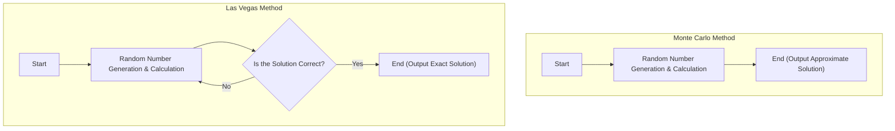

In computer science, algorithms that use random numbers to solve problems are called **Randomized Algorithms**. By using random numbers, there are many cases where solutions can be obtained faster than deterministic algorithms (algorithms that always return the same result through the same steps), or the implementations become much simpler.

Among them, representative approaches are the **Monte Carlo algorithm** and the **Las Vegas algorithm**. Both names originate from famous casino cities, but their characteristics are significantly different.

In this article, we will explain the mechanisms of these two algorithms, specific implementation examples, and the differences between them in detail, incorporating diagrams and formulas.

## 1. Monte Carlo Algorithm

The Monte Carlo method is an algorithm where **"the execution time is always constant (finite), but there is a probability that the obtained solution is incorrect."** The probability of making a mistake can be reduced as much as desired by increasing the number of trials $N$.

### Characteristics
- **Execution Time**: Always has a deterministic upper bound.
- **Correctness**: There is a certain probability of returning an incorrect answer (including when obtaining an approximate solution).

### Trade-off Between Execution Time and Accuracy
The greatest strength of the Monte Carlo method is that the execution time can be fixed. In simulations or numerical calculations, if there is a requirement to "output the most plausible result within 1 hour," you can reliably obtain a result within the time simply by adjusting the number of loop iterations.
However, because it bears the risk of probabilistically making a mistake, it should not be used on its own in systems where a false judgment is fatal (for example, control of medical equipment that must absolutely not fail, or finalizing financial transactions).

### Concrete Example 1: Approximate Calculation of Pi $\pi$

The most famous example of the Monte Carlo method is the approximate calculation of Pi.
Suppose a circle of radius 1 is inscribed in a square with a side length of 2. The area of the square is $2 \times 2 = 4$, and the area of the circle is $\pi \times 1^2 = \pi$.

If you randomly throw darts (plot points) into this square and calculate the ratio of points that fall inside the circle, it approximates the ratio of the areas $\frac{\pi}{4}$.

Let the total number of points plotted be $N_{total}$, and the number of points that fell inside the circle be $N_{in}$. The following formula holds:

$$
\frac{N_{in}}{N_{total}} \approx \frac{\pi}{4} \implies \pi \approx 4 \times \frac{N_{in}}{N_{total}}
$$

#### Implementation Example in Python

```python
import random

def estimate_pi(num_samples: int) -> float:
    points_inside_circle = 0
    
    for _ in range(num_samples):
        # Generate random x, y coordinates in the range of -1.0 to 1.0
        x = random.uniform(-1.0, 1.0)
        y = random.uniform(-1.0, 1.0)
        
        # If the distance from the origin is 1 or less, it's inside the circle
        if x**2 + y**2 <= 1.0:
            points_inside_circle += 1
            
    return 4 * points_inside_circle / num_samples

# 1,000,000 trials
pi_approx = estimate_pi(1_000_000)
print(f"Approximate value of pi: {pi_approx}")
```

The more you increase the number of trials `num_samples`, the more accurate the value of $\pi$ you will obtain, but there is no guarantee that it will be an absolutely exact value.

### Concrete Example 2: Miller-Rabin Primality Test

This is an algorithm that quickly determines whether a huge number is a prime number. When generating keys for [RSA](https://kenji.blog/en/p/modern-cryptography-public-key-hash-signature/) encryption, etc., prime numbers of hundreds of digits are required, but if this is done using deterministic trial division (dividing sequentially by $2, 3, 5, \dots$), it will not finish even if the lifespan of the universe runs out.

Here, we use a Monte Carlo method called the **Miller-Rabin primality test**.
For the number $n$ you want to test, select a random base $a$ and test whether it satisfies a specific conditional expression based on an extension of [Fermat's Little Theorem](https://kenji.blog/en/p/fermats-little-theorem/).

If it is judged to be "composite" in one test, that number is definitively composite. However, if it is judged as "possibly prime," there is a maximum probability of $\frac{1}{4}$ that it is misjudged as prime when it is actually composite.

However, if you repeat this test $k$ times with different random $a$'s, the probability of misjudging all of them is $(\frac{1}{4})^k$. For example, if you set $k=50$, the probability of a false positive is $4^{-50}$, which in practical terms is an accuracy level where it's safe to consider it "definitively a prime number."

## 2. Las Vegas Algorithm

The Las Vegas method is an algorithm where **"the obtained solution is always 100% correct, but the execution time probabilistically fluctuates (in the worst case, it might not end infinitely)."**

### Characteristics
- **Execution Time**: A random variable, and if you are unlucky, it can take a very long time.
- **Correctness**: When the algorithm terminates, its answer is always correct.

### Fluctuation of Computational Complexity and Expected Value
The strength of the Las Vegas method is its reliability in "not producing wrong results." Therefore, it excels in situations where absolute accuracy of the result is required.
Instead, the time until the algorithm terminates depends on random numbers. Even if the "expected execution time (average computational complexity)" is very small, the theoretical possibility of reaching the worst-case time complexity or falling into an infinite loop when extremely unlucky cannot be eliminated.
However, realistically, the probability of hitting an "extremely unlucky case" is astronomically low, so in practice, it often runs faster than deterministic algorithms and is widely adopted.

### Concrete Example 1: Randomized QuickSort

In QuickSort, a representative sorting algorithm, making the choice of pivot (reference value) random is a typical example of a Las Vegas algorithm.

In standard QuickSort, a fixed strategy is always taken, such as choosing the last element of the array as the pivot. However, in this case, if an already sorted array is given from the start, the worst-case time complexity becomes $O(n^2)$.

In **Randomized QuickSort**, the pivot is chosen randomly from within the array. This mathematically guarantees that the average time complexity will be $O(n \log n)$ for any input data. The output sorted result itself is always completely correct.

If the array to be sorted has hundreds of millions of elements and is almost sorted from the beginning, a standard QuickSort runs the risk of causing a stack overflow or a massive increase in computation time. However, by using Randomized QuickSort, it has the advantage of consistently delivering fast performance even against malicious input data designed to intentionally trigger the worst-case scenario (a type of DoS attack). Thus, the Las Vegas method is also useful for improving security and system robustness.

#### Implementation Example in Python

```python
import random

def randomized_quicksort(arr: list) -> list:
    if len(arr) <= 1:
        return arr
    
    # Select pivot randomly
    pivot_idx = random.randint(0, len(arr) - 1)
    pivot = arr[pivot_idx]
    
    # Distribute elements other than the pivot to the left and right
    left = [x for i, x in enumerate(arr) if x <= pivot and i != pivot_idx]
    right = [x for i, x in enumerate(arr) if x > pivot and i != pivot_idx]
    
    # Sort recursively and combine
    return randomized_quicksort(left) + [pivot] + randomized_quicksort(right)

data = [3, 1, 4, 1, 5, 9, 2, 6, 5, 3, 5]
sorted_data = randomized_quicksort(data)
print(f"Sorted result: {sorted_data}")
```

In this implementation, the sorted result is absolutely never wrong. However, if the random number draws are extremely poor, and the maximum or minimum value is consistently chosen as the pivot, the computation time will increase significantly.

### Concrete Example 2: Construction of a Hash Table

Another example of a Las Vegas algorithm is the construction of a perfect hash function.
Suppose you want to create a hash function for a given set of data where no collisions occur whatsoever (different data resulting in the same hash value).

At this time, we take the approach: "Randomly select a hash function and try to place all the data in the hash table. If even one collision occurs, randomly choose a different hash function and start over from the beginning."

Since this repeats until a perfect state with no collisions (the correct solution) is obtained, it is a typical Las Vegas method. Theoretically, it might continue to collide forever, but if an appropriate family of hash functions is prepared, a collision-free hash function can be found in a few trials.

## 3. Comparison of [Monte Carlo and Las Vegas Algorithms](https://kenji.blog/en/p/monte-carlo-and-las-vegas-algorithms/)

Let's clearly compare the differences between the two algorithms.

| Algorithm | Execution Time | Correctness of Result | Examples of Main Uses |
| --- | --- | --- | --- |
| **Monte Carlo** | Always constant (has upper bound) | May be probabilistically wrong | Calculation of Pi, primality testing, physical simulations |
| **Las Vegas** | Probabilistically fluctuates (worst case infinite) | Always 100% correct | Randomized QuickSort, construction of hash tables |

Also, the two are positioned at opposite extremes in terms of whether they fix "time" or "accuracy." You can think of the Monte Carlo method as fixing time and sacrificing accuracy, while the Las Vegas method fixes accuracy and sacrifices time.

The following Mermaid diagram visually represents the difference in the flow of both.



The Monte Carlo method is guaranteed to end if the calculation is performed a predetermined number of times, whereas the Las Vegas method has a loop structure that repeats the trial until a "correct solution" is obtained.

## 4. Relationship Between the Two and Conversion

Interestingly, depending on the situation, it is possible to convert these two algorithms into each other.

### Las Vegas Method $\rightarrow$ Monte Carlo Method
You can convert a Las Vegas algorithm to a Monte Carlo method by imposing a restriction: **"If a certain amount of time passes, forcefully terminate the process and return a random value (or error)."**
This guarantees the execution time, but if it is terminated, it will return an incorrect answer.

### Monte Carlo Method $\rightarrow$ Las Vegas Method
If it's possible to **"verify whether the answer provided by the Monte Carlo method is correct at a very high speed,"** it can be converted into a Las Vegas method.
You execute the Monte Carlo method and pass the answer through a verifier. By creating a loop where you execute the Monte Carlo method again if it's wrong, it becomes a Las Vegas method that eventually always outputs the correct answer (though the execution time cannot be predicted).

## 5. Conclusion

In this article, we explained two powerful algorithm paradigms that utilize random numbers.

- **Monte Carlo Method**: Keeps the time but occasionally makes mistakes. (Example: Approximate calculations, primality testing, etc.)
- **Las Vegas Method**: Never makes a mistake but occasionally doesn't keep the time. (Example: QuickSort, hash table construction, etc.)

In actual system development or data science scenarios, which approach to adopt changes depending on whether strict accuracy is required or real-time capability (an upper bound on computation time) is required. Sometimes, a hybrid approach of the two is also adopted.

Random numbers are not just "random values" but a powerful tool in computer science. When faced with a problem that is difficult to solve with deterministic algorithms, by all means, consider utilizing **Randomized Algorithms**.
