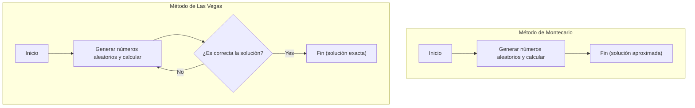

En ciencias de la computación, un algoritmo que utiliza números aleatorios para resolver problemas se llama **algoritmo probabilístico** (Randomized Algorithm). En muchos casos, al utilizar números aleatorios, se puede obtener una solución más rápido que con un algoritmo determinista (uno que siempre devuelve el mismo resultado con los mismos pasos) o la implementación se vuelve mucho más sencilla.

Entre estos, los enfoques más representativos son el **algoritmo de Montecarlo** (Monte Carlo algorithm) y el **algoritmo de Las Vegas** (Las Vegas algorithm). Aunque ambos nombres provienen de famosas ciudades de casinos, sus características son muy diferentes.

En este artículo, explicaremos en detalle cómo funcionan estos dos algoritmos, ejemplos concretos de implementación y las diferencias entre ambos, incluyendo diagramas y fórmulas matemáticas.

## 1. Algoritmo de Montecarlo (Monte Carlo Algorithm)

El método de Montecarlo es un algoritmo donde **"el tiempo de ejecución es siempre constante (finito), pero existe la posibilidad de que la solución obtenida sea incorrecta probabilísticamente"**. La probabilidad de cometer un error se puede reducir tanto como se desee aumentando el número de intentos $N$.

### Características
- **Tiempo de ejecución**: Siempre tiene un límite superior determinista.
- **Exactitud**: Existe una cierta probabilidad de que devuelva una respuesta incorrecta (incluido el caso de obtener soluciones aproximadas).

### El compromiso entre tiempo de ejecución y precisión
La mayor ventaja del método de Montecarlo es poder fijar el tiempo de ejecución. En simulaciones y cálculos numéricos, si se tiene el requisito de "producir el resultado más plausible en el lapso de 1 hora", basta con ajustar el número de iteraciones en el bucle para obtener un resultado a tiempo con toda seguridad.
Sin embargo, dado que asume el riesgo probabilístico de estar equivocado, no debe usarse de forma aislada en sistemas donde un error de cálculo sería fatal (por ejemplo, en el control de dispositivos médicos donde no se puede fallar o en el procesamiento definitivo de transacciones financieras).

### Ejemplo 1: Cálculo aproximado de Pi ($\pi$)

El ejemplo más famoso del método de Montecarlo es la aproximación de Pi.
Supongamos un cuadrado con lados de longitud 2, y un círculo de radio 1 inscrito dentro. El área del cuadrado es $2 \times 2 = 4$, y el área del círculo es $\pi \times 1^2 = \pi$.

Si arrojamos dardos (ponemos puntos) al azar dentro de este cuadrado y calculamos la proporción de puntos que caen dentro del círculo, esto se aproximará a la relación de áreas $\frac{\pi}{4}$.

Si llamamos $N_{total}$ al número total de puntos generados, y $N_{in}$ a los puntos que han caído dentro del círculo, tenemos la siguiente fórmula:

$$
\frac{N_{in}}{N_{total}} \approx \frac{\pi}{4} \implies \pi \approx 4 \times \frac{N_{in}}{N_{total}}
$$

#### Ejemplo de implementación en Python

```python
import random

def estimate_pi(num_samples: int) -> float:
    points_inside_circle = 0
    
    for _ in range(num_samples):
        # Generar coordenadas aleatorias x, y en el rango de -1.0 a 1.0
        x = random.uniform(-1.0, 1.0)
        y = random.uniform(-1.0, 1.0)
        
        # Si la distancia desde el origen es menor o igual a 1, está dentro del círculo
        if x**2 + y**2 <= 1.0:
            points_inside_circle += 1
            
    return 4 * points_inside_circle / num_samples

# Ejecutar 1 millón de veces
pi_approx = estimate_pi(1_000_000)
print(f"Aproximación de Pi: {pi_approx}")
```

Cuanto más aumentes el número de intentos `num_samples`, obtendrás un valor más preciso de $\pi$, pero no hay garantía de que se alcance un valor absolutamente exacto.

### Ejemplo 2: Test de primalidad de Miller-Rabin

Este es un algoritmo rápido para determinar si un número muy grande es primo. Al generar claves en la criptografía [RSA](https://kenji.blog/es/p/modern-cryptography-public-key-hash-signature/) se necesitan números primos de cientos de dígitos; comprobar si un número es primo mediante un método de división por ensayo determinista (dividiendo secuencialmente entre $2, 3, 5, \dots$) llevaría más tiempo que la edad del universo.

Aquí es donde entra en juego el algoritmo de Montecarlo conocido como el **Test de primalidad de Miller-Rabin**.
Para un número dado $n$ que queremos evaluar, elegimos una base aleatoria $a$ y probamos si cumple con ciertas ecuaciones basadas en la extensión del pequeño teorema de [Fermat](https://kenji.blog/es/p/fermat/).

Si en un solo test se determina que "es compuesto", entonces el número es de hecho compuesto. Pero si el algoritmo dictamina que "podría ser primo", existe como máximo un $\frac{1}{4}$ de probabilidad de que el número sea en realidad compuesto y haya sido clasificado erróneamente como primo.

No obstante, si repetimos este test $k$ veces utilizando diferentes bases aleatorias $a$, la probabilidad de fallar todas las veces será $(\frac{1}{4})^k$. Si configuramos, por ejemplo, $k=50$, la probabilidad de un falso positivo será $4^{-50}$, lo que representa una precisión a un nivel que, a efectos prácticos, nos permite considerar que el número es "absolutamente primo" sin problemas.

## 2. Algoritmo de Las Vegas (Las Vegas Algorithm)

El método de Las Vegas es un algoritmo donde **"la solución obtenida es siempre 100% correcta, pero el tiempo de ejecución fluctúa probabilísticamente (en el peor de los casos podría no terminar nunca)"**.

### Características
- **Tiempo de ejecución**: Es una variable aleatoria, y si se tiene mala suerte, puede demorar mucho.
- **Exactitud**: Cuando el algoritmo finaliza, la respuesta devuelta es siempre correcta.

### Dispersión de la complejidad computacional y valor esperado
La fortaleza del método de Las Vegas radica en su fiabilidad para "no devolver resultados incorrectos". Por eso, es muy útil en situaciones donde se requiere precisión absoluta.
Por otro lado, el tiempo hasta que el algoritmo termina depende de los números aleatorios. Aunque el "tiempo de ejecución esperado (complejidad promedio)" sea muy corto, no se puede descartar por completo la posibilidad teórica de alcanzar la complejidad computacional del peor de los casos, o entrar en un bucle infinito si se tiene una suerte nefasta.
Aun así, en el mundo real, las probabilidades de caer en ese "caso de extrema mala suerte" son astronómicamente bajas, por lo que en la práctica estos algoritmos suelen operar más rápido que los deterministas y son ampliamente adoptados.

### Ejemplo 1: [Quicksort](https://kenji.blog/es/p/sorting-algorithms/) Aleatorizado (Randomized QuickSort)

Una aplicación clásica del método de Las Vegas la encontramos en el célebre algoritmo de ordenamiento [Quicksort](https://kenji.blog/es/p/sorting-algorithms/), al utilizar un número aleatorio para elegir el pivote (el valor de referencia).

En un [Quicksort](https://kenji.blog/es/p/sorting-algorithms/) convencional, suele usarse una estrategia fija, como escoger siempre el último elemento del arreglo como pivote. Sin embargo, en ese caso, si la matriz que se le pasa ya está previamente ordenada, su complejidad temporal caerá en el peor caso posible: $O(n^2)$.

En el **[Quicksort](https://kenji.blog/es/p/sorting-algorithms/) Aleatorizado**, el pivote se elige al azar entre los elementos del arreglo. Con esto se garantiza matemáticamente que la complejidad promedio sea $O(n \log n)$, independientemente del orden de los datos de entrada. El resultado de la clasificación arrojado siempre es totalmente correcto.

Si el arreglo que queremos ordenar cuenta con varios cientos de millones de elementos y da la casualidad de que casi todos ya vienen ordenados, el [Quicksort](https://kenji.blog/es/p/sorting-algorithms/) normal entrañaría un serio peligro de provocar un desbordamiento de pila (stack overflow) o de prolongar exageradamente el tiempo de proceso. En cambio, mediante el [Quicksort](https://kenji.blog/es/p/sorting-algorithms/) Aleatorizado, poseemos la ventaja de garantizar un rendimiento rápido y estable, incluso frente a datos de entrada maliciosos ideados para forzar el peor de los casos (un tipo de ataque DoS). Así es como el método de Las Vegas contribuye también a afianzar la robustez y seguridad de los sistemas.

#### Ejemplo de implementación en Python

```python
import random

def randomized_quicksort(arr: list) -> list:
    if len(arr) <= 1:
        return arr
    
    # Elección aleatoria del pivote
    pivot_idx = random.randint(0, len(arr) - 1)
    pivot = arr[pivot_idx]
    
    # Dividir elementos a izquierda y derecha usando el pivote
    left = [x for i, x in enumerate(arr) if x <= pivot and i != pivot_idx]
    right = [x for i, x in enumerate(arr) if x > pivot and i != pivot_idx]
    
    # Ordenar de forma recursiva y combinar
    return randomized_quicksort(left) + [pivot] + randomized_quicksort(right)

data = [3, 1, 4, 1, 5, 9, 2, 6, 5, 3, 5]
sorted_data = randomized_quicksort(data)
print(f"Resultado de la ordenación: {sorted_data}")
```

En esta implementación, no hay posibilidad de que el resultado ordenado sea erróneo. Ahora bien, si los números elegidos fuesen exageradamente desafortunados y se seleccionaran persistentemente el valor máximo o mínimo como pivote, el tiempo computacional se incrementaría considerablemente.

### Ejemplo 2: Construcción de una tabla Hash

Otro ejemplo de la técnica de Las Vegas es la elaboración de una función Hash perfecta.
Dada una colección de datos, supongamos que queremos forjar una función de hash donde no surja ninguna colisión (es decir, el evento en el que distintos datos acaben con el mismo valor hash).

En un escenario así, el método a seguir consistiría en: "Seleccionar al azar una función de hash e intentar alojar todos los datos en la tabla de hash. Si ocurre aunque sea una sola colisión, se escoge aleatoriamente otra función hash distinta y se reinicia desde el principio".

Como se repite constantemente hasta conseguir un estado perfecto sin colisiones (la solución correcta), hablamos de un método de Las Vegas de manual. En teoría podría colisionar incesantemente; pero teniendo dispuesta de antemano una adecuada familia de funciones hash, podremos dar con una carente de colisiones en unos cuantos intentos.

## 3. Comparativa entre el método de Montecarlo y el de Las Vegas

A continuación, mostramos una comparación clara sobre las diferencias entre ambos algoritmos.

| Algoritmo | Tiempo de Ejecución | Precisión de los Resultados | Principales casos de uso |
| --- | --- | --- | --- |
| **Método de Montecarlo** | Siempre constante (con límite máximo) | Puede equivocarse de manera probabilística | Cálculo de Pi, pruebas de primalidad, simulaciones físicas |
| **Método de Las Vegas** | Fluctúa de manera probabilística (infinito en el peor caso) | Siempre 100% correcto | [Quicksort](https://kenji.blog/es/p/sorting-algorithms/) aleatorizado, construcción de tablas Hash |

Igualmente, los dos se ubican en los extremos opuestos respecto a qué factor prefieren fijar: el "tiempo" o la "precisión". Podríamos interpretar que el método de Montecarlo sacrifica precisión a cambio de asegurar un tiempo fijo, mientras que el método de Las Vegas supedita el tiempo a fin de garantizar una precisión invariable.

El siguiente esquema en Mermaid ayuda a visualizar la divergencia en el flujo de ambos:



Al llevar a cabo los cálculos un número de veces estipulado, el método de Montecarlo invariablemente concluye; a diferencia del de Las Vegas, que alberga un ciclo de repetición de los intentos hasta que recaba la "solución correcta".

## 4. Vínculo y conversión entre ambos

Como dato interesante, resulta factible convertir un algoritmo de uno en otro, dependiendo de la situación.

### Método de Las Vegas $\rightarrow$ Método de Montecarlo
Para reconvertir un algoritmo de Las Vegas en uno de Montecarlo, es suficiente con incorporar una limitación: **"Una vez trascurrido un plazo de tiempo fijo, se interrumpe forzadamente la operación devolviendo un valor cualquiera (o un error)"**.
De esta manera, blindamos el tiempo de procesamiento a cambio de que, si es acortado súbitamente, se devuelva un resultado incorrecto.

### Método de Montecarlo $\rightarrow$ Método de Las Vegas
Si contamos con la capacidad de **"verificar muy velozmente si la solución dada por el método de Montecarlo es cierta"**, entonces seremos capaces de mutarlo en un algoritmo de Las Vegas.
Si programamos un bucle en el cual lanzamos el de Montecarlo, aplicamos un verificador sobre la respuesta, y, si esta fuese errónea, reiteramos la operación con el de Montecarlo, obtendremos a la larga un método de Las Vegas (del cual, empero, no podremos deducir el tiempo empleado) que arroje irremediablemente una contestación valedera.

## 5. Resumen

En el artículo de hoy hemos abordado dos potentes concepciones de algoritmos que sacan provecho de los números aleatorios.

- **Método de Montecarlo**: Acata los plazos de tiempo, aunque a veces yerra en los resultados. (Ej: cálculos aproximados, tests de primalidad, etc.)
- **Método de Las Vegas**: Bajo ningún concepto comete un error, pero a veces no acata los plazos. (Ej: [Quicksort](https://kenji.blog/es/p/sorting-algorithms/), creación de tablas Hash, etc.)

De cara al desarrollo en entornos reales o a la labor en ciencia de datos, el decidirnos por uno u otro proceder estará condicionado por si prevalece la urgencia del proceso (un tope estricto de computación en tiempo real) o si, por contrapartida, impera el rigor extremo. A veces, las circunstancias exigirán un modelo intermedio.

Los números aleatorios no conforman sencillamente un puñado de "cifras puestas a voleo"; configuran, dentro de las ciencias de la computación, un engranaje formidable. Frente a dificultades donde un algoritmo determinista encallaría con probabilidad, no desdeñes el sopesar un recurso como un **algoritmo probabilístico**.
