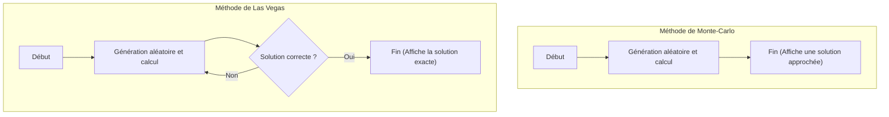

En informatique, un algorithme qui utilise des nombres aléatoires pour résoudre un problème est appelé un **algorithme probabiliste** (Randomized Algorithm). En utilisant des nombres aléatoires, il y a de nombreux cas où il est possible d'obtenir une solution beaucoup plus rapidement, ou de rendre l'implémentation beaucoup plus simple qu'avec un algorithme déterministe (un algorithme qui renvoie toujours le même résultat en suivant les mêmes étapes).

Parmi eux, les approches les plus représentatives sont la **méthode de Monte-Carlo** (Monte Carlo algorithm) et la **méthode de Las Vegas** (Las Vegas algorithm). Leurs noms proviennent tous deux de célèbres villes de casinos, mais leurs propriétés sont très différentes.

Cet article explique en détail le fonctionnement de ces deux algorithmes, montre des exemples d'implémentation concrets et souligne leurs différences avec des schémas et des formules mathématiques.

## 1. Méthode de Monte-Carlo (Monte Carlo Algorithm)

La méthode de Monte-Carlo est un algorithme dans lequel **« le temps d'exécution est toujours constant (fini), mais la solution obtenue peut être probabilistiquement erronée »**. La probabilité de faire une erreur peut être réduite autant que l'on veut en augmentant le nombre d'essais $N$.

### Caractéristiques
- **Temps d'exécution** : A toujours une limite supérieure déterministe.
- **Validité** : Il est possible de retourner une mauvaise réponse avec une certaine probabilité (y compris lorsqu'on cherche une solution approchée).

### Le compromis entre le temps d'exécution et la précision
La plus grande force de la méthode de Monte-Carlo est de pouvoir fixer le temps d'exécution. Lors de simulations ou de calculs numériques, si l'on exige d'« obtenir le résultat le plus plausible possible en moins d'une heure », il suffit d'ajuster le nombre de boucles pour avoir la certitude d'obtenir le résultat dans les temps.
Cependant, comme elle implique un risque d'erreur probabiliste, elle ne doit pas être utilisée seule dans des systèmes où un faux positif serait fatal (par exemple, pour le contrôle de dispositifs médicaux qui ne doivent absolument pas échouer ou pour la validation définitive de transactions financières).

### Exemple concret 1 : L'approximation de $\pi$

L'exemple le plus célèbre de la méthode de Monte-Carlo est le calcul approximatif de la constante Pi.
Supposons un cercle de rayon 1 inscrit dans un carré dont le côté mesure 2. L'aire du carré est $2 \times 2 = 4$, et l'aire du cercle est $\pi \times 1^2 = \pi$.

Si on lance des fléchettes de manière aléatoire dans ce carré (placement de points) et qu'on calcule le ratio de points tombés à l'intérieur du cercle, cela permet d'approximer le rapport d'aires $\frac{\pi}{4}$.

Soit $N_{total}$ le nombre total de points placés et $N_{in}$ le nombre de points à l'intérieur du cercle, on a la relation mathématique suivante :

$$
\frac{N_{in}}{N_{total}} \approx \frac{\pi}{4} \implies \pi \approx 4 \times \frac{N_{in}}{N_{total}}
$$

#### Exemple d'implémentation en Python

```python
import random

def estimate_pi(num_samples: int) -> float:
    points_inside_circle = 0
    
    for _ in range(num_samples):
        # Générer des coordonnées x, y aléatoires entre -1.0 et 1.0
        x = random.uniform(-1.0, 1.0)
        y = random.uniform(-1.0, 1.0)
        
        # Si la distance par rapport à l'origine est <= 1, on est dans le cercle
        if x**2 + y**2 <= 1.0:
            points_inside_circle += 1
            
    return 4 * points_inside_circle / num_samples

# Test avec 1 million d'essais
pi_approx = estimate_pi(1_000_000)
print(f"Valeur approximative de Pi : {pi_approx}")
```

Plus le nombre d'essais `num_samples` est élevé, plus la valeur de $\pi$ obtenue sera précise, mais rien ne garantit que ce soit la valeur absolument exacte.

### Exemple concret 2 : Le test de primalité de Miller-Rabin

C'est un algorithme permettant de déterminer très rapidement si un nombre géant est premier. Lors de la génération de clés dans la cryptographie RSA, on a besoin de nombres premiers longs de centaines de chiffres. S'y atteler avec la division par essais déterministe (en divisant successivement par $2, 3, 5, \dots$) prendrait plus de temps que l'âge de l'univers.

C'est là qu'intervient le **test de primalité de Miller-Rabin**, qui utilise la méthode de Monte-Carlo.
Pour vérifier si un nombre $n$ est premier, on choisit une base aléatoire $a$ et on vérifie si une condition spécifique basée sur une extension du petit théorème de [Fermat](https://kenji.blog/fr/p/fermat/) est satisfaite.

Si un test détermine qu'il « est composé », alors le nombre est assurément composé. Mais s'il détermine qu'il est « peut-être premier », il y a un risque maximal de $\frac{1}{4}$ que ce soit un faux positif (le nombre est composé mais évalué comme premier).

Toutefois, en répétant ce test $k$ fois avec des bases aléatoires $a$ différentes, la probabilité d'une fausse identification à chaque fois devient $(\frac{1}{4})^k$. Par exemple, si on fixe $k=50$, la probabilité de se tromper tombe à $4^{-50}$, ce qui, d'un point de vue pratique, donne une précision telle que l'on peut affirmer que le nombre est « absolument premier ».

## 2. Méthode de Las Vegas (Las Vegas Algorithm)

La méthode de Las Vegas est un algorithme dans lequel **« la solution obtenue est toujours 100% correcte, mais le temps d'exécution fluctue probabilistiquement (et dans le pire des cas, pourrait théoriquement être infini) »**.

### Caractéristiques
- **Temps d'exécution** : C'est une variable aléatoire, et il peut être très long si on n'a pas de chance.
- **Validité** : Quand l'algorithme se termine, sa réponse est toujours correcte.

### Variation de la complexité et valeur espérée
Le point fort de la méthode de Las Vegas est sa fiabilité de ne « jamais donner de résultat faux ». C'est pourquoi elle brille dans les situations nécessitant une précision absolue.
En contrepartie, le temps nécessaire à l'algorithme pour se terminer dépend des nombres aléatoires. Bien que le « temps d'exécution attendu (en moyenne) » puisse être très court, dans un cas de malchance extrême, on ne peut exclure la possibilité théorique d'atteindre le pire des temps de calcul ou de tomber dans une boucle infinie.
Cependant, dans la réalité, la probabilité de tirer ce « cas de malchance extrême » étant astronomiquement faible, il est en pratique très souvent plus rapide qu'un algorithme déterministe, d'où son adoption fréquente.

### Exemple concret 1 : Le tri rapide randomisé (Randomized QuickSort)

Le choix aléatoire d'un pivot dans le Tri rapide (Quicksort), l'algorithme de tri le plus célèbre, est un exemple typique de la méthode de Las Vegas.

Dans un Quicksort normal, on utilise souvent une stratégie fixe consistant à toujours choisir le dernier élément du tableau comme pivot. Néanmoins, avec cette stratégie, si l'on donne un tableau déjà trié, on fait face au pire cas avec une complexité de $O(n^2)$.

Dans le **tri rapide randomisé**, le pivot est choisi de manière aléatoire parmi les éléments du tableau. Il est mathématiquement garanti que, de cette manière, pour n'importe quelles données d'entrée, la complexité moyenne sera de $O(n \log n)$. Et le résultat du tri produit est toujours parfaitement correct.

Si le tableau à trier comporte des centaines de millions d'éléments et est déjà presque trié, le Quicksort normal risquerait de provoquer un dépassement de capacité (stack overflow) ou de faire exploser le temps de calcul. L'utilisation du tri rapide randomisé permet de contrer efficacement des données malveillantes cherchant délibérément à provoquer le pire cas (comme une forme d'attaque DoS), garantissant ainsi une performance rapide et stable. De la sorte, la méthode de Las Vegas aide à améliorer la sécurité et la robustesse des systèmes.

#### Exemple d'implémentation en Python

```python
import random

def randomized_quicksort(arr: list) -> list:
    if len(arr) <= 1:
        return arr
    
    # Choix aléatoire du pivot
    pivot_idx = random.randint(0, len(arr) - 1)
    pivot = arr[pivot_idx]
    
    # Répartition des autres éléments à gauche et à droite du pivot
    left = [x for i, x in enumerate(arr) if x <= pivot and i != pivot_idx]
    right = [x for i, x in enumerate(arr) if x > pivot and i != pivot_idx]
    
    # Tri récursif et assemblage
    return randomized_quicksort(left) + [pivot] + randomized_quicksort(right)

data = [3, 1, 4, 1, 5, 9, 2, 6, 5, 3, 5]
sorted_data = randomized_quicksort(data)
print(f"Résultat du tri : {sorted_data}")
```

Dans cette implémentation, le tri ne se trompera absolument jamais de résultat. Cependant, si le hasard fait très mal les choses et que le pivot sélectionné est continuellement la valeur maximale ou minimale, le temps de calcul augmentera considérablement.

### Exemple concret 2 : Construction de table de hachage (Hash table)

La construction d'une fonction de hachage parfaite est un autre exemple de la méthode de Las Vegas.
Imaginons que nous voulions créer une fonction de hachage où aucune collision (deux données différentes ayant la même valeur de hachage) ne se produit pour un ensemble de données donné.

L'approche adoptée est de « choisir une fonction de hachage au hasard, placer toutes les données dans la table. Si une seule collision se produit, choisir de nouveau une autre fonction au hasard et tout recommencer ».

C'est typiquement la méthode de Las Vegas puisqu'on recommence l'opération jusqu'à obtenir un état parfait sans collision (la solution correcte). Théoriquement, on pourrait tomber en collision à l'infini, mais si on prépare une famille adéquate de fonctions de hachage, on peut trouver une fonction sans collision en quelques essais.

## 3. Comparaison de Monte-Carlo et Las Vegas

Comparons clairement la différence entre ces deux algorithmes.

| Algorithme | Temps d'exécution | Précision du résultat | Exemples d'application typiques |
| --- | --- | --- | --- |
| **Méthode de Monte-Carlo** | Toujours constant (limite supérieure) | Probablement sujet à erreurs | Calcul de $\pi$, test de primalité, simulations physiques |
| **Méthode de Las Vegas** | Fluctuation probabiliste (pire infini) | Toujours 100% correct | Tri rapide randomisé, construction de table de hachage |

De plus, ces algorithmes sont à l'opposé l'un de l'autre quant à ce qui est « figé » : le « temps » ou la « précision ». On peut dire que la méthode de Monte-Carlo fige le temps et sacrifie la précision, tandis que la méthode de Las Vegas fige la précision et sacrifie le temps.

Le schéma Mermaid suivant montre visuellement la différence de flux entre les deux méthodes.



La méthode de Monte-Carlo se terminera toujours une fois le nombre défini de calculs effectués. La méthode de Las Vegas possède une boucle qui réitère l'opération jusqu'à l'obtention de la « solution correcte ».

## 4. Relations et conversion entre les deux

Il est intéressant de noter qu'il est possible, selon la situation, de convertir un algorithme dans l'autre.

### Méthode de Las Vegas $\rightarrow$ Méthode de Monte-Carlo
En imposant la limite **« d'interrompre le traitement de force si une certaine durée s'est écoulée, et de renvoyer une valeur au hasard (ou une erreur) »** à un algorithme de Las Vegas, on peut le convertir en un algorithme de Monte-Carlo.
Cela permet de garantir le temps d'exécution, mais s'il est interrompu, il renverra une réponse erronée.

### Méthode de Monte-Carlo $\rightarrow$ Méthode de Las Vegas
Si l'on peut **« vérifier très rapidement si la réponse fournie par la méthode de Monte-Carlo est correcte ou non »**, on peut alors la convertir en algorithme de Las Vegas.
On exécute l'algorithme de Monte-Carlo et on soumet sa réponse au validateur. Si elle est fausse, on relance la méthode de Monte-Carlo. On crée ainsi une boucle qui en fera une méthode de Las Vegas crachant obligatoirement la bonne réponse au final (bien que le temps soit imprévisible).

## 5. Résumé

Dans cet article, nous avons explicité deux paradigmes algorithmiques très puissants exploitant les nombres aléatoires.

- **Méthode de Monte-Carlo** : Respecte le temps imparti, mais fait parfois des erreurs. (Ex : calcul approximatif, test de primalité)
- **Méthode de Las Vegas** : Ne fait absolument aucune erreur, mais peut parfois ne pas respecter le temps imparti. (Ex : tri rapide, construction de table de hachage)

Sur le terrain, lors du développement de systèmes informatiques ou dans la data science, l'approche adoptée diffèrera selon que le besoin prioritaire soit une exactitude stricte ou des résultats en temps réel (un plafond pour le temps de calcul). Il arrive aussi qu'une approche hybride soit mise en œuvre.

Les nombres aléatoires ne sont pas simplement des « valeurs choisies au hasard », mais un outil très puissant en informatique. Si vous êtes un jour confronté à un problème qu'il est difficile de résoudre avec un algorithme déterministe, envisagez fortement l'utilisation d'un **algorithme probabiliste**.
