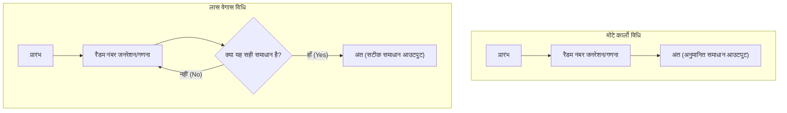

कंप्यूटर विज्ञान में, समस्याओं को हल करने के लिए यादृच्छिक संख्याओं (रैंडम नंबर) का उपयोग करने वाले एल्गोरिदम को **संभाव्य एल्गोरिदम** (Randomized Algorithm) कहा जाता है। ऐसे कई मामले हैं जहां रैंडम नंबर का उपयोग करके नियतात्मक (deterministic) एल्गोरिदम (ऐसे एल्गोरिदम जो हमेशा एक ही प्रक्रिया के साथ एक ही परिणाम देते हैं) की तुलना में समाधान तेजी से प्राप्त किए जा सकते हैं, या कार्यान्वयन बहुत सरल हो जाता है।

इनमें से विशिष्ट दृष्टिकोण **मोंटे कार्लो विधि** (Monte Carlo algorithm) और **लास वेगास विधि** (Las Vegas algorithm) हैं। दोनों का नाम प्रसिद्ध कैसीनो शहरों के नाम पर रखा गया है, लेकिन उनके गुण बहुत भिन्न हैं।

इस लेख में, हम आरेखों और गणितीय सूत्रों के साथ इन दो एल्गोरिदम के तंत्र, विशिष्ट कार्यान्वयन उदाहरणों और उनके बीच के अंतरों को विस्तार से समझाएंगे।

## 1. मोंटे कार्लो विधि (Monte Carlo Algorithm)

मोंटे कार्लो विधि एक ऐसा एल्गोरिथ्म है जहां **"निष्पादन का समय हमेशा निश्चित (सीमित) होता है, लेकिन प्राप्त समाधान संभावित रूप से गलत हो सकता है"**। परीक्षणों की संख्या $N$ बढ़ाकर त्रुटि की संभावना को मनचाहे ढंग से कम किया जा सकता है।

### विशेषताएँ
- **निष्पादन समय**: हमेशा एक नियतात्मक ऊपरी सीमा होती है।
- **शुद्धता**: गलत उत्तर वापस करने की एक निश्चित संभावना है (अनुमानित समाधान प्राप्त करने सहित)।

### निष्पादन समय और सटीकता के बीच व्यापार-बंद (Trade-off)
मोंटे कार्लो विधि का सबसे बड़ा लाभ यह है कि निष्पादन का समय तय किया जा सकता है। सिमुलेशन या संख्यात्मक गणनाओं में, जब यह आवश्यकता होती है कि "मैं 1 घंटे के भीतर सबसे प्रशंसनीय परिणाम चाहता हूं," तो आप केवल लूप की संख्या को समायोजित करके समय सीमा के भीतर परिणाम सुनिश्चित कर सकते हैं।
हालाँकि, चूँकि इसमें संभावित त्रुटि का जोखिम होता है, इसलिए इसका उपयोग उन प्रणालियों में अकेले नहीं किया जाना चाहिए जहाँ गलत निर्णय घातक हो सकते हैं (जैसे चिकित्सा उपकरणों का नियंत्रण जिन्हें कभी विफल नहीं होना चाहिए, या वित्तीय लेनदेन को अंतिम रूप देना)।

### विशिष्ट उदाहरण 1: पाई $\pi$ की अनुमानित गणना

मोंटे कार्लो विधि का सबसे प्रसिद्ध उदाहरण पाई की अनुमानित गणना है।
मान लीजिए कि त्रिज्या 1 वाला एक वृत्त भुजा की लंबाई 2 वाले वर्ग में अंकित है। वर्ग का क्षेत्रफल $2 \times 2 = 4$ है, और वृत्त का क्षेत्रफल $\pi \times 1^2 = \pi$ है।

यदि आप बेतरतीब ढंग से डार्ट्स (बिंदु) इस वर्ग में फेंकते हैं, और वृत्त के अंदर गिरने वाले बिंदुओं का अनुपात पाते हैं, तो यह क्षेत्रफलों के अनुपात $\frac{\pi}{4}$ के लगभग बराबर होगा।

यदि डाले गए बिंदुओं की कुल संख्या $N_{total}$ है और वृत्त के अंदर बिंदुओं की संख्या $N_{in}$ है, तो निम्नलिखित सूत्र लागू होता है।

$$
\frac{N_{in}}{N_{total}} \approx \frac{\pi}{4} \implies \pi \approx 4 \times \frac{N_{in}}{N_{total}}
$$

#### पायथन में कार्यान्वयन उदाहरण

```python
import random

def estimate_pi(num_samples: int) -> float:
    points_inside_circle = 0
    
    for _ in range(num_samples):
        # -1.0 से 1.0 की सीमा में रैंडम x, y निर्देशांक उत्पन्न करें
        x = random.uniform(-1.0, 1.0)
        y = random.uniform(-1.0, 1.0)
        
        # यदि मूल बिंदु (origin) से दूरी 1 या उससे कम है, तो यह वृत्त के अंदर है
        if x**2 + y**2 <= 1.0:
            points_inside_circle += 1
            
    return 4 * points_inside_circle / num_samples

# 10 लाख बार परीक्षण
pi_approx = estimate_pi(1_000_000)
print(f"पाई का अनुमानित मान: {pi_approx}")
```

जैसे-जैसे आप परीक्षणों की संख्या `num_samples` बढ़ाते हैं, आपको $\pi$ का अधिक सटीक मान प्राप्त होगा, लेकिन इस बात की कोई गारंटी नहीं है कि यह बिल्कुल सटीक मान होगा।

### विशिष्ट उदाहरण 2: मिलर-राबिन प्राइमलिटी टेस्ट

यह एक एल्गोरिदम है जो तेजी से यह निर्धारित करता है कि क्या कोई बड़ी संख्या एक अभाज्य संख्या (prime number) है। RSA एन्क्रिप्शन आदि के लिए कुंजियाँ (keys) उत्पन्न करते समय, सैकड़ों अंकों वाली अभाज्य संख्याओं की आवश्यकता होती है, लेकिन यदि आप इसे एक नियतात्मक परीक्षण विभाजन विधि ($2, 3, 5, \dots$ द्वारा क्रमिक रूप से विभाजित करना) के साथ करने का प्रयास करते हैं, तो ब्रह्मांड के अंत तक भी यह समाप्त नहीं होगा।

यहां हम **मिलर-राबिन प्राइमलिटी टेस्ट (Miller-Rabin primality test)** नामक मोंटे कार्लो विधि का उपयोग करते हैं।
जांची जाने वाली संख्या $n$ के लिए, हम एक यादृच्छिक आधार $a$ चुनते हैं और परीक्षण करते हैं कि क्या यह फ़र्मेट ([Fermat](https://kenji.blog/hi/p/fermat/)) के छोटे प्रमेय के विस्तार के आधार पर एक विशिष्ट स्थिति को संतुष्ट करता है।

यदि एक परीक्षण यह निर्धारित करता है कि यह एक "समग्र संख्या (composite number)" है, तो वह संख्या निश्चित रूप से एक समग्र संख्या है। हालाँकि, यदि यह निर्धारित किया जाता है कि यह "एक अभाज्य संख्या हो सकती है", तो अधिकतम $\frac{1}{4}$ संभावना है कि यह वास्तव में एक समग्र संख्या होने पर गलती से एक अभाज्य संख्या के रूप में आंकी जाएगी।

हालाँकि, यदि आप इस परीक्षण को अलग-अलग रैंडम $a$ के साथ $k$ बार दोहराते हैं, तो हर बार गलत निर्णय लेने की संभावना $(\frac{1}{4})^k$ हो जाती है। उदाहरण के लिए, यदि आप $k=50$ सेट करते हैं, तो गलत पहचान की संभावना $4^{-50}$ है, जो सटीकता का एक स्तर है जिसे व्यावहारिक रूप से "निश्चित रूप से अभाज्य" माना जा सकता है।

## 2. लास वेगास विधि (Las Vegas Algorithm)

लास वेगास विधि एक एल्गोरिथ्म है जहां **"प्राप्त समाधान हमेशा 100% सही होता है, लेकिन निष्पादन का समय संभावित रूप से भिन्न होता है (सबसे खराब स्थिति में, यह कभी समाप्त नहीं हो सकता है)"**।

### विशेषताएँ
- **निष्पादन समय**: यह एक यादृच्छिक चर (random variable) है, और यदि आप बदकिस्मत हैं, तो इसमें बहुत लंबा समय लग सकता है।
- **शुद्धता**: जब एल्गोरिदम समाप्त होता है, तो उसका उत्तर हमेशा सही होता है।

### गणना की जटिलता और अपेक्षित मूल्य में भिन्नता
लास वेगास विधि की ताकत इसकी विश्वसनीयता है, अर्थात यह "गलत परिणाम नहीं देती"। इसलिए, यह उन स्थितियों में उपयोगी है जहां परिणामों की पूर्ण सटीकता की आवश्यकता होती है।
बदले में, एल्गोरिदम के समाप्त होने में लगने वाला समय रैंडम नंबरों पर निर्भर करता है। भले ही "अपेक्षित निष्पादन समय (औसत कम्प्यूटेशनल जटिलता)" बहुत कम हो, सैद्धांतिक संभावना से इंकार नहीं किया जा सकता है कि यह अत्यधिक बदकिस्मती होने पर सबसे खराब-स्थिति जटिलता तक पहुंच सकता है या अनंत लूप में गिर सकता है।
हालाँकि, वास्तविकता में, "अत्यधिक बदकिस्मत मामला" खींचने की संभावना खगोलीय रूप से कम है, इसलिए व्यावहारिक उपयोग में, यह अक्सर नियतात्मक एल्गोरिदम की तुलना में तेज़ होता है और व्यापक रूप से उपयोग किया जाता है।

### विशिष्ट उदाहरण 1: रैंडमाइज़्ड क्विकसॉर्ट (Randomized QuickSort)

लास वेगास विधि का एक विशिष्ट उदाहरण क्विकसॉर्ट (एक प्रतिनिधि छँटाई एल्गोरिथ्म) में पिवट (संदर्भ मान) को बेतरतीब ढंग से चुनना है।

नियमित क्विकसॉर्ट में, हम एक निश्चित रणनीति का उपयोग करते हैं, जैसे हमेशा सरणी (array) के अंतिम तत्व को पिवट के रूप में चुनना। हालाँकि, इस मामले में, यदि आपको एक सरणी दी जाती है जिसे पहले ही सॉर्ट किया जा चुका है, तो सबसे खराब स्थिति की जटिलता $O(n^2)$ होगी।

**रैंडमाइज़्ड क्विकसॉर्ट** में, पिवट को सरणी से यादृच्छिक रूप से चुना जाता है। यह गणितीय रूप से गारंटी देता है कि किसी भी इनपुट डेटा के लिए औसत कम्प्यूटेशनल जटिलता $O(n \log n)$ होगी। आउटपुट सॉर्ट किया गया परिणाम हमेशा पूरी तरह से सही होता है।

यदि सॉर्ट की जाने वाली सरणी में करोड़ों तत्व हैं और शुरू से ही लगभग सॉर्ट की गई है, तो नियमित क्विकसॉर्ट में स्टैक ओवरफ़्लो या गणना समय में उल्लेखनीय वृद्धि होने का जोखिम है। हालाँकि, रैंडमाइज़्ड क्विकसॉर्ट का उपयोग करके, यह दुर्भावनापूर्ण इनपुट डेटा (DoS हमले का एक प्रकार) के खिलाफ भी स्थिर और उच्च गति प्रदर्शन प्रदान कर सकता है जो जानबूझकर सबसे खराब स्थिति का कारण बनता है। इस तरह, लास वेगास विधि सिस्टम की सुरक्षा और मजबूती (robustness) को बेहतर बनाने में भी उपयोगी है।

#### पायथन में कार्यान्वयन उदाहरण

```python
import random

def randomized_quicksort(arr: list) -> list:
    if len(arr) <= 1:
        return arr
    
    # पिवट को बेतरतीब ढंग से चुनें
    pivot_idx = random.randint(0, len(arr) - 1)
    pivot = arr[pivot_idx]
    
    # पिवट के अलावा अन्य तत्वों को बाएँ और दाएँ क्रमबद्ध करें
    left = [x for i, x in enumerate(arr) if x <= pivot and i != pivot_idx]
    right = [x for i, x in enumerate(arr) if x > pivot and i != pivot_idx]
    
    # पुनरावर्ती रूप से (recursively) सॉर्ट करें और संयोजित करें
    return randomized_quicksort(left) + [pivot] + randomized_quicksort(right)

data = [3, 1, 4, 1, 5, 9, 2, 6, 5, 3, 5]
sorted_data = randomized_quicksort(data)
print(f"सॉर्ट परिणाम: {sorted_data}")
```

इस कार्यान्वयन में, यह बिल्कुल असंभव है कि सॉर्ट परिणाम गलत हो। हालाँकि, यदि रैंडम नंबर ड्रॉ बेहद खराब है और हमेशा अधिकतम या न्यूनतम मान को पिवट के रूप में चुना जाता है, तो गणना समय में काफी वृद्धि होगी।

### विशिष्ट उदाहरण 2: हैश टेबल का निर्माण

लास वेगास विधि का एक और उदाहरण एक आदर्श हैश फ़ंक्शन (perfect hash function) का निर्माण है।
मान लीजिए कि हम डेटा के दिए गए सेट के लिए एक हैश फ़ंक्शन बनाना चाहते हैं जहाँ कोई टकराव (भिन्न डेटा का एक ही हैश मान होना) न हो।

इस समय, हम निम्नलिखित दृष्टिकोण अपनाते हैं: "यादृच्छिक रूप से एक हैश फ़ंक्शन चुनें और सभी डेटा को हैश तालिका में रखें। यदि एक बार भी टकराव होता है, तो बेतरतीब ढंग से एक अन्य हैश फ़ंक्शन चुनें और शुरू से ही पुनः आरंभ करें।"

यह एक सामान्य लास वेगास विधि है क्योंकि इसे तब तक दोहराया जाता है जब तक कि बिना टकराव वाली एक आदर्श स्थिति (सही समाधान) प्राप्त न हो जाए। सैद्धांतिक रूप से, यह हमेशा के लिए टकरा सकता है, लेकिन यदि हैश कार्यों का एक उपयुक्त परिवार तैयार किया जाता है, तो कुछ ही परीक्षणों में टकराव-मुक्त हैश फ़ंक्शन पाया जा सकता है।

## 3. मोंटे कार्लो विधि और लास वेगास विधि की तुलना

आइए दो एल्गोरिदम के बीच के अंतरों की तुलना आसानी से समझने वाले तरीके से करें।

| एल्गोरिदम | निष्पादन समय | परिणाम की शुद्धता | मुख्य उपयोगों के उदाहरण |
| --- | --- | --- | --- |
| **मोंटे कार्लो विधि** | हमेशा स्थिर (ऊपरी सीमा के साथ) | संभावना है कि यह गलत हो सकता है | पाई की गणना, प्राइमलिटी परीक्षण, भौतिकी सिमुलेशन |
| **लास वेगास विधि** | संभावित रूप से परिवर्तनशील (सबसे खराब स्थिति में अनंत) | हमेशा 100% सही | रैंडमाइज़्ड क्विकसॉर्ट, हैश टेबल निर्माण |

इसके अलावा, दोनों इस मायने में ध्रुवीय विपरीत हैं कि वे या तो "समय" या "सटीकता" को ठीक करते हैं। मोंटे कार्लो विधि समय को निश्चित रखती है और सटीकता का त्याग करती है, जबकि लास वेगास विधि सटीकता को निश्चित रखती है और समय का त्याग करती है।

नीचे दिया गया Mermaid आरेख दोनों के प्रवाह के बीच अंतर को दर्शाता है।



मोंटे कार्लो विधि हमेशा गणनाओं की एक निर्धारित संख्या पूरी होने के बाद समाप्त हो जाएगी, लेकिन लास वेगास विधि में एक लूप संरचना होती है जो परीक्षणों को तब तक दोहराती है जब तक कि "सही समाधान" प्राप्त नहीं हो जाता।

## 4. दोनों का संबंध और रूपांतरण

दिलचस्प बात यह है कि स्थिति के आधार पर, इन दो एल्गोरिदम को एक-दूसरे में बदला जा सकता है।

### लास वेगास विधि $\rightarrow$ मोंटे कार्लो विधि
आप **"यदि एक निश्चित समय बीत चुका है, तो जबरन प्रक्रिया को समाप्त करें और एक उचित मान (या त्रुटि) वापस करें"** का प्रतिबंध लगाकर लास वेगास विधि को मोंटे कार्लो विधि में परिवर्तित कर सकते हैं।
यह निष्पादन समय की गारंटी देता है, लेकिन यदि इसे छोटा कर दिया जाता है, तो यह गलत उत्तर देगा।

### मोंटे कार्लो विधि $\rightarrow$ लास वेगास विधि
यदि मोंटे कार्लो विधि द्वारा दिए गए उत्तर को **"यह बहुत तेज़ी से सत्यापित किया जा सकता है कि यह सही है या नहीं,"** तो इसे लास वेगास विधि में परिवर्तित किया जा सकता है।
मोंटे कार्लो विधि को क्रियान्वित करें और इसके उत्तर को सत्यापनकर्ता के माध्यम से जांचें। यदि यह गलत है, तो आप एक लूप बना सकते हैं जो मोंटे कार्लो विधि को फिर से निष्पादित करता है, और अंततः यह लास वेगास विधि बन जाएगा जो हमेशा सही उत्तर (यद्यपि निष्पादन समय अज्ञात है) देता है।

## 5. निष्कर्ष

इस लेख में, हमने यादृच्छिक संख्याओं का लाभ उठाने वाले दो शक्तिशाली एल्गोरिदम प्रतिमानों की व्याख्या की।

- **मोंटे कार्लो विधि** : समय का पालन करता है, लेकिन कभी-कभी गलतियाँ करता है। (उदाहरण: अनुमानित गणना, प्राइमलिटी परीक्षण, आदि)
- **लास वेगास विधि** : कभी गलती नहीं करता, लेकिन कभी-कभी समय का पालन नहीं करता। (उदाहरण: क्विकसॉर्ट, हैश टेबल निर्माण, आदि)

वास्तविक सिस्टम डेवलपमेंट या डेटा साइंस में, आपको कौन सा दृष्टिकोण अपनाना चाहिए यह इस बात पर निर्भर करता है कि सख्त सटीकता की आवश्यकता है या वास्तविक समय (गणना समय की ऊपरी सीमा) की। कभी-कभी दोनों को मिलाकर एक हाइब्रिड दृष्टिकोण अपनाया जाता है।

रैंडम नंबर केवल "यादृच्छिक मान" नहीं हैं, बल्कि कंप्यूटर विज्ञान में शक्तिशाली उपकरण हैं। यदि आपको किसी ऐसी समस्या का सामना करना पड़ता है जिसे नियतात्मक एल्गोरिदम से हल करना मुश्किल है, तो कृपया **संभाव्य एल्गोरिदम** का उपयोग करने पर विचार करें।
