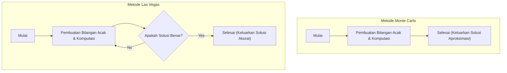

Dalam ilmu komputer, algoritma yang menggunakan bilangan acak untuk memecahkan masalah disebut **algoritma probabilistik** (Randomized Algorithm). Dengan menggunakan bilangan acak, terdapat banyak kasus di mana kita bisa mendapatkan solusi lebih cepat atau membuat implementasi yang jauh lebih sederhana dibandingkan algoritma deterministik (algoritma yang selalu mengembalikan hasil yang sama dengan prosedur yang sama).

Di antaranya, pendekatan yang paling representatif adalah **metode Monte Carlo** (Monte Carlo algorithm) dan **metode Las Vegas** (Las Vegas algorithm). Meskipun keduanya dinamai dari kota-kota kasino yang terkenal, sifat keduanya sangatlah berbeda.

Artikel ini akan menjelaskan secara detail mekanisme kedua algoritma ini, contoh implementasi konkret, dan perbedaan di antara keduanya, disertai dengan ilustrasi dan rumus matematika.

## 1. Metode Monte Carlo (Monte Carlo Algorithm)

Metode Monte Carlo adalah algoritma di mana **"waktu eksekusinya selalu konstan (terbatas), tetapi solusi yang diperoleh memiliki kemungkinan salah secara probabilistik"**. Probabilitas kesalahan ini dapat diperkecil sebanyak mungkin dengan meningkatkan jumlah percobaan $N$.

### Karakteristik
- **Waktu Eksekusi**: Selalu memiliki batas atas yang deterministik.
- **Kebenaran (Correctness)**: Terdapat kemungkinan mengembalikan jawaban yang salah dengan probabilitas tertentu (termasuk saat mendapatkan solusi hampiran/aproksimasi).

### Trade-off antara Waktu Eksekusi dan Akurasi
Keunggulan terbesar dari metode Monte Carlo adalah kemampuannya untuk menetapkan waktu eksekusi yang tetap. Dalam simulasi atau komputasi numerik, jika ada persyaratan "berikan hasil yang paling masuk akal dalam waktu 1 jam", kita bisa menyesuaikan jumlah perulangan (loop) untuk memastikan kita mendapatkan hasil dalam batas waktu tersebut.
Namun, karena ada risiko kesalahan secara probabilistik, metode ini tidak boleh digunakan sendirian pada sistem di mana kesalahan deteksi akan berakibat fatal (misalnya, pengendalian peralatan medis yang tidak boleh gagal atau penyelesaian transaksi keuangan).

### Contoh 1: Menghitung Nilai Aproksimasi Pi $\pi$

Contoh metode Monte Carlo yang paling terkenal adalah perhitungan nilai aproksimasi Pi ($\pi$).
Misalkan ada sebuah lingkaran dengan jari-jari 1 yang berada di dalam sebuah persegi dengan panjang sisi 2. Luas persegi tersebut adalah $2 \times 2 = 4$, dan luas lingkaran adalah $\pi \times 1^2 = \pi$.

Jika kita melempar dart (titik) secara acak ke dalam persegi ini, proporsi titik-titik yang jatuh di dalam lingkaran akan mendekati rasio luasnya yaitu $\frac{\pi}{4}$.

Jika total titik yang dilempar adalah $N_{total}$ dan jumlah titik yang masuk ke dalam lingkaran adalah $N_{in}$, maka berlaku rumus berikut:

$$
\frac{N_{in}}{N_{total}} \approx \frac{\pi}{4} \implies \pi \approx 4 \times \frac{N_{in}}{N_{total}}
$$

#### Contoh Implementasi dengan Python

```python
import random

def estimate_pi(num_samples: int) -> float:
    points_inside_circle = 0
    
    for _ in range(num_samples):
        # Menghasilkan koordinat x dan y acak dalam rentang -1.0 hingga 1.0
        x = random.uniform(-1.0, 1.0)
        y = random.uniform(-1.0, 1.0)
        
        # Jika jarak dari titik asal <= 1, maka berada di dalam lingkaran
        if x**2 + y**2 <= 1.0:
            points_inside_circle += 1
            
    return 4 * points_inside_circle / num_samples

# 1 juta percobaan
pi_approx = estimate_pi(1_000_000)
print(f"Nilai aproksimasi Pi: {pi_approx}")
```

Semakin besar jumlah percobaan `num_samples`, semakin akurat nilai $\pi$ yang diperoleh, tetapi tidak ada jaminan akan menjadi nilai yang mutlak benar.

### Contoh 2: Uji Primalitas Miller-Rabin

Ini adalah algoritma untuk menguji apakah suatu bilangan besar adalah bilangan prima dengan cepat. Saat membuat kunci pada kriptografi RSA, diperlukan bilangan prima dengan panjang ratusan digit, namun jika hal ini dilakukan dengan metode pembagian percobaan deterministik (metode dengan membagi berurutan $2, 3, 5, \dots$), ia tidak akan selesai bahkan hingga akhir umur alam semesta.

Di sinilah kita menggunakan **uji primalitas Miller-Rabin** yang memanfaatkan metode Monte Carlo.
Untuk bilangan $n$ yang akan diuji, kita memilih basis acak $a$, dan mengujinya apakah ia memenuhi kondisi tertentu berdasarkan generalisasi [Teorema Kecil Fermat](https://kenji.blog/id/p/fermats-little-theorem/).

Jika dalam satu tes bilangan tersebut ditentukan "bilangan komposit", maka bilangan tersebut pasti adalah komposit. Namun, jika ia ditentukan "mungkin bilangan prima", ada kemungkinan maksimal $\frac{1}{4}$ bahwa bilangan tersebut sebenarnya komposit tetapi keliru diidentifikasi sebagai prima.

Akan tetapi, jika tes ini diulang sebanyak $k$ kali dengan bilangan acak $a$ yang berbeda, probabilitas kesalahan pada seluruh tes akan menjadi $(\frac{1}{4})^k$. Sebagai contoh, jika kita menetapkan $k=50$, probabilitas kesalahannya adalah $4^{-50}$, yang dalam praktiknya memiliki akurasi pada tingkat di mana aman untuk menganggapnya "pasti bilangan prima".

## 2. Metode Las Vegas (Las Vegas Algorithm)

Metode Las Vegas adalah algoritma di mana **"solusi yang diperoleh selalu 100% benar, tetapi waktu eksekusinya berfluktuasi secara probabilistik (pada kasus terburuk, ada kemungkinan ia tidak pernah selesai)"**.

### Karakteristik
- **Waktu Eksekusi**: Merupakan variabel acak, dan jika kurang beruntung, dapat memakan waktu yang sangat lama.
- **Kebenaran (Correctness)**: Ketika algoritma selesai, jawabannya selalu pasti benar.

### Variasi Kompleksitas Komputasi dan Nilai Harapan
Keunggulan metode Las Vegas adalah keandalannya yang "tidak menghasilkan jawaban salah". Oleh karena itu, ia berguna pada situasi di mana keakuratan hasil adalah mutlak diperlukan.
Sebagai gantinya, waktu yang dibutuhkan hingga algoritma tersebut selesai bergantung pada bilangan acak. Meskipun "waktu eksekusi yang diharapkan (rata-rata kompleksitas waktu)" mungkin sangat kecil, kemungkinan teoritis bahwa waktu yang dibutuhkan mencapai kompleksitas terburuk atau terjebak dalam infinite loop (perulangan tak terhingga) ketika sedang tidak beruntung tidak dapat dikesampingkan.
Namun dalam praktiknya, probabilitas mengalami "kasus yang sangat tidak beruntung" sangatlah kecil secara astronomis, sehingga pada penggunaannya secara umum ia sering bekerja lebih cepat daripada algoritma deterministik, dan algoritma ini diadopsi secara luas.

### Contoh 1: Randomized QuickSort (Pengurutan Cepat Acak)

Pada QuickSort, yang merupakan salah satu algoritma pengurutan perwakilan, metode memilih pivot (nilai referensi) secara acak adalah contoh klasik dari metode Las Vegas.

Dalam QuickSort biasa, ada strategi tetap yang digunakan, seperti selalu memilih elemen di akhir array sebagai pivot. Namun dalam kasus ini, jika diberikan array yang sudah terurut, kompleksitas waktu terburuknya menjadi $O(n^2)$.

Pada **Randomized QuickSort**, pivot dipilih secara acak dari dalam array. Dengan melakukan ini, terlepas dari apa pun data input yang diberikan, secara matematis dijamin bahwa nilai harapan kompleksitas waktunya menjadi $O(n \log n)$. Hasil urutan yang dikembalikan pun akan selalu benar sepenuhnya.

Jika array target yang diurutkan memiliki ratusan juta elemen dan sejak awal hampir seluruhnya telah terurut, QuickSort biasa berisiko menimbulkan *stack overflow* atau peningkatan waktu komputasi yang drastis. Namun dengan menggunakan Randomized QuickSort, algoritma ini memiliki kelebihan yakni kemampuannya mempertahankan performa tinggi yang stabil bahkan saat menghadapi input berbahaya (salah satu jenis serangan DoS) yang dirancang secara sengaja untuk memicu kasus terburuk. Dengan demikian, metode Las Vegas juga berkontribusi pada peningkatan keamanan dan ketahanan (robustness) sistem.

#### Contoh Implementasi dengan Python

```python
import random

def randomized_quicksort(arr: list) -> list:
    if len(arr) <= 1:
        return arr
    
    # Memilih pivot secara acak
    pivot_idx = random.randint(0, len(arr) - 1)
    pivot = arr[pivot_idx]
    
    # Memisahkan elemen-elemen selain pivot ke kiri dan kanan
    left = [x for i, x in enumerate(arr) if x <= pivot and i != pivot_idx]
    right = [x for i, x in enumerate(arr) if x > pivot and i != pivot_idx]
    
    # Mengurutkan secara rekursif dan menggabungkan
    return randomized_quicksort(left) + [pivot] + randomized_quicksort(right)

data = [3, 1, 4, 1, 5, 9, 2, 6, 5, 3, 5]
sorted_data = randomized_quicksort(data)
print(f"Hasil pengurutan: {sorted_data}")
```

Pada implementasi ini, tidak ada kemungkinan bahwa hasil urutan akan salah. Namun, jika perolehan angka acaknya sangat buruk dan selalu terus memilih nilai maksimum atau minimum sebagai pivot, waktu komputasi akan meningkat drastis.

### Contoh 2: Membangun Tabel Hash (Hash Table)

Contoh metode Las Vegas lainnya adalah pembuatan fungsi hash yang sempurna (perfect hash function).
Misalkan untuk himpunan data tertentu, kita ingin membuat sebuah fungsi hash yang sama sekali tidak mengalami *collision* (kejadian di mana data yang berbeda memiliki nilai hash yang sama).

Pada saat seperti ini, pendekatannya adalah "Pilih fungsi hash secara acak, dan coba masukkan seluruh data ke dalam tabel hash. Jika terjadi *collision* bahkan hanya sekali saja, pilih kembali fungsi hash lain secara acak dan ulangi dari awal".

Hal ini akan terus diulang hingga sebuah status sempurna tanpa *collision* (solusi yang benar) tercapai, sehingga ini merupakan tipe klasik metode Las Vegas. Secara teori, *collision* bisa saja terus berlanjut tanpa henti, tetapi jika keluarga fungsi hash yang sesuai telah disiapkan, fungsi hash tanpa *collision* dapat ditemukan dengan beberapa kali percobaan saja.

## 3. Perbandingan [Metode Monte Carlo dan Las Vegas](https://kenji.blog/id/p/monte-carlo-and-las-vegas-algorithms/)

Mari bandingkan perbedaan antara kedua algoritma ini agar mudah dipahami.

| Algoritma | Waktu Eksekusi | Keakuratan Hasil | Contoh Kasus Penggunaan Utama |
| --- | --- | --- | --- |
| **Metode Monte Carlo** | Selalu konstan (ada batas atas) | Ada kemungkinan salah secara probabilistik | Perhitungan Pi, uji primalitas, simulasi fisika |
| **Metode Las Vegas** | Berfluktuasi probabilistik (terburuk tak terhingga) | Selalu 100% benar | Randomized QuickSort, pembuatan tabel hash |

Di samping itu, keduanya berada pada kutub yang berlawanan terkait apakah kita akan memfiksasi "waktu" atau "akurasi". Metode Monte Carlo dapat dipandang memfiksasi waktu dan mengorbankan akurasi, sedangkan metode Las Vegas memfiksasi akurasi dan mengorbankan waktu.

Diagram Mermaid di bawah ini merepresentasikan perbedaan aliran proses (flow) di antara keduanya secara visual.



## 4. Hubungan antara Keduanya dan Konversi

Menariknya, tergantung situasinya, salah satu algoritma ini bisa diubah menjadi algoritma yang lain.

### Metode Las Vegas $\rightarrow$ Metode Monte Carlo
Metode Las Vegas dapat dikonversi menjadi metode Monte Carlo dengan menetapkan batasan: **"Jika waktu tertentu telah berlalu, paksa untuk menghentikan proses dan kembalikan nilai apa adanya (atau error)"**.
Dengan ini, waktu eksekusi bisa dijamin, namun jika diberhentikan di tengah jalan, ia akan mengembalikan hasil yang salah.

### Metode Monte Carlo $\rightarrow$ Metode Las Vegas
Jika hasil yang dikeluarkan oleh metode Monte Carlo **"dapat diverifikasi benar atau tidaknya dengan sangat cepat"**, maka hal ini dapat dikonversi menjadi metode Las Vegas.
Jalankan metode Monte Carlo, lalu masukkan jawabannya ke *verifier* (mesin pemeriksa). Jika jawabannya salah, jalankan metode Monte Carlo lagi. Jika kita membuat loop seperti ini, maka pada akhirnya ia akan selalu mengeluarkan hasil akhir yang benar (meskipun waktu eksekusinya tak dapat diprediksi), sehingga ia menjadi metode Las Vegas.

## 5. Kesimpulan

Artikel ini telah menjelaskan dua paradigma algoritma probabilistik kuat yang memanfaatkan bilangan acak.

- **Metode Monte Carlo** : Mematuhi waktu, namun terkadang membuat kesalahan. (Contoh: perhitungan aproksimasi, uji primalitas, dll.)
- **Metode Las Vegas** : Tidak akan pernah membuat kesalahan, namun terkadang tidak mematuhi waktu. (Contoh: QuickSort, pembuatan tabel hash, dll.)

Di lapangan dalam pengembangan sistem nyata maupun *data science*, mana yang lebih baik diadopsi akan bergantung pada apakah dibutuhkan tingkat keakuratan yang ketat, ataukah kapabilitas *real-time* (batas atas waktu komputasi) yang lebih diperlukan. Terkadang, pendekatan hibrida antara keduanya juga bisa diadopsi.

Bilangan acak bukanlah sekadar "nilai acak" biasa, melainkan perkakas (tool) yang sangat tangguh dalam ilmu komputer. Apabila Anda menjumpai masalah-masalah yang sulit diselesaikan dengan algoritma deterministik, pastikan untuk mempertimbangkan penggunaan **algoritma probabilistik**.
