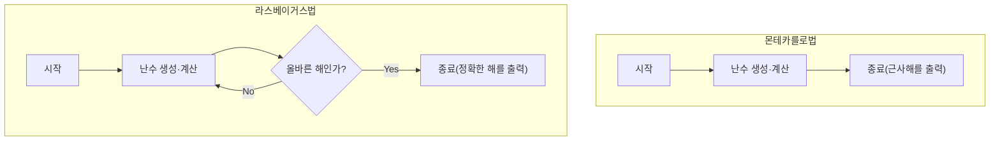

컴퓨터 사이언스에서 난수를 사용하여 문제를 푸는 알고리즘을 ** 확률적 알고리즘 ** (Randomized Algorithm)이라고 부릅니다. 난수를 사용함으로써 결정론적인 알고리즘(항상 같은 절차로 같은 결과를 반환하는 알고리즘)보다 고속으로 해를 얻을 수 있거나, 구현이 매우 심플해지는 케이스가 수없이 존재합니다.

그중에서도 대표적인 접근법이 ** 몬테카를로법 ** (Monte Carlo algorithm)과 ** 라스베이거스법 ** (Las Vegas algorithm)입니다. 이름은 둘 다 유명한 카지노의 도시에서 유래했지만 그 성질은 크게 다릅니다.

본 기사에서는 이 두 알고리즘의 구조, 구체적인 구현 예시, 그리고 양자의 차이에 대해 도해나 수식을 섞어가며 자세히 해설합니다.

## 1. 몬테카를로법 (Monte Carlo Algorithm)

몬테카를로법은 ** '실행 시간은 반드시 일정(유한)하지만 얻어지는 해가 확률적으로 틀릴 가능성이 있는' ** 알고리즘입니다. 틀릴 확률은 시행 횟수 $N$ 을 늘림으로써 얼마든지 작게 만들 수 있습니다.

### 특징
- ** 실행 시간 ** : 항상 결정론적인 상한이 있다.
- ** 정당성 ** : 일정한 확률로 잘못된 답을 반환할 가능성이 있다(근사해를 얻는 경우도 포함).

### 실행 시간과 정밀도의 트레이드오프
몬테카를로법의 가장 큰 강점은 실행 시간을 고정할 수 있다는 것입니다. 시뮬레이션이나 수치 계산에서 '1시간 이내에 가장 그럴싸한 결과를 내줬으면 좋겠다'라는 요구사항이 있을 경우 루프 횟수를 조정하는 것만으로 확실하게 시간 내에 결과를 얻을 수 있습니다.
단, 확률적으로 틀릴 리스크를 짊어지기 때문에 오판이 치명적인 시스템(예를 들어 절대로 실패해서는 안 되는 의료기기 제어나 금융 거래의 확정 처리 등)에는 단독으로 사용해서는 안 됩니다.

### 구체적 예시 1: 원주율 $\pi$ 의 근사 계산

몬테카를로법의 가장 유명한 예시는 원주율의 근사 계산입니다.
한 변의 길이가 2인 정사각형 안에 반지름이 1인 원이 내접하고 있다고 합시다. 정사각형의 넓이는 $2 \times 2 = 4$, 원의 넓이는 $\pi \times 1^2 = \pi$ 입니다.

이 정사각형 안에 무작위로 다트를 던져(점을 찍어) 원 안에 들어간 점의 비율을 구하면 그것은 넓이의 비 $\frac{\pi}{4}$ 에 근사됩니다.

찍은 점의 총수를 $N_{total}$ , 원 안에 들어간 점의 수를 $N_{in}$ 이라고 하면 다음 수식이 성립합니다.

$$
\frac{N_{in}}{N_{total}} \approx \frac{\pi}{4} \implies \pi \approx 4 \times \frac{N_{in}}{N_{total}}
$$

#### Python에 의한 구현 예시

```python
import random

def estimate_pi(num_samples: int) -> float:
    points_inside_circle = 0
    
    for _ in range(num_samples):
        # -1.0 에서 1.0 범위로 랜덤한 x, y 좌표를 생성
        x = random.uniform(-1.0, 1.0)
        y = random.uniform(-1.0, 1.0)
        
        # 원점으로부터의 거리가 1 이하이면 원의 안쪽
        if x**2 + y**2 <= 1.0:
            points_inside_circle += 1
            
    return 4 * points_inside_circle / num_samples

# 100만 번 시행
pi_approx = estimate_pi(1_000_000)
print(f"원주율의 근삿값: {pi_approx}")
```

시행 횟수 `num_samples` 를 늘릴수록 더 정밀도가 높은 $\pi$ 의 값을 얻을 수 있지만 절대로 정확한 값이 된다는 보장은 없습니다.

### 구체적 예시 2: 밀러-라빈 소수 판정법

거대한 수가 소수인지 여부를 고속으로 판정하는 알고리즘입니다. RSA 암호 등에서 키를 생성할 때 수백 자리의 소수가 필요해지는데, 이를 결정론적인 시험 나눗셈법($2, 3, 5, \dots$ 로 순서대로 나누어 가는 방법)으로 수행하면 우주의 수명이 다해도 끝나지 않습니다.

여기서 ** 밀러-라빈 소수 판정법 ** 이라는 몬테카를로법을 이용합니다.
판정하고 싶은 수 $n$ 에 대해 무작위로 기수 $a$ 를 선택하고, 페르마의 소정리의 확장에 기반한 특정 조건식을 만족하는지를 테스트합니다.

1번의 테스트에서 '합성수이다'라고 판정되면 그 수는 확실히 합성수입니다. 하지만 '소수일지도 모른다'라고 판정된 경우, 실제로는 합성수인데 소수라고 오판해 버릴 확률이 최대 $\frac{1}{4}$ 존재합니다.

그러나 이 테스트를 다른 무작위 $a$ 로 $k$ 번 반복하면 모두에서 오판할 확률은 $(\frac{1}{4})^k$ 가 됩니다. 예를 들어 $k=50$ 으로 설정하면 오판 확률은 $4^{-50}$ 이 되어 실용상으로는 '절대로 소수이다'라고 간주해도 문제없는 수준의 정밀도가 됩니다.

## 2. 라스베이거스법 (Las Vegas Algorithm)

라스베이거스법은 ** '얻어지는 해는 항상 100% 옳지만, 실행 시간이 확률적으로 변동하는(최악의 경우 무한히 끝나지 않을 가능성도 있는)' ** 알고리즘입니다.

### 특징
- ** 실행 시간 ** : 확률 변수이며, 운이 나쁘면 매우 시간이 걸린다.
- ** 정당성 ** : 알고리즘이 종료되었을 때 그 답은 반드시 옳다.

### 계산량의 편차와 기댓값
라스베이거스법의 강점은 '잘못된 결과를 내지 않는다'는 신뢰성입니다. 따라서 결과의 정확성이 절대적으로 필요한 상황에서 활약합니다.
그 대신 알고리즘이 종료될 때까지의 시간이 난수에 의존합니다. '기대되는 실행 시간(평균 계산량)'은 매우 작더라도 극히 운이 나쁜 경우에는 최악 계산량에 도달하거나 무한 루프에 빠질 이론적 가능성을 배제할 수 없습니다.
그러나 현실적으로는 '극단적으로 운이 나쁜 케이스'를 뽑을 확률은 천문학적으로 낮기 때문에 실용상으로는 결정론적 알고리즘보다 고속으로 동작하는 경우가 많아 널리 채용되고 있습니다.

### 구체적 예시 1: 난택 퀵 정렬 (Randomized QuickSort)

정렬 알고리즘의 대표격인 퀵 정렬에서 피벗(기준값)을 고르는 방법을 랜덤하게 하는 방법이 라스베이거스법의 전형적인 예시입니다.

통상적인 퀵 정렬에서는 항상 배열의 맨 끝 요소를 피벗으로 고르는 등의 고정된 전략을 취합니다. 그러나 이 경우 애초에 정렬된 배열이 주어지면 최악 계산량 $O(n^2)$ 이 되어 버립니다.

** 난택 퀵 정렬 ** 에서는 피벗을 배열 중에서 랜덤하게 고릅니다. 이로 인해 어떠한 입력 데이터에 대해서도 평균 계산량이 $O(n \log n)$ 이 됨이 수학적으로 보장됩니다. 출력되는 정렬 결과 자체는 항상 완전히 옳습니다.

만약 정렬 대상 배열이 수억 개의 요소가 있고 처음부터 거의 정렬되어 있는 경우 통상적인 퀵 정렬에서는 스택 오버플로나 계산 시간의 대폭적인 증가를 초래할 위험이 있습니다. 그러나 난택 퀵 정렬을 사용함으로써 의도적으로 최악의 케이스를 일으키는 악의적인 입력 데이터(DoS 공격의 일종)에 대해서도 안정적으로 고속의 퍼포먼스를 발휘할 수 있다는 강점이 있습니다. 이처럼 라스베이거스법은 보안이나 시스템의 견고성 향상에도 도움이 되는 것입니다.

#### Python에 의한 구현 예시

```python
import random

def randomized_quicksort(arr: list) -> list:
    if len(arr) <= 1:
        return arr
    
    # 피벗을 랜덤하게 선택
    pivot_idx = random.randint(0, len(arr) - 1)
    pivot = arr[pivot_idx]
    
    # 피벗 이외의 요소를 좌우로 분류
    left = [x for i, x in enumerate(arr) if x <= pivot and i != pivot_idx]
    right = [x for i, x in enumerate(arr) if x > pivot and i != pivot_idx]
    
    # 재귀적으로 정렬하여 결합
    return randomized_quicksort(left) + [pivot] + randomized_quicksort(right)

data = [3, 1, 4, 1, 5, 9, 2, 6, 5, 3, 5]
sorted_data = randomized_quicksort(data)
print(f"정렬 결과: {sorted_data}")
```

이 구현에서는 정렬 결과가 틀릴 일은 절대 없습니다. 단, 난수 뽑기 운이 극단적으로 나빠서 항상 최댓값이나 최솟값을 피벗으로 계속 고를 경우 계산 시간이 현저하게 증대됩니다.

### 구체적 예시 2: 해시표(해시 테이블)의 구축

또 다른 라스베이거스법의 예시로서 완전 해시 함수의 구축이 있습니다.
주어진 데이터 집합에 대해 충돌(다른 데이터가 같은 해시값이 되어버리는 것)이 일절 발생하지 않는 해시 함수를 만들고 싶다고 합시다.

이때 '랜덤하게 해시 함수를 골라 모든 데이터를 해시표에 배치해 본다. 만약 충돌이 1번이라도 발생하면 다른 해시 함수를 랜덤하게 다시 골라 처음부터 다시 한다'는 접근법을 취합니다.

이것은 충돌이 없는 완벽한 상태(올바른 해)를 얻을 때까지 반복하기 때문에 전형적인 라스베이거스법입니다. 이론상으로는 언제까지나 계속 충돌할지도 모르지만 적절한 해시 함수의 족(family)을 준비해 두면 몇 번의 시행으로 충돌이 없는 해시 함수를 찾을 수 있습니다.

## 3. 몬테카를로법과 라스베이거스법의 비교

2가지 알고리즘의 차이를 알기 쉽게 비교해 보겠습니다.

| 알고리즘 | 실행 시간 | 결과의 정확성 | 주요 용도 예시 |
| --- | --- | --- | --- |
| ** 몬테카를로법 ** | 항상 일정(상한 있음) | 확률적으로 틀릴 가능성이 있다 | 원주율 계산, 소수 판정, 물리 시뮬레이션 |
| ** 라스베이거스법 ** | 확률적으로 변동(최악 무한) | 항상 100% 옳다 | 난택 퀵 정렬, 해시표 구축 |

또한 양자는 각각 '시간'과 '정밀도' 중 어느 쪽을 고정할 것인가 하는 점에서 대극에 위치하고 있습니다. 몬테카를로법은 시간을 고정하고 정밀도를 희생하며, 라스베이거스법은 정밀도를 고정하고 시간을 희생하고 있다고 생각할 수 있습니다.

아래의 Mermaid 다이어그램은 양자의 흐름 차이를 시각적으로 표현한 것입니다.



몬테카를로법은 계산을 정해진 횟수만큼 하면 반드시 종료하지만, 라스베이거스법은 '올바른 해'를 얻을 때까지 시행을 반복하는 루프 구조를 가집니다.

## 4. 양자의 관계와 변환

흥미롭게도 상황에 따라서는 이 2가지 알고리즘을 상호 변환하는 것이 가능합니다.

### 라스베이거스법 $\rightarrow$ 몬테카를로법
라스베이거스법 알고리즘에 대해 ** '일정 시간이 경과하면 강제로 처리를 중단하고 적당한 값(또는 에러)을 반환한다' ** 는 제한을 둠으로써 몬테카를로법으로 변환할 수 있습니다.
이에 따라 실행 시간은 보장되지만 중단된 경우에는 잘못된 답을 반환하게 됩니다.

### 몬테카를로법 $\rightarrow$ 라스베이거스법
만약 몬테카를로법이 낸 답이 ** '올바른지 여부를 매우 고속으로 검증할 수 있다' ** 고 한다면 그것을 라스베이거스법으로 변환할 수 있습니다.
몬테카를로법을 실행하고 그 답을 검증기에 돌립니다. 틀렸다면 다시 몬테카를로법을 실행한다는 루프를 만들면 최종적으로 반드시 올바른 답을 출력하는(단 실행 시간은 알 수 없는) 라스베이거스법이 됩니다.

## 5. 정리

본 기사에서는 난수를 활용한 두 가지 강력한 알고리즘 패러다임에 대해 해설했습니다.

- ** 몬테카를로법 ** : 시간은 지키지만 가끔 실수를 한다. (예: 근사 계산, 소수 판정 등)
- ** 라스베이거스법 ** : 실수는 절대 안 하지만 가끔 시간을 안 지킨다. (예: 퀵 정렬, 해시표 구축 등)

실제 시스템 개발이나 데이터 과학 현장에서도 엄밀한 정확성이 요구되는지 아니면 실시간성(계산 시간의 상한)이 요구되는지에 따라 어느 쪽 접근법을 채용해야 할지가 달라집니다. 때로는 양자를 하이브리드한 접근법이 채용되는 경우도 있습니다.

난수는 단순한 '랜덤한 값'이 아니라 컴퓨터 사이언스에 있어서 강력한 툴입니다. 결정론적 알고리즘으로는 해결하기 어려운 문제에 직면했을 때에는 꼭 ** 확률적 알고리즘 ** 의 이용을 검토해 보시기 바랍니다.
