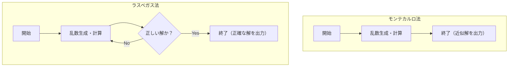

コンピュータサイエンスにおいて、乱数を用いて問題を解くアルゴリズムを **確率的アルゴリズム** (Randomized Algorithm) と呼びます。乱数を使うことで、決定論的なアルゴリズム（常に同じ手順で同じ結果を返すアルゴリズム）よりも高速に解を得られたり、実装が非常にシンプルになったりするケースが数多く存在します。

中でも代表的なアプローチが **モンテカルロ法** (Monte Carlo algorithm) と **ラスベガス法** (Las Vegas algorithm) です。名前はどちらも有名なカジノの街に由来していますが、その性質は大きく異なります。

本記事では、これら2つのアルゴリズムの仕組み、具体的な実装例、そして両者の違いについて、図解や数式を交えて詳しく解説します。

## 1. モンテカルロ法 (Monte Carlo Algorithm)

モンテカルロ法は、 **「実行時間は必ず一定（有限）だが、得られる解が確率的に間違っている可能性がある」** アルゴリズムです。間違える確率は、試行回数 $N$ を増やすことでいくらでも小さくすることができます。

### 特徴
- **実行時間**: 常に決定論的な上限がある。
- **正当性**: 一定の確率で誤った答えを返す可能性がある（近似解を得る場合も含む）。

### 実行時間と精度のトレードオフ
モンテカルロ法の最大の強みは、実行時間を固定できることです。シミュレーションや数値計算において、「1時間以内に一番もっともらしい結果を出してほしい」という要件がある場合、ループ回数を調整するだけで確実に時間内に結果を得ることができます。
ただし、確率的に誤るリスクを背負うため、誤判定が致命的になるシステム（例えば、絶対に失敗してはいけない医療機器の制御や金融取引の確定処理など）には単体で用いるべきではありません。

### 具体例1：円周率 $\pi$ の近似計算

モンテカルロ法の最も有名な例は、円周率の近似計算です。
1辺の長さが 2 の正方形の中に、半径 1 の円が内接しているとします。正方形の面積は $2 \times 2 = 4$、円の面積は $\pi \times 1^2 = \pi$ です。

この正方形の中にランダムにダーツを投げ（点を打ち）、円の中に入った点の割合を求めると、それは面積の比 $\frac{\pi}{4}$ に近似されます。

打った点の総数を $N_{total}$ 、円の中に入った点の数を $N_{in}$ とすると、以下の数式が成り立ちます。

$$
\frac{N_{in}}{N_{total}} \approx \frac{\pi}{4} \implies \pi \approx 4 \times \frac{N_{in}}{N_{total}}
$$

#### Pythonによる実装例

```python
import random

def estimate_pi(num_samples: int) -> float:
    points_inside_circle = 0
    
    for _ in range(num_samples):
        # -1.0 から 1.0 の範囲でランダムな x, y 座標を生成
        x = random.uniform(-1.0, 1.0)
        y = random.uniform(-1.0, 1.0)
        
        # 原点からの距離が1以下なら円の内側
        if x**2 + y**2 <= 1.0:
            points_inside_circle += 1
            
    return 4 * points_inside_circle / num_samples

# 100万回試行
pi_approx = estimate_pi(1_000_000)
print(f"円周率の近似値: {pi_approx}")
```

試行回数 `num_samples` を増やすほど、より精度の高い $\pi$ の値が得られますが、絶対に正確な値になる保証はありません。

### 具体例2：ミラー・ラビン素数判定法

巨大な数が素数であるかどうかを高速に判定するアルゴリズムです。[RSA](https://kenji.blog/p/modern-cryptography-public-key-hash-signature/)暗号などで鍵を生成する際、数百桁の素数が必要になりますが、これを決定論的な試し割り法（$2, 3, 5, \dots$ で順番に割っていく方法）で行うと宇宙の寿命が尽きても終わりません。

ここで **ミラー・ラビン素数判定法** というモンテカルロ法を利用します。
判定したい数 $n$ に対して、ランダムな基数 $a$ を選び、[フェルマーの小定理](https://kenji.blog/p/fermats-little-theorem/)の拡張に基づく特定の条件式を満たすかをテストします。

1回のテストで「合成数である」と判定されたら、その数は確実に合成数です。しかし「素数かもしれない」と判定された場合、本当は合成数なのに素数と誤判定してしまう確率が最大で $\frac{1}{4}$ 存在します。

しかし、このテストを異なるランダムな $a$ で $k$ 回繰り返せば、すべてで誤判定する確率は $(\frac{1}{4})^k$ となります。たとえば $k=50$ に設定すれば、誤判定の確率は $4^{-50}$ となり、実用上は「絶対に素数である」と見なして問題ないレベルの精度になります。

## 2. ラスベガス法 (Las Vegas Algorithm)

ラスベガス法は、 **「得られる解は常に100%正しいが、実行時間が確率的に変動する（最悪の場合は無限に終わらない可能性もある）」** アルゴリズムです。

### 特徴
- **実行時間**: 確率変数であり、運が悪いと非常に時間がかかる。
- **正当性**: アルゴリズムが終了したとき、その答えは必ず正しい。

### 計算量のばらつきと期待値
ラスベガス法の強みは「間違った結果を出さない」という信頼性です。そのため、結果の正確性が絶対に必要な場面で活躍します。
その代わり、アルゴリズムが終了するまでの時間が乱数に依存します。「期待される実行時間（平均計算量）」は非常に小さくても、極めて運が悪い場合には最悪計算量に達したり、無限ループに陥る理論的可能性を排除できません。
しかし、現実的には「極端に運が悪いケース」を引く確率は天文学的に低いため、実用上は決定論的アルゴリズムよりも高速に動作することが多く、広く採用されています。

### 具体例1：乱択[クイック[ソート](https://kenji.blog/p/sorting-algorithms/)](https://kenji.blog/p/sorting-algorithms/) (Randomized QuickSort)

[[ソート](https://kenji.blog/p/sorting-algorithms/)アルゴリズム](https://kenji.blog/p/sorting-algorithms/)の代表格である[クイック[ソート](https://kenji.blog/p/sorting-algorithms/)](https://kenji.blog/p/sorting-algorithms/)において、ピボット（基準値）の選び方をランダムにする方法がラスベガス法の典型例です。

通常の[クイック[ソート](https://kenji.blog/p/sorting-algorithms/)](https://kenji.blog/p/sorting-algorithms/)では、常に配列の末尾の要素をピボットに選ぶなどの固定の戦略をとります。しかし、この場合、元から[ソート](https://kenji.blog/p/sorting-algorithms/)済みの配列を与えられると最悪計算量 $O(n^2)$ となってしまいます。

**乱択[クイック[ソート](https://kenji.blog/p/sorting-algorithms/)](https://kenji.blog/p/sorting-algorithms/)** では、ピボットを配列の中からランダムに選びます。これにより、どのような入力データに対しても、平均計算量が $O(n \log n)$ になることが数学的に保証されます。出力される[ソート](https://kenji.blog/p/sorting-algorithms/)結果自体は常に完全に正しいです。

もし[ソート](https://kenji.blog/p/sorting-algorithms/)対象の配列が数億要素あり、かつ最初からほとんど[ソート](https://kenji.blog/p/sorting-algorithms/)されている場合、通常の[クイック[ソート](https://kenji.blog/p/sorting-algorithms/)](https://kenji.blog/p/sorting-algorithms/)ではスタックオーバーフローや計算時間の大幅な増加を招く危険があります。しかし、乱択[クイック[ソート](https://kenji.blog/p/sorting-algorithms/)](https://kenji.blog/p/sorting-algorithms/)を用いることで、意図的に最悪ケースを引き起こすような悪意のある入力データ（DoS攻撃の一種）に対しても、安定して高速なパフォーマンスを発揮できるという強みがあります。このように、ラスベガス法はセキュリティやシステムの堅牢性向上にも役立つのです。

#### Pythonによる実装例

```python
import random

def randomized_quicksort(arr: list) -> list:
    if len(arr) <= 1:
        return arr
    
    # ピボットをランダムに選択
    pivot_idx = random.randint(0, len(arr) - 1)
    pivot = arr[pivot_idx]
    
    # ピボット以外の要素を左右に振り分け
    left = [x for i, x in enumerate(arr) if x <= pivot and i != pivot_idx]
    right = [x for i, x in enumerate(arr) if x > pivot and i != pivot_idx]
    
    # 再帰的にソートして結合
    return randomized_quicksort(left) + [pivot] + randomized_quicksort(right)

data = [3, 1, 4, 1, 5, 9, 2, 6, 5, 3, 5]
sorted_data = randomized_quicksort(data)
print(f"ソート結果: {sorted_data}")
```

この実装では、[ソート](https://kenji.blog/p/sorting-algorithms/)結果が間違っていることは絶対にありません。ただし、乱数の引きが極端に悪く、常に最大値や最小値をピボットに選び続けてしまった場合、計算時間が著しく増大します。

### 具体例2：ハッシュ表（[ハッシュテーブル](https://kenji.blog/p/search-algorithms-linear-binary-hash-table-principles/)）の構築

もう一つのラスベガス法の例として、完全ハッシュ関数の構築があります。
与えられたデータの集合に対して、衝突（異なるデータが同じハッシュ値になってしまうこと）が一切発生しないハッシュ関数を作りたいとします。

このとき、「ランダムにハッシュ関数を選び、すべてのデータをハッシュ表に配置してみる。もし衝突が1回でも発生したら、別のハッシュ関数をランダムに選び直して最初からやり直す」というアプローチをとります。

これは、衝突がない完璧な状態（正しい解）が得られるまで繰り返すため、典型的なラスベガス法です。理論上はいつまでも衝突し続けるかもしれませんが、適切なハッシュ関数の族を用意しておけば、数回の試行で衝突のないハッシュ関数を見つけることができます。

## 3. [モンテカルロ法とラスベガス法](https://kenji.blog/p/monte-carlo-and-las-vegas-algorithms/)の比較

2つのアルゴリズムの違いを分かりやすく比較してみましょう。

| アルゴリズム | 実行時間 | 結果の正確性 | 主な用途の例 |
| --- | --- | --- | --- |
| **モンテカルロ法** | 常に一定（上限あり） | 確率的に間違える可能性がある | 円周率の計算、素数判定、物理シミュレーション |
| **ラスベガス法** | 確率的に変動（最悪無限） | 常に100%正しい | 乱択[クイック[ソート](https://kenji.blog/p/sorting-algorithms/)](https://kenji.blog/p/sorting-algorithms/)、ハッシュ表の構築 |

また、両者はそれぞれ「時間」と「精度」のどちらを固定するかという点で対極に位置しています。モンテカルロ法は時間を固定して精度を犠牲にし、ラスベガス法は精度を固定して時間を犠牲にしていると考えることができます。

以下の Mermaid 図は、両者のフローの違いを視覚的に表現したものです。



モンテカルロ法は計算を決められた回数行えば必ず終了しますが、ラスベガス法は「正しい解」が得られるまで試行を繰り返すループ構造を持ちます。

## 4. 両者の関係と変換

興味深いことに、状況によってはこれら2つのアルゴリズムを相互に変換することが可能です。

### ラスベガス法 $\rightarrow$ モンテカルロ法
ラスベガス法のアルゴリズムに対して **「一定の時間が経過したら、強制的に処理を打ち切って適当な値（またはエラー）を返す」** という制限を設けることで、モンテカルロ法に変換できます。
これにより、実行時間は保証されますが、打ち切られた場合は誤った答えを返すことになります。

### モンテカルロ法 $\rightarrow$ ラスベガス法
もし、モンテカルロ法が出した答えが **「正しいかどうかを非常に高速に検証できる」** のであれば、それをラスベガス法に変換できます。
モンテカルロ法を実行し、その答えを検証機にかけます。間違っていたら再度モンテカルロ法を実行する、というループを作れば、最終的に必ず正しい答えを出力する（ただし実行時間は読めない）ラスベガス法になります。

## 5. まとめ

本記事では、乱数を活用した2つの強力なアルゴリズムパラダイムについて解説しました。

- **モンテカルロ法** : 時間は守るが、たまにミスをする。（例：近似計算、素数判定など）
- **ラスベガス法** : ミスは絶対にしないが、たまに時間を守らない。（例：[クイック[ソート](https://kenji.blog/p/sorting-algorithms/)](https://kenji.blog/p/sorting-algorithms/)、ハッシュ表の構築など）

実際のシステム開発やデータサイエンスの現場でも、厳密な正確性が求められるのか、それともリアルタイム性（計算時間の上限）が求められるのかによって、どちらのアプローチを採用すべきかが変わってきます。時には両者をハイブリッドさせたアプローチが採用されることもあります。

乱数はただの「ランダムな値」ではなく、計算機科学において強力なツールです。決定論的アルゴリズムでは解決が難しい問題に直面したときには、ぜひ **確率的アルゴリズム** の利用を検討してみてください。

