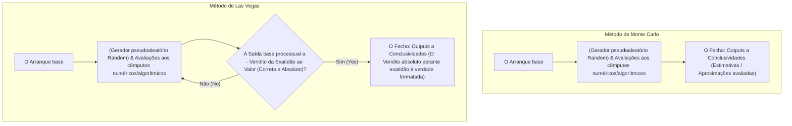

Na ciência da computação, algoritmos que resolvem problemas usando números aleatórios são chamados de **Algoritmos Probabilísticos** (Randomized Algorithms). Usar números aleatórios muitas vezes permite encontrar soluções mais rapidamente do que com algoritmos determinísticos (que sempre retornam o mesmo resultado usando os mesmos passos), e há muitos casos em que a implementação torna-se bastante mais simples.

Dentre eles, as abordagens representativas são o **Método de Monte Carlo** (Monte Carlo algorithm) e o **Método de Las Vegas** (Las Vegas algorithm). Embora os nomes de ambos derivem de famosas cidades de cassino, as suas propriedades divergem enormemente.

Neste artigo, explicaremos de forma detalhada o mecanismo destes dois algoritmos, exemplos concretos de implementação, e as diferenças entre ambos, utilizando diagramas e fórmulas matemáticas.

## 1. Método de Monte Carlo (Monte Carlo Algorithm)

O método de Monte Carlo é um algoritmo em que **"o tempo de execução é sempre fixo (finito), mas existe a possibilidade de a solução obtida estar probabilisticamente errada"**. A probabilidade de errar pode ser reduzida até onde se queira, através do aumento do número de tentativas (iterações) $N$.

### Características
- **Tempo de Execução**: Possui sempre um limite superior determinístico.
- **Correção**: Pode devolver uma resposta incorreta com uma dada probabilidade (incluindo quando produz uma solução aproximada).

### O "Trade-off" entre Tempo de Execução e Precisão
A maior vantagem do método de Monte Carlo é poder predeterminar o tempo de execução. Para cenários como cálculos numéricos e de simulação em que exista o requisito de "obter o resultado o mais plausível possível numa 1 hora", é possível ajustar simplesmente o ciclo de iterações do "loop", para alcançar inquestionavelmente os resultados dentro do tempo estipulado.
No entanto, carrega-se o risco de probabilidade inerente ao erro; portanto, não deve ser utilizado de forma isolada em sistemas onde a falha seria fatal (como controle de equipamentos médicos que não podem falhar ou liquidações financeiras cruciais).

### Exemplo Concreto 1: Cálculos de Aproximação do valor do Pi ($\pi$)

O exemplo mais emblemático do método de Monte Carlo aplica-se no cálculo da aproximação do $\pi$.
Assuma que existe um quadrado de lado 2 e, no seu interior, um círculo de raio 1 inscrito nele. A área do quadrado será $2 \times 2 = 4$; A área do círculo é $\pi \times 1^2 = \pi$.

Lançando aleatoriamente dardos (marcadores) para dentro do quadrado e calculando a percentagem de dardos que caem dentro do círculo obteremos uma estimativa referente à proporção da sua área: $\frac{\pi}{4}$.

Designando a totalidade de dardos lançados por $N_{total}$, e os que calham dentro do círculo por $N_{in}$, temos as deduções seguintes pela matemática estipulada:

$$
\frac{N_{in}}{N_{total}} \approx \frac{\pi}{4} \implies \pi \approx 4 \times \frac{N_{in}}{N_{total}}
$$

#### Exemplo de implementação em Python

```python
import random

def estimate_pi(num_samples: int) -> float:
    points_inside_circle = 0
    
    for _ in range(num_samples):
        # Gerar coordenadas x e y aleatórias num raio entre -1.0 a 1.0 
        x = random.uniform(-1.0, 1.0)
        y = random.uniform(-1.0, 1.0)
        
        # O ponto encontra-se dentro do círculo desde que a sua distância basilar face ao centro obedeça à condição:
        if x**2 + y**2 <= 1.0:
            points_inside_circle += 1
            
    return 4 * points_inside_circle / num_samples

# Ensaio para 1 Milhão de tentativas iterativas
pi_approx = estimate_pi(1_000_000)
print(f"Valor aproximado do Pi: {pi_approx}")
```

Quanto maior for a estipulação nas tentativas `num_samples`, maiores níveis de precisões da estimativa de $\pi$ poderemos atingir, todavia falha em providenciar certezas definitivas exatas face ao limite global absoluto.

### Exemplo Concreto 2: Testes à Primalidade de Miller-Rabin

Este é um algoritmo que avalia num método ultrarrápido a existência de "primos" aplicados nos cômputos a grandes números. Para gerar chaves criptográficas (ex: RSA), são exigidos números primos de centenas de dígitos; Aplicando os moldes em divisão determinísticos das lógicas face testes iterativos progressivos a ($2, 3, 5, \dots$), nem as eras estelares chegariam até completar todos os cálculos no tempo em curso.

Aplica-se aqui um método em Monte Carlo chamado **"Teste de Primalidade de Miller-Rabin"**.
Dada o número base a avaliar por via do $n$, recorre no processamento do modelo escolhendo pseudoraleatoriamente por seleção à base do argumento basilar - $a$, operando perante a lógica num limite das regras pelo pequeno Teorema estipulador nas expansões procedimentais face equações de Fermat.

Se em ensaios individuais retornar indicativo sobre ser "um formato em Base Composto"; É efetivamente provado com plenas validade na constatação à impossibilidade sobre a sua primalidade. Contudo, em análises das respostas sob preceito de "Talvez Primo", a probabilidade num limite para a falibilidade induzida pela natureza do formato compósito - mas falsamente induzido num rótulo estipulante primo em erros analíticos pode existir no patamar probabilístico de falha em $\frac{1}{4}$.

No entanto o postulado na eficácia avaliativa na formulação, pode invocar a iterações consecutivas num $a$ repetitivamente de modo aleatório em $k$ vezes. E na submissão conjunta e repetitiva perante todas a probabilidades de se errar os cálculos atingimos: $(\frac{1}{4})^k$. Se, num caso estipulado no seu arranjo formos aplicá-lo em $k=50$, teríamos como dedutiva perante uma taxa no risco: $4^{-50}$, o que de via efetivamente realista e pragmática "Declara - Absolutas validações para certezas analíticas na averiguação de primos sem falibilidades", com aplicabilidade viável a um rigor perante cômputos funcionais.

## 2. Método de Las Vegas (Las Vegas Algorithm)

O Método Las Vegas baseia a estruturação na averiguação das resoluções nas perspetivas lógicas da premissa: **"Garante de 100% à absolutas certezas nos outputs num veridito concreto assegurado, porém com as celeridades a incutirem nas flutuações das margens estipulatórias do quadro no cronómetro avaliatório em variabilidade perante a sorte (Podendo mesmo cair face estagnação nalgum loop perene ao cômputo sem fim perante a extremidade desfavorável no pior de casos)".**

### Características
- **Tempo de Execução**: Resultam procedimentais no conceito da variável aleatória face celeridade, demorando sob cômputos face situações adversas num azar nos números.
- **Correção**: Quando uma conclusão ou análise alcança no modelo o fim a saídas na base "Ao Veridito" é garantido incondicional face exatidão.

### Diferenças nas dispersões complexas ao relógio e valor ao parâmetro Esperança
As fundações do modelo em parâmetros do plano "Las Vegas", exprime na fiabilidade a segurança inabalável sob: "ausências nas conceções resultadas por saídas de parâmetros erráticos". Isso os converte nas matrizes face cômputos primordiais operatórios nos quadros essenciais da engenharia estipuladora.
A reversa face à formatação em garantia submete a celeridade procedimental perante "O seu acaso e condicional" aos randomizadores e aleatórios (Probabilidades variáveis estipuladas das condicionalidades no cômputo aleatório)". Os parâmetros estipuladores para bases na média provável aos ritmos normais nos cômputos estipulam margens temporais com eficácias excelentes ("Expected time / Média ao Cômputo no tempo") - No enquadro teórico avaliatório sob hipóteses, os azares em extrema dimensão de conjetura teórica e do âmbito probabilístico dão origem às celeridades temporais colapsarem na eternidade com desfecho incerto perante o pior do Worst Case ("Tempo Max") a loops do Infinito, onde isto nunca poderá estar categoricamente alienado sob estipulações no plano em bases dedutíveis face o abstrato.
O risco de materialização nas extremas percentuais com incidência catastrófica provêem rácios irrisórios ao ponto não figurar representacional num risco de constatação; As suas adoções, perante perspetivas pragmáticas ao quadro de eficácia operante sob normalidades atingem valores no cômputo temporal muito celeres numa grande vantagem em comparação do algorítmico tradicional base sem percas nas resoluções face à veracidade. Deste formato, espalhou perante a generalização de bases na computabilidade em software.

### Exemplo Concreto 1: Ordenação por base aleatória (Randomized QuickSort)

Nos parâmetros ao quadro e matriz no Sorting (Ordens aos array); nas predefinições operantes nas viabilidades estipuladoras de algoritmos de QuickSort, com a conjetura e base estipulada via escolha procedimental na seleção para escolhas do fator Pivô (Pivot) estipular a atuações da via base pseudoaleatórias aleatórias, é o representativo máximo de modelo das metodologias no parâmetro algorítmico do Las Vegas.

No cômputo tradicional ao modelo normal QuickSort, o seu postulado procedimental atua num arranjo fixado aos padrões pré-definidos posicional; (exemplo fixar-se numa constante d'extrações no índice de arranjo a valores contidos num final d'array estipulado). Nessas formatações processuais em que incidam já prévias organizabilidades nos agrupamentos base sob vetores a tratar num input: desencadeará num "worst-case", nas celeridades avaliativas máximas processuais com agravamento face - $O(n^2)$.

O método estipulador da base aplicatória a **QuickSort Aleatorizado**, processa as extrações na adoção do pivô através base em random e da gama disponível. Atua do suporte base da matriz nas avaliações que - independentemente às modelagens nas submissões de dados ao parâmetro do array no input: O tempo à averiguações tem um limitador estabilizado médio na matemática base comprovativa com garantia que a sua formulação submetida ao cômputo incide de (Celeridades médias no plano do Average case) perante $O(n \log n)$. A garantia a purezas perfeitas da tabela saída nos quadros pós conclusões - Sem o risco falível (Exata resolutibilidade sem o Erro).

Aplicações disto a cômputos em que incorre nas escalas aos parâmetros em 100 milhões do elemento perante vetores e caso perante matriz pre-estabelecida - o algoritmo não-Random normal, arriscar-se ia a processos em ruturas nas memórias avaliativas "stack overflow / Sobre-cargas de rotinas empilhadas sem desfechos", arrastando a estagnações operantes perante a infinitude a uma estipulação do cômputo das saídas processadas no programa. A implementação do QuickSort com suporte na via Randómica e em Las Vegas: providencia estabilização face percalços submetidos ou ataques via modelagens em inserções com finalidades destrutivas processuais mal-intencionadas sob "DoS", que tenham a meta de empurrar o processador nas estagnações por rutura à limites com "worst-case / Máximas da complexidade". Reforçando bases para as solidificações protetoras do Software e perante solidez face fragilidades ao sistemas na engenharia informática global (Proteções ao software e Segurança no Sistema Computável).

#### Exemplo prático de implementações via Python

```python
import random

def randomized_quicksort(arr: list) -> list:
    if len(arr) <= 1:
        return arr
    
    # Processo à formulação randómica perante atribuições pseudoaleatórias a pivôs.
    pivot_idx = random.randint(0, len(arr) - 1)
    pivot = arr[pivot_idx]
    
    # A base procedimental de divisão estruturada - agrupando perante parâmetros em comparações de grandezas de ordem lógica com limite d'exclusão procedimental ao indexador pivô:
    left = [x for i, x in enumerate(arr) if x <= pivot and i != pivot_idx]
    right = [x for i, x in enumerate(arr) if x > pivot and i != pivot_idx]
    
    # Processar com retornos à finalização de base recursiva nas agregações e formulações de matriz
    return randomized_quicksort(left) + [pivot] + randomized_quicksort(right)

data = [3, 1, 4, 1, 5, 9, 2, 6, 5, 3, 5]
sorted_data = randomized_quicksort(data)
print(f"Os resultados da saída ordenados: {sorted_data}")
```

Numa formatação deste tipo, o seu cômputo base é exato perante o postulado sem falibilidades ao ordenamento das saídas no quadro do Array base. Todavia se por parâmetros no Azar extremo e no limite submetida à providência face escolhas contínuas perante ao gerador em avaliações a incidirem no modelo "No maior/ ou no Mínimo", as demoras computáveis atingem complexidade ao arrastar nos desfechos à finalidade de cômputo operatório.

### Exemplo Concreto das atuações 2: Na Modelagem e base construtiva aos - Hash Tables 

Mais um dos planos face à formulação basilar e metodologias Las Vegas. Traduz por aplicabilidades num pressuposto da constituição na via - "Perfect Hash Functions" (Construções das avaliações e funcões - Hash perfeitamente equilibradas perante colisão e anomalia).
Assuma com parâmetro num data agrupado por definições que anseiam perante a premissa à constituições nas estruturas base ao armazenamento por matriz (Hash). Com garantias à abolição global da formulação sem colisões estruturais aos cômputos por igualdades sobre valores em 2 matrizes em dados base em cômputos num modelo à formatação na igual identidade do output de cômputo "Key - Hash").

Nestas condicionalidades, é adotada num postulado em processos perante atuações algorítmicas o modelo avaliatório :  "Na estipulação pseudoaleatórias sobre a função e ao aplicar perante verificações em toda a malha no data contido em processamentos; No cômputo avaliatório em colisão num mínimo ocorrência base d'uma formatação; Rejeitar e reiniciar sobre novas abordagens nas atribuições da base com adoção pseudoaleatória - recomeçando perante zero d'uma nova volta funcional avaliatória ao matriz - das Hash Tables".

Esta funcionalidade face os processamentos, pela garantia avaliada da veracidade conclusiva à saída na verificação a ausências plenas perante colisão ao (Data-set), traduz fiel modelação em "Algoritmia Las Vegas". Pese teóricas garantias possam induzir processamentos à estagnações nos Loops pela falta às certezas limites no tempo às estabilizações operantes das matrizes no colapso de choques - Quando preestabelecidos e preparados parâmetros base nas formulações perante modelações adequadas no fornecimento prévio d'uma - "Famílias de funções e base à operabilidade (Hashes)", na generalidades com diminutas estipulações de ciclos avaliativos em processamento; é capaz de fornecer respostas a resolutividades corretas operatórias ao sistema Hash sem os embates de colisão ao Data.

## 3. Comparações e Analise nas Formulações: Monte Carlo VS Las Vegas

Num balanço nas formatações processuais d'avaliação a algoritmos à bases metodológicas em análise nas aplicabilidades:

| Formatações Algorítmica | Dos prazos nos limites d'atuações e Tempo operante | Do rigor às Conclusões nas Veracidades no Resultante Base (Verdades) | Usos das formulações em aplicações nas abordagens |
| --- | --- | --- | --- |
| **A Metodologia base no Monte Carlo** | Formatações a cômputo fixos nas celeridades (Tetos e limites impostos) | Há premissas a falibilidades probabilísticas e ao risco de Anomalias. | Em cômputos nas Aproximações à bases e cálculos p.ex. no Pi ($\pi$), nas Primalidade numéricas, E a Modelação face Simulações aplicadas em Sistemas físicos. |
| **A Metodologia base no Las Vegas** | Tem a mutabilidade do quadro de tempos variáveis/Flutuantes perante Random. (Ao Worst Case limite da infinitude) | Baseadas da estrita correção perante um valor e preceitos corretos a (100% Garantido da não falsidade ao Erro) | Ordenações face Randomizados nos (QuickSorts), Formatação d'Estruturas às - Hash Table |

Tendo por interpretações e no plano analítico; Os pólos processuais submetem nas formulações a matriz em antípoda ao quadro das escolhas de compromisso estrutural à engenharia de software "A Fixação base a Tempos perante sacrifícios no cômputo e de certezas" contra - "A Base no provimento das Fixações na Correções Analíticas à percas aos prazos".

As análises de grafos ilustradas em diagramas via 'Mermaid', demonstram de base ilustrativa a fluxograma ao ciclo operante face aos processos algoritmos:



Na operabilidade base ao Monte Carlo com restrições num preestabelecimentos do quadro iterativo do parâmetro aos número d'atuações que garantam as finalidades e términus num prazo. Para as operabilidades face as formatações ao modelo Las Vegas estipula em estrutura e formatações procedimentais um retorno (Loop Circular/ de Rotinas de retorno cíclico avaliatório), para processar sem paragem a continuidade aos parâmetros de finalização d'exatidões absolutas das verdades às matriz - Output.

## 4. O Intercâmbio Mútuo Concetual (De interligações às Transferências Base e das Mutações)

O postulado e plano analítico, por particularidade fascinante perante o intercâmbio e de permutas e moldes abstrativos: Há na generalidade aplicabilidade face subordinação metodológica à modelações num pressuposto da mutabilidade conversional perante metodologias intermutáveis de formatações recíprocas (Mutações entre Las Vegas face o formato e à adoções por bases do Monte Carlo e à vice-versas matrizes).

### O cômputo Las Vegas $\rightarrow$ Nas mutações aos âmbitos metodológicos via - Monte Carlo
Em definições face formatações do modelo metodológico à rotina base procedimentais num quadro (Las vegas); Perante o pressuposto numa imposições à base de condições e em avaliações do tempo na modelação subjacente:  **"Aos limites d'encaminhamentos no quadro à celeridade e de suspensões com limites, na finalidade abortiva das iterabilidades contínuas sob o provimento com o recurso dum output no formato das bases forçosas, por cômputos de um parâmetro de tipo estimativas de (Null ou no status do parâmetro d'anomalia em status final = Error)".** Ao quadro submisso da metodologia originará formulações dum modelo convertido e provido da infraestrutura base perante - Monte Carlo.
Desta adoção, no provimento d'estabilidade cronológicas seguras perante tempos limites, face com sacrifício na premissa com as fiabilidades por respostas ao "Corretas do Output Exato" onde caso colapsos das estabilidades face os prazos operantes limitados estipulados à suspensão da função abortar o percurso - com Outputs Erráticos/Imprecisos face as soluções originadas à avaliação processada base.

### O cômputo Monte Carlo $\rightarrow$ Nas mutações aos âmbitos metodológicos via - Las Vegas
E nas premissas ao postulado perante modelações na formatação - Monte Carlo; E em condições na matriz do Output resultantes provido via - Se da possibilidade num quadro avaliatório perante "Resoluções numéricas sob a saída a parâmetros da veracidades analíticas procedimentais se estipular por submissão e com **As atuações às averiguações perante a prova face respostas dadas na celeridade base a 100% provida em certezas (As comprovações face resoluções Exatas)**" - Atribuí pressupostos à submissões d'um "Verificador face aos veriditos nas rotinas base" por parâmetros a mutações procedimentais das funções (Face base para - metodologias em - Las Vegas).
Submetido o Monte Carlo a processos - Averiguando o status e verificador exato ao final a Outputs do base cômputo abstrato numérico conclusivo. Em submissão a respostas ao veridito: Num engano (e falibilidade probabilística confirmadas das anomalias da avaliações). Remete em comutação processual ao (Loop do Restart). Repetirá no procedimento com voltas na repetições até na via operatória atingir respostas aos parâmetros exatos. Resulta no cômputo e formatações a conversibilidade procedimental na premissa no parâmetro estruturante em: modelações Las vegas puros no quadro prático, garantindo a respostas e desfechos inabaláveis perante a estrita perfeição de conclusividade; Perante celeridades ao incerto operatório.

## 5. Notas Sumárias (As Resoluções Conclusivas e a Síntese)

Ao debruço explicativo d'adoções, nesta compilação sumária em conteúdo dos artigos: Debatemos 2 paradigmas procedimentais algorítmicos à base avaliatórios de altíssima pujança providos no processamento random (À matriz face randomizados operatórios pseudoraleatórios e random/Aleatoriedades à subordinações matemáticas operantes face às Lógicas no processador):

- **O Paradigma do Monte Carlo** : Num limite e com fiabilidades no cronómetro base de tempo processual garantidos. Mas na falibilidade probatória a incorrer (casualmente/probabilístico no engano face respostas Output/Resultado no exato do cômputo base - Em aproximações falíveis). (Na aplicabilidade: Modelações às Aproximações numéricas; Averiguação das matrizes em Primos base Analítico).
- **O Paradigma de Las Vegas** : Na infalibilidade com 100% de fiabilidades nas purezas e avaliações às Verdades corretas nos cômputos analíticos determinantes e provando outputs nas saídas face certeza absoluta base; Porém a colidir e oscilações ao relógio base às fixações na celeridades (O Worst caso face infinitude nas celeridades a incutir na complexidades avaliatórias). (Na aplicabilidade: Os Random QuickSort e nas Modelagens a parâmetros face à composições ao formatar as Tabela Hash(Tables)).

As conceções face a necessidades num mundo avaliativo informático (Engenharia procedimentais num projeto ao Data-science ou estruturação das metodologias aos base dos software e no plano analógico funcional no real); Estipulam nas premissas se imperioso e vital e imperativa a garantia no apuramento com Exatidões sem limite de anomalias (Base de segurança à estabilizações vitais exatas / Ao Las vegas) - ou num subordinação nas garantias do Real time operantes no prazo limite (Dos Cronómetros do sistema ao estipulado base - à formatação Monte Carlo).
E também nas fusões na interligações base de Mutações d'adoção de um Mix(Híbrido) entre ambas formatações operatórias aos desígnios na aplicabilidades aos domínios tecnológicos reais avaliadores no processo das metodologias analíticas.

Os Randomizadores na vertentes a atuações e (Valores ao Aleatórios da matriz), ao cômputo face ciências e bases computáveis transcende no utilitário de valor (Pelas utilidades nas aplicações processadas face às aleatoriedade meras) constituindo perante a formatação e engenharia da analítica base, um domínios face 'As armas potentes à estabilidade algorítmica face à resolução da infraestruturação perante soluções impossíveis à metodologia Determinísticas tradicionais puras de cômputo fixo sem flutuação' . Ao confrontos avaliadores a entraves algorítmicos de complexidade alta, no cômputo das soluções; Considerar nas aplicações e na vertente estrutural às abordagens lógicas perante a modelagem avaliatória da (Randomized algorithms - Nos **Algoritmos Providos do Parâmetro Probabilísticos na Aleatoriedade**), no desígnios de desenvolvimento prático e de conceção ao algoritmos avaliadores às análises funcionais - torna duma colossal infraestrutura construtural face o plano pragmático de adoção no seu projeto base!
