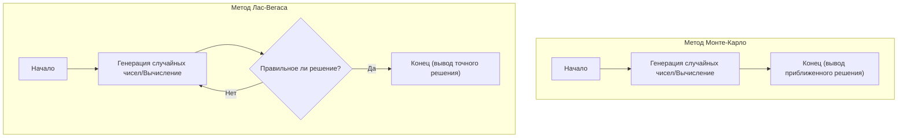

В информатике алгоритмы, которые используют случайные числа для решения проблем, называются **вероятностными алгоритмами** (Randomized Algorithm). Существует множество случаев, когда использование случайных чисел позволяет получить решение быстрее, чем при использовании детерминированных алгоритмов (которые всегда выдают один и тот же результат при одной и той же последовательности действий), или делает реализацию намного проще.

Среди них наиболее известными подходами являются **метод Монте-Карло** (Monte Carlo algorithm) и **метод Лас-Вегаса** (Las Vegas algorithm). Названия обоих происходят от известных городов казино, но их свойства сильно различаются.

В этой статье мы подробно объясним механизмы работы этих двух алгоритмов, конкретные примеры реализации и различия между ними с помощью диаграмм и математических формул.

## 1. Метод Монте-Карло (Monte Carlo Algorithm)

Метод Монте-Карло — это алгоритм, **«время выполнения которого всегда постоянно (ограничено), но получаемое решение может быть вероятностно ошибочным»**. Вероятность ошибки можно сделать сколь угодно малой, увеличивая количество испытаний $N$.

### Особенности
- **Время выполнения**: Всегда имеет детерминированный верхний предел.
- **Корректность**: Существует вероятность выдачи неправильного ответа (включая получение приближенного решения).

### Компромисс между временем выполнения и точностью
Самым большим преимуществом метода Монте-Карло является то, что время его выполнения можно фиксировать. При моделировании или численных вычислениях, если существует требование «получить наиболее правдоподобный результат в течение 1 часа», вы можете гарантированно получить результат вовремя, просто отрегулировав количество циклов.
Однако, поскольку он несет риск вероятностных ошибок, его не следует использовать в одиночку в системах, где ложное срабатывание фатально (например, управление медицинским оборудованием, которое ни в коем случае не должно дать сбой, или подтверждение финансовых транзакций).

### Пример 1: Приближенное вычисление числа Пи $\pi$

Самый известный пример метода Монте-Карло — приближенное вычисление числа Пи.
Предположим, что в квадрат со стороной 2 вписан круг радиусом 1. Площадь квадрата равна $2 \times 2 = 4$, а площадь круга равна $\pi \times 1^2 = \pi$.

Если случайным образом бросать дротики (ставить точки) внутри этого квадрата и подсчитать долю точек, попавших внутрь круга, то она будет приближаться к отношению площадей $\frac{\pi}{4}$.

Если общее количество брошенных точек $N_{total}$, а количество точек, попавших внутрь круга, $N_{in}$, то справедливо следующее уравнение:

$$
\frac{N_{in}}{N_{total}} \approx \frac{\pi}{4} \implies \pi \approx 4 \times \frac{N_{in}}{N_{total}}
$$

#### Пример реализации на Python

```python
import random

def estimate_pi(num_samples: int) -> float:
    points_inside_circle = 0
    
    for _ in range(num_samples):
        # Генерируем случайные координаты x, y в диапазоне от -1.0 до 1.0
        x = random.uniform(-1.0, 1.0)
        y = random.uniform(-1.0, 1.0)
        
        # Если расстояние от начала координат меньше или равно 1, точка внутри круга
        if x**2 + y**2 <= 1.0:
            points_inside_circle += 1
            
    return 4 * points_inside_circle / num_samples

# 1 миллион испытаний
pi_approx = estimate_pi(1_000_000)
print(f"Приближенное значение числа Пи: {pi_approx}")
```

Чем больше количество испытаний `num_samples`, тем более точное значение $\pi$ можно получить, но нет никаких гарантий, что значение будет абсолютно точным.

### Пример 2: Тест простоты Миллера-Рабина

Это алгоритм, который быстро определяет, является ли огромное число простым. При генерации ключей в криптографии [RSA](https://kenji.blog/ru/p/modern-cryptography-public-key-hash-signature/) и т.д. требуются простые числа длиной в сотни цифр, но если делать это методом пробного деления (последовательным делением на $2, 3, 5, \dots$), это не закончится и до конца жизни Вселенной.

Здесь используется метод Монте-Карло, называемый **тестом простоты Миллера-Рабина**.
Для числа $n$, которое нужно проверить, случайным образом выбирается основание $a$ и проверяется, удовлетворяет ли оно определенному условию, основанному на расширении малой теоремы Ферма.

Если за один тест определено, что это «составное число», то это число безусловно является составным. Однако, если определено, что оно «возможно, простое число», вероятность того, что составное число будет ошибочно определено как простое, составляет максимум $\frac{1}{4}$.

Но если повторить этот тест $k$ раз с разными случайными $a$, вероятность того, что все они будут ложными, составит $(\frac{1}{4})^k$. Например, если установить $k=50$, вероятность ошибки составит $4^{-50}$, что на практике дает уровень точности, при котором можно с уверенностью считать, что число «абсолютно простое».

## 2. Метод Лас-Вегаса (Las Vegas Algorithm)

Метод Лас-Вегаса — это алгоритм, **«получаемое решение которого всегда на 100% верно, но время выполнения которого варьируется в зависимости от вероятности (в худшем случае может даже никогда не завершиться)»**.

### Особенности
- **Время выполнения**: Является случайной величиной, и если не повезет, может занять очень много времени.
- **Корректность**: Когда алгоритм завершается, его ответ всегда правильный.

### Вариативность вычислительной сложности и математическое ожидание
Преимущество метода Лас-Вегаса — его надежность, «он не выдает неправильных результатов». Поэтому он активен в ситуациях, когда требуется абсолютная точность результатов.
Взамен время, необходимое для завершения алгоритма, зависит от случайных чисел. Даже если «ожидаемое время выполнения (средняя вычислительная сложность)» очень мало, нельзя исключить теоретическую возможность достижения наихудшей вычислительной сложности или попадания в бесконечный цикл при крайнем невезении.
Однако в реальности вероятность столкнуться с «крайне неудачным случаем» астрономически мала, поэтому на практике он часто работает быстрее, чем детерминированные алгоритмы, и широко используется.

### Пример 1: Рандомизированная быстрая сортировка (Randomized QuickSort)

В быстрой сортировке, типичном алгоритме сортировки, метод случайного выбора опорного элемента (pivot) является классическим примером метода Лас-Вегаса.

В обычной быстрой сортировке используется фиксированная стратегия, например, в качестве опорного элемента всегда выбирается последний элемент массива. Однако в этом случае, если подается уже отсортированный массив, наихудшая вычислительная сложность составит $O(n^2)$.

В **рандомизированной быстрой сортировке** опорный элемент выбирается случайным образом из массива. Это математически гарантирует, что средняя вычислительная сложность составит $O(n \log n)$ для любых входных данных. Сам результат сортировки всегда абсолютно верен.

Если сортируемый массив содержит сотни миллионов элементов и изначально почти отсортирован, обычная быстрая сортировка рискует вызвать переполнение стека и значительное увеличение времени вычислений. Однако использование рандомизированной быстрой сортировки имеет то преимущество, что она обеспечивает стабильную и высокую производительность даже против вредоносных входных данных, намеренно вызывающих наихудшие случаи (своего рода DoS-атака). Таким образом, метод Лас-Вегаса также полезен для повышения безопасности и надежности системы.

#### Пример реализации на Python

```python
import random

def randomized_quicksort(arr: list) -> list:
    if len(arr) <= 1:
        return arr
    
    # Случайный выбор опорного элемента
    pivot_idx = random.randint(0, len(arr) - 1)
    pivot = arr[pivot_idx]
    
    # Распределение элементов кроме опорного влево и вправо
    left = [x for i, x in enumerate(arr) if x <= pivot and i != pivot_idx]
    right = [x for i, x in enumerate(arr) if x > pivot and i != pivot_idx]
    
    # Рекурсивная сортировка и объединение
    return randomized_quicksort(left) + [pivot] + randomized_quicksort(right)

data = [3, 1, 4, 1, 5, 9, 2, 6, 5, 3, 5]
sorted_data = randomized_quicksort(data)
print(f"Результат сортировки: {sorted_data}")
```

В этой реализации невозможно, чтобы результат сортировки был неверным. Однако, если генерация случайных чисел крайне неудачна, и вы продолжаете всегда выбирать максимальное или минимальное значение в качестве опорного элемента, время вычислений значительно увеличится.

### Пример 2: Построение хеш-таблицы (Hash Table)

Другим примером метода Лас-Вегаса является построение совершенной хеш-функции.
Предположим, мы хотим создать хеш-функцию, при которой для заданного набора данных не возникает никаких коллизий (когда разные данные получают одно и то же значение хеша).

В этом случае применяется следующий подход: «Случайным образом выберем хеш-функцию и попытаемся разместить все данные в хеш-таблице. Если произойдет хотя бы одна коллизия, случайным образом выберем другую хеш-функцию и начнем все сначала».

Это типичный метод Лас-Вегаса, потому что он повторяется до тех пор, пока не будет получено идеальное состояние (правильное решение) без коллизий. В теории коллизии могут продолжаться бесконечно, но если подготовлено подходящее семейство хеш-функций, хеш-функцию без коллизий можно найти за несколько попыток.

## 3. Сравнение метода Монте-Карло и метода Лас-Вегаса

Давайте сравним различия между двумя алгоритмами простым и понятным образом.

| Алгоритм | Время выполнения | Точность результата | Примеры использования |
| --- | --- | --- | --- |
| **Метод Монте-Карло** | Всегда постоянно (есть верхний предел) | Может вероятностно ошибаться | Вычисление числа Пи, проверка простоты, физическое моделирование |
| **Метод Лас-Вегаса** | Вероятностно меняется (в худшем случае бесконечно) | Всегда на 100% верно | Рандомизированная быстрая сортировка, построение хеш-таблиц |

Кроме того, эти два метода являются противоположностями с точки зрения того, что фиксируется — «время» или «точность». Можно сказать, что метод Монте-Карло фиксирует время в ущерб точности, а метод Лас-Вегаса фиксирует точность в ущерб времени.

Диаграмма Mermaid ниже визуально демонстрирует разницу в их процессах.



Метод Монте-Карло всегда завершается, если расчет выполняется заданное количество раз, тогда как метод Лас-Вегаса имеет структуру цикла, который повторяет попытки до тех пор, пока не будет получено «правильное решение».

## 4. Отношения и преобразования между ними

Интересно, что в некоторых ситуациях эти два алгоритма можно преобразовывать друг в друга.

### Метод Лас-Вегаса $\rightarrow$ Метод Монте-Карло
Наложив на алгоритм метода Лас-Вегаса ограничение **«по истечении определенного времени принудительно прервать обработку и вернуть какое-то значение (или ошибку)»**, его можно преобразовать в метод Монте-Карло.
Это гарантирует время выполнения, но если обработка была прервана, будет возвращен неверный ответ.

### Метод Монте-Карло $\rightarrow$ Метод Лас-Вегаса
Если **«можно очень быстро проверить, правильный ли ответ дал метод Монте-Карло»**, его можно преобразовать в метод Лас-Вегаса.
Запустите метод Монте-Карло и пропустите ответ через верификатор. Если вы создадите цикл, который повторяет запуск метода Монте-Карло, если ответ неправильный, в конечном итоге получится метод Лас-Вегаса, который всегда выдает правильный ответ (хотя время его выполнения непредсказуемо).

## 5. Заключение

В этой статье мы объяснили две мощные парадигмы алгоритмов, использующие случайные числа.

- **Метод Монте-Карло** : Соблюдает время, но иногда делает ошибки. (Пример: приближенные вычисления, тест простоты и т.д.)
- **Метод Лас-Вегаса** : Никогда не делает ошибок, но иногда не соблюдает время. (Пример: быстрая сортировка, построение хеш-таблиц и т.д.)

При реальной разработке систем или в науке о данных то, какой подход следует применить, будет зависеть от того, требуется ли строгая точность или скорость работы в реальном времени (верхний предел времени вычислений). Иногда применяется гибридный подход, объединяющий оба метода.

Случайные числа — это не просто «случайные значения», это мощный инструмент в информатике. Когда вы сталкиваетесь с проблемой, которую трудно решить с помощью детерминированного алгоритма, обязательно рассмотрите возможность использования **вероятностных алгоритмов**.
