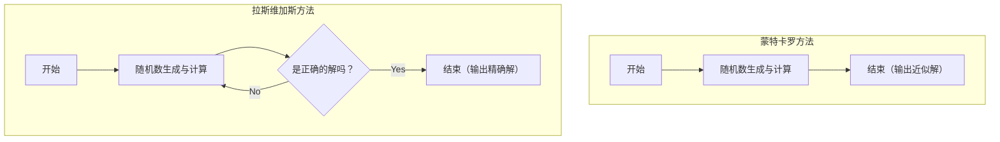

在计算机科学中，利用随机数来解决问题的算法被称为 **概率算法** (Randomized Algorithm)。在很多情况下，使用随机数能比确定性算法（总是以相同步骤返回相同结果的算法）更快地获得解答，或者让实现变得极其简单。

其中代表性的方法是 **蒙特卡罗方法** (Monte Carlo algorithm) 和 **拉斯维加斯方法** (Las Vegas algorithm)。这两个名字都来源于著名的赌场城市，但它们的性质却大相径庭。

本文将结合图解和数学公式，详细解说这两种算法的机制、具体的实现示例，以及它们之间的区别。

## 1. 蒙特卡罗方法 (Monte Carlo Algorithm)

蒙特卡罗方法是一种 **“执行时间必然是固定的（有限的），但得到的解在概率上有可能是错误”** 的算法。只要增加试验次数 $N$ ，出错的概率就可以变得任意小。

### 特征
- **执行时间**: 始终有确定性的上限。
- **正确性**: 存在一定概率返回错误的答案（包括获得近似解的情况）。

### 执行时间与精度的权衡
蒙特卡罗方法最大的优势在于可以固定执行时间。在模拟或数值计算中，如果有“希望在1小时内得出最合理的结论”的需求，只需调整循环次数即可确保在时间内得出结果。
但是，由于需要承担概率性错误的风险，它不应该单独用于误判会致命的系统（例如，绝对不容许失败的医疗设备控制或金融交易的结算处理等）。

### 具体例子1：圆周率 $\pi$ 的近似计算

蒙特卡罗方法最著名的例子就是圆周率的近似计算。
假设边长为 2 的正方形中内接一个半径为 1 的圆。正方形的面积为 $2 \times 2 = 4$ ，圆的面积为 $\pi \times 1^2 = \pi$ 。

在这个正方形内随机投飞镖（打点），求出落在圆内的点的比例，它会近似于面积的比例 $\frac{\pi}{4}$ 。

设打点的总数为 $N_{total}$ ，落在圆内的点的数量为 $N_{in}$ ，则以下公式成立。

$$
\frac{N_{in}}{N_{total}} \approx \frac{\pi}{4} \implies \pi \approx 4 \times \frac{N_{in}}{N_{total}}
$$

#### Python的实现示例

```python
import random

def estimate_pi(num_samples: int) -> float:
    points_inside_circle = 0
    
    for _ in range(num_samples):
        # 在 -1.0 到 1.0 的范围内生成随机的 x, y 坐标
        x = random.uniform(-1.0, 1.0)
        y = random.uniform(-1.0, 1.0)
        
        # 距离原点的距离如果小于等于1，就在圆内
        if x**2 + y**2 <= 1.0:
            points_inside_circle += 1
            
    return 4 * points_inside_circle / num_samples

# 试行100万次
pi_approx = estimate_pi(1_000_000)
print(f"圆周率的近似值: {pi_approx}")
```

随着试验次数 `num_samples` 的增加，可以得到精度更高的 $\pi$ 值，但无法保证成为绝对精确的值。

### 具体例子2：米勒-拉宾素性检验法

这是一种用于高速判定某个巨大数是否为素数的算法。在 [RSA](https://kenji.blog/zh-cn/p/modern-cryptography-public-key-hash-signature/) 密码等生成密钥时，需要数百位的素数，如果用确定性的试除法（依次除以 $2, 3, 5, \dots$ 的方法）来进行，那么直到宇宙寿命耗尽也无法结束。

在此，我们利用称为 **米勒-拉宾素性检验法** 的蒙特卡罗方法。
对于想要判定的数 $n$ ，随机选择一个基数 $a$ ，测试它是否满足基于[费马小定理](https://kenji.blog/zh-cn/p/fermats-little-theorem/)扩展的特定条件式。

在1次测试中，如果被判定为“是合数”，那么该数就绝对是合数。但是，如果被判定为“可能是素数”，实际上存在最大 $\frac{1}{4}$ 的概率，它其实是合数却被误判为素数。

然而，如果用不同的随机数 $a$ 重复这个测试 $k$ 次，在所有测试中都发生误判的概率就是 $(\frac{1}{4})^k$ 。例如，设定 $k=50$ ，误判的概率将是 $4^{-50}$ ，在实用层面上达到了可以视为“绝对是素数”而毫无问题的精度水平。

## 2. 拉斯维加斯方法 (Las Vegas Algorithm)

拉斯维加斯方法是一种 **“得出的解总是100%正确的，但执行时间会概率性地波动（最坏的情况下甚至有可能无法结束）”** 的算法。

### 特征
- **执行时间**: 是一个随机变量，如果运气不好会非常耗时。
- **正确性**: 当算法结束时，其答案必定是正确的。

### 计算量的分散与期望值
拉斯维加斯方法的优势在于“不会得出错误结果”的可靠性。因此，它在绝对需要结果准确性的场合下非常有用。
作为代价，算法结束所需的时间依赖于随机数。即使“期望的执行时间（平均复杂度）”非常小，在运气极差的情况下也无法排除达到最坏复杂度，或者陷入无限循环的理论可能性。
不过在现实中，遇到“极端运气不好的情况”的概率低至天文数字，因此在实际应用中，它往往比确定性算法运行得更快，并被广泛采用。

### 具体例子1：随机化快速排序 (Randomized QuickSort)

作为[排序算法](https://kenji.blog/zh-cn/p/sorting-algorithms/)代表的快速排序中，随机选择基准值（Pivot）的方法是拉斯维加斯方法的典型例子。

在常规的快速排序中，总是采取固定策略，例如选择数组末尾的元素作为基准值。但是，在这种情况下，如果给定的是原本就已经排序好的数组，最坏复杂度会达到 $O(n^2)$ 。

在 **随机化快速排序** 中，会从数组中随机选择基准值。通过这样做，可以从数学上保证，对于任何输入数据，平均复杂度都能达到 $O(n \log n)$ 。输出的排序结果本身则始终是完全正确的。

如果作为排序对象的数组有数亿个元素，并且从一开始就几乎是排好序的，在常规的快速排序中会有引发栈溢出或计算时间大幅增加的风险。但是，通过使用随机化快速排序，即便是对于故意引起最坏情况的恶意输入数据（一种DoS攻击），也具备能够稳定发挥高速性能的优势。像这样，拉斯维加斯方法也有助于提升安全性和系统的稳健性。

#### Python的实现示例

```python
import random

def randomized_quicksort(arr: list) -> list:
    if len(arr) <= 1:
        return arr
    
    # 随机选择基准值
    pivot_idx = random.randint(0, len(arr) - 1)
    pivot = arr[pivot_idx]
    
    # 将基准值以外的元素分发到左右
    left = [x for i, x in enumerate(arr) if x <= pivot and i != pivot_idx]
    right = [x for i, x in enumerate(arr) if x > pivot and i != pivot_idx]
    
    # 递归排序并合并
    return randomized_quicksort(left) + [pivot] + randomized_quicksort(right)

data = [3, 1, 4, 1, 5, 9, 2, 6, 5, 3, 5]
sorted_data = randomized_quicksort(data)
print(f"排序结果: {sorted_data}")
```

在这个实现中，排序结果绝对不可能出错。但是，如果随机数抽取极端地糟糕，总是持续选择最大值或最小值作为基准值的话，计算时间会显著增加。

### 具体例子2：哈希表（Hash Table）的构建

拉斯维加斯方法的另一个例子是完美哈希函数的构建。
假设我们想要为一个给定的数据集制作一个绝对不会发生冲突（不同的数据产生相同的哈希值）的哈希函数。

在这个时候，我们采取“随机选择一个哈希函数，尝试将所有数据放置在哈希表中。如果发生哪怕1次冲突，就重新随机选择另一个哈希函数从头再来”的方法。

因为要重复这一过程直到获得没有冲突的完美状态（正确的解），所以它是典型的拉斯维加斯方法。在理论上可能会一直发生冲突下去，但只要准备好合适的哈希函数族，经过几次尝试就能找到不发生冲突的哈希函数。

## 3. [蒙特卡罗方法与拉斯维加斯方法](https://kenji.blog/zh-cn/p/monte-carlo-and-las-vegas-algorithms/)的比较

让我们通俗易懂地比较一下这两种算法的区别。

| 算法 | 执行时间 | 结果的正确性 | 主要用途示例 |
| --- | --- | --- | --- |
| **蒙特卡罗方法** | 始终固定（有上限） | 概率上可能出错 | 圆周率的计算、素性检验、物理模拟 |
| **拉斯维加斯方法** | 概率性波动（最坏无限） | 始终100%正确 | 随机化快速排序、哈希表的构建 |

此外，两者在选择固定“时间”还是“精度”这一点上处于两极。可以认为，蒙特卡罗方法是固定时间而牺牲精度，拉斯维加斯方法是固定精度而牺牲时间。

以下的 Mermaid 图直观地表现了两者流程的差异。



蒙特卡罗方法只要执行了预定的计算次数就必定结束，而拉斯维加斯方法具有不断重复尝试直到得出“正确解”的循环结构。

## 4. 两者的关系与转换

有趣的是，根据情况，这两种算法是可以相互转换的。

### 拉斯维加斯方法 $\rightarrow$ 蒙特卡罗方法
通过对拉斯维加斯方法的算法设定 **“如果经过了一定时间，就强制中断处理并返回一个适当的值（或错误）”** 这样的限制，就可以将其转换为蒙特卡罗方法。
由此，执行时间得到了保证，但在被中断的情况下就会返回错误的答案。

### 蒙特卡罗方法 $\rightarrow$ 拉斯维加斯方法
如果蒙特卡罗方法得出的答案 **“能够以极高的速度验证其是否正确”** ，那么就能将其转换为拉斯维加斯方法。
执行蒙特卡罗方法，并将得出的答案放入验证机。只要构筑一个如果不正确就再次执行蒙特卡罗方法的循环，它就会变成最终必然输出正确答案（只是无法预测执行时间）的拉斯维加斯方法。

## 5. 总结

本文解说了活用随机数的两种强大的算法范式。

- **蒙特卡罗方法** : 遵守时间，但偶尔犯错。（例：近似计算、素性检验等）
- **拉斯维加斯方法** : 绝对不犯错，但偶尔不遵守时间。（例：快速排序、哈希表的构建等）

在实际的系统开发和数据科学现场，应该根据是追求严格的准确性，还是追求实时性（计算时间的上限），来决定采用哪种方法。有时也会采用将两者结合的混合方案。

随机数不仅仅只是“随机的值”，在计算机科学中也是强大的工具。在面对确定性算法难以解决的问题时，请务必考虑利用 **概率算法** 。
