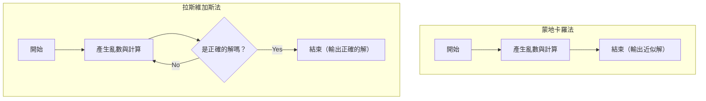

在電腦科學中，使用亂數來解決問題的演算法被稱為 **機率演算法** (Randomized Algorithm)。透過使用亂數，有許多情況可以比決定性演算法（總是使用相同步驟回傳相同結果的演算法）更快速地得出解，或者使實作變得非常簡單。

其中最具代表性的方法是 **蒙地卡羅法** (Monte Carlo algorithm) 與 **拉斯維加斯法** (Las Vegas algorithm)。這兩個名稱都源自於著名的賭城，但它們的性質有很大的不同。

本文將結合圖解與數學公式，詳細解說這兩種演算法的機制、具體的實作範例，以及兩者之間的差異。

## 1. 蒙地卡羅法 (Monte Carlo Algorithm)

蒙地卡羅法是一種 **「執行時間必定固定（有限），但得到的解在機率上有可能是錯誤的」** 演算法。錯誤的機率可以透過增加嘗試次數 $N$ 來盡可能地縮小。

### 特徵
- **執行時間** ：總是具有決定性的上限。
- **正確性** ：有一定機率可能回傳錯誤的答案（包括取得近似解的情況）。

### 執行時間與精確度的權衡
蒙地卡羅法最大的優勢在於可以固定執行時間。在模擬或數值計算中，如果遇到「請在 1 小時內給出最合理的結果」的要求，只要調整迴圈次數，就能確保在時間內得出結果。
不過，因為必須背負在機率上發生錯誤的風險，所以不應該單獨將它用於一旦誤判就會造成致命後果的系統（例如，絕對不能失敗的醫療設備控制或金融交易的確認處理等）。

### 具體範例 1：圓周率 $\pi$ 的近似計算

蒙地卡羅法最有名的範例是圓周率的近似計算。
假設在一個邊長為 2 的正方形內，有一個半徑為 1 的內切圓。正方形的面積為 $2 \times 2 = 4$，圓的面積為 $\pi \times 1^2 = \pi$。

如果在這個正方形內隨機投擲飛鏢（打點），並求出落入圓內的點的比例，這個值將會近似於面積的比值 $\frac{\pi}{4}$。

如果將打出的點的總數設為 $N_{total}$，落入圓內的點的數量設為 $N_{in}$，則可以得出以下數學公式。

$$
\frac{N_{in}}{N_{total}} \approx \frac{\pi}{4} \implies \pi \approx 4 \times \frac{N_{in}}{N_{total}}
$$

#### 使用 Python 的實作範例

```python
import random

def estimate_pi(num_samples: int) -> float:
    points_inside_circle = 0
    
    for _ in range(num_samples):
        # 產生介於 -1.0 到 1.0 之間的隨機 x, y 座標
        x = random.uniform(-1.0, 1.0)
        y = random.uniform(-1.0, 1.0)
        
        # 如果與原點的距離小於等於 1，則在圓的內部
        if x**2 + y**2 <= 1.0:
            points_inside_circle += 1
            
    return 4 * points_inside_circle / num_samples

# 嘗試 100 萬次
pi_approx = estimate_pi(1_000_000)
print(f"圓周率的近似值: {pi_approx}")
```

雖然嘗試次數 `num_samples` 越多，可以得到精確度更高的 $\pi$ 值，但無法保證它會變成絕對準確的值。

### 具體範例 2：米勒-拉賓質數判定法

這是一種可以快速判定一個巨大的數是否為質數的演算法。在產生 [RSA](https://kenji.blog/zh-tw/p/modern-cryptography-public-key-hash-signature/) 密碼等的金鑰時，會需要數百位數的質數，但如果使用決定性的試除法（依序用 $2, 3, 5, \dots$ 去除的方法）來進行，即使到了宇宙的盡頭也算不完。

這時我們就可以利用被稱為 **米勒-拉賓質數判定法** 的蒙地卡羅法。
對於想要判定的數字 $n$，隨機選擇一個基數 $a$，並測試其是否滿足基於[費馬小定理](https://kenji.blog/zh-tw/p/fermats-little-theorem/)擴展的特定條件式。

如果在 1 次測試中被判定為「是合數」，那麼該數肯定就是合數。但是，如果被判定為「可能是質數」的話，它其實是合數卻被誤判為質數的機率最大為 $\frac{1}{4}$。

不過，如果使用不同的隨機 $a$ 將這個測試重複 $k$ 次，那麼在所有測試中都誤判的機率就會變成 $(\frac{1}{4})^k$。例如，如果設定為 $k=50$，誤判的機率就會變成 $4^{-50}$，在實務上這已經達到了可以視為「絕對是質數」且毫無問題的精確度水準。

## 2. 拉斯維加斯法 (Las Vegas Algorithm)

拉斯維加斯法是一種 **「得到的解總是 100% 正確，但執行時間會因為機率而變動（最壞的情況下有可能永遠不會結束）」** 演算法。

### 特徵
- **執行時間** ：是一個隨機變數，如果運氣不好，可能會花費非常多的時間。
- **正確性** ：當演算法結束時，其答案必定是正確的。

### 計算複雜度的波動與期望值
拉斯維加斯法的優勢在於「不會給出錯誤結果」的可靠性。因此，它非常活躍於絕對需要結果正確性的場合中。
作為代價，演算法結束前的時間取決於亂數。雖然「期望的執行時間（平均計算複雜度）」可能非常小，但我們無法排除在運氣極差的情況下達到最壞計算複雜度，或是陷入無窮迴圈的理論可能性。
然而，在現實中，遇到「運氣極端不好」的情況的機率是天文數字般的低，因此在實務上它通常比決定性演算法運作得更快，並被廣泛採用。

### 具體範例 1：隨機快速排序 (Randomized QuickSort)

作為代表性排序演算法的快速排序中，將選擇基準點（Pivot）的方法隨機化，就是拉斯維加斯法的典型例子。

在一般的快速排序中，通常會採取固定策略，例如總是選擇陣列最後一個元素作為基準點。但是，在這種情況下，如果給定一個原本就已經排序好的陣列，最壞計算複雜度就會變成 $O(n^2)$。

在 **隨機快速排序** 中，會從陣列中隨機選擇基準點。這樣一來，對於任何輸入資料，其平均計算複雜度在數學上都被保證為 $O(n \log n)$。輸出的排序結果本身也總是完全正確的。

如果要排序的陣列有數億個元素，而且一開始就幾乎已經排序好了，使用一般的快速排序就會有引發堆疊溢位（[Stack](https://kenji.blog/zh-tw/p/c-language-pointers-memory-management-stack-heap/) Overflow）或計算時間大幅增加的危險。但是，透過使用隨機快速排序，即使面對故意引發最壞情況的惡意輸入資料（一種 DoS 攻擊），也能穩定發揮高速效能，這就是它的強項。像這樣，拉斯維加斯法也有助於提升安全性與系統的健全性。

#### 使用 Python 的實作範例

```python
import random

def randomized_quicksort(arr: list) -> list:
    if len(arr) <= 1:
        return arr
    
    # 隨機選擇基準點
    pivot_idx = random.randint(0, len(arr) - 1)
    pivot = arr[pivot_idx]
    
    # 將基準點以外的元素分發到左右兩邊
    left = [x for i, x in enumerate(arr) if x <= pivot and i != pivot_idx]
    right = [x for i, x in enumerate(arr) if x > pivot and i != pivot_idx]
    
    # 遞迴地進行排序並結合
    return randomized_quicksort(left) + [pivot] + randomized_quicksort(right)

data = [3, 1, 4, 1, 5, 9, 2, 6, 5, 3, 5]
sorted_data = randomized_quicksort(data)
print(f"排序結果: {sorted_data}")
```

在這個實作中，排序結果絕對不可能出錯。不過，如果亂數的運氣極度不佳，總是持續選擇到最大值或最小值作為基準點，計算時間就會顯著增加。

### 具體範例 2：建構雜湊表 ([Hash Table](https://kenji.blog/zh-tw/p/search-algorithms-linear-binary-hash-table-principles/))

另一個拉斯維加斯法的例子是建構完美雜湊函數。
假設對於給定的資料集合，我們希望建立一個完全不發生碰撞（不同的資料變成相同的雜湊值）的雜湊函數。

這時，我們會採取「隨機選擇一個雜湊函數，並嘗試將所有資料放置到雜湊表中。如果發生哪怕是 1 次碰撞，就隨機重新選擇另一個雜湊函數並從頭開始」的方法。

因為它會反覆執行直到獲得沒有碰撞的完美狀態（正確的解）為止，這是一個典型的拉斯維加斯法。雖然理論上它可能會無止境地一直發生碰撞，但只要準備好合適的雜湊函數族群，就能在幾次嘗試內找到沒有碰撞的雜湊函數。

## 3. [蒙地卡羅法與拉斯維加斯法](https://kenji.blog/zh-tw/p/monte-carlo-and-las-vegas-algorithms/)的比較

讓我們簡單明瞭地比較這兩種演算法的差異。

| 演算法 | 執行時間 | 結果的正確性 | 主要用途範例 |
| --- | --- | --- | --- |
| **蒙地卡羅法** | 總是固定（有上限） | 在機率上有可能出錯 | 計算圓周率、判定質數、物理模擬 |
| **拉斯維加斯法** | 會因機率變動（最壞為無限） | 總是 100% 正確 | 隨機快速排序、建構雜湊表 |

此外，就固定「時間」還是「精確度」這一點而言，兩者分別位於天秤的兩端。我們可以將蒙地卡羅法視為固定時間而犧牲精確度，而拉斯維加斯法則可視為固定精確度而犧牲時間。

以下的 Mermaid 圖表視覺化地呈現了兩者流程上的差異。



蒙地卡羅法只要進行了決定好的計算次數必定會結束，而拉斯維加斯法則是具有反覆嘗試直到獲得「正確的解」為止的迴圈結構。

## 4. 兩者的關係與轉換

有趣的是，在某些情況下，我們可以將這兩種演算法互相轉換。

### 拉斯維加斯法 $\rightarrow$ 蒙地卡羅法
對於拉斯維加斯法的演算法，只要加上 **「當經過一定時間後，就強制中斷處理並回傳隨便一個值（或錯誤）」** 這樣的限制，就可以將它轉換為蒙地卡羅法。
這樣雖然可以保證執行時間，但如果被中斷了，就會回傳錯誤的答案。

### 蒙地卡羅法 $\rightarrow$ 拉斯維加斯法
如果蒙地卡羅法給出的答案 **「可以非常快速地驗證其正確性」** ，就可以將它轉換為拉斯維加斯法。
執行蒙地卡羅法，並將其答案放入驗證機中檢驗。只要建立一個「如果錯誤就再次執行蒙地卡羅法」的迴圈，最終它就會成為必定能輸出正確答案（但無法預估執行時間）的拉斯維加斯法。

## 5. 總結

本文解說了兩種活用亂數的強大演算法範式。

- **蒙地卡羅法** ：會遵守時間，但偶爾會犯錯。（例如：近似計算、判定質數等）
- **拉斯維加斯法** ：絕對不犯錯，但偶爾不遵守時間。（例如：快速排序、建構雜湊表等）

在實際的系統開發或資料科學領域中，究竟應該採用哪一種方法，取決於現場是要求嚴格的正確性，還是即時性（計算時間的上限）。有時也會採用混合這兩者的途徑。

亂數不只是單純的「隨機值」，在計算機科學中它是一個強大的工具。當您面臨難以用決定性演算法解決的問題時，請務必考慮利用 **機率演算法** 。
