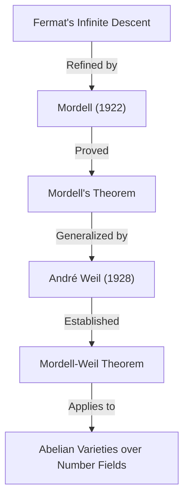

## 1. مقدمة

أحد علماء الرياضيات الذين تركوا بصمة رائعة في عالم الرياضيات في القرن العشرين، وخاصة في مجال **نظرية الأعداد** (Number Theory)، هو لويس جويل مورديل (1888–1972). لقد حقق نتائج رائدة في دراسة المعادلات الديوفانتية وأرسى الأسس للعديد من النظريات الهامة عند تقاطع الهندسة الجبرية الحديثة ونظرية الأعداد. في هذه المقالة، سنشرح بالتفصيل حياة مورديل، والنظريات والحدسيات المهمة التي تحمل اسمه، والتأثير العميق الذي تركه في المجتمع الرياضي.

العديد ممن سمعوا عن مورديل ربما يعرفونه من خلال **مبرهنة مورديل** (Mordell's Theorem) أو **حدسية مورديل** (Mordell Conjecture). لم تكن هذه الإنجازات مجرد براهين لنظريات فردية، بل كانت بمثابة مقدمات مهمة لدراما رياضية رائعة أدت إلى إثبات **[مبرهنة فيرما الأخيرة](https://kenji.blog/ar/p/fermats-last-theorem/)** ([Fermat's Last Theorem](https://kenji.blog/ar/p/fermats-last-theorem/)).

## 2. الأيام الأولى: من التعلم الذاتي إلى كامبريدج

ولد لويس جويل مورديل في 28 يناير 1888 في فيلادلفيا، بنسلفانيا، الولايات المتحدة الأمريكية. كان والداه مهاجرين يهوديين من ليتوانيا، ولم تكن عائلته ثرية على الإطلاق. ومع ذلك، منذ سن مبكرة، أظهر مورديل موهبة وشغفاً غير عاديين بالرياضيات.

اشترى كتباً رياضية متخصصة من متاجر الكتب المستعملة وأتقن الرياضيات المتقدمة بالكامل تقريباً من خلال **التعلم الذاتي**. على وجه الخصوص، صادف مجموعة من أوراق الامتحانات السابقة لـ **Mathematical Tripos**، وهو امتحان التخرج في الرياضيات بجامعة كامبريدج، وانغمس في حلها. غذت هذه التجربة طموحه القوي للدراسة في كامبريدج في إنجلترا.

في عام 1906، وفي سن الثامنة عشرة، سافر مورديل إلى إنجلترا بمفرده وبمال قليل جداً لإجراء امتحان للحصول على منحة دراسية. نجح في الفوز بالمنحة ودخل كلية سانت جون، كامبريدج. في عام 1909، حقق نتائج ممتازة في امتحان Tripos، حيث أصبح **الرانغلر الثالث** (Third Wrangler) (المرتبة الثالثة في الترتيب العام).

## 3. الشغف بالمعادلات الديوفانتية

كان محور بحث مورديل دائماً هو **المعادلات الديوفانتية** (Diophantine equations). المعادلة الديوفانتية هي مسألة إيجاد حلول صحيحة أو نسبية لمعادلات متعددة الحدود ذات معاملات صحيحة. سُميت على اسم عالم الرياضيات اليوناني القديم ديوفانتس.

المثال الأكثر شهرة للمعادلة الديوفانتية هو المثال المتعلق بمبرهنة فيثاغورس:

$$ x^2 + y^2 = z^2 $$

تسمى الحلول الصحيحة لهذه المعادلة بثلاثيات فيثاغورس، ومن المعروف أن هناك عدداً لا نهائياً منها. ومع ذلك، مع زيادة الدرجة، تصبح المشكلة صعبة بسرعة. المعادلة التالية، المعروفة من [مبرهنة فيرما الأخيرة](https://kenji.blog/ar/p/fermats-last-theorem/)، هي مثال رئيسي:

$$ x^n + y^n = z^n \quad (n \ge 3) $$

استكشف مورديل بعمق خصائص حلول مثل هذه المعادلات. كان يفضل بشدة التعامل مع معادلات ملموسة بدلاً من مجرد بناء نظريات مجردة.

## 4. معادلة مورديل

أولى مورديل اهتماماً خاصاً بشكل المعادلة المعروفة الآن باسم **معادلة مورديل** (Mordell's Equation):

$$ y^2 = x^3 + k $$

هنا، $k$ هو عدد صحيح غير صفري. هذه المعادلة هي واحدة من أبسط أشكال المنحنى الإهليلجي. منذ أن أثبت [بيير دي فيرما](https://kenji.blog/ar/p/fermat/) في القرن السابع عشر أنه من أجل $k = -2$، أي $y^2 = x^3 - 2$، الحلول الصحيحة الوحيدة هي $(x, y) = (3, \pm 5)$، تمت دراسة العديد من هذه المعادلات.

بحث مورديل بعمق في الطرق العامة لإيجاد حلول صحيحة لهذه المعادلة ومحدودية حلولها. طبق نهجه نظرية فئات المثاليات في نظرية الأعداد الجبرية، مما يمثل قفزة كبيرة إلى الأمام مقارنة بالطرق الكلاسيكية.

## 5. مبرهنة مورديل: النقاط النسبية على المنحنيات الإهليلجية

واحدة من أعظم الإنجازات الرياضية لمورديل هي **مبرهنة مورديل**، التي نُشرت في عام 1922. تؤكد هذه المبرهنة أن مجموعة جميع النقاط النسبية لمنحنى إهليلجي على حقل الأعداد النسبية $\mathbb{Q}$ هي **مولدة بشكل نهائي** (finitely generated) كزمرة جمعية.

كان معروفاً أن مجموعة النقاط النسبية $E(\mathbb{Q})$ لمنحنى إهليلجي $E$ لها بنية زمرة من خلال طريقة الوتر والمماس (chord-and-tangent method). أثبت مورديل أن هذه الزمرة لها البنية التالية:

$$ E(\mathbb{Q}) \cong E(\mathbb{Q})_{\text{tors}} \oplus \mathbb{Z}^r $$

هنا، $E(\mathbb{Q})_{\text{tors}}$ هي **زمرة جزئية للالتواء** (torsion subgroup) تتكون من عدد محدود من النقاط، و $r$ هو عدد صحيح غير سالب يُسمى **الرتبة** (rank).

تعني هذه المبرهنة أنه من أجل إيجاد جميع النقاط النسبية اللانهائية لمنحنى إهليلجي، يكفي إيجاد عدد محدود من نقاط "الأساس". إنها نتيجة هائلة في الهندسة الحسابية. كان برهان مورديل تنقيحاً حديثاً لـ "طريقة النزول اللانهائي" (Method of infinite descent) لفيرما.

في وقت لاحق، في عام 1928، قام عالم الرياضيات الفرنسي أندريه ويل بتعميم هذه المبرهنة لتشمل حقول الأعداد العامة والتنوعات الأبيلية، لذلك يُطلق عليها الآن غالباً **مبرهنة مورديل-ويل** (Mordell-Weil Theorem).

## 6. حدسية مورديل: تقاطع الهندسة الجبرية ونظرية الأعداد

في عام 1922، إلى جانب نشر مبرهنته، اقترح مورديل حدسية أكبر. هذه هي **حدسية مورديل** (Mordell Conjecture). قدمت هذه الحدسية ادعاءً مذهلاً بأن عدد الحلول النسبية لمعادلة ما يعتمد على "جنسها" (genus)، وهو خاصية طوبولوجية للشكل الذي تحدده المعادلة.

عند التفكير فيها على الأعداد المركبة، يشكل المنحنى الجبري $C$ سطحاً يشبه كعكة الدونات ذات الثقوب. عدد هذه الثقوب هو الجنس $g$. صنفها مورديل على النحو التالي:

- إذا كان $g = 0$ (مثل المقاطع المخروطية): إذا كانت هناك نقطة نسبية واحدة، فهناك عدد لا نهائي منها.
- إذا كان $g = 1$ (مثل المنحنيات الإهليلجية): بموجب مبرهنة مورديل، تشكل النقاط النسبية زمرة مولدة بشكل نهائي (يمكن أن تكون محدودة أو لانهائية).
- إذا كان $g \ge 2$: **هناك دائماً عدد محدود فقط من النقاط النسبية.**

الادعاء الخاص بالحالة $g \ge 2$ هو حدسية مورديل. أشارت هذه الحدسية إلى أن الشيء "الرياضي-العددي" (حلول المعادلة الجبرية) يتم التحكم فيه بالكامل بواسطة كائن "هندسي" (عدد الثقوب في الشكل)، مما أرسل صدمة كبيرة بين علماء الرياضيات في ذلك الوقت.

$$ \text{If } g \ge 2 \text{, then } |C(\mathbb{Q})| < \infty $$

ظلت هذه الحدسية دون حل لأكثر من 60 عاماً. ومع ذلك، في عام 1983، أثبتها أخيراً عالم الرياضيات الألماني جيرد فالتينغز، وأصبحت **مبرهنة فالتينغز** (Faltings's Theorem). مقابل هذا الإنجاز، حصل فالتينغز على ميدالية فيلدز في عام 1986.

علاوة على ذلك، فإن معادلة [مبرهنة فيرما الأخيرة](https://kenji.blog/ar/p/fermats-last-theorem/)، $x^n + y^n = z^n$، لها جنس 3 أو أكثر عندما يكون $n \ge 4$. لذلك، من حدسية مورديل (مبرهنة فالتينغز)، يترتب على ذلك فوراً أن معادلة فيرما لها في الغالب عدد محدود من الحلول النسبية لكل $n$.

## 7. المشاركة مع رامانوجان والنماذج المعيارية

لم تقتصر إنجازات مورديل على المعادلات الديوفانتية. كما قدم مساهمات كبيرة في المشكلات التي لم تُحل والتي تركها عالم الرياضيات العبقري [سرينيفاسا رامانوجان](https://kenji.blog/ar/p/ramanujan/).

حدس رامانوجان عدة خصائص مفاجئة حول دالة تاو لرامانوجان $\tau(n)$، المُعرّفة على النحو التالي:

$$ \sum_{n=1}^{\infty} \tau(n) q^n = q \prod_{n=1}^{\infty} (1 - q^n)^{24} $$

توقع رامانوجان أنه عندما يكون $\gcd(m, n) = 1$، فإن $\tau(mn) = \tau(m)\tau(n)$ (خاصية الجداء). في عام 1917، أثبت مورديل هذه الحدسية ببراعة. كانت تقنية الإثبات الخاصة به سلفاً للأدوات الأساسية في نظرية النماذج المعيارية المعروفة اليوم باسم **مؤثرات هيكي** (Hecke operators). لعب اكتشاف مورديل دوراً بالغ الأهمية في التطور اللاحق لنظرية النماذج التماثلية (automorphic forms) في نظرية الأعداد.

## 8. تشكيل مدرسة مانشستر ودعم اللاجئين

في عشرينيات القرن العشرين، تم تعيين مورديل أستاذاً في جامعة مانشستر. هناك، بنى مدرسة قوية للرياضيات، ورفع جامعة مانشستر لتكون مركزاً لنظرية الأعداد في المملكة المتحدة.

يُعرف مورديل ليس فقط بتميزه البحثي ولكن أيضاً بإنسانيته. في ثلاثينيات القرن العشرين، أجبر صعود ألمانيا النازية العديد من العلماء اليهود على ترك وظائفهم، مما اضطرهم إلى الفرار من أوروبا. دعمهم مورديل بنشاط واستقبلهم في جامعة مانشستر.

كان من بين علماء الرياضيات الذين دعمهم بول إيردوس، الذي أصبح لاحقاً أحد أعظم علماء الرياضيات في القرن العشرين، وكورت ماهلر، وهو مرجع في نظرية الأعداد المتسامية. تحظى جهود مورديل بإشادة كبيرة ليس فقط لتطوير الرياضيات البريطانية ولكن أيضاً من منظور إنساني لإنقاذه المواهب المضطهدة.

## 9. كخليفة هاردي: السنوات الأخيرة في كامبريدج

في عام 1945، عند تقاعد جي. إتش. هاردي، تم انتخاب مورديل لمنصب **أستاذ سادليريان للرياضيات البحتة** (Sadleirian Professor of Pure Mathematics) في جامعة كامبريدج. هذا هو أحد أرقى المناصب في المجتمع الرياضي البريطاني.

وبعودته إلى كامبريدج، قام مورديل بتوجيه العديد من الطلاب وكرس نفسه لتطوير نظرية الأعداد. كانت محاضراته عاطفية، وتنقل للطلاب باستمرار فرحة وأهمية حل المشكلات الملموسة. حتى تقاعده في عام 1953، سيطر كزعيم في العالم الرياضي البريطاني.

## 10. الشخصية والمساهمة في التعليم

كان مورديل صريحاً للغاية، وكان يُعرف أحياناً بتعليقاته غير المتحفظة. على الرغم من عيشه في المملكة المتحدة لفترة طويلة، واصل التحدث باللغة الإنجليزية بلهجة أمريكية قوية طوال حياته.

كان يفضل حل المشكلات الملموسة بدلاً من بناء النظريات من أجل النظريات المجردة. تنعكس فلسفته القائلة بأن "الرياضيات هي لحل المشكلات" بقوة في تحفته الفنية "المعادلات الديوفانتية". كان هذا الكتاب تتويجاً لبحثه الذي استمر طوال حياته وألهم العديد من علماء الرياضيات الشباب.

كما كان لدى مورديل عين ثاقبة لاكتشاف مواهب الآخرين. كان أحد إنجازاته العظيمة هو تربية علماء رياضيات مثل جيه. دبليو. إس. كاسيلز، الذين سيقودون لاحقاً مجتمع نظرية الأعداد البريطاني.

## 11. إرثه للرياضيات الحديثة

الإرث الذي تركه [لويس مورديل](https://kenji.blog/ar/p/mordell/) في عالم الرياضيات متجذر بعمق في أسس الرياضيات الحديثة.

1. **أسس الهندسة الحسابية**: حفزت مبرهنة مورديل وحدسية مورديل بقوة تطور "الهندسة الحسابية" (Arithmetic Geometry)، والتي تنظر إلى الكائنات العددية-النظرية من منظور هندسي.
2. **نظرية النماذج المعيارية**: أصبحت التقنيات التي استخدمها في إثبات حدسية رامانوجان نقطة البداية لنظرية ضخمة تمتد إلى برنامج لانجلاندز الحديث.
3. **حل المعادلات الديوفانتية**: لا تزال نهجه الملموسة وأوراقه العديدة بمثابة الأساس للطرق الخوارزمية لحل المعادلات باستخدام أجهزة الكمبيوتر اليوم.

عندما تم إثبات [مبرهنة فيرما الأخيرة](https://kenji.blog/ar/p/fermats-last-theorem/) من قبل [أندرو وايلز](https://kenji.blog/ar/p/wiles/)، كانت المفاهيم التي تتضمن مورديل بعمق، مثل المنحنيات الإهليلجية والنماذج المعيارية، لا غنى عنها لخلفيتها النظرية.

## 12. خاتمة

ارتقى [لويس مورديل](https://kenji.blog/ar/p/mordell/) من شاب شغوف علّم نفسه بنفسه إلى عملاق في نظرية الأعداد يمثل القرن العشرين. نُقش اسمه إلى الأبد في تاريخ الرياضيات في شكل **مبرهنة مورديل** و **حدسية مورديل**.

بفضل التزامه القوي بحل المشكلات الملموسة والدفء الإنساني الذي أنقذ علماء الرياضيات اللاجئين، تعد حياة مورديل وإنجازاته نموذجاً ممتازاً يوضح كيف يتطور تخصص الرياضيات وكيف يمكن للشخص أن يساهم في هذا التطور. ولا يزال عالم المعادلات الديوفانتية الذي استكشفه يبهر العديد من علماء الرياضيات حتى يومنا هذا.
