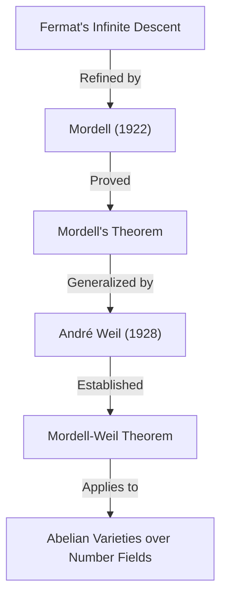

## 1. Einführung

Einer der Mathematiker, der im 20. Jahrhundert insbesondere auf dem Gebiet der **Zahlentheorie** (Number Theory) brillante Spuren in der mathematischen Welt hinterlassen hat, ist Louis Joel Mordell (1888–1972). Er erzielte bahnbrechende Ergebnisse bei der Untersuchung diophantischer Gleichungen und legte den Grundstein für viele wichtige Theorien an der Schnittstelle von moderner algebraischer Geometrie und Zahlentheorie. In diesem Artikel werden wir das Leben von Mordell, die wichtigen Sätze und Vermutungen, die seinen Namen tragen, sowie seinen tiefgreifenden Einfluss auf die mathematische Gemeinschaft detailliert erläutern.

Viele, die von Mordell gehört haben, kennen ihn wahrscheinlich durch den **Satz von Mordell** (Mordell's Theorem) oder die **Mordell-Vermutung** (Mordell Conjecture). Diese Errungenschaften waren nicht nur Beweise einzelner Sätze, sondern dienten als wichtige Vorspiele für ein großartiges mathematisches Drama, das zum Beweis von **[Fermat](https://kenji.blog/de/p/fermat/)s Letztem Satz** ([Fermat's Last Theorem](https://kenji.blog/de/p/fermats-last-theorem/)) führte.

## 2. Frühe Jahre: Vom Selbststudium nach Cambridge

Louis Joel Mordell wurde am 28. Januar 1888 in Philadelphia, Pennsylvania, USA, geboren. Seine Eltern waren jüdische Einwanderer aus Litauen, und seine Familie war keineswegs wohlhabend. Schon in jungen Jahren zeigte Mordell jedoch ein außergewöhnliches Talent und eine Leidenschaft für Mathematik.

Er kaufte mathematische Fachbücher in Antiquariaten und eignete sich fortgeschrittene Mathematik fast ausschließlich im **Selbststudium** an. Insbesondere stieß er auf eine Sammlung alter Prüfungsaufgaben des **Mathematical Tripos**, der mathematischen Abschlussprüfung an der Universität Cambridge, und vertiefte sich in deren Lösung. Diese Erfahrung weckte in ihm den starken Ehrgeiz, im englischen Cambridge zu studieren.

1906, im Alter von 18 Jahren, reiste Mordell allein und mit sehr wenig Geld nach England, um an einer Stipendienprüfung teilzunehmen. Er gewann das Stipendium erfolgreich und trat in das St John's College in Cambridge ein. Im Tripos von 1909 erzielte er hervorragende Ergebnisse und wurde **Third Wrangler** (Drittplatzierter in der Gesamtwertung).

## 3. Leidenschaft für Diophantische Gleichungen

Im Zentrum von Mordells Forschung standen immer **diophantische Gleichungen** (Diophantine equations). Eine diophantische Gleichung ist das Problem, ganzzahlige oder rationale Lösungen für Polynomgleichungen mit ganzzahligen Koeffizienten zu finden. Sie ist nach dem antiken griechischen Mathematiker Diophantos benannt.

Das berühmteste Beispiel für eine diophantische Gleichung ist die Gleichung, die mit dem Satz des [Pythagoras](https://kenji.blog/de/p/pythagoras/) zusammenhängt:

$$ x^2 + y^2 = z^2 $$

Die ganzzahligen Lösungen dieser Gleichung werden pythagoreische Tripel genannt, und es ist bekannt, dass es unendlich viele davon gibt. Mit zunehmendem Grad wird das Problem jedoch schnell schwierig. Die folgende Gleichung, bekannt durch [Fermat](https://kenji.blog/de/p/fermat/)s Letzten Satz, ist ein Paradebeispiel:

$$ x^n + y^n = z^n \quad (n \ge 3) $$

Mordell erforschte die Eigenschaften der Lösungen solcher Gleichungen tiefgehend. Er zog es stark vor, konkrete Gleichungen in Angriff zu nehmen, anstatt lediglich abstrakte Theorien zu konstruieren.

## 4. Mordells Gleichung

Besondere Aufmerksamkeit schenkte Mordell der Form von Gleichungen, die heute als **Mordell-Gleichung** (Mordell's Equation) bekannt ist:

$$ y^2 = x^3 + k $$

Hier ist $k$ eine von null verschiedene ganze Zahl. Diese Gleichung ist eine der einfachsten Formen einer elliptischen Kurve. Seit [Pierre de Fermat](https://kenji.blog/de/p/fermat/) im 17. Jahrhundert bewies, dass für $k = -2$, d. h. $y^2 = x^3 - 2$, die einzigen ganzzahligen Lösungen $(x, y) = (3, \pm 5)$ sind, wurden viele solcher Gleichungen untersucht.

Mordell erforschte intensiv allgemeine Methoden, um ganzzahlige Lösungen für diese Gleichung zu finden, sowie die Endlichkeit ihrer Lösungen. Sein Ansatz wendete die Theorie der Idealklassen in der algebraischen Zahlentheorie an und stellte einen bedeutenden Sprung gegenüber klassischen Methoden dar.

## 5. Der Satz von Mordell: Rationale Punkte auf elliptischen Kurven

Eine der größten mathematischen Errungenschaften Mordells ist der **Satz von Mordell**, der 1922 veröffentlicht wurde. Dieser Satz besagt, dass die Menge aller rationalen Punkte einer elliptischen Kurve über dem Körper der rationalen Zahlen $\mathbb{Q}$ als additive Gruppe **endlich erzeugt** (finitely generated) ist.

Es war bekannt, dass die Menge der rationalen Punkte $E(\mathbb{Q})$ einer elliptischen Kurve $E$ durch die Sehnen-und-Tangenten-Methode (chord-and-tangent method) eine Gruppenstruktur besitzt. Mordell bewies, dass diese Gruppe die folgende Struktur hat:

$$ E(\mathbb{Q}) \cong E(\mathbb{Q})_{\text{tors}} \oplus \mathbb{Z}^r $$

Hierbei ist $E(\mathbb{Q})_{\text{tors}}$ eine **Torsionsuntergruppe** (torsion subgroup), die aus einer endlichen Anzahl von Punkten besteht, und $r$ ist eine nichtnegative ganze Zahl, die **Rang** (rank) genannt wird.

Dieser Satz bedeutet, dass es ausreicht, eine endliche Anzahl von "Basis"-Punkten zu finden, um alle unendlich vielen rationalen Punkte einer elliptischen Kurve zu finden. Es ist ein monumentales Ergebnis in der arithmetischen Geometrie. Mordells Beweis war eine moderne Verfeinerung von [Fermat](https://kenji.blog/de/p/fermat/)s "Methode des unendlichen Abstiegs" (Method of infinite descent).

Später, im Jahr 1928, verallgemeinerte der französische Mathematiker [André Weil](https://kenji.blog/de/p/weil/) diesen Satz auf allgemeine Zahlkörper und abelsche Varietäten, weshalb er heute oft als **Satz von Mordell-Weil** (Mordell-Weil Theorem) bezeichnet wird.

## 6. Die Mordell-Vermutung: Der Schnittpunkt von algebraischer Geometrie und Zahlentheorie

Im Jahr 1922 schlug Mordell zusammen mit der Veröffentlichung seines Satzes eine noch grandiosere Vermutung vor. Dies ist die **Mordell-Vermutung**. Diese Vermutung stellte die erstaunliche Behauptung auf, dass die Anzahl der rationalen Lösungen einer Gleichung von ihrem "Geschlecht" (genus) abhängt, einer topologischen Eigenschaft der durch die Gleichung definierten Form.

Betrachtet man sie über den komplexen Zahlen, so bildet eine algebraische Kurve $C$ eine Oberfläche wie ein Donut mit Löchern. Die Anzahl dieser Löcher ist das Geschlecht $g$. Mordell klassifizierte sie wie folgt:

- Wenn $g = 0$ (z. B. Kegelschnitte): Wenn es einen rationalen Punkt gibt, gibt es unendlich viele.
- Wenn $g = 1$ (z. B. elliptische Kurven): Nach dem Satz von Mordell bilden die rationalen Punkte eine endlich erzeugte Gruppe (kann endlich oder unendlich sein).
- Wenn $g \ge 2$: **Es gibt immer nur endlich viele rationale Punkte.**

Die Behauptung für den Fall $g \ge 2$ ist die Mordell-Vermutung. Diese Vermutung legte nahe, dass ein "zahlentheoretisches" Objekt (die Lösungen einer algebraischen Gleichung) vollständig von einem "geometrischen" Objekt (der Anzahl der Löcher in einer Form) gesteuert wird, was unter den damaligen Mathematikern einen großen Schock auslöste.

$$ \text{If } g \ge 2 \text{, then } |C(\mathbb{Q})| < \infty $$

Diese Vermutung blieb über 60 Jahre lang ungelöst. 1983 wurde sie jedoch schließlich vom deutschen Mathematiker [Gerd Faltings](https://kenji.blog/de/p/faltings/) bewiesen und wurde so zum **Satz von Faltings** (Faltings's Theorem). Für diese Leistung wurde Faltings 1986 mit der Fields-Medaille ausgezeichnet.

Darüber hinaus hat die Gleichung für [Fermat](https://kenji.blog/de/p/fermat/)s Letzten Satz, $x^n + y^n = z^n$, ein Geschlecht von 3 oder mehr, wenn $n \ge 4$. Daher folgt aus der Mordell-Vermutung (Satz von Faltings) unmittelbar, dass die [Fermat](https://kenji.blog/de/p/fermat/)-Gleichung für jedes $n$ höchstens endlich viele rationale Lösungen hat.

## 7. Beteiligung an Ramanujan und Modulformen

Mordells Leistungen beschränkten sich nicht auf diophantische Gleichungen. Er leistete auch bedeutende Beiträge zu ungelösten Problemen, die das Mathematikgenie [Srinivasa Ramanujan](https://kenji.blog/de/p/ramanujan/) hinterlassen hatte.

Ramanujan vermutete mehrere überraschende Eigenschaften der Ramanujan-Tau-Funktion $\tau(n)$, die wie folgt definiert ist:

$$ \sum_{n=1}^{\infty} \tau(n) q^n = q \prod_{n=1}^{\infty} (1 - q^n)^{24} $$

Ramanujan vermutete, dass, wenn $\gcd(m, n) = 1$, $\tau(mn) = \tau(m)\tau(n)$ gilt (Multiplikativität). 1917 bewies Mordell diese Vermutung auf wunderbare Weise. Seine Beweistechnik war ein Vorläufer grundlegender Werkzeuge in der Theorie der Modulformen, die heute als **Hecke-Operatoren** (Hecke operators) bekannt sind. Mordells Entdeckung spielte eine äußerst wichtige Rolle für die spätere Entwicklung der Theorie der automorphen Formen in der Zahlentheorie.

## 8. Gründung der Manchester-Schule und Flüchtlingshilfe

In den 1920er Jahren wurde Mordell zum Professor an der Universität Manchester ernannt. Dort baute er eine mächtige Schule für Mathematik auf und erhob die Universität Manchester zum Zentrum der Zahlentheorie im Vereinigten Königreich.

Mordell ist nicht nur für seine Forschungsexzellenz bekannt, sondern auch für seine Menschlichkeit. In den 1930er Jahren zwang der Aufstieg von Nazi-Deutschland viele jüdische Wissenschaftler aus ihren Jobs, was sie zur Flucht aus Europa zwang. Mordell unterstützte sie aktiv und nahm sie an der Universität Manchester auf.

Unter den Mathematikern, die er unterstützte, befanden sich Paul Erdős, der später einer der größten Mathematiker des 20. Jahrhunderts wurde, und Kurt Mahler, eine Autorität auf dem Gebiet der transzendenten Zahlentheorie. Mordells Bemühungen werden nicht nur für die Entwicklung der britischen Mathematik, sondern auch aus humanitärer Sicht für die Rettung verfolgter Talente hoch gelobt.

## 9. Als Hardys Nachfolger: Späte Jahre in Cambridge

Im Jahr 1945, nach der Pensionierung von G. H. Hardy, wurde Mordell auf den **Sadleirian Professor of Pure Mathematics** an der Universität Cambridge gewählt. Dies ist einer der angesehensten Posten in der britischen Mathematikgemeinschaft.

Nach seiner Rückkehr nach Cambridge betreute Mordell viele Studenten und widmete sich der Entwicklung der Zahlentheorie. Seine Vorlesungen waren leidenschaftlich und vermittelten den Studenten kontinuierlich die Freude und Wichtigkeit, konkrete Probleme zu lösen. Bis zu seiner Pensionierung im Jahr 1953 regierte er als Führer in der britischen mathematischen Welt.

## 10. Persönlichkeit und Beitrag zur Bildung

Mordell war äußerst offen und manchmal für seine vorbehaltlosen Bemerkungen bekannt. Obwohl er lange im Vereinigten Königreich lebte, sprach er sein ganzes Leben lang Englisch mit einem starken amerikanischen Akzent.

Er zog es vor, konkrete Probleme zu lösen, anstatt Theorien um abstrakter Theorien willen zu konstruieren. Seine Philosophie, dass "Mathematik dazu da ist, Probleme zu lösen", spiegelt sich stark in seinem Meisterwerk "Diophantine Equations" wider. Dieses Buch war der Höhepunkt seiner lebenslangen Forschung und inspirierte viele junge Mathematiker.

Mordell hatte auch ein scharfes Auge für das Talent anderer. Eine seiner großen Leistungen war die Ausbildung von Mathematikern wie J. W. S. Cassels, die später die britische Zahlentheorie-Gemeinschaft leiten sollten.

## 11. Vermächtnis an die moderne Mathematik

Das Vermächtnis, das [Louis Mordell](https://kenji.blog/de/p/mordell/) in der mathematischen Welt hinterlassen hat, ist tief in den Grundlagen der modernen Mathematik verwurzelt.

1. **Grundlagen der arithmetischen Geometrie**: Der Satz von Mordell und die Mordell-Vermutung haben die Entwicklung der "Arithmetischen Geometrie", die zahlentheoretische Objekte aus einer geometrischen Perspektive betrachtet, stark vorangetrieben.
2. **Theorie der Modulformen**: Die Techniken, die er beim Beweis der Ramanujan-Vermutung verwendete, wurden zum Ausgangspunkt für eine massive Theorie, die bis zum modernen Langlands-Programm reicht.
3. **Lösen diophantischer Gleichungen**: Seine konkreten Ansätze und zahlreichen Arbeiten dienen noch heute als Grundlage für algorithmische Methoden zur Lösung von Gleichungen mit Computern.

Als [Fermats Letzter Satz](https://kenji.blog/de/p/fermats-last-theorem/) von [Andrew Wiles](https://kenji.blog/de/p/wiles/) bewiesen wurde, waren Konzepte, an denen Mordell stark beteiligt war, wie elliptische Kurven und Modulformen, für dessen theoretischen Hintergrund unverzichtbar.

## 12. Fazit

[Louis Mordell](https://kenji.blog/de/p/mordell/) stieg von einem leidenschaftlichen autodidaktischen Jugendlichen zu einem Giganten der Zahlentheorie auf, der das 20. Jahrhundert repräsentiert. Sein Name ist in Form des **Satzes von Mordell** und der **Mordell-Vermutung** auf ewig in die Geschichte der Mathematik eingraviert.

Mit seinem starken Engagement für die Lösung konkreter Probleme und der warmherzigen Menschlichkeit, die Flüchtlingsmathematiker rettete, sind Mordells Leben und Errungenschaften ein hervorragendes Modell, das zeigt, wie sich die Disziplin der Mathematik entwickelt und wie eine Person zu dieser Entwicklung beitragen kann. Die Welt der diophantischen Gleichungen, die er erforschte, fasziniert bis heute viele Mathematiker.
