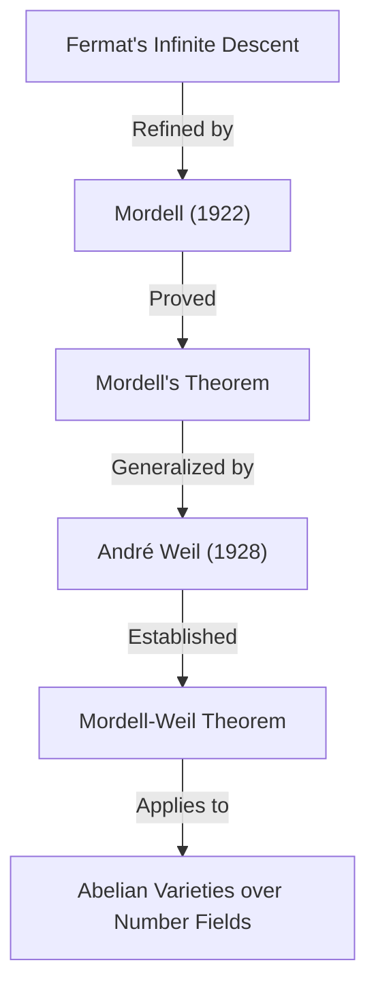

## 1. Introduction

One of the mathematicians who left a brilliant mark in the 20th-century mathematical world, particularly in the field of **Number Theory**, is Louis Joel Mordell (1888–1972). He achieved groundbreaking results in the study of Diophantine equations and laid the foundations for many important theories at the intersection of modern algebraic geometry and number theory. In this article, we will explain in detail the life of Mordell, the important theorems and conjectures bearing his name, and the profound impact he had on the mathematical community.

Many who have heard of Mordell probably know him through **Mordell's Theorem** or the **Mordell Conjecture**. These achievements were not merely the proofs of single theorems but served as important preludes to a magnificent mathematical drama leading to the proof of **[Fermat's Last Theorem](https://kenji.blog/en/p/fermats-last-theorem/)**.

## 2. Early Days: From Self-Study to Cambridge

Louis Joel Mordell was born on January 28, 1888, in Philadelphia, Pennsylvania, USA. His parents were Jewish immigrants from Lithuania, and his family was by no means wealthy. However, from a young age, Mordell showed an extraordinary talent and passion for mathematics.

He bought specialized mathematical books at second-hand bookstores and mastered advanced mathematics almost entirely through **self-study**. In particular, he came across a collection of past examination papers for the **Mathematical Tripos**, the mathematical graduation exam at Cambridge University, and became engrossed in solving them. This experience fueled his strong ambition to study at Cambridge in England.

In 1906, at the age of 18, Mordell traveled to England alone with very little money to take an exam for a scholarship. He successfully won the scholarship and entered St John's College, Cambridge. In the 1909 Tripos, he achieved excellent results, becoming the **Third Wrangler** (ranking third overall).

## 3. Passion for Diophantine Equations

At the center of Mordell's research was always **Diophantine equations**. A Diophantine equation is a problem of finding integer or rational solutions to polynomial equations with integer coefficients. It is named after the ancient Greek mathematician [Diophantus](https://kenji.blog/en/p/diophantus/).

The most famous example of a Diophantine equation is the one related to the Pythagorean theorem:

$$ x^2 + y^2 = z^2 $$

The integer solutions to this equation are called Pythagorean triples, and it is known that there are infinitely many of them. However, as the degree increases, the problem quickly becomes difficult. The following equation, known from [Fermat's Last Theorem](https://kenji.blog/en/p/fermats-last-theorem/), is a prime example:

$$ x^n + y^n = z^n \quad (n \ge 3) $$

Mordell deeply explored the properties of the solutions to such equations. He strongly preferred to tackle concrete equations rather than merely constructing abstract theories.

## 4. Mordell's Equation

Mordell paid particular attention to the form of equation now known as **Mordell's Equation**:

$$ y^2 = x^3 + k $$

Here, $k$ is a non-zero integer. This equation is one of the simplest forms of an elliptic curve. Since [Pierre de Fermat](https://kenji.blog/en/p/fermat/) in the 17th century proved that for $k = -2$, i.e., $y^2 = x^3 - 2$, the only integer solutions are $(x, y) = (3, \pm 5)$, many such equations have been studied.

Mordell deeply researched general methods for finding integer solutions to this equation and the finiteness of its solutions. His approach applied the theory of ideal classes in algebraic number theory, representing a significant leap forward from classical methods.

## 5. Mordell's Theorem: Rational Points on Elliptic Curves

One of Mordell's greatest mathematical achievements is **Mordell's Theorem**, published in 1922. This theorem asserts that the set of all rational points of an elliptic curve over the field of rational numbers $\mathbb{Q}$ is **finitely generated** as an additive group.

It was known that the set of rational points $E(\mathbb{Q})$ of an elliptic curve $E$ has a group structure through the chord-and-tangent method. Mordell proved that this group has the following structure:

$$ E(\mathbb{Q}) \cong E(\mathbb{Q})_{\text{tors}} \oplus \mathbb{Z}^r $$

Here, $E(\mathbb{Q})_{\text{tors}}$ is a **torsion subgroup** consisting of a finite number of points, and $r$ is a non-negative integer called the **rank**.

This theorem means that in order to find all infinitely many rational points of an elliptic curve, it is sufficient to find a finite number of "basis" points. It is a monumental result in arithmetic geometry. Mordell's proof was a modern refinement of [Fermat](https://kenji.blog/en/p/fermat/)'s "Method of infinite descent".

Later, in 1928, the French mathematician [André Weil](https://kenji.blog/en/p/weil/) generalized this theorem to general number fields and abelian varieties, so it is now often called the **Mordell-Weil Theorem**.

## 6. The Mordell Conjecture: The Intersection of Algebraic Geometry and Number Theory

In 1922, along with the publication of his theorem, Mordell proposed an even grander conjecture. This is the **Mordell Conjecture**. This conjecture made the astonishing claim that the number of rational solutions to an equation depends on its "genus," a topological property of the shape defined by the equation.

When considered over complex numbers, an algebraic curve $C$ forms a surface like a donut with holes. The number of these holes is the genus $g$. Mordell classified them as follows:

- If $g = 0$ (e.g., conic sections): If there is a rational point, there are infinitely many.
- If $g = 1$ (e.g., elliptic curves): By Mordell's Theorem, the rational points form a finitely generated group (could be finite or infinite).
- If $g \ge 2$: **There are always only finitely many rational points.**

The claim for the $g \ge 2$ case is the Mordell Conjecture. This conjecture suggested that a "number-theoretic" object (the solutions of an algebraic equation) is completely controlled by a "geometric" object (the number of holes in a shape), which sent a major shockwave through mathematicians at the time.

$$ \text{If } g \ge 2 \text{, then } |C(\mathbb{Q})| < \infty $$

This conjecture remained unsolved for over 60 years. However, in 1983, it was finally proved by the German mathematician [Gerd Faltings](https://kenji.blog/en/p/faltings/), becoming **Faltings's Theorem**. For this achievement, Faltings was awarded the Fields Medal in 1986.

Furthermore, the equation for [Fermat's Last Theorem](https://kenji.blog/en/p/fermats-last-theorem/), $x^n + y^n = z^n$, has a genus of 3 or more when $n \ge 4$. Therefore, from the Mordell Conjecture (Faltings's Theorem), it immediately follows that the [Fermat](https://kenji.blog/en/p/fermat/) equation has at most finitely many rational solutions for each $n$.

## 7. Involvement with Ramanujan and Modular Forms

Mordell's achievements were not limited to Diophantine equations. He also made significant contributions to unresolved problems left by the genius mathematician [Srinivasa Ramanujan](https://kenji.blog/en/p/ramanujan/).

Ramanujan conjectured several surprising properties about the Ramanujan tau function $\tau(n)$, defined as follows:

$$ \sum_{n=1}^{\infty} \tau(n) q^n = q \prod_{n=1}^{\infty} (1 - q^n)^{24} $$

Ramanujan conjectured that when $\gcd(m, n) = 1$, $\tau(mn) = \tau(m)\tau(n)$ (multiplicativity). In 1917, Mordell beautifully proved this conjecture. His proof technique was a precursor to fundamental tools in the theory of modular forms known today as **Hecke operators**. Mordell's discovery played a highly critical role in the later development of the theory of automorphic forms in number theory.

## 8. Formation of the Manchester School and Refugee Support

In the 1920s, Mordell was appointed as a professor at the University of Manchester. There, he built a powerful school of mathematics, elevating the University of Manchester to the center of number theory in the UK.

Mordell is known not only for his research excellence but also for his humanity. In the 1930s, the rise of Nazi Germany forced many Jewish scientists out of their jobs, compelling them to flee Europe. Mordell actively supported them and welcomed them to the University of Manchester.

Among the mathematicians he supported were Paul Erdős, who later became one of the greatest mathematicians of the 20th century, and Kurt Mahler, an authority on transcendental number theory. Mordell's efforts are highly praised not only for the development of British mathematics but also from a humanitarian perspective for rescuing persecuted talents.

## 9. As Hardy's Successor: Late Years at Cambridge

In 1945, upon the retirement of G. H. Hardy, Mordell was elected to the **Sadleirian Professor of Pure Mathematics** at Cambridge University. This is one of the most prestigious posts in the British mathematical community.

Returning to Cambridge, Mordell mentored many students and dedicated himself to the development of number theory. His lectures were passionate, continuously conveying to students the joy and importance of solving concrete problems. Until his retirement in 1953, he reigned as a leader in the British mathematical world.

## 10. Personality and Contribution to Education

Mordell was extremely outspoken and was sometimes known for his unreserved remarks. Despite living in the UK for a long time, he continued to speak English with a strong American accent throughout his life.

He preferred solving concrete problems over constructing theories for the sake of abstract theories. His philosophy that "mathematics is for solving problems" is strongly reflected in his masterpiece "Diophantine Equations". This book was the culmination of his lifelong research and inspired many young mathematicians.

Mordell also had a keen eye for spotting the talent of others. One of his great achievements was raising mathematicians like J. W. S. Cassels, who would later lead the British number theory community.

## 11. Legacy to Modern Mathematics

The legacy that [Louis Mordell](https://kenji.blog/en/p/mordell/) left in the mathematical world is deeply rooted in the foundations of modern mathematics.

1. **Foundations of Arithmetic Geometry**: Mordell's Theorem and the Mordell Conjecture strongly spurred the development of "Arithmetic Geometry," which views number-theoretic objects from a geometric perspective.
2. **Theory of Modular Forms**: The techniques he used in the proof of Ramanujan's conjecture became the starting point for a massive theory that extends to the modern Langlands Program.
3. **Solving Diophantine Equations**: His concrete approaches and numerous papers still serve as the basis for algorithmic methods of solving equations using computers today.

When [Fermat's Last Theorem](https://kenji.blog/en/p/fermats-last-theorem/) was proved by [Andrew Wiles](https://kenji.blog/en/p/wiles/), concepts deeply involving Mordell, such as elliptic curves and modular forms, were indispensable to its theoretical background.

## 12. Conclusion

[Louis Mordell](https://kenji.blog/en/p/mordell/) rose from a passionate self-taught youth to a giant of number theory representing the 20th century. His name is eternally engraved in the history of mathematics in the form of **Mordell's Theorem** and the **Mordell Conjecture**.

With his strong commitment to solving concrete problems and the warm humanity that saved refugee mathematicians, Mordell's life and achievements are an excellent model showing how the discipline of mathematics develops and how a person can contribute to that development. The world of Diophantine equations he explored continues to fascinate many mathematicians to this day.
