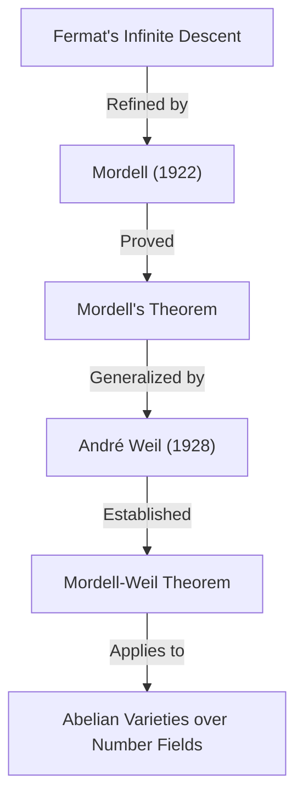

## 1. Introducción

Uno de los matemáticos que dejó una huella brillante en el mundo matemático del siglo XX, particularmente en el campo de la **Teoría de Números**, es Louis Joel Mordell (1888–1972). Logró resultados revolucionarios en el estudio de las ecuaciones diofánticas y sentó las bases de muchas teorías importantes en la intersección de la geometría algebraica moderna y la teoría de números. En este artículo, explicaremos en detalle la vida de Mordell, los teoremas y conjeturas importantes que llevan su nombre y el profundo impacto que tuvo en la comunidad matemática.

Muchos de los que han oído hablar de Mordell probablemente lo conozcan por el **Teorema de Mordell** o la **Conjetura de Mordell**. Estos logros no fueron meras demostraciones de un solo teorema, sino que sirvieron como importantes preludios para un magnífico drama matemático que condujo a la demostración del **Último Teorema de Fermat**.

## 2. Primeros Años: Del Autoestudio a Cambridge

Louis Joel Mordell nació el 28 de enero de 1888 en Filadelfia, Pensilvania, Estados Unidos. Sus padres eran inmigrantes judíos de Lituania y su familia no era en absoluto rica. Sin embargo, desde una edad temprana, Mordell demostró un talento y una pasión extraordinarios por las matemáticas.

Compraba libros de matemáticas especializadas en librerías de segunda mano y dominó las matemáticas avanzadas casi por completo a través del **autoestudio**. En particular, se topó con una colección de exámenes anteriores del **Mathematical Tripos**, el examen de graduación de matemáticas de la Universidad de Cambridge, y se enfrascó en resolverlos. Esta experiencia alimentó su fuerte ambición de estudiar en Cambridge, Inglaterra.

En 1906, a la edad de 18 años, Mordell viajó solo a Inglaterra con muy poco dinero para realizar un examen de beca. Obtuvo la beca con éxito y entró en el St John's College de Cambridge. En el Tripos de 1909, logró excelentes resultados, convirtiéndose en el **Tercer Wrangler** (tercer puesto en la clasificación general).

## 3. Pasión por las Ecuaciones Diofánticas

El centro de la investigación de Mordell fueron siempre las **ecuaciones diofánticas**. Una ecuación diofántica es un problema en el que se buscan soluciones enteras o racionales a ecuaciones polinómicas con coeficientes enteros. Lleva el nombre del antiguo matemático griego [Diofanto](https://kenji.blog/p/diophantus/).

El ejemplo más famoso de ecuación diofántica es la relacionada con el teorema de Pitágoras:

$$ x^2 + y^2 = z^2 $$

Las soluciones enteras de esta ecuación se denominan ternas pitagóricas y se sabe que existen infinitas de ellas. Sin embargo, a medida que aumenta el grado, el problema se vuelve rápidamente difícil. La siguiente ecuación, conocida por el Último Teorema de Fermat, es un excelente ejemplo:

$$ x^n + y^n = z^n \quad (n \ge 3) $$

Mordell exploró profundamente las propiedades de las soluciones a tales ecuaciones. Prefería con creces abordar ecuaciones concretas en lugar de simplemente construir teorías abstractas.

## 4. La Ecuación de Mordell

Mordell prestó especial atención a la forma de la ecuación que ahora se conoce como la **Ecuación de Mordell**:

$$ y^2 = x^3 + k $$

Aquí, $k$ es un entero no nulo. Esta ecuación es una de las formas más simples de una curva elíptica. Desde que [Pierre de Fermat](https://kenji.blog/p/fermat/) en el siglo XVII demostró que para $k = -2$, es decir, $y^2 = x^3 - 2$, las únicas soluciones enteras son $(x, y) = (3, \pm 5)$, se han estudiado muchas de estas ecuaciones.

Mordell investigó profundamente los métodos generales para encontrar soluciones enteras a esta ecuación y la finitud de sus soluciones. Su enfoque aplicó la teoría de clases de ideales en la teoría algebraica de números, representando un salto significativo hacia adelante respecto a los métodos clásicos.

## 5. Teorema de Mordell: Puntos Racionales en Curvas Elípticas

Uno de los mayores logros matemáticos de Mordell es el **Teorema de Mordell**, publicado en 1922. Este teorema afirma que el conjunto de todos los puntos racionales de una curva elíptica sobre el cuerpo de los números racionales $\mathbb{Q}$ está **finitamente generado** como un grupo aditivo.

Se sabía que el conjunto de puntos racionales $E(\mathbb{Q})$ de una curva elíptica $E$ tiene una estructura de grupo mediante el método de la secante y la tangente (chord-and-tangent method). Mordell demostró que este grupo tiene la siguiente estructura:

$$ E(\mathbb{Q}) \cong E(\mathbb{Q})_{\text{tors}} \oplus \mathbb{Z}^r $$

Aquí, $E(\mathbb{Q})_{\text{tors}}$ es un **subgrupo de torsión** que consiste en un número finito de puntos, y $r$ es un número entero no negativo llamado el **rango**.

Este teorema significa que para encontrar todos los infinitos puntos racionales de una curva elíptica, es suficiente encontrar un número finito de puntos "base". Es un resultado monumental en la geometría aritmética. La prueba de Mordell fue un refinamiento moderno del "Método de descenso infinito" de Fermat.

Más tarde, en 1928, el matemático francés [André Weil](https://kenji.blog/p/weil/) generalizó este teorema a cuerpos de números generales y variedades abelianas, por lo que ahora se le suele llamar el **Teorema de Mordell-Weil**.

## 6. La Conjetura de Mordell: La Intersección de la Geometría Algebraica y la Teoría de Números

En 1922, junto con la publicación de su teorema, Mordell propuso una conjetura aún más grandiosa. Esta es la **Conjetura de Mordell**. Esta conjetura hacía la asombrosa afirmación de que el número de soluciones racionales a una ecuación depende de su "género", una propiedad topológica de la forma definida por la ecuación.

Cuando se considera sobre los números complejos, una curva algebraica $C$ forma una superficie como una rosquilla con agujeros. El número de estos agujeros es el género $g$. Mordell los clasificó de la siguiente manera:

- Si $g = 0$ (por ejemplo, secciones cónicas): Si hay un punto racional, hay infinitos.
- Si $g = 1$ (por ejemplo, curvas elípticas): Por el Teorema de Mordell, los puntos racionales forman un grupo finitamente generado (podría ser finito o infinito).
- Si $g \ge 2$: **Siempre hay solo un número finito de puntos racionales.**

La afirmación para el caso $g \ge 2$ es la Conjetura de Mordell. Esta conjetura sugirió que un objeto "teórico de números" (las soluciones de una ecuación algebraica) está completamente controlado por un objeto "geométrico" (el número de agujeros en una forma), lo que provocó una gran conmoción entre los matemáticos de la época.

$$ \text{If } g \ge 2 \text{, then } |C(\mathbb{Q})| < \infty $$

Esta conjetura permaneció sin resolverse durante más de 60 años. Sin embargo, en 1983, fue finalmente demostrada por el matemático alemán [Gerd Faltings](https://kenji.blog/p/faltings/), convirtiéndose en el **Teorema de Faltings**. Por este logro, Faltings recibió la Medalla Fields en 1986.

Además, la ecuación del Último Teorema de Fermat, $x^n + y^n = z^n$, tiene un género de 3 o más cuando $n \ge 4$. Por lo tanto, de la Conjetura de Mordell (Teorema de Faltings), se deduce inmediatamente que la ecuación de Fermat tiene, a lo sumo, un número finito de soluciones racionales para cada $n$.

## 7. Implicación con Ramanujan y las Formas Modulares

Los logros de Mordell no se limitaron a las ecuaciones diofánticas. También hizo contribuciones significativas a los problemas no resueltos que dejó el genio matemático [Srinivasa Ramanujan](https://kenji.blog/p/ramanujan/).

Ramanujan conjeturó varias propiedades sorprendentes sobre la función tau de Ramanujan $\tau(n)$, definida de la siguiente manera:

$$ \sum_{n=1}^{\infty} \tau(n) q^n = q \prod_{n=1}^{\infty} (1 - q^n)^{24} $$

Ramanujan conjeturó que cuando $\gcd(m, n) = 1$, $\tau(mn) = \tau(m)\tau(n)$ (multiplicatividad). En 1917, Mordell demostró bellamente esta conjetura. Su técnica de demostración fue precursora de las herramientas fundamentales en la teoría de formas modulares conocidas hoy como **operadores de Hecke**. El descubrimiento de Mordell jugó un papel sumamente crítico en el desarrollo posterior de la teoría de las formas automorfas en la teoría de números.

## 8. Formación de la Escuela de Mánchester y Apoyo a Refugiados

En la década de 1920, Mordell fue nombrado profesor en la Universidad de Mánchester. Allí construyó una poderosa escuela de matemáticas, elevando a la Universidad de Mánchester a ser el centro de la teoría de números en el Reino Unido.

Mordell es conocido no solo por su excelencia en investigación, sino también por su humanidad. En la década de 1930, el ascenso de la Alemania nazi obligó a muchos científicos judíos a abandonar sus trabajos y huir de Europa. Mordell los apoyó activamente y los acogió en la Universidad de Mánchester.

Entre los matemáticos a los que apoyó se encontraban Paul Erdős, que más tarde se convertiría en uno de los más grandes matemáticos del siglo XX, y Kurt Mahler, una autoridad en la teoría de números trascendentes. Los esfuerzos de Mordell son muy elogiados no solo por el desarrollo de las matemáticas británicas, sino también desde una perspectiva humanitaria por rescatar talentos perseguidos.

## 9. Como Sucesor de Hardy: Últimos Años en Cambridge

En 1945, tras la jubilación de G. H. Hardy, Mordell fue elegido para la **Cátedra Sadleirian de Matemáticas Puras** en la Universidad de Cambridge. Este es uno de los puestos más prestigiosos de la comunidad matemática británica.

De regreso en Cambridge, Mordell fue mentor de muchos estudiantes y se dedicó al desarrollo de la teoría de números. Sus clases eran apasionadas y transmitían continuamente a los estudiantes la alegría y la importancia de resolver problemas concretos. Hasta su jubilación en 1953, reinó como líder en el mundo matemático británico.

## 10. Personalidad y Contribución a la Educación

Mordell era extremadamente franco y, a veces, era conocido por sus comentarios sin reservas. A pesar de vivir en el Reino Unido durante mucho tiempo, continuó hablando inglés con un fuerte acento estadounidense durante toda su vida.

Prefería resolver problemas concretos antes que construir teorías por el mero hecho de las teorías abstractas. Su filosofía de que "las matemáticas sirven para resolver problemas" se refleja fuertemente en su obra maestra "Ecuaciones Diofánticas". Este libro fue la culminación de toda una vida de investigación e inspiró a muchos matemáticos jóvenes.

Mordell también tenía buen ojo para detectar el talento de los demás. Uno de sus grandes logros fue formar a matemáticos como J. W. S. Cassels, que más tarde liderarían la comunidad de la teoría de números británica.

## 11. Legado a las Matemáticas Modernas

El legado que dejó [Louis Mordell](https://kenji.blog/p/mordell/) en el mundo matemático está profundamente arraigado en los cimientos de las matemáticas modernas.

1. **Fundamentos de la Geometría Aritmética**: El Teorema de Mordell y la Conjetura de Mordell impulsaron fuertemente el desarrollo de la "Geometría Aritmética", que ve los objetos teóricos de números desde una perspectiva geométrica.
2. **Teoría de Formas Modulares**: Las técnicas que usó en la demostración de la conjetura de Ramanujan se convirtieron en el punto de partida de una teoría masiva que se extiende hasta el moderno Programa de Langlands.
3. **Resolución de Ecuaciones Diofánticas**: Sus enfoques concretos y numerosos artículos todavía sirven como base para los métodos algorítmicos actuales de resolución de ecuaciones utilizando computadoras.

Cuando [Andrew Wiles](https://kenji.blog/p/wiles/) demostró el Último Teorema de Fermat, los conceptos que involucraban profundamente a Mordell, como las curvas elípticas y las formas modulares, eran indispensables para su base teórica.

## 12. Conclusión

[Louis Mordell](https://kenji.blog/p/mordell/) pasó de ser un joven apasionado y autodidacta a convertirse en un gigante de la teoría de números que representa al siglo XX. Su nombre está grabado eternamente en la historia de las matemáticas en forma del **Teorema de Mordell** y la **Conjetura de Mordell**.

Con su firme compromiso de resolver problemas concretos y la cálida humanidad que salvó a los matemáticos refugiados, la vida y los logros de Mordell son un modelo excelente que muestra cómo se desarrolla la disciplina de las matemáticas y cómo una persona puede contribuir a ese desarrollo. El mundo de las ecuaciones diofánticas que exploró continúa fascinando a muchos matemáticos hasta el día de hoy.
