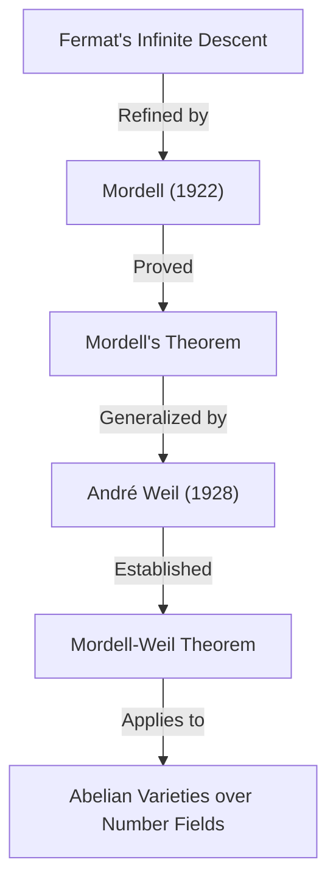

## 1. Introduction

L'un des mathématiciens qui a laissé une empreinte brillante dans le monde mathématique du XXe siècle, en particulier dans le domaine de la **théorie des nombres**, est Louis Joel Mordell (1888–1972). Il a obtenu des résultats révolutionnaires dans l'étude des équations diophantiennes et a jeté les bases de nombreuses théories importantes à l'intersection de la géométrie algébrique moderne et de la théorie des nombres. Dans cet article, nous expliquerons en détail la vie de Mordell, les théorèmes et conjectures importants qui portent son nom, et le profond impact qu'il a eu sur la communauté mathématique.

Beaucoup de ceux qui ont entendu parler de Mordell le connaissent probablement grâce au **Théorème de Mordell** ou à la **Conjecture de Mordell**. Ces réalisations n'étaient pas de simples démonstrations d'un seul théorème, mais ont servi de préludes importants à un magnifique drame mathématique qui a conduit à la démonstration du **Dernier Théorème de Fermat**.

## 2. Les Premières Années : De l'Autodidaxie à Cambridge

Louis Joel Mordell est né le 28 janvier 1888 à Philadelphie, en Pennsylvanie, aux États-Unis. Ses parents étaient des immigrants juifs de Lituanie, et sa famille n'était pas du tout riche. Cependant, dès son plus jeune âge, Mordell a montré un talent et une passion extraordinaires pour les mathématiques.

Il achetait des livres de mathématiques spécialisées dans les librairies d'occasion et maîtrisait les mathématiques avancées presque entièrement en **autodidacte**. En particulier, il est tombé sur un recueil d'anciens examens du **Mathematical Tripos**, l'examen de fin d'études en mathématiques de l'Université de Cambridge, et s'est absorbé dans leur résolution. Cette expérience a nourri sa forte ambition d'étudier à Cambridge en Angleterre.

En 1906, à l'âge de 18 ans, Mordell voyage seul en Angleterre avec très peu d'argent pour passer un examen de bourse. Il remporte la bourse avec succès et entre au St John's College de Cambridge. Lors du Tripos de 1909, il obtient d'excellents résultats, devenant le **Troisième Wrangler** (troisième au classement général).

## 3. Passion pour les Équations Diophantiennes

Au centre des recherches de Mordell se trouvaient toujours les **équations diophantiennes**. Une équation diophantienne est un problème consistant à trouver des solutions entières ou rationnelles à des équations polynomiales à coefficients entiers. Elle tire son nom de l'ancien mathématicien grec [Diophante](https://kenji.blog/fr/p/diophantus/).

L'exemple le plus célèbre d'équation diophantienne est celui lié au théorème de Pythagore :

$$ x^2 + y^2 = z^2 $$

Les solutions entières de cette équation sont appelées triplets pythagoriciens, et on sait qu'il en existe une infinité. Cependant, à mesure que le degré augmente, le problème devient rapidement difficile. L'équation suivante, connue pour le Dernier Théorème de Fermat, en est un excellent exemple :

$$ x^n + y^n = z^n \quad (n \ge 3) $$

Mordell a profondément exploré les propriétés des solutions de telles équations. Il préférait de loin s'attaquer à des équations concrètes plutôt que de construire de simples théories abstraites.

## 4. L'Équation de Mordell

Mordell a accordé une attention particulière à la forme de l'équation maintenant connue sous le nom d'**Équation de Mordell** :

$$ y^2 = x^3 + k $$

Ici, $k$ est un entier non nul. Cette équation est l'une des formes les plus simples d'une courbe elliptique. Depuis que [Pierre de Fermat](https://kenji.blog/fr/p/fermat/) a prouvé au XVIIe siècle que pour $k = -2$, c'est-à-dire $y^2 = x^3 - 2$, les seules solutions entières sont $(x, y) = (3, \pm 5)$, de nombreuses équations de ce type ont été étudiées.

Mordell a mené des recherches approfondies sur les méthodes générales pour trouver des solutions entières à cette équation et sur la finitude de ses solutions. Son approche appliquait la théorie des classes d'idéaux dans la théorie algébrique des nombres, représentant un bond en avant significatif par rapport aux méthodes classiques.

## 5. Le Théorème de Mordell : Points Rationnels sur les Courbes Elliptiques

L'une des plus grandes réalisations mathématiques de Mordell est le **Théorème de Mordell**, publié en 1922. Ce théorème affirme que l'ensemble de tous les points rationnels d'une courbe elliptique sur le corps des nombres rationnels $\mathbb{Q}$ est **de type fini** en tant que groupe additif.

On savait que l'ensemble des points rationnels $E(\mathbb{Q})$ d'une courbe elliptique $E$ a une structure de groupe grâce à la méthode de la corde et de la tangente (chord-and-tangent method). Mordell a prouvé que ce groupe a la structure suivante :

$$ E(\mathbb{Q}) \cong E(\mathbb{Q})_{\text{tors}} \oplus \mathbb{Z}^r $$

Ici, $E(\mathbb{Q})_{\text{tors}}$ est un **sous-groupe de torsion** composé d'un nombre fini de points, et $r$ est un entier positif ou nul appelé le **rang**.

Ce théorème signifie que pour trouver tous les points rationnels en nombre infini d'une courbe elliptique, il suffit de trouver un nombre fini de points de « base ». C'est un résultat monumental en géométrie arithmétique. La preuve de Mordell était un raffinement moderne de la « Méthode de descente infinie » de Fermat.

Plus tard, en 1928, le mathématicien français [André Weil](https://kenji.blog/fr/p/weil/) a généralisé ce théorème à des corps de nombres généraux et à des variétés abéliennes, c'est pourquoi on l'appelle aujourd'hui souvent le **Théorème de Mordell-Weil**.

## 6. La Conjecture de Mordell : L'Intersection de la Géométrie Algébrique et de la Théorie des Nombres

En 1922, en même temps que la publication de son théorème, Mordell a proposé une conjecture encore plus grandiose. Il s'agit de la **Conjecture de Mordell**. Cette conjecture affirmait de manière étonnante que le nombre de solutions rationnelles à une équation dépend de son « genre », une propriété topologique de la forme définie par l'équation.

Considérée sur les nombres complexes, une courbe algébrique $C$ forme une surface semblable à un beignet avec des trous. Le nombre de ces trous est le genre $g$. Mordell les a classés comme suit :

- Si $g = 0$ (par exemple, les coniques) : S'il y a un point rationnel, il y en a une infinité.
- Si $g = 1$ (par exemple, les courbes elliptiques) : Par le Théorème de Mordell, les points rationnels forment un groupe de type fini (il peut être fini ou infini).
- Si $g \ge 2$ : **Il n'y a toujours qu'un nombre fini de points rationnels.**

L'affirmation pour le cas $g \ge 2$ est la Conjecture de Mordell. Cette conjecture suggérait qu'un objet « arithmétique » (les solutions d'une équation algébrique) est complètement contrôlé par un objet « géométrique » (le nombre de trous dans une forme), ce qui a provoqué une onde de choc majeure parmi les mathématiciens de l'époque.

$$ \text{If } g \ge 2 \text{, then } |C(\mathbb{Q})| < \infty $$

Cette conjecture est restée non résolue pendant plus de 60 ans. Cependant, en 1983, elle a finalement été prouvée par le mathématicien allemand [Gerd Faltings](https://kenji.blog/fr/p/faltings/), devenant ainsi le **Théorème de Faltings**. Pour cet accomplissement, Faltings a reçu la Médaille Fields en 1986.

De plus, l'équation du Dernier Théorème de Fermat, $x^n + y^n = z^n$, a un genre supérieur ou égal à 3 lorsque $n \ge 4$. Par conséquent, d'après la Conjecture de Mordell (Théorème de Faltings), il s'ensuit immédiatement que l'équation de Fermat a au plus un nombre fini de solutions rationnelles pour chaque $n$.

## 7. Implication avec Ramanujan et les Formes Modulaires

Les réalisations de Mordell ne se sont pas limitées aux équations diophantiennes. Il a également apporté des contributions significatives aux problèmes non résolus laissés par le génie mathématique [Srinivasa Ramanujan](https://kenji.blog/fr/p/ramanujan/).

Ramanujan avait conjecturé plusieurs propriétés surprenantes concernant la fonction tau de Ramanujan $\tau(n)$, définie comme suit :

$$ \sum_{n=1}^{\infty} \tau(n) q^n = q \prod_{n=1}^{\infty} (1 - q^n)^{24} $$

Ramanujan a conjecturé que lorsque $\gcd(m, n) = 1$, $\tau(mn) = \tau(m)\tau(n)$ (multiplicativité). En 1917, Mordell a magnifiquement prouvé cette conjecture. Sa technique de preuve était un précurseur des outils fondamentaux de la théorie des formes modulaires connus aujourd'hui sous le nom d'**opérateurs de Hecke**. La découverte de Mordell a joué un rôle extrêmement critique dans le développement ultérieur de la théorie des formes automorphes en théorie des nombres.

## 8. Formation de l'École de Manchester et Soutien aux Réfugiés

Dans les années 1920, Mordell est nommé professeur à l'Université de Manchester. Il y a construit une puissante école de mathématiques, élevant l'Université de Manchester au rang de centre de la théorie des nombres au Royaume-Uni.

Mordell est connu non seulement pour son excellence en recherche, mais aussi pour son humanité. Dans les années 1930, la montée de l'Allemagne nazie a forcé de nombreux scientifiques juifs à quitter leur emploi, les obligeant à fuir l'Europe. Mordell les a activement soutenus et accueillis à l'Université de Manchester.

Parmi les mathématiciens qu'il a soutenus figuraient Paul Erdős, qui est devenu plus tard l'un des plus grands mathématiciens du XXe siècle, et Kurt Mahler, une autorité en matière de théorie des nombres transcendants. Les efforts de Mordell sont très appréciés non seulement pour le développement des mathématiques britanniques, mais aussi d'un point de vue humanitaire pour avoir sauvé des talents persécutés.

## 9. En tant que Successeur de Hardy : Les Dernières Années à Cambridge

En 1945, lors de la retraite de G. H. Hardy, Mordell a été élu à la **Chaire Sadleirian de Mathématiques Pures** à l'Université de Cambridge. C'est l'un des postes les plus prestigieux de la communauté mathématique britannique.

De retour à Cambridge, Mordell a encadré de nombreux étudiants et s'est consacré au développement de la théorie des nombres. Ses cours étaient passionnés, transmettant continuellement aux étudiants la joie et l'importance de résoudre des problèmes concrets. Jusqu'à sa retraite en 1953, il a régné en maître sur le monde mathématique britannique.

## 10. Personnalité et Contribution à l'Éducation

Mordell était extrêmement franc et, parfois, il était connu pour ses remarques sans réserve. Bien qu'ayant vécu au Royaume-Uni pendant longtemps, il a continué à parler anglais avec un fort accent américain tout au long de sa vie.

Il préférait résoudre des problèmes concrets plutôt que de construire des théories pour le plaisir des théories abstraites. Sa philosophie selon laquelle « les mathématiques servent à résoudre des problèmes » se reflète fortement dans son chef-d'œuvre « Équations Diophantiennes ». Ce livre était l'aboutissement de toute une vie de recherche et a inspiré de nombreux jeunes mathématiciens.

Mordell avait également un œil vif pour repérer le talent des autres. L'une de ses grandes réalisations a été de former des mathématiciens comme J. W. S. Cassels, qui dirigeront plus tard la communauté britannique de la théorie des nombres.

## 11. Héritage pour les Mathématiques Modernes

L'héritage que [Louis Mordell](https://kenji.blog/fr/p/mordell/) a laissé dans le monde mathématique est profondément enraciné dans les fondements des mathématiques modernes.

1. **Fondements de la Géométrie Arithmétique** : Le Théorème de Mordell et la Conjecture de Mordell ont fortement stimulé le développement de la « Géométrie Arithmétique », qui considère les objets arithmétiques d'un point de vue géométrique.
2. **Théorie des Formes Modulaires** : Les techniques qu'il a utilisées dans la preuve de la conjecture de Ramanujan sont devenues le point de départ d'une théorie massive qui s'étend jusqu'au Programme de Langlands moderne.
3. **Résolution d'Équations Diophantiennes** : Ses approches concrètes et ses nombreux articles servent toujours de base aux méthodes algorithmiques actuelles de résolution d'équations à l'aide d'ordinateurs.

Lorsque le Dernier Théorème de Fermat a été prouvé par [Andrew Wiles](https://kenji.blog/fr/p/wiles/), des concepts impliquant profondément Mordell, tels que les courbes elliptiques et les formes modulaires, étaient indispensables à sa base théorique.

## 12. Conclusion

[Louis Mordell](https://kenji.blog/fr/p/mordell/) est passé d'un jeune autodidacte passionné à un géant de la théorie des nombres représentant le XXe siècle. Son nom est gravé à jamais dans l'histoire des mathématiques sous la forme du **Théorème de Mordell** et de la **Conjecture de Mordell**.

Avec son engagement fort à résoudre des problèmes concrets et la chaleur humaine qui a sauvé les mathématiciens réfugiés, la vie et les réalisations de Mordell sont un excellent modèle montrant comment la discipline des mathématiques se développe et comment une personne peut y contribuer. Le monde des équations diophantiennes qu'il a exploré continue de fasciner de nombreux mathématiciens à ce jour.
