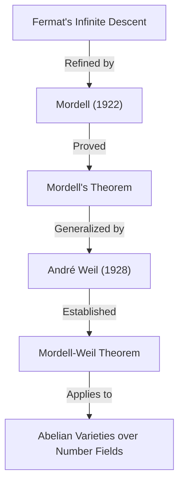

## 1. परिचय

20वीं सदी की गणितीय दुनिया में, विशेष रूप से **संख्या सिद्धांत** (Number Theory) के क्षेत्र में शानदार छाप छोड़ने वाले गणितज्ञों में से एक लुईस जोएल मोर्डेल (1888–1972) हैं। उन्होंने डायोफैंटाइन समीकरणों के अध्ययन में अभूतपूर्व परिणाम प्राप्त किए और आधुनिक बीजगणितीय ज्यामिति और संख्या सिद्धांत के चौराहे पर कई महत्वपूर्ण सिद्धांतों की नींव रखी। इस लेख में, हम मोर्डेल के जीवन, उनके नाम वाले महत्वपूर्ण प्रमेयों और अनुमानों, और गणितीय समुदाय पर उनके गहरे प्रभाव के बारे में विस्तार से बताएंगे।

जिन लोगों ने मोर्डेल के बारे में सुना है, वे संभवतः उन्हें **मोर्डेल के प्रमेय** (Mordell's Theorem) या **मोर्डेल अनुमान** (Mordell Conjecture) के माध्यम से जानते हैं। ये उपलब्धियां केवल एक प्रमेय के प्रमाण नहीं थीं, बल्कि एक शानदार गणितीय नाटक की महत्वपूर्ण प्रस्तावना थीं जिसके कारण **फ़र्मेट का अंतिम प्रमेय** ([Fermat's Last Theorem](https://kenji.blog/hi/p/fermats-last-theorem/)) का प्रमाण मिला।

## 2. शुरुआती दिन: स्व-अध्ययन से कैम्ब्रिज तक

लुईस जोएल मोर्डेल का जन्म 28 जनवरी, 1888 को संयुक्त राज्य अमेरिका के फिलाडेल्फिया, पेंसिल्वेनिया में हुआ था। उनके माता-पिता लिथुआनिया के यहूदी आप्रवासी थे, और उनका परिवार बिल्कुल भी अमीर नहीं था। हालाँकि, कम उम्र से ही, मोर्डेल ने गणित के लिए एक असाधारण प्रतिभा और जुनून दिखाया।

उन्होंने पुरानी किताबों की दुकानों से विशेष गणितीय किताबें खरीदीं और लगभग पूरी तरह से **स्व-अध्ययन** के माध्यम से उन्नत गणित में महारत हासिल की। विशेष रूप से, उन्हें कैम्ब्रिज विश्वविद्यालय में गणित की स्नातक परीक्षा, **मैथमेटिकल ट्राइपोस** (Mathematical Tripos) के पिछले प्रश्नपत्रों का एक संग्रह मिला, और वे उन्हें हल करने में तल्लीन हो गए। इस अनुभव ने इंग्लैंड में कैम्ब्रिज में अध्ययन करने की उनकी तीव्र महत्वाकांक्षा को बढ़ावा दिया।

1906 में, 18 वर्ष की आयु में, मोर्डेल छात्रवृत्ति के लिए परीक्षा देने के लिए बहुत कम पैसों के साथ अकेले इंग्लैंड गए। उन्होंने सफलतापूर्वक छात्रवृत्ति जीती और कैम्ब्रिज के सेंट जॉन्स कॉलेज में प्रवेश लिया। 1909 के ट्राइपोस में, उन्होंने उत्कृष्ट परिणाम प्राप्त किए, और **थर्ड रैंगलर** (कुल मिलाकर तीसरा स्थान) बने।

## 3. डायोफैंटाइन समीकरणों के लिए जुनून

मोर्डेल के शोध के केंद्र में हमेशा **डायोफैंटाइन समीकरण** (Diophantine equations) रहे। डायोफैंटाइन समीकरण पूर्णांक गुणांक वाले बहुपद समीकरणों के पूर्णांक या परिमेय हल खोजने की एक समस्या है। इसका नाम प्राचीन यूनानी गणितज्ञ [डायोफैंटस](https://kenji.blog/hi/p/diophantus/) के नाम पर रखा गया है।

डायोफैंटाइन समीकरण का सबसे प्रसिद्ध उदाहरण पाइथागोरस प्रमेय से संबंधित है:

$$ x^2 + y^2 = z^2 $$

इस समीकरण के पूर्णांक हलों को पाइथागोरस त्रिक कहा जाता है, और यह ज्ञात है कि ऐसे अनंत हल हैं। हालाँकि, जैसे-जैसे घात बढ़ती है, समस्या जल्दी ही कठिन हो जाती है। फ़र्मेट के अंतिम प्रमेय से जाना जाने वाला निम्नलिखित समीकरण एक प्रमुख उदाहरण है:

$$ x^n + y^n = z^n \quad (n \ge 3) $$

मोर्डेल ने ऐसे समीकरणों के हलों के गुणों का गहराई से पता लगाया। उन्होंने केवल अमूर्त सिद्धांतों के निर्माण के बजाय ठोस समीकरणों को हल करना अत्यधिक पसंद किया।

## 4. मोर्डेल का समीकरण

मोर्डेल ने उस समीकरण के रूप पर विशेष ध्यान दिया जिसे अब **मोर्डेल का समीकरण** (Mordell's Equation) कहा जाता है:

$$ y^2 = x^3 + k $$

यहाँ, $k$ एक शून्येतर पूर्णांक है। यह समीकरण अण्डाकार वक्र के सबसे सरल रूपों में से एक है। 17वीं शताब्दी में [पियरे डी फ़र्मेट](https://kenji.blog/hi/p/fermat/) ([Pierre de Fermat](https://kenji.blog/hi/p/fermat/)) ने सिद्ध किया था कि $k = -2$ के लिए, यानी $y^2 = x^3 - 2$, केवल पूर्णांक हल $(x, y) = (3, \pm 5)$ हैं, तब से ऐसे कई समीकरणों का अध्ययन किया गया है।

मोर्डेल ने इस समीकरण के पूर्णांक हल खोजने के सामान्य तरीकों और इसके हलों की परिमितता पर गहराई से शोध किया। उनके दृष्टिकोण ने बीजगणितीय संख्या सिद्धांत में आदर्श वर्गों (ideal classes) के सिद्धांत को लागू किया, जो शास्त्रीय विधियों से एक महत्वपूर्ण छलांग का प्रतिनिधित्व करता है।

## 5. मोर्डेल का प्रमेय: अण्डाकार वक्रों पर परिमेय बिंदु

मोर्डेल की सबसे बड़ी गणितीय उपलब्धियों में से एक 1922 में प्रकाशित **मोर्डेल का प्रमेय** (Mordell's Theorem) है। यह प्रमेय दावा करता है कि परिमेय संख्याओं के क्षेत्र $\mathbb{Q}$ पर एक अण्डाकार वक्र के सभी परिमेय बिंदुओं का समुच्चय एक योज्य समूह के रूप में **परिमित रूप से जनित** (finitely generated) होता है।

यह ज्ञात था कि जीवा-और-स्पर्शरेखा विधि (chord-and-tangent method) के माध्यम से अण्डाकार वक्र $E$ के परिमेय बिंदुओं $E(\mathbb{Q})$ के समुच्चय की एक समूह संरचना होती है। मोर्डेल ने सिद्ध किया कि इस समूह की निम्नलिखित संरचना है:

$$ E(\mathbb{Q}) \cong E(\mathbb{Q})_{\text{tors}} \oplus \mathbb{Z}^r $$

यहाँ, $E(\mathbb{Q})_{\text{tors}}$ एक **मरोड़ उपसमूह** (torsion subgroup) है जिसमें बिंदुओं की एक परिमित संख्या होती है, और $r$ एक गैर-ऋणात्मक पूर्णांक है जिसे **रैंक** (rank) कहा जाता है।

इस प्रमेय का अर्थ है कि अण्डाकार वक्र के सभी अनंत परिमेय बिंदुओं को खोजने के लिए, परिमित संख्या में "आधार" बिंदु खोजना पर्याप्त है। यह अंकगणितीय ज्यामिति में एक स्मारकीय परिणाम है। मोर्डेल का प्रमाण फ़र्मेट की "अनंत अवरोह विधि" (Method of infinite descent) का आधुनिक शोधन था।

बाद में, 1928 में, फ्रांसीसी गणितज्ञ [आंद्रे वेइल](https://kenji.blog/hi/p/weil/) ([André Weil](https://kenji.blog/hi/p/weil/)) ने इस प्रमेय को सामान्य संख्या क्षेत्रों और एबेलियन किस्मों (abelian varieties) के लिए सामान्यीकृत किया, इसलिए अब इसे अक्सर **मोर्डेल-वेइल का प्रमेय** (Mordell-Weil Theorem) कहा जाता है।

## 6. मोर्डेल अनुमान: बीजगणितीय ज्यामिति और संख्या सिद्धांत का चौराहा

1922 में, अपने प्रमेय के प्रकाशन के साथ, मोर्डेल ने एक और भी भव्य अनुमान प्रस्तावित किया। यह **मोर्डेल अनुमान** (Mordell Conjecture) है। इस अनुमान ने यह आश्चर्यजनक दावा किया कि किसी समीकरण के परिमेय हलों की संख्या उसके "जीनस" (genus) पर निर्भर करती है, जो समीकरण द्वारा परिभाषित आकार का एक टोपोलॉजिकल गुण है।

जब जटिल संख्याओं पर विचार किया जाता है, तो एक बीजगणितीय वक्र $C$ छेद वाले डोनट जैसी सतह बनाता है। इन छिद्रों की संख्या जीनस $g$ है। मोर्डेल ने उन्हें इस प्रकार वर्गीकृत किया:

- यदि $g = 0$ (जैसे, शांकव परिच्छेद): यदि कोई परिमेय बिंदु है, तो अनंत बिंदु हैं।
- यदि $g = 1$ (जैसे, अण्डाकार वक्र): मोर्डेल के प्रमेय से, परिमेय बिंदु एक परिमित रूप से जनित समूह बनाते हैं (परिमित या अनंत हो सकते हैं)।
- यदि $g \ge 2$: **हमेशा केवल परिमित संख्या में परिमेय बिंदु होते हैं।**

$g \ge 2$ मामले का दावा मोर्डेल अनुमान है। इस अनुमान ने सुझाव दिया कि एक "संख्या-सैद्धांतिक" वस्तु (बीजगणितीय समीकरण के हल) पूरी तरह से एक "ज्यामितीय" वस्तु (आकार में छिद्रों की संख्या) द्वारा नियंत्रित होती है, जिसने उस समय गणितज्ञों के बीच एक बड़ा सदमा भेजा।

$$ \text{If } g \ge 2 \text{, then } |C(\mathbb{Q})| < \infty $$

यह अनुमान 60 वर्षों से अधिक समय तक अनसुलझा रहा। हालाँकि, 1983 में, इसे अंततः जर्मन गणितज्ञ [गर्ड फाल्टिंग्स](https://kenji.blog/hi/p/faltings/) ([Gerd Faltings](https://kenji.blog/hi/p/faltings/)) द्वारा सिद्ध किया गया, जो **फाल्टिंग्स का प्रमेय** (Faltings's Theorem) बन गया। इस उपलब्धि के लिए, फाल्टिंग्स को 1986 में फील्ड्स मेडल से सम्मानित किया गया था।

इसके अलावा, फ़र्मेट के अंतिम प्रमेय के समीकरण, $x^n + y^n = z^n$, का जीनस 3 या उससे अधिक होता है जब $n \ge 4$ होता है। इसलिए, मोर्डेल अनुमान (फाल्टिंग्स का प्रमेय) से, यह तुरंत अनुसरण करता है कि फ़र्मेट समीकरण में प्रत्येक $n$ के लिए अधिकतम परिमित संख्या में परिमेय हल होते हैं।

## 7. रामानुजन और मॉड्यूलर फॉर्म के साथ जुड़ाव

मोर्डेल की उपलब्धियाँ डायोफैंटाइन समीकरणों तक सीमित नहीं थीं। उन्होंने प्रतिभाशाली गणितज्ञ [श्रीनिवास रामानुजन](https://kenji.blog/hi/p/ramanujan/) ([Srinivasa Ramanujan](https://kenji.blog/hi/p/ramanujan/)) द्वारा छोड़ी गई अनसुलझी समस्याओं में भी महत्वपूर्ण योगदान दिया।

रामानुजन ने रामानुजन ताऊ फ़ंक्शन $\tau(n)$ के बारे में कई आश्चर्यजनक गुणों का अनुमान लगाया, जिसे इस प्रकार परिभाषित किया गया है:

$$ \sum_{n=1}^{\infty} \tau(n) q^n = q \prod_{n=1}^{\infty} (1 - q^n)^{24} $$

रामानुजन ने अनुमान लगाया कि जब $\gcd(m, n) = 1$ होता है, तो $\tau(mn) = \tau(m)\tau(n)$ (गुणात्मकता) होता है। 1917 में, मोर्डेल ने इस अनुमान को खूबसूरती से सिद्ध किया। उनकी प्रमाण तकनीक मॉड्यूलर फॉर्म के सिद्धांत में मूलभूत उपकरणों का अग्रदूत थी जिसे आज **हेके ऑपरेटरों** (Hecke operators) के रूप में जाना जाता है। मोर्डेल की खोज ने संख्या सिद्धांत में ऑटोमोर्फिक रूपों के सिद्धांत के बाद के विकास में एक अत्यंत महत्वपूर्ण भूमिका निभाई।

## 8. मैनचेस्टर स्कूल का गठन और शरणार्थी सहायता

1920 के दशक में, मोर्डेल को मैनचेस्टर विश्वविद्यालय में प्रोफेसर नियुक्त किया गया था। वहाँ, उन्होंने गणित का एक शक्तिशाली स्कूल बनाया, जिसने मैनचेस्टर विश्वविद्यालय को यूके में संख्या सिद्धांत के केंद्र तक पहुँचाया।

मोर्डेल न केवल अपने उत्कृष्ट शोध के लिए बल्कि अपनी मानवता के लिए भी जाने जाते हैं। 1930 के दशक में, नाजी जर्मनी के उदय ने कई यहूदी वैज्ञानिकों को उनकी नौकरियों से निकाल दिया, जिससे उन्हें यूरोप से भागने के लिए मजबूर होना पड़ा। मोर्डेल ने सक्रिय रूप से उनका समर्थन किया और मैनचेस्टर विश्वविद्यालय में उनका स्वागत किया।

जिन गणितज्ञों का उन्होंने समर्थन किया, उनमें पॉल एर्डोस (Paul Erdős) शामिल थे, जो बाद में 20वीं सदी के सबसे महान गणितज्ञों में से एक बने, और कर्ट महलर (Kurt Mahler), जो पारलौकिक संख्या सिद्धांत (transcendental number theory) के अधिकारी थे। ब्रिटिश गणित के विकास के लिए ही नहीं, बल्कि उत्पीड़ित प्रतिभाओं को बचाने के मानवीय दृष्टिकोण से भी मोर्डेल के प्रयासों की अत्यधिक प्रशंसा की जाती है।

## 9. हार्डी के उत्तराधिकारी के रूप में: कैम्ब्रिज में अंतिम वर्ष

1945 में, जी. एच. हार्डी की सेवानिवृत्ति के बाद, मोर्डेल को कैम्ब्रिज विश्वविद्यालय में **शुद्ध गणित के सैडलेरियन प्रोफेसर** (Sadleirian Professor of Pure Mathematics) के लिए चुना गया था। यह ब्रिटिश गणितीय समुदाय में सबसे प्रतिष्ठित पदों में से एक है।

कैम्ब्रिज लौटकर, मोर्डेल ने कई छात्रों का मार्गदर्शन किया और संख्या सिद्धांत के विकास के लिए खुद को समर्पित कर दिया। उनके व्याख्यान भावुक थे, जो छात्रों को ठोस समस्याओं को हल करने की खुशी और महत्व को लगातार बताते थे। 1953 में अपनी सेवानिवृत्ति तक, उन्होंने ब्रिटिश गणितीय दुनिया में एक नेता के रूप में शासन किया।

## 10. व्यक्तित्व और शिक्षा में योगदान

मोर्डेल अत्यधिक मुखर थे और कभी-कभी अपनी स्पष्ट टिप्पणियों के लिए जाने जाते थे। लंबे समय तक यूके में रहने के बावजूद, उन्होंने जीवन भर मजबूत अमेरिकी लहजे में अंग्रेजी बोलना जारी रखा।

उन्होंने अमूर्त सिद्धांतों के निर्माण के बजाय ठोस समस्याओं को हल करना पसंद किया। उनका यह दर्शन कि "गणित समस्याओं को हल करने के लिए है", उनकी उत्कृष्ट कृति "डायोफैंटाइन इक्वेशंस" (Diophantine Equations) में दृढ़ता से परिलक्षित होता है। यह पुस्तक उनके आजीवन शोध का निष्कर्ष थी और इसने कई युवा गणितज्ञों को प्रेरित किया।

मोर्डेल के पास दूसरों की प्रतिभा को पहचानने की गहरी नज़र भी थी। उनकी एक बड़ी उपलब्धि जे. डब्ल्यू. एस. कैसल्स (J. W. S. Cassels) जैसे गणितज्ञों को तैयार करना था, जो बाद में ब्रिटिश संख्या सिद्धांत समुदाय का नेतृत्व करेंगे।

## 11. आधुनिक गणित को विरासत

[लुईस मोर्डेल](https://kenji.blog/hi/p/mordell/) ने गणितीय दुनिया में जो विरासत छोड़ी, वह आधुनिक गणित की नींव में गहराई से निहित है।

1. **अंकगणितीय ज्यामिति की नींव**: मोर्डेल के प्रमेय और मोर्डेल अनुमान ने "अंकगणितीय ज्यामिति" (Arithmetic Geometry) के विकास को दृढ़ता से प्रेरित किया, जो संख्या-सैद्धांतिक वस्तुओं को ज्यामितीय दृष्टिकोण से देखता है।
2. **मॉड्यूलर फॉर्म का सिद्धांत**: रामानुजन के अनुमान के प्रमाण में उन्होंने जिन तकनीकों का इस्तेमाल किया, वे एक विशाल सिद्धांत का शुरुआती बिंदु बन गईं जो आधुनिक लैंगलैंड्स प्रोग्राम (Langlands Program) तक फैला हुआ है।
3. **डायोफैंटाइन समीकरणों को हल करना**: उनके ठोस दृष्टिकोण और कई कागजात अभी भी आज कंप्यूटर का उपयोग करके समीकरणों को हल करने के एल्गोरिथम तरीकों के आधार के रूप में कार्य करते हैं।

जब [एंड्रयू विल्स](https://kenji.blog/hi/p/wiles/) ([Andrew Wiles](https://kenji.blog/hi/p/wiles/)) द्वारा फ़र्मेट का अंतिम प्रमेय सिद्ध किया गया, तो मोर्डेल से गहराई से जुड़ी अवधारणाएं, जैसे अण्डाकार वक्र और मॉड्यूलर रूप, इसकी सैद्धांतिक पृष्ठभूमि के लिए अपरिहार्य थीं।

## 12. निष्कर्ष

[लुईस मोर्डेल](https://kenji.blog/hi/p/mordell/) एक भावुक स्व-शिक्षित युवा से 20वीं सदी का प्रतिनिधित्व करने वाले संख्या सिद्धांत के दिग्गज बन गए। उनका नाम **मोर्डेल के प्रमेय** और **मोर्डेल अनुमान** के रूप में गणित के इतिहास में हमेशा के लिए उकेरा गया है।

ठोस समस्याओं को हल करने की उनकी मजबूत प्रतिबद्धता और शरणार्थी गणितज्ञों को बचाने वाली गर्म मानवता के साथ, मोर्डेल का जीवन और उपलब्धियां एक उत्कृष्ट मॉडल हैं जो यह दर्शाता है कि गणित का अनुशासन कैसे विकसित होता है और एक व्यक्ति उस विकास में कैसे योगदान दे सकता है। डायोफैंटाइन समीकरणों की जिस दुनिया को उन्होंने खोजा, वह आज भी कई गणितज्ञों को मोहित करती है।
