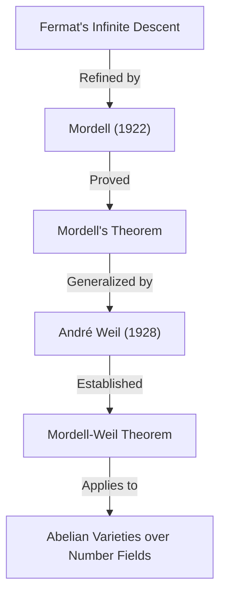

## 1. Pendahuluan

Salah satu matematikawan yang meninggalkan jejak cemerlang di dunia matematika abad ke-20, khususnya di bidang **Teori Bilangan** (Number Theory), adalah Louis Joel Mordell (1888–1972). Ia mencapai hasil yang inovatif dalam studi persamaan Diophantine dan meletakkan dasar bagi banyak teori penting di persimpangan geometri aljabar modern dan teori bilangan. Dalam artikel ini, kita akan menjelaskan secara rinci kehidupan Mordell, teorema dan konjektur penting yang memakai namanya, serta dampak mendalam yang ia berikan pada komunitas matematika.

Banyak orang yang pernah mendengar tentang Mordell mungkin mengenalnya melalui **Teorema Mordell** (Mordell's Theorem) atau **Konjektur Mordell** (Mordell Conjecture). Pencapaian ini bukan sekadar pembuktian teorema tunggal, tetapi berfungsi sebagai awal yang penting dari sebuah drama matematika yang luar biasa yang mengarah pada pembuktian **[Teorema Terakhir Fermat](https://kenji.blog/p/fermats-last-theorem/)** ([Fermat's Last Theorem](https://kenji.blog/p/fermats-last-theorem/)).

## 2. Masa Muda: Dari Belajar Otodidak ke Cambridge

Louis Joel Mordell lahir pada tanggal 28 Januari 1888 di Philadelphia, Pennsylvania, AS. Orang tuanya adalah imigran Yahudi dari Lituania, dan keluarganya sama sekali tidak kaya. Namun, sejak usia muda, Mordell menunjukkan bakat dan hasrat yang luar biasa terhadap matematika.

Ia membeli buku-buku matematika khusus di toko buku bekas dan menguasai matematika tingkat lanjut hampir sepenuhnya melalui **belajar otodidak**. Secara khusus, ia menemukan kumpulan soal ujian masa lalu untuk **Mathematical Tripos**, ujian kelulusan matematika di Universitas Cambridge, dan menjadi asyik menyelesaikannya. Pengalaman ini memicu ambisi kuatnya untuk belajar di Cambridge di Inggris.

Pada tahun 1906, pada usia 18 tahun, Mordell pergi ke Inggris sendirian dengan uang yang sangat sedikit untuk mengikuti ujian beasiswa. Ia berhasil memenangkan beasiswa tersebut dan masuk ke St John's College, Cambridge. Pada Tripos tahun 1909, ia mencapai hasil yang sangat baik, menjadi **Third Wrangler** (peringkat ketiga secara keseluruhan).

## 3. Gairah pada Persamaan Diophantine

Pusat penelitian Mordell selalu pada **persamaan Diophantine**. Persamaan Diophantine adalah masalah mencari solusi bilangan bulat atau rasional untuk persamaan polinomial dengan koefisien bilangan bulat. Dinamai menurut nama matematikawan Yunani kuno [Diophantus](https://kenji.blog/p/diophantus/).

Contoh paling terkenal dari persamaan Diophantine adalah yang terkait dengan teorema Pythagoras:

$$ x^2 + y^2 = z^2 $$

Solusi bilangan bulat untuk persamaan ini disebut triple Pythagoras, dan diketahui jumlahnya tak terhingga. Namun, seiring dengan meningkatnya derajat, masalahnya dengan cepat menjadi sulit. Persamaan berikut, yang dikenal dari [Teorema Terakhir Fermat](https://kenji.blog/p/fermats-last-theorem/), adalah contoh utama:

$$ x^n + y^n = z^n \quad (n \ge 3) $$

Mordell secara mendalam mengeksplorasi sifat-sifat solusi dari persamaan semacam itu. Ia sangat lebih suka menangani persamaan konkret daripada hanya membangun teori abstrak.

## 4. Persamaan Mordell

Mordell memberikan perhatian khusus pada bentuk persamaan yang sekarang dikenal sebagai **Persamaan Mordell**:

$$ y^2 = x^3 + k $$

Di sini, $k$ adalah bilangan bulat bukan nol. Persamaan ini adalah salah satu bentuk kurva eliptik yang paling sederhana. Sejak [Pierre de Fermat](https://kenji.blog/p/fermat/) pada abad ke-17 membuktikan bahwa untuk $k = -2$, yaitu $y^2 = x^3 - 2$, satu-satunya solusi bilangan bulat adalah $(x, y) = (3, \pm 5)$, banyak persamaan seperti itu telah dipelajari.

Mordell secara mendalam meneliti metode umum untuk menemukan solusi bilangan bulat pada persamaan ini dan keterhinggaan solusinya. Pendekatannya menerapkan teori kelas ideal dalam teori bilangan aljabar, yang mewakili lompatan maju yang signifikan dari metode klasik.

## 5. Teorema Mordell: Titik Rasional pada Kurva Eliptik

Salah satu pencapaian matematika terbesar Mordell adalah **Teorema Mordell**, yang diterbitkan pada tahun 1922. Teorema ini menegaskan bahwa himpunan semua titik rasional dari kurva eliptik pada lapangan bilangan rasional $\mathbb{Q}$ dibangun secara **terhingga** (finitely generated) sebagai grup aditif.

Telah diketahui bahwa himpunan titik rasional $E(\mathbb{Q})$ dari kurva eliptik $E$ memiliki struktur grup melalui metode tali busur dan garis singgung (chord-and-tangent method). Mordell membuktikan bahwa grup ini memiliki struktur berikut:

$$ E(\mathbb{Q}) \cong E(\mathbb{Q})_{\text{tors}} \oplus \mathbb{Z}^r $$

Di sini, $E(\mathbb{Q})_{\text{tors}}$ adalah **subgrup torsi** (torsion subgroup) yang terdiri dari sejumlah titik terhingga, dan $r$ adalah bilangan bulat non-negatif yang disebut **rank** (peringkat).

Teorema ini berarti bahwa untuk menemukan semua titik rasional yang jumlahnya tak terhingga dari sebuah kurva eliptik, cukup dengan menemukan sejumlah terhingga titik "basis". Ini adalah hasil yang monumental dalam geometri aritmatika. Pembuktian Mordell adalah penyempurnaan modern dari "Metode penurunan tak terhingga" (Method of infinite descent) Fermat.

Kemudian, pada tahun 1928, matematikawan Prancis [André Weil](https://kenji.blog/p/weil/) memperumum teorema ini pada lapangan bilangan umum dan varietas abelian, sehingga sekarang sering disebut **Teorema Mordell-Weil** (Mordell-Weil Theorem).

## 6. Konjektur Mordell: Persimpangan Geometri Aljabar dan Teori Bilangan

Pada tahun 1922, bersamaan dengan penerbitan teoremanya, Mordell mengajukan konjektur (dugaan) yang lebih megah. Ini adalah **Konjektur Mordell**. Konjektur ini membuat klaim yang menakjubkan bahwa jumlah solusi rasional pada suatu persamaan bergantung pada "genus"-nya, sebuah sifat topologis dari bentuk yang didefinisikan oleh persamaan tersebut.

Bila dipertimbangkan pada bilangan kompleks, kurva aljabar $C$ membentuk permukaan seperti donat yang memiliki lubang. Jumlah lubang ini adalah genus $g$. Mordell mengklasifikasikannya sebagai berikut:

- Jika $g = 0$ (misalnya irisan kerucut): Jika terdapat satu titik rasional, maka terdapat titik rasional yang tak terhingga banyaknya.
- Jika $g = 1$ (misalnya kurva eliptik): Berdasarkan Teorema Mordell, titik-titik rasional membentuk grup yang dibangun secara terhingga (bisa terhingga atau tak terhingga).
- Jika $g \ge 2$: **Selalu hanya terdapat titik rasional dalam jumlah terhingga.**

Klaim untuk kasus $g \ge 2$ adalah Konjektur Mordell. Konjektur ini menyatakan bahwa suatu objek "teori bilangan" (solusi dari persamaan aljabar) sepenuhnya dikendalikan oleh objek "geometris" (jumlah lubang dalam suatu bentuk), yang menyebabkan kejutan besar di kalangan matematikawan pada saat itu.

$$ \text{If } g \ge 2 \text{, then } |C(\mathbb{Q})| < \infty $$

Konjektur ini tetap belum terpecahkan selama lebih dari 60 tahun. Namun, pada tahun 1983, akhirnya dibuktikan oleh matematikawan Jerman [Gerd Faltings](https://kenji.blog/p/faltings/), menjadi **Teorema Faltings**. Atas pencapaian ini, Faltings dianugerahi Medali Fields pada tahun 1986.

Selain itu, persamaan untuk [Teorema Terakhir Fermat](https://kenji.blog/p/fermats-last-theorem/), $x^n + y^n = z^n$, memiliki genus 3 atau lebih ketika $n \ge 4$. Oleh karena itu, dari Konjektur Mordell (Teorema Faltings), segera disimpulkan bahwa persamaan Fermat paling banyak memiliki solusi rasional yang terhingga untuk setiap $n$.

## 7. Keterlibatan dengan Ramanujan dan Bentuk Modular

Pencapaian Mordell tidak terbatas pada persamaan Diophantine. Ia juga memberikan kontribusi signifikan terhadap masalah yang belum terpecahkan yang ditinggalkan oleh matematikawan jenius [Srinivasa Ramanujan](https://kenji.blog/p/ramanujan/).

Ramanujan menduga beberapa sifat mengejutkan tentang fungsi tau Ramanujan $\tau(n)$, yang didefinisikan sebagai berikut:

$$ \sum_{n=1}^{\infty} \tau(n) q^n = q \prod_{n=1}^{\infty} (1 - q^n)^{24} $$

Ramanujan menduga bahwa ketika $\gcd(m, n) = 1$, $\tau(mn) = \tau(m)\tau(n)$ (perkalian). Pada tahun 1917, Mordell membuktikan konjektur ini dengan indah. Teknik pembuktiannya merupakan cikal bakal alat dasar dalam teori bentuk modular yang kini dikenal sebagai **operator Hecke** (Hecke operators). Penemuan Mordell memainkan peran yang sangat kritis dalam pengembangan teori bentuk automorfik dalam teori bilangan di kemudian hari.

## 8. Pembentukan Sekolah Manchester dan Dukungan untuk Pengungsi

Pada tahun 1920-an, Mordell diangkat sebagai profesor di Universitas Manchester. Di sana, ia membangun sekolah matematika yang kuat, mengangkat Universitas Manchester menjadi pusat teori bilangan di Inggris.

Mordell dikenal bukan hanya karena keunggulan penelitiannya tetapi juga karena rasa kemanusiaannya. Pada tahun 1930-an, bangkitnya Nazi Jerman memaksa banyak ilmuwan Yahudi kehilangan pekerjaan mereka, memaksa mereka melarikan diri dari Eropa. Mordell secara aktif mendukung mereka dan menyambut mereka di Universitas Manchester.

Di antara matematikawan yang didukungnya adalah Paul Erdős, yang kemudian menjadi salah satu matematikawan terhebat di abad ke-20, dan Kurt Mahler, seorang ahli teori bilangan transendental. Upaya Mordell sangat dipuji tidak hanya untuk pengembangan matematika Inggris tetapi juga dari perspektif kemanusiaan karena telah menyelamatkan bakat-bakat yang teraniaya.

## 9. Sebagai Penerus Hardy: Tahun-Tahun Terakhir di Cambridge

Pada tahun 1945, setelah pensiunnya G. H. Hardy, Mordell terpilih untuk menjadi **Profesor Matematika Murni Sadleirian** (Sadleirian Professor of Pure Mathematics) di Universitas Cambridge. Ini adalah salah satu jabatan paling bergengsi dalam komunitas matematika Inggris.

Sekembalinya ke Cambridge, Mordell membimbing banyak siswa dan mendedikasikan dirinya untuk pengembangan teori bilangan. Kuliah-kuliahnya sangat penuh semangat, terus-menerus menyampaikan kegembiraan dan pentingnya memecahkan masalah konkret kepada siswa. Hingga pensiun pada tahun 1953, ia berkuasa sebagai pemimpin di dunia matematika Inggris.

## 10. Kepribadian dan Kontribusi pada Pendidikan

Mordell sangat blak-blakan dan kadang-kadang dikenal dengan ucapannya yang tanpa basa-basi. Meskipun tinggal di Inggris dalam waktu yang lama, ia terus berbicara bahasa Inggris dengan aksen Amerika yang kental sepanjang hidupnya.

Ia lebih suka memecahkan masalah konkret daripada membangun teori demi teori abstrak. Filosofinya bahwa "matematika adalah untuk menyelesaikan masalah" tercermin kuat dalam mahakaryanya "Diophantine Equations". Buku ini adalah puncak penelitian seumur hidupnya dan menginspirasi banyak matematikawan muda.

Mordell juga memiliki pandangan tajam untuk melihat bakat orang lain. Salah satu pencapaian besarnya adalah membina matematikawan seperti J. W. S. Cassels, yang kemudian memimpin komunitas teori bilangan Inggris.

## 11. Warisan pada Matematika Modern

Warisan yang ditinggalkan [Louis Mordell](https://kenji.blog/p/mordell/) dalam dunia matematika berakar kuat pada fondasi matematika modern.

1. **Dasar Geometri Aritmatika**: Teorema Mordell dan Konjektur Mordell dengan kuat memacu pengembangan "Geometri Aritmatika", yang memandang objek teori bilangan dari perspektif geometris.
2. **Teori Bentuk Modular**: Teknik yang ia gunakan dalam pembuktian konjektur Ramanujan menjadi titik awal untuk teori masif yang meluas ke Program Langlands (Langlands Program) modern.
3. **Penyelesaian Persamaan Diophantine**: Pendekatan konkretnya dan banyak makalahnya masih menjadi dasar bagi metode algoritma untuk menyelesaikan persamaan menggunakan komputer saat ini.

Ketika [Teorema Terakhir Fermat](https://kenji.blog/p/fermats-last-theorem/) dibuktikan oleh [Andrew Wiles](https://kenji.blog/p/wiles/), konsep-konsep yang sangat melibatkan Mordell, seperti kurva eliptik dan bentuk modular, sangat diperlukan untuk latar belakang teoretisnya.

## 12. Kesimpulan

[Louis Mordell](https://kenji.blog/p/mordell/) bangkit dari seorang pemuda otodidak yang bersemangat menjadi raksasa teori bilangan yang mewakili abad ke-20. Namanya terukir abadi dalam sejarah matematika dalam bentuk **Teorema Mordell** dan **Konjektur Mordell**.

Dengan komitmennya yang kuat untuk menyelesaikan masalah konkret dan kehangatan kemanusiaannya yang menyelamatkan para matematikawan pengungsi, kehidupan dan pencapaian Mordell adalah model yang sangat baik yang menunjukkan bagaimana disiplin ilmu matematika berkembang dan bagaimana seseorang dapat berkontribusi pada perkembangan itu. Dunia persamaan Diophantine yang ia eksplorasi terus mempesona banyak matematikawan hingga hari ini.
