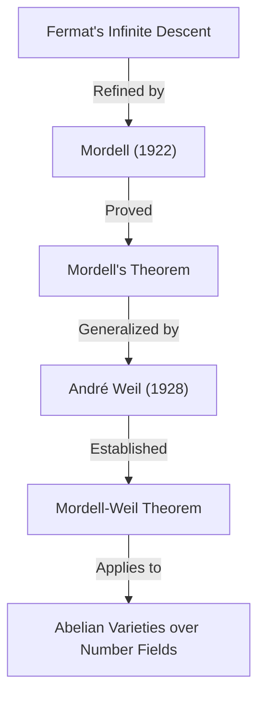

## 1. 서론

20세기 수학계에서, 특히 **수론** (Number Theory) 분야에서 빛나는 발자취를 남긴 수학자 중 한 명이 루이스 조엘 모델 (Louis Joel Mordell, 1888–1972)입니다. 그는 디오판토스 방정식 연구에서 획기적인 성과를 거두었으며, 현대 대수기하학과 수론의 교차점에 있는 많은 중요한 이론의 기초를 닦았습니다. 본 기사에서는 모델의 생애, 그의 이름이 붙은 중요한 정리와 추측, 그리고 그가 수학계에 미친 깊은 영향에 대해 자세히 설명합니다.

모델의 이름을 들어본 사람들의 대부분은 아마도 **모델의 정리** (Mordell's Theorem) 나 **모델 추측** (Mordell Conjecture) 을 통해 그를 알게 되었을 것입니다. 이러한 업적은 단지 하나의 정리를 증명한 것에 그치지 않고, 그 후의 수학, 특히 **페르마의 마지막 정리** ([Fermat's Last Theorem](https://kenji.blog/p/fermats-last-theorem/)) 의 증명에 이르는 장대한 수학적 드라마의 중요한 복선이 되었습니다.

## 2. 젊은 시절의 모델: 독학에서 케임브리지로

루이스 조엘 모델은 1888년 1월 28일 미국 펜실베이니아주 필라델피아에서 태어났습니다. 그의 부모는 리투아니아에서 이주해 온 유대계 이민자였으며, 가정 형편은 결코 넉넉하지 않았습니다. 하지만 젊은 시절부터 모델은 수학에 대해 비정상적일 정도의 재능과 열정을 보였습니다.

그는 헌책방에서 수학 전문 서적을 사 모았고, 거의 **독학** 으로 고등 수학을 습득해 나갔습니다. 특히 케임브리지 대학의 수학 졸업 시험인 **트라이포스** (Mathematical Tripos) 의 기출 문제집을 우연히 접하고 그것을 푸는 데 열중했습니다. 이 경험이 그에게 영국의 케임브리지 대학에서 공부하겠다는 강한 뜻을 품게 했습니다.

1906년, 18세의 모델은 장학금을 얻기 위한 시험을 치르기 위해 적은 자금을 손에 쥐고 단신으로 영국으로 건너갔습니다. 그는 훌륭하게 장학금을 획득하여 케임브리지 대학의 세인트 존스 칼리지에 입학합니다. 1909년 트라이포스에서는 전체 3위의 성적인 **서드 랭글러** (Third Wrangler) 라는 우수한 성적을 거두었습니다.

## 3. 디오판토스 방정식에 대한 열정

모델의 연구 중심에는 항상 **디오판토스 방정식** (Diophantine equations) 이 있었습니다. 디오판토스 방정식이란 정수 계수를 갖는 다항식 방정식에서 정수해나 유리수해를 구하는 문제를 말합니다. 고대 그리스의 수학자 디오판토스의 이름을 따서 명명되었습니다.

가장 유명한 디오판토스 방정식의 예는 피타고라스의 정리와 관련된 방정식입니다.

$$ x^2 + y^2 = z^2 $$

이 방정식의 정수해는 피타고라스 수라고 불리며, 무한히 존재한다는 것이 알려져 있습니다. 하지만 차수가 올라가면 문제는 순식간에 어려워집니다. 페르마의 마지막 정리로 알려진 다음 식은 그 대표적인 예입니다.

$$ x^n + y^n = z^n \quad (n \ge 3) $$

모델은 이러한 방정식의 해의 성질에 대해 깊이 탐구했습니다. 그는 추상적인 이론을 구축하기보다는 구체적인 방정식을 다루는 것을 강하게 선호했습니다.

## 4. 모델 방정식

모델이 특히 주목한 것이 현재는 **모델 방정식** (Mordell's Equation) 이라고 불리는 다음 형태의 방정식입니다.

$$ y^2 = x^3 + k $$

여기서 $k$ 는 0이 아닌 정수입니다. 이 방정식은 타원 곡선 (Elliptic curve) 의 가장 단순한 형태 중 하나입니다. 17세기에 피에르 드 페르마 (Pierre de Fermat) 가 $k = -2$ 인 경우, 즉 $y^2 = x^3 - 2$ 의 정수해가 $(x, y) = (3, \pm 5)$ 뿐임을 증명한 이래, 많은 방정식이 연구되어 왔습니다.

모델은 이 방정식의 정수해를 구하는 일반적인 방법이나 해의 유한성에 대해 깊이 연구했습니다. 그의 접근 방식은 대수적 정수론의 이데알 류 이론을 응용하는 것이었으며, 이전의 고전적인 수법을 크게 도약시키는 것이었습니다.

## 5. 모델의 정리: 타원 곡선의 유리점

모델의 가장 큰 수학적 업적 중 하나가 1922년에 발표된 **모델의 정리** 입니다. 이 정리는 유리수체 $\mathbb{Q}$ 상의 타원 곡선의 유리점 전체의 집합이 덧셈군으로서 **유한 생성** (finitely generated) 됨을 주장하는 것입니다.

타원 곡선 $E$ 의 유리점의 집합 $E(\mathbb{Q})$ 는 현과 접선의 조작 (chord-and-tangent method) 에 의해 군의 구조를 가짐이 알려져 있었습니다. 모델은 이 군이 다음과 같은 구조를 가짐을 증명했습니다.

$$ E(\mathbb{Q}) \cong E(\mathbb{Q})_{\text{tors}} \oplus \mathbb{Z}^r $$

여기서 $E(\mathbb{Q})_{\text{tors}}$ 는 유한 개의 점으로 이루어진 **꼬임 부분군** (torsion subgroup) 이며, $r$ 은 음이 아닌 정수로 **랭크** (rank) 라고 불립니다.

이 정리는 타원 곡선의 유리점을 무한히 찾기 위해서는 유한 개의 '기저'가 되는 점을 찾으면 충분하다는 것을 의미하며, 수론 기하학에 있어서 금자탑이라고 할 수 있는 결과입니다. 모델의 증명은 페르마의 '무한 강하법' (Method of infinite descent) 을 현대적으로 세련되게 다듬은 것이었습니다.

그 후 1928년에 프랑스의 수학자 앙드레 베유 (André Weil) 가 이 정리를 일반 대수체 및 아벨 다양체로 확장했기 때문에, 현재는 **모델-베유의 정리** (Mordell-Weil Theorem) 라고 불리는 경우도 많습니다.

## 6. 모델 추측: 대수기하학과 수론의 교차점

1922년, 모델은 정리의 발표와 동시에 더욱 장대한 추측을 세웠습니다. 그것이 **모델 추측** (Mordell Conjecture) 입니다. 이 추측은 방정식의 유리수해의 개수가 그 방정식이 정의하는 도형의 위상적 성질인 '종수' (genus) 에 의존한다는 놀라운 주장이었습니다.

대수 곡선 $C$ 는 복소수 상에서 생각하면 구멍이 뚫린 도넛과 같은 곡면이 됩니다. 이 구멍의 수가 종수 $g$ 입니다. 모델은 다음과 같이 분류했습니다.

- $g = 0$ 인 경우 (예: 원뿔 곡선): 유리점이 존재하면 그것은 무한히 존재한다.
- $g = 1$ 인 경우 (예: 타원 곡선): 모델의 정리에 의해 유리점은 유한 생성인 군을 이룬다 (유한 개인 경우도 무한 개인 경우도 있다).
- $g \ge 2$ 인 경우: **유리점은 항상 유한 개밖에 존재하지 않는다.**

이 $g \ge 2$ 인 경우의 주장이 모델 추측입니다. 이 추측은 대수 방정식의 해라는 '수론적'인 대상이 도형의 구멍의 수라는 '기하학적'인 대상에 의해 완전히 제어되고 있음을 시사하는 것으로, 당시의 수학자들에게 큰 충격을 주었습니다.

$$ \text{If } g \ge 2 \text{, then } |C(\mathbb{Q})| < \infty $$

이 추측은 60년 이상 동안 미해결인 채로 남아 있었습니다. 그러나 1983년, 독일의 수학자 게르트 팔팅스 (Gerd Faltings) 에 의해 마침내 증명되어 **팔팅스의 정리** (Faltings's Theorem) 가 되었습니다. 이 업적으로 팔팅스는 1986년에 필즈상을 수상했습니다.

또한 페르마의 마지막 정리의 방정식 $x^n + y^n = z^n$ 은 $n \ge 4$ 일 때 종수가 3 이상이 되기 때문에, 모델 추측 (팔팅스의 정리) 으로부터 페르마 방정식의 유리수해는 각 $n$ 에 대해 기껏해야 유한 개밖에 존재하지 않음이 즉시 도출됩니다.

## 7. 라마누잔과의 관계 및 모듈러 형식

모델의 업적은 디오판토스 방정식에 머무르지 않습니다. 그는 천재 수학자 스리니바사 라마누잔 (Srinivasa Ramanujan) 이 남긴 미해결 문제에도 큰 공헌을 했습니다.

라마누잔은 다음과 같이 정의되는 라마누잔의 타우 함수 $\tau(n)$ 에 대해 몇 가지 놀라운 성질을 추측했습니다.

$$ \sum_{n=1}^{\infty} \tau(n) q^n = q \prod_{n=1}^{\infty} (1 - q^n)^{24} $$

라마누잔은 $\gcd(m, n) = 1$ 일 때 $\tau(mn) = \tau(m)\tau(n)$ 이 됨을 (승법성) 추측했습니다. 1917년, 모델은 이 추측을 훌륭하게 증명했습니다. 그의 증명 수법은 오늘날 **헤케 작용소** (Hecke operators) 라고 불리는 모듈러 형식 이론의 기본적인 도구의 선구자가 되는 것이었습니다. 모델의 이 발견은 후의 수론에 있어서 보형 형식론의 발전에 극히 중요한 역할을 했습니다.

## 8. 맨체스터 학파의 형성과 난민 지원

1920년대, 모델은 맨체스터 대학의 교수로 취임했습니다. 그곳에서 그는 강력한 수학 학파를 형성하여 맨체스터 대학을 영국 수론의 중심지로 끌어올렸습니다.

모델은 연구자로서의 탁월성뿐만 아니라 그 인간성으로도 알려져 있습니다. 1930년대, 나치 독일의 대두로 인해 많은 유대계 과학자들이 직장을 잃고 유럽을 떠날 수밖에 없게 되었습니다. 모델은 그들을 적극적으로 지원하여 맨체스터 대학으로 받아들였습니다.

그가 지원한 수학자 중에는 후에 20세기 최대의 수학자 중 한 명이 되는 폴 에르되시 (Paul Erdős) 나 초월수론의 권위자인 쿠르트 말러 (Kurt Mahler) 등이 포함되어 있었습니다. 모델의 진력은 영국 수학계의 발전뿐만 아니라 박해받은 재능을 구한다는 인도적인 관점에서도 높이 평가받고 있습니다.

## 9. 하디의 후계자로서: 케임브리지에서의 만년

1945년, G. H. 하디 (G. H. Hardy) 의 은퇴와 함께 모델은 케임브리지 대학의 **새들러 순수수학 교수직** (Sadleirian Professor of Pure Mathematics) 에 선출되었습니다. 이는 영국 수학계에서 가장 권위 있는 자리 중 하나입니다.

케임브리지로 돌아온 모델은 수많은 학생을 지도하며 수론의 발전에 진력했습니다. 그의 강의는 열정적이었으며, 학생들에게 구체적인 문제를 푸는 것의 기쁨과 중요성을 계속해서 전했습니다. 1953년에 퇴임할 때까지 그는 영국 수학계의 리더로서 군림했습니다.

## 10. 인물상과 교육에 대한 공헌

모델은 매우 솔직하고 때로는 사양 없는 말투를 쓰는 것으로도 알려져 있었습니다. 영국에 오래 살면서도 그는 평생 강한 미국 억양의 영어를 계속 사용했습니다.

그는 추상적인 이론을 위한 이론 구축보다는 구체적인 문제를 푸는 것을 무엇보다도 선호했습니다. "수학은 문제를 풀기 위한 것이다"라는 그의 철학은 그가 저술한 명저 'Diophantine Equations' (디오판토스 방정식) 에도 짙게 반영되어 있습니다. 이 책은 그의 평생에 걸친 연구의 집대성이며, 많은 젊은 수학자들에게 영감을 주었습니다.

모델은 또한 타인의 재능을 알아보는 안목도 뛰어났습니다. J. W. S. 캐설스 (J. W. S. Cassels) 등 후의 영국 수론계를 짊어지고 나갈 수학자들을 키워낸 것도 그의 큰 공적인 것입니다.

## 11. 현대 수학에의 유산

루이스 모델이 수학계에 남긴 유산은 현대 수학의 근간에 깊이 뿌리내리고 있습니다.

1. **수론 기하학의 기초** : 모델의 정리와 모델 추측은 수론적 대상을 기하학적인 시점에서 파악하는 '수론 기하학' (Arithmetic Geometry) 의 발전을 강하게 촉구했습니다.
2. **모듈러 형식론** : 라마누잔의 추측 증명에 이용한 수법은 현대의 랭글랜즈 프로그램 (Langlands Program) 에까지 이어지는 거대한 이론의 출발점이 되었습니다.
3. **디오판토스 방정식의 해법** : 그의 구체적인 접근 방식과 다수의 논문은 현재에도 컴퓨터를 이용한 방정식의 해법 알고리즘의 기초가 되고 있습니다.

페르마의 마지막 정리가 앤드루 와일스 (Andrew Wiles) 에 의해 증명되었을 때에도, 그 이론적 배경에는 타원 곡선이나 모듈러 형식이라는 모델이 깊게 관여한 개념이 불가결했습니다.

## 12. 결론

루이스 모델은 독학의 열정적인 청년에서 20세기를 대표하는 수론의 거성으로 올라섰습니다. 그의 이름은 **모델의 정리** 와 **모델 추측** 이라는 형태로 영원히 수학의 역사에 새겨져 있습니다.

구체적인 문제 해결에 대한 강한 고집과 난민 수학자들을 구한 따뜻한 인간성. 모델의 생애와 업적은 수학이라는 학문이 어떻게 발전하고, 그리고 사람이 어떻게 그 발전에 공헌할 수 있는지를 보여주는 훌륭한 모범이라고 할 수 있을 것입니다. 그가 탐구했던 디오판토스 방정식의 세계는 지금도 여전히 많은 수학자들을 매료시키고 있습니다.
