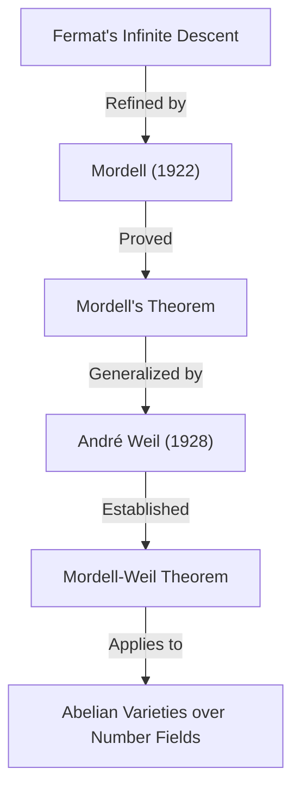

## 1. はじめに

20世紀の数学界において、とりわけ **数論** (Number Theory) の分野で輝かしい足跡を残した数学者の一人が、ルイス・[モーデル](https://kenji.blog/p/mordell/) (Louis Joel Mordell, 1888–1972) です。彼は[ディオファントス](/p/diophantus/)方程式の研究において画期的な成果を挙げ、現代の代数幾何学と数論の交差点にある多くの重要な理論の基礎を築きました。本記事では、[モーデル](https://kenji.blog/p/mordell/)の生涯、彼の名が冠された重要な定理や予想、そして彼が数学界に与えた深い影響について、詳細に解説します。

[モーデル](https://kenji.blog/p/mordell/)の名前を耳にしたことがある人の多くは、おそらく **モーデルの定理** (Mordell's Theorem) や **モーデル予想** (Mordell Conjecture) を通じて彼を知ったことでしょう。これらの業績は、単なる一つの定理の証明にとどまらず、その後の数学、特に **[フェルマーの最終定理](/p/fermats-last-theorem/)** ([Fermat's Last Theorem](https://kenji.blog/p/fermats-last-theorem/)) の証明に至る壮大な数学的ドラマの重要な伏線となりました。

## 2. 若き日の[モーデル](https://kenji.blog/p/mordell/)：独学からケンブリッジへ

ルイス・ジョエル・[モーデル](https://kenji.blog/p/mordell/)は、1888年1月28日、アメリカ合衆国のペンシルベニア州フィラデルフィアで生まれました。彼の両親はリトアニアから移住してきたユダヤ系の移民であり、決して裕福な家庭ではありませんでした。しかし、若い頃から[モーデル](https://kenji.blog/p/mordell/)は数学に対して異常なまでの才能と情熱を示しました。

彼は古本屋で数学の専門書を買い集め、ほとんど **独学** で高度な数学を習得していきました。特に、ケンブリッジ大学の数学卒業試験である **トライポス** (Mathematical Tripos) の過去問題集に出会い、それを解くことに熱中しました。この経験が、彼にイギリスのケンブリッジ大学で学ぶという強い志を抱かせました。

1906年、18歳の[モーデル](https://kenji.blog/p/mordell/)は奨学金を得るための試験を受けるために、わずかな資金を手に単身でイギリスへと渡りました。彼は見事に奨学金を獲得し、ケンブリッジ大学のセント・ジョンズ・カレッジに入学します。1909年のトライポスでは、全体で3位の成績である **サード・ラングラー** (Third Wrangler) という優秀な成績を収めました。

## 3. [ディオファントス](https://kenji.blog/p/diophantus/)方程式への情熱

[モーデル](https://kenji.blog/p/mordell/)の研究の中心にあったのは、常に **[ディオファントス](/p/diophantus/)方程式** (Diophantine equations) でした。[ディオファントス](/p/diophantus/)方程式とは、整数係数を持つ多項式の方程式において、整数解や有理数解を求める問題のことです。古代ギリシャの数学者[ディオファントス](https://kenji.blog/p/diophantus/)にちなんで名付けられました。

最も有名な[ディオファントス](https://kenji.blog/p/diophantus/)方程式の例は、[ピタゴラス](https://kenji.blog/p/pythagoras/)の定理に関連する方程式です。

$$ x^2 + y^2 = z^2 $$

この方程式の整数解は[ピタゴラス](https://kenji.blog/p/pythagoras/)数と呼ばれ、無限に存在することが知られています。しかし、次数が上がると問題は途端に難しくなります。[フェルマーの最終定理](https://kenji.blog/p/fermats-last-theorem/)で知られる以下の式は、その最たる例です。

$$ x^n + y^n = z^n \quad (n \ge 3) $$

[モーデル](https://kenji.blog/p/mordell/)は、このような方程式の解の性質について深く探求しました。彼は抽象的な理論を構築するだけでなく、具体的な方程式に取り組むことを強く好みました。

## 4. [モーデル](https://kenji.blog/p/mordell/)方程式

[モーデル](https://kenji.blog/p/mordell/)が特に注目したのが、現在では **[モーデル](https://kenji.blog/p/mordell/)方程式** (Mordell's Equation) と呼ばれる次の形の方程式です。

$$ y^2 = x^3 + k $$

ここで $k$ はゼロではない整数です。この方程式は、楕円曲線 (Elliptic curve) の最も単純な形の一つです。17世紀に[ピエール・ド・フェルマー](https://kenji.blog/p/fermat/) ([Pierre de Fermat](https://kenji.blog/p/fermat/)) が $k = -2$ の場合、すなわち $y^2 = x^3 - 2$ の整数解が $(x, y) = (3, \pm 5)$ のみであることを証明して以来、多くの方程式が研究されてきました。

[モーデル](https://kenji.blog/p/mordell/)は、この方程式の整数解を求める一般的な方法や、解の有限性について深く研究しました。彼のアプローチは、代数的整数論におけるイデアル類の理論を応用するものであり、それまでの古典的な手法を大きく飛躍させるものでした。

## 5. [モーデル](https://kenji.blog/p/mordell/)の定理：楕円曲線の有理点

[モーデル](https://kenji.blog/p/mordell/)の最大の数学的業績の一つが、1922年に発表された **[モーデル](https://kenji.blog/p/mordell/)の定理** です。この定理は、有理数体 $\mathbb{Q}$ 上の楕円曲線の有理点全体の集合が、加法群として **有限生成** (finitely generated) であることを主張するものです。

楕円曲線 $E$ の有理点の集合 $E(\mathbb{Q})$ は、弦と接線の操作 (chord-and-tangent method) によって群の構造を持つことが知られていました。[モーデル](https://kenji.blog/p/mordell/)は、この群が次のような構造を持つことを証明しました。

$$ E(\mathbb{Q}) \cong E(\mathbb{Q})_{\text{tors}} \oplus \mathbb{Z}^r $$

ここで、$E(\mathbb{Q})_{\text{tors}}$ は有限個の点からなる **ねじれ部分群** (torsion subgroup) であり、$r$ は非負の整数で **ランク** (rank) と呼ばれます。

この定理は、楕円曲線の有理点を無限に見つけるためには、有限個の「基底」となる点を見つければ十分であることを意味しており、数論幾何学における金字塔とも言える結果です。[モーデル](https://kenji.blog/p/mordell/)の証明は、[フェルマー](https://kenji.blog/p/fermat/)の「無限降下法」 (Method of infinite descent) を現代的に洗練させたものでした。

その後、1928年にフランスの数学者アンドレ・[ヴェイユ](https://kenji.blog/p/weil/) (André Weil) がこの定理を一般の代数体およびアーベル多様体に拡張したため、現在では **モーデル・[ヴェイユ](https://kenji.blog/p/weil/)の定理** (Mordell-Weil Theorem) と呼ばれることも多いです。

## 6. [モーデル](https://kenji.blog/p/mordell/)予想：代数幾何学と数論の交差点

1922年、[モーデル](https://kenji.blog/p/mordell/)は定理の発表と同時に、さらに壮大な予想を立てました。それが **[モーデル](https://kenji.blog/p/mordell/)予想** (Mordell Conjecture) です。この予想は、方程式の有理数解の個数が、その方程式が定義する図形の位相的な性質である「種数」 (genus) に依存するという驚くべき主張でした。

代数曲線 $C$ は、複素数上で考えると穴の開いたドーナツのような曲面になります。この穴の数が種数 $g$ です。[モーデル](https://kenji.blog/p/mordell/)は次のように分類しました。

- $g = 0$ の場合（例：円錐曲線）: 有理点が存在すれば、それは無限に存在する。
- $g = 1$ の場合（例：楕円曲線）: [モーデル](https://kenji.blog/p/mordell/)の定理により、有理点は有限生成な群をなす（有限個の場合も無限個の場合もある）。
- $g \ge 2$ の場合: **有理点は常に有限個しか存在しない。**

この $g \ge 2$ の場合の主張が[モーデル](https://kenji.blog/p/mordell/)予想です。この予想は、代数方程式の解という「数論的」な対象が、図形の穴の数という「幾何学的」な対象によって完全に制御されていることを示唆しており、当時の数学者たちに大きな衝撃を与えました。

$$ \text{If } g \ge 2 \text{, then } |C(\mathbb{Q})| < \infty $$

この予想は60年以上もの間、未解決のままでした。しかし1983年、ドイツの数学者[ゲルト・ファルティングス](https://kenji.blog/p/faltings/) (Gerd Faltings) によってついに証明され、**ファルティングスの定理** (Faltings's Theorem) となりました。この業績により、[ファルティングス](https://kenji.blog/p/faltings/)は1986年にフィールズ賞を受賞しました。

また、[フェルマーの最終定理](https://kenji.blog/p/fermats-last-theorem/)の方程式 $x^n + y^n = z^n$ は、$n \ge 4$ のとき種数が 3 以上になるため、モーデル予想（ファルティングスの定理）から、[フェルマー](https://kenji.blog/p/fermat/)方程式の有理数解は各 $n$ に対して高々有限個しか存在しないことが直ちに導かれます。

## 7. [ラマヌジャン](https://kenji.blog/p/ramanujan/)との関わりとモジュラー形式

[モーデル](https://kenji.blog/p/mordell/)の業績は[ディオファントス](/p/diophantus/)方程式にとどまりません。彼は天才数学者シュリニヴァーサ・ラマヌジャン ([Srinivasa Ramanujan](https://kenji.blog/p/ramanujan/)) の残した未解決問題にも大きな貢献をしました。

[ラマヌジャン](https://kenji.blog/p/ramanujan/)は、次のように定義される[ラマヌジャン](https://kenji.blog/p/ramanujan/)のタウ関数 $\tau(n)$ について、いくつかの驚くべき性質を予想していました。

$$ \sum_{n=1}^{\infty} \tau(n) q^n = q \prod_{n=1}^{\infty} (1 - q^n)^{24} $$

[ラマヌジャン](https://kenji.blog/p/ramanujan/)は、$\gcd(m, n) = 1$ のとき、 $\tau(mn) = \tau(m)\tau(n)$ となること（乗法性）を予想しました。1917年、モーデルはこの予想を見事に証明しました。彼の証明の手法は、今日では **ヘッケ作用素** (Hecke operators) と呼ばれるモジュラー形式の理論における基本的な道具の先駆けとなるものでした。[モーデル](https://kenji.blog/p/mordell/)のこの発見は、後の数論における保型形式論の発展に極めて重要な役割を果たしました。

## 8. マンチェスター学派の形成と難民支援

1920年代、[モーデル](https://kenji.blog/p/mordell/)はマンチェスター大学の教授に就任しました。そこで彼は強力な数学の学派を形成し、マンチェスター大学をイギリスにおける数論の中心地へと押し上げました。

[モーデル](https://kenji.blog/p/mordell/)は研究者としての卓越性だけでなく、その人間性でも知られています。1930年代、ナチス・ドイツの台頭によって多くのユダヤ系科学者が職を追われ、ヨーロッパから逃れざるを得なくなりました。[モーデル](https://kenji.blog/p/mordell/)は彼らを積極的に支援し、マンチェスター大学に受け入れました。

彼が支援した数学者の中には、後に20世紀最大の数学者の一人となるポール・エルデシュ (Paul Erdős) や、超越数論の権威であるクルト・マーラー (Kurt Mahler) などが含まれていました。[モーデル](https://kenji.blog/p/mordell/)の尽力は、イギリス数学界の発展だけでなく、迫害された才能を救うという人道的な観点からも高く評価されています。

## 9. ハーディの後継者として：ケンブリッジでの晩年

1945年、G.H.ハーディ (G. H. Hardy) の引退に伴い、[モーデル](https://kenji.blog/p/mordell/)はケンブリッジ大学の **サドラー純粋数学教授職** (Sadleirian Professor of Pure Mathematics) に選出されました。これはイギリスの数学界において最も権威のあるポストの一つです。

ケンブリッジに戻った[モーデル](https://kenji.blog/p/mordell/)は、数多くの学生を指導し、数論の発展に尽力しました。彼の講義は情熱的であり、学生たちに具体的な問題を解くことの喜びと重要性を伝え続けました。1953年に退官するまで、彼はイギリス数学界のリーダーとして君臨しました。

## 10. 人物像と教育への貢献

[モーデル](https://kenji.blog/p/mordell/)は非常に率直で、時には遠慮のない物言いをすることでも知られていました。イギリスに長く住みながらも、彼は終生強いアメリカなまりの英語を話し続けました。

彼は抽象的な理論のための理論構築よりも、具体的な問題を解くことを何よりも好みました。「数学は問題を解くためのものである」という彼の哲学は、彼が著した名著『Diophantine Equations』（[ディオファントス](https://kenji.blog/p/diophantus/)方程式）にも色濃く反映されています。この本は、彼の生涯にわたる研究の集大成であり、多くの若い数学者にインスピレーションを与えました。

[モーデル](https://kenji.blog/p/mordell/)はまた、他者の才能を見抜く目にも長けていました。ジョン・キャッセルズ (J. W. S. Cassels) など、後のイギリス数論界を背負って立つ数学者たちを育て上げたのも彼の大きな功績です。

## 11. 現代数学への遺産

ルイス・[モーデル](https://kenji.blog/p/mordell/)が数学界に残した遺産は、現代数学の根幹に深く根付いています。

1. **数論幾何学の基礎** : [モーデル](https://kenji.blog/p/mordell/)の定理と[モーデル](https://kenji.blog/p/mordell/)予想は、数論的対象を幾何学的な視点から捉える「数論幾何学」 (Arithmetic Geometry) の発展を強く促しました。
2. **モジュラー形式論** : [ラマヌジャン](https://kenji.blog/p/ramanujan/)の予想の証明で用いた手法は、現代のラングランズ・プログラム (Langlands Program) にまで連なる巨大な理論の出発点となりました。
3. **[ディオファントス](https://kenji.blog/p/diophantus/)方程式の解法** : 彼の具体的なアプローチと多数の論文は、現在でもコンピュータを用いた方程式の解法アルゴリズムの基礎となっています。

[フェルマーの最終定理](https://kenji.blog/p/fermats-last-theorem/)が[アンドリュー・ワイルズ](/p/wiles/) (Andrew Wiles) によって証明された際にも、その理論的背景には楕円曲線やモジュラー形式という、[モーデル](https://kenji.blog/p/mordell/)が深く関わった概念が不可欠でした。

## 12. 結論

ルイス・[モーデル](https://kenji.blog/p/mordell/)は、独学の情熱的な青年から、20世紀を代表する数論の巨星へと登り詰めました。彼の名前は **モーデルの定理** や **[モーデル](https://kenji.blog/p/mordell/)予想** という形で永遠に数学の歴史に刻まれています。

具体的な問題解決への強いこだわりと、難民数学者を救った温かい人間性。[モーデル](https://kenji.blog/p/mordell/)の生涯と業績は、数学という学問がいかにして発展し、そして人がいかにしてその発展に貢献できるかを示す、素晴らしい模範と言えるでしょう。彼の探求した[ディオファントス](https://kenji.blog/p/diophantus/)方程式の世界は、今もなお多くの数学者たちを魅了し続けています。
