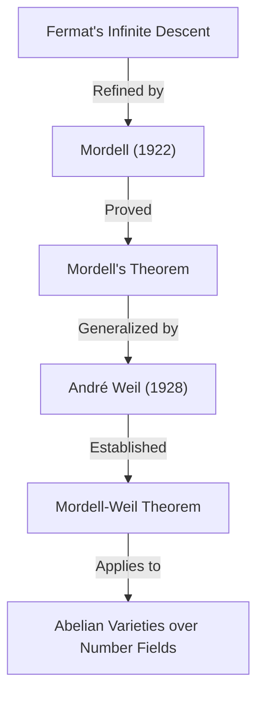

## 1. Introdução

Um dos matemáticos que deixou uma marca brilhante no mundo matemático do século XX, particularmente no campo da **Teoria dos Números**, é Louis Joel Mordell (1888–1972). Ele alcançou resultados inovadores no estudo de equações diofantinas e lançou as bases para muitas teorias importantes na interseção da geometria algébrica moderna com a teoria dos números. Neste artigo, explicaremos em detalhes a vida de Mordell, os importantes teoremas e conjecturas que levam seu nome e o profundo impacto que ele teve na comunidade matemática.

Muitos dos que ouviram falar de Mordell provavelmente o conhecem pelo **Teorema de Mordell** ou pela **Conjectura de Mordell**. Essas realizações não foram meras provas de um único teorema, mas serviram como prelúdios importantes para um magnífico drama matemático que levou à prova do **Último Teorema de [Fermat](https://kenji.blog/pt/p/fermat/)**.

## 2. Primeiros Anos: Do Autoestudo a Cambridge

Louis Joel Mordell nasceu em 28 de janeiro de 1888, na Filadélfia, Pensilvânia, EUA. Seus pais eram imigrantes judeus da Lituânia e sua família não era de forma alguma rica. No entanto, desde muito jovem, Mordell demonstrou talento e paixão extraordinários pela matemática.

Ele comprava livros matemáticos especializados em sebos e dominava a matemática avançada quase inteiramente através do **autoestudo**. Em particular, ele se deparou com uma coleção de provas anteriores para o **Mathematical Tripos**, o exame de graduação em matemática da Universidade de Cambridge, e ficou absorto em resolvê-las. Essa experiência alimentou sua forte ambição de estudar em Cambridge, na Inglaterra.

Em 1906, aos 18 anos, Mordell viajou sozinho para a Inglaterra com muito pouco dinheiro para fazer um exame para uma bolsa de estudos. Ele ganhou a bolsa com sucesso e ingressou no St John's College, em Cambridge. No Tripos de 1909, alcançou excelentes resultados, tornando-se o **Terceiro Wrangler** (terceiro classificado na classificação geral).

## 3. Paixão por Equações Diofantinas

No centro da pesquisa de Mordell estavam sempre as **equações diofantinas**. Uma equação diofantina é um problema para encontrar soluções inteiras ou racionais para equações polinomiais com coeficientes inteiros. O nome vem do antigo matemático grego [Diofanto](https://kenji.blog/pt/p/diophantus/).

O exemplo mais famoso de equação diofantina é aquele relacionado ao teorema de Pitágoras:

$$ x^2 + y^2 = z^2 $$

As soluções inteiras para esta equação são chamadas de triplas pitagóricas, e sabe-se que existem infinitas delas. No entanto, à medida que o grau aumenta, o problema rapidamente se torna difícil. A seguinte equação, conhecida pelo Último Teorema de [Fermat](https://kenji.blog/pt/p/fermat/), é um excelente exemplo:

$$ x^n + y^n = z^n \quad (n \ge 3) $$

Mordell explorou profundamente as propriedades das soluções para tais equações. Ele preferia fortemente lidar com equações concretas em vez de meramente construir teorias abstratas.

## 4. A Equação de Mordell

Mordell prestou atenção especial à forma da equação agora conhecida como **Equação de Mordell**:

$$ y^2 = x^3 + k $$

Aqui, $k$ é um número inteiro diferente de zero. Esta equação é uma das formas mais simples de uma curva elíptica. Desde que [Pierre de Fermat](https://kenji.blog/pt/p/fermat/) no século 17 provou que para $k = -2$, ou seja, $y^2 = x^3 - 2$, as únicas soluções inteiras são $(x, y) = (3, \pm 5)$, muitas dessas equações foram estudadas.

Mordell pesquisou profundamente os métodos gerais para encontrar soluções inteiras para esta equação e a finitude de suas soluções. Sua abordagem aplicou a teoria de classes de ideais na teoria algébrica dos números, representando um salto significativo em relação aos métodos clássicos.

## 5. Teorema de Mordell: Pontos Racionais em Curvas Elípticas

Uma das maiores realizações matemáticas de Mordell é o **Teorema de Mordell**, publicado em 1922. Este teorema afirma que o conjunto de todos os pontos racionais de uma curva elíptica sobre o corpo dos números racionais $\mathbb{Q}$ é **finitamente gerado** como um grupo aditivo.

Sabia-se que o conjunto de pontos racionais $E(\mathbb{Q})$ de uma curva elíptica $E$ tem uma estrutura de grupo através do método da corda e tangente (chord-and-tangent method). Mordell provou que esse grupo tem a seguinte estrutura:

$$ E(\mathbb{Q}) \cong E(\mathbb{Q})_{\text{tors}} \oplus \mathbb{Z}^r $$

Aqui, $E(\mathbb{Q})_{\text{tors}}$ é um **subgrupo de torção** que consiste num número finito de pontos, e $r$ é um número inteiro não negativo chamado de **posto** (rank).

Este teorema significa que para encontrar todos os infinitos pontos racionais de uma curva elíptica, é suficiente encontrar um número finito de pontos "base". É um resultado monumental na geometria aritmética. A prova de Mordell foi um refinamento moderno do "Método da descida infinita" de [Fermat](https://kenji.blog/pt/p/fermat/).

Mais tarde, em 1928, o matemático francês [André Weil](https://kenji.blog/pt/p/weil/) generalizou este teorema para corpos de números gerais e variedades abelianas, por isso é hoje frequentemente chamado de **Teorema de Mordell-Weil**.

## 6. A Conjectura de Mordell: A Interseção da Geometria Algébrica e da Teoria dos Números

Em 1922, junto com a publicação de seu teorema, Mordell propôs uma conjectura ainda mais grandiosa. Esta é a **Conjectura de Mordell**. Esta conjectura fez a surpreendente afirmação de que o número de soluções racionais de uma equação depende de seu "gênero", uma propriedade topológica da forma definida pela equação.

Quando considerada sobre os números complexos, uma curva algébrica $C$ forma uma superfície semelhante a uma rosquinha com buracos. O número desses buracos é o gênero $g$. Mordell os classificou da seguinte forma:

- Se $g = 0$ (por exemplo, seções cônicas): Se houver um ponto racional, haverá infinitos.
- Se $g = 1$ (por exemplo, curvas elípticas): Pelo Teorema de Mordell, os pontos racionais formam um grupo finitamente gerado (pode ser finito ou infinito).
- Se $g \ge 2$: **Sempre há apenas um número finito de pontos racionais.**

A afirmação para o caso $g \ge 2$ é a Conjectura de Mordell. Esta conjectura sugeria que um objeto "teórico dos números" (as soluções de uma equação algébrica) é completamente controlado por um objeto "geométrico" (o número de buracos em uma forma), o que causou grande choque entre os matemáticos da época.

$$ \text{If } g \ge 2 \text{, then } |C(\mathbb{Q})| < \infty $$

Esta conjectura permaneceu sem solução por mais de 60 anos. No entanto, em 1983, foi finalmente provada pelo matemático alemão [Gerd Faltings](https://kenji.blog/pt/p/faltings/), tornando-se o **Teorema de Faltings**. Por essa conquista, Faltings recebeu a Medalha Fields em 1986.

Além disso, a equação do Último Teorema de [Fermat](https://kenji.blog/pt/p/fermat/), $x^n + y^n = z^n$, tem um gênero 3 ou mais quando $n \ge 4$. Portanto, pela Conjectura de Mordell (Teorema de Faltings), segue-se imediatamente que a equação de [Fermat](https://kenji.blog/pt/p/fermat/) tem no máximo um número finito de soluções racionais para cada $n$.

## 7. Envolvimento com Ramanujan e Formas Modulares

As realizações de Mordell não se limitaram a equações diofantinas. Ele também fez contribuições significativas para os problemas não resolvidos deixados pelo genial matemático [Srinivasa Ramanujan](https://kenji.blog/pt/p/ramanujan/).

Ramanujan conjecturou várias propriedades surpreendentes sobre a função tau de Ramanujan $\tau(n)$, definida da seguinte forma:

$$ \sum_{n=1}^{\infty} \tau(n) q^n = q \prod_{n=1}^{\infty} (1 - q^n)^{24} $$

Ramanujan conjecturou que quando $\gcd(m, n) = 1$, $\tau(mn) = \tau(m)\tau(n)$ (multiplicatividade). Em 1917, Mordell provou lindamente essa conjectura. Sua técnica de prova foi precursora das ferramentas fundamentais na teoria de formas modulares hoje conhecidas como **operadores de Hecke**. A descoberta de Mordell desempenhou um papel extremamente crítico no desenvolvimento posterior da teoria das formas automórficas na teoria dos números.

## 8. Formação da Escola de Manchester e Apoio a Refugiados

Na década de 1920, Mordell foi nomeado professor da Universidade de Manchester. Lá, ele construiu uma poderosa escola de matemática, elevando a Universidade de Manchester ao centro da teoria dos números no Reino Unido.

Mordell é conhecido não apenas por sua excelência em pesquisa, mas também por sua humanidade. Na década de 1930, a ascensão da Alemanha nazista forçou muitos cientistas judeus a deixarem seus empregos, obrigando-os a fugir da Europa. Mordell os apoiou ativamente e os acolheu na Universidade de Manchester.

Entre os matemáticos que ele apoiou estavam Paul Erdős, que mais tarde se tornou um dos maiores matemáticos do século 20, e Kurt Mahler, uma autoridade em teoria dos números transcendentes. Os esforços de Mordell são muito elogiados não apenas pelo desenvolvimento da matemática britânica, mas também do ponto de vista humanitário por resgatar talentos perseguidos.

## 9. Como Sucessor de Hardy: Os Últimos Anos em Cambridge

Em 1945, com a aposentadoria de G. H. Hardy, Mordell foi eleito para o **Professor Sadleirian de Matemática Pura** na Universidade de Cambridge. Este é um dos postos mais prestigiados da comunidade matemática britânica.

Retornando a Cambridge, Mordell foi mentor de muitos alunos e dedicou-se ao desenvolvimento da teoria dos números. Suas palestras eram apaixonadas, transmitindo continuamente aos alunos a alegria e a importância de resolver problemas concretos. Até sua aposentadoria em 1953, reinou como líder no mundo matemático britânico.

## 10. Personalidade e Contribuição para a Educação

Mordell era extremamente franco e às vezes era conhecido por seus comentários sem reservas. Apesar de viver muito tempo no Reino Unido, continuou a falar inglês com um forte sotaque americano durante toda a vida.

Ele preferia resolver problemas concretos em vez de construir teorias pelo bem das teorias abstratas. A sua filosofia de que "a matemática serve para resolver problemas" reflecte-se fortemente na sua obra-prima "Equações Diofantinas". Este livro foi o culminar da pesquisa de sua vida e inspirou muitos jovens matemáticos.

Mordell também tinha um olhar atento para detectar o talento dos outros. Uma das suas grandes realizações foi a formação de matemáticos como J. W. S. Cassels, que mais tarde lideraria a comunidade britânica da teoria dos números.

## 11. Legado para a Matemática Moderna

O legado que [Louis Mordell](https://kenji.blog/pt/p/mordell/) deixou no mundo matemático está profundamente enraizado nos fundamentos da matemática moderna.

1. **Fundamentos da Geometria Aritmética**: O Teorema de Mordell e a Conjectura de Mordell estimularam fortemente o desenvolvimento da "Geometria Aritmética", que vê objetos teóricos dos números de uma perspectiva geométrica.
2. **Teoria das Formas Modulares**: As técnicas que ele usou na demonstração da conjectura de Ramanujan tornaram-se o ponto de partida de uma teoria massiva que se estende até o moderno Programa de Langlands.
3. **Resolução de Equações Diofantinas**: Suas abordagens concretas e numerosos artigos ainda hoje servem como base para métodos algorítmicos de resolução de equações por meio de computadores.

Quando o Último Teorema de [Fermat](https://kenji.blog/pt/p/fermat/) foi provado por [Andrew Wiles](https://kenji.blog/pt/p/wiles/), conceitos envolvendo profundamente Mordell, como curvas elípticas e formas modulares, foram indispensáveis ao seu embasamento teórico.

## 12. Conclusão

[Louis Mordell](https://kenji.blog/pt/p/mordell/) passou de um jovem apaixonado e autodidata a um gigante da teoria dos números, representando o século XX. O seu nome está gravado para sempre na história da matemática sob a forma do **Teorema de Mordell** e da **Conjectura de Mordell**.

Com seu forte compromisso em resolver problemas concretos e o calor humano que salvou matemáticos refugiados, a vida e as conquistas de Mordell são um excelente modelo que mostra como a disciplina da matemática se desenvolve e como uma pessoa pode contribuir para esse desenvolvimento. O mundo das equações diofantinas que ele explorou continua a fascinar muitos matemáticos até hoje.
