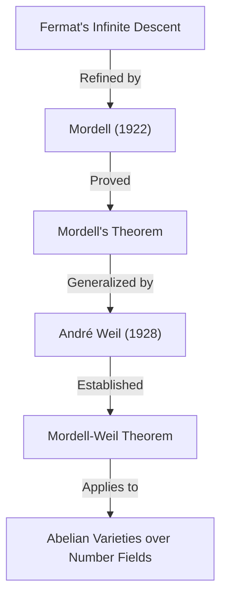

## 1. Введение

Одним из математиков, оставивших яркий след в математическом мире 20-го века, в частности в области **теории чисел**, является Луис Джоэл Морделл (1888–1972). Он достиг выдающихся результатов в изучении диофантовых уравнений и заложил основы многих важных теорий на стыке современной алгебраической геометрии и теории чисел. В этой статье мы подробно расскажем о жизни Морделла, важных теоремах и гипотезах, носящих его имя, и о том глубоком влиянии, которое он оказал на математическое сообщество.

Многие из тех, кто слышал о Морделле, вероятно, знают его благодаря **теореме Морделла** или **гипотезе Морделла**. Эти достижения были не просто доказательствами отдельных теорем, но послужили важными прелюдиями к великолепной математической драме, приведшей к доказательству **Великой теоремы Ферма**.

## 2. Ранние годы: от самообразования до Кембриджа

Луис Джоэл Морделл родился 28 января 1888 года в Филадельфии, штат Пенсильвания, США. Его родители были еврейскими иммигрантами из Литвы, и его семья была далеко не богатой. Однако с ранних лет Морделл проявлял необычайный талант и страсть к математике.

Он покупал специализированные математические книги в букинистических магазинах и освоил высшую математику почти полностью путем **самообразования**. В частности, он наткнулся на сборник прошлых экзаменационных работ для **Mathematical Tripos**, выпускного экзамена по математике в Кембриджском университете, и увлекся их решением. Этот опыт подогрел в нем сильное стремление учиться в Кембридже в Англии.

В 1906 году, в возрасте 18 лет, Морделл отправился в Англию один, с очень небольшими деньгами, чтобы сдать экзамен на стипендию. Он успешно выиграл стипендию и поступил в колледж Святого Иоанна в Кембридже. На экзамене Tripos в 1909 году он добился отличных результатов, став **третьим вранглером** (Third Wrangler, третье место в общем зачете).

## 3. Страсть к диофантовым уравнениям

В центре исследований Морделла всегда находились **диофантовы уравнения**. [Диофант](https://kenji.blog/ru/p/diophantus/)ово уравнение — это проблема нахождения целых или рациональных решений для полиномиальных уравнений с целыми коэффициентами. Оно названо в честь древнегреческого математика [Диофант](https://kenji.blog/ru/p/diophantus/)а.

Самый известный пример диофантова уравнения — уравнение, связанное с теоремой Пифагора:

$$ x^2 + y^2 = z^2 $$

Целые решения этого уравнения называются пифагоровыми тройками, и известно, что их существует бесконечно много. Однако по мере увеличения степени проблема быстро становится сложной. Следующее уравнение, известное из Великой теоремы Ферма, является ярким примером:

$$ x^n + y^n = z^n \quad (n \ge 3) $$

Морделл глубоко исследовал свойства решений таких уравнений. Он настоятельно предпочитал заниматься конкретными уравнениями, а не просто строить абстрактные теории.

## 4. Уравнение Морделла

Морделл уделил особое внимание форме уравнения, ныне известной как **уравнение Морделла**:

$$ y^2 = x^3 + k $$

Здесь $k$ — ненулевое целое число. Это уравнение является одной из простейших форм эллиптической кривой. С тех пор как в 17 веке [Пьер де Ферма](https://kenji.blog/ru/p/fermat/) доказал, что для $k = -2$, т.е. $y^2 = x^3 - 2$, единственными целыми решениями являются $(x, y) = (3, \pm 5)$, было изучено множество подобных уравнений.

Морделл глубоко исследовал общие методы нахождения целых решений этого уравнения и конечность его решений. В его подходе применялась теория идеалов из алгебраической теории чисел, что представляло собой значительный скачок вперед по сравнению с классическими методами.

## 5. Теорема Морделла: рациональные точки на эллиптических кривых

Одним из величайших математических достижений Морделла является **теорема Морделла**, опубликованная в 1922 году. Эта теорема утверждает, что множество всех рациональных точек эллиптической кривой над полем рациональных чисел $\mathbb{Q}$ **конечно порождено** как аддитивная группа.

Было известно, что множество рациональных точек $E(\mathbb{Q})$ эллиптической кривой $E$ имеет структуру группы (через метод хорд и касательных). Морделл доказал, что эта группа имеет следующую структуру:

$$ E(\mathbb{Q}) \cong E(\mathbb{Q})_{\text{tors}} \oplus \mathbb{Z}^r $$

Здесь $E(\mathbb{Q})_{\text{tors}}$ — это **подгруппа кручения**, состоящая из конечного числа точек, а $r$ — неотрицательное целое число, называемое **рангом**.

Эта теорема означает, что для нахождения всех бесконечно многих рациональных точек эллиптической кривой достаточно найти конечное число «базисных» точек. Это монументальный результат в арифметической геометрии. Доказательство Морделла было современным уточнением ферматовского «метода бесконечного спуска».

Позже, в 1928 году, французский математик [Андре Вейль](https://kenji.blog/ru/p/weil/) обобщил эту теорему на общие числовые поля и абелевы многообразия, поэтому теперь ее часто называют **теоремой Морделла-Вейля**.

## 6. Гипотеза Морделла: пересечение алгебраической геометрии и теории чисел

В 1922 году, вместе с публикацией своей теоремы, Морделл предложил еще более грандиозную гипотезу. Это **гипотеза Морделла**. В этой гипотезе делалось поразительное утверждение о том, что количество рациональных решений уравнения зависит от его «рода» — топологического свойства фигуры, определяемой уравнением.

При рассмотрении над комплексными числами алгебраическая кривая $C$ образует поверхность, подобную пончику с дырками. Количество этих дырок и есть род $g$. Морделл классифицировал их следующим образом:

- Если $g = 0$ (например, конические сечения): Если есть рациональная точка, то их бесконечно много.
- Если $g = 1$ (например, эллиптические кривые): По теореме Морделла рациональные точки образуют конечно порожденную группу (может быть конечной или бесконечной).
- Если $g \ge 2$: **Всегда существует только конечное число рациональных точек.**

Утверждение для случая $g \ge 2$ — это и есть гипотеза Морделла. Эта гипотеза предполагала, что «теоретико-числовой» объект (решения алгебраического уравнения) полностью контролируется «геометрическим» объектом (количеством дырок в фигуре), что вызвало шок среди математиков того времени.

$$ \text{If } g \ge 2 \text{, then } |C(\mathbb{Q})| < \infty $$

Эта гипотеза оставалась нерешенной более 60 лет. Однако в 1983 году она была наконец доказана немецким математиком Гердом Фальтингсом и стала называться **теоремой Фальтингса**. За это достижение Фальтингс был награжден Филдсовской премией в 1986 году.

Более того, уравнение для Великой теоремы Ферма, $x^n + y^n = z^n$, имеет род 3 или более при $n \ge 4$. Следовательно, из гипотезы Морделла (теоремы Фальтингса) немедленно следует, что уравнение Ферма имеет не более чем конечное число рациональных решений для каждого $n$.

## 7. Связь с Рамануджаном и модулярные формы

Достижения Морделла не ограничивались диофантовыми уравнениями. Он также внес значительный вклад в нерешенные проблемы, оставленные гениальным математиком Сринивасой Рамануджаном.

Рамануджан высказал гипотезу о нескольких удивительных свойствах $\tau$-функции Рамануджана $\tau(n)$, определяемой следующим образом:

$$ \sum_{n=1}^{\infty} \tau(n) q^n = q \prod_{n=1}^{\infty} (1 - q^n)^{24} $$

Рамануджан предположил, что при $\gcd(m, n) = 1$ выполняется условие $\tau(mn) = \tau(m)\tau(n)$ (мультипликативность). В 1917 году Морделл блестяще доказал эту гипотезу. Его метод доказательства стал предвестником фундаментальных инструментов в теории модулярных форм, известных сегодня как **операторы Гекке**. Открытие Морделла сыграло крайне важную роль в последующем развитии теории автоморфных форм в теории чисел.

## 8. Создание Манчестерской школы и поддержка беженцев

В 1920-х годах Морделл был назначен профессором Манчестерского университета. Там он создал мощную математическую школу, сделав Манчестерский университет центром теории чисел в Великобритании.

Морделл известен не только своими выдающимися исследованиями, но и своей человечностью. В 1930-х годах приход к власти нацистской Германии вынудил многих еврейских ученых лишиться работы и бежать из Европы. Морделл активно поддерживал их и принимал в Манчестерском университеете.

Среди математиков, которых он поддерживал, были Пал Эрдёш, ставший впоследствии одним из величайших математиков 20-го века, и Курт Малер, авторитет в области теории трансцендентных чисел. Усилия Морделла высоко оцениваются не только с точки зрения развития британской математики, но и с гуманитарной точки зрения за спасение преследуемых талантов.

## 9. Преемник Харди: последние годы в Кембридже

В 1945 году, после выхода на пенсию Г. Х. Харди, Морделл был избран на должность **Садлейрианского профессора чистой математики** в Кембриджском университете. Это один из самых престижных постов в британском математическом сообществе.

Вернувшись в Кембридж, Морделл был наставником многих студентов и посвятил себя развитию теории чисел. Его лекции были страстными, постоянно донося до студентов радость и важность решения конкретных задач. Вплоть до своей отставки в 1953 году он безраздельно властвовал как лидер в британском математическом мире.

## 10. Личность и вклад в образование

Морделл был чрезвычайно откровенен и иногда был известен своими резкими замечаниями. Несмотря на то, что он долгое время жил в Великобритании, он продолжал говорить по-английски с сильным американским акцентом на протяжении всей своей жизни.

Он предпочитал решать конкретные проблемы, а не строить теории ради абстрактных теорий. Его философия, согласно которой «математика предназначена для решения задач», нашла яркое отражение в его шедевре «[Диофант](https://kenji.blog/ru/p/diophantus/)овы уравнения». Эта книга стала кульминацией его исследований длиною в жизнь и вдохновила многих молодых математиков.

Морделл также обладал острым зрением на выявление талантов других людей. Одним из его великих достижений было воспитание таких математиков, как Дж. В. С. Касселс, которые позже возглавили британское сообщество теории чисел.

## 11. Наследие для современной математики

Наследие, оставленное Луисом Морделлом в математическом мире, глубоко укоренилось в основах современной математики.

1. **Основы арифметической геометрии**: Теорема Морделла и гипотеза Морделла послужили мощным стимулом для развития «арифметической геометрии», которая рассматривает теоретико-числовые объекты с геометрической точки зрения.
2. **Теория модулярных форм**: Методы, которые он использовал при доказательстве гипотезы Рамануджана, стали отправной точкой массивной теории, которая простирается вплоть до современной программы Ленглендса.
3. **Решение диофантовых уравнений**: Его конкретные подходы и многочисленные статьи по-прежнему служат основой для алгоритмических методов решения уравнений с использованием компьютеров в наши дни.

Когда [Эндрю Уайлс](https://kenji.blog/ru/p/wiles/) доказал Великую теорему Ферма, концепции, в которых Морделл принимал глубокое участие, такие как эллиптические кривые и модулярные формы, были незаменимы для ее теоретического обоснования.

## 12. Заключение

[Луис Морделл](https://kenji.blog/ru/p/mordell/) вырос из увлеченного юноши-самоучки до гиганта теории чисел, представляющего 20-й век. Его имя навечно вписано в историю математики в виде **теоремы Морделла** и **гипотезы Морделла**.

Благодаря его сильной приверженности решению конкретных проблем и человеческой теплоте, которая спасла математиков-беженцев, жизнь и достижения Морделла являются прекрасным примером того, как развивается математическая дисциплина и как человек может внести свой вклад в это развитие. Мир диофантовых уравнений, который он исследовал, продолжает очаровывать многих математиков и по сей день.
