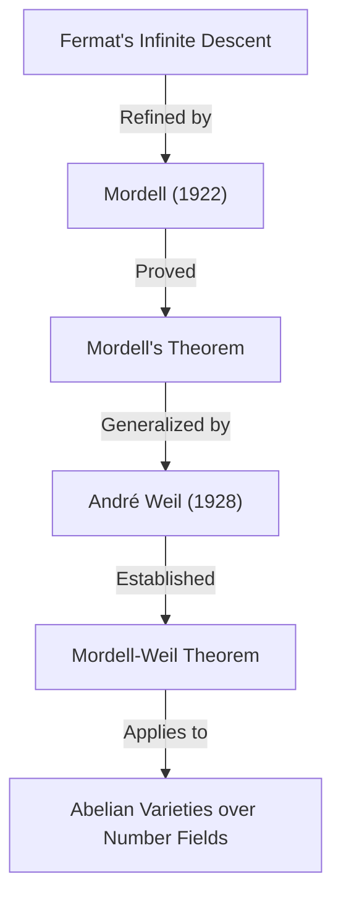

## 1. 引言

在20世纪的数学界，尤其是在 **数论** 领域留下辉煌足迹的数学家之一，便是路易斯·乔尔·莫德尔（Louis Joel Mordell, 1888–1972）。他在丢番图方程的研究中取得了突破性成果，并为现代代数几何与数论交叉领域的许多重要理论奠定了基础。在本文中，我们将详细探讨莫德尔的生平、以他名字命名的重要定理与猜想，以及他对数学界产生的深远影响。

许多听说过莫德尔名字的人，大概都是通过 **莫德尔定理** （Mordell's Theorem）或 **莫德尔猜想** （Mordell Conjecture）认识他的。这些成就不仅仅是证明了某个单一定理，更成为了后来通向证明 **费马大定理** （Fermat's Last Theorem）那场宏大数学戏剧的重要伏笔。

## 2. 早年的莫德尔：从自学到剑桥

路易斯·乔尔·莫德尔于1888年1月28日出生在美国宾夕法尼亚州的费城。他的父母是从立陶宛移居的犹太裔移民，家庭条件绝不富裕。然而，莫德尔从年轻时起就对数学展现出了异乎寻常的天赋与热情。

他在二手书店收集数学专业书籍，几乎完全通过 **自学** 掌握了高等数学。特别是，他偶然接触到了剑桥大学数学毕业考试—— **Tripos** （Mathematical Tripos）的历年真题集，并沉迷于解题。这段经历让他萌生了前往英国剑桥大学求学的强烈志向。

1906年，18岁的莫德尔为了参加奖学金考试，带着微薄的资金只身前往英国。他出色地赢得了奖学金，进入了剑桥大学圣约翰学院。在1909年的Tripos考试中，他取得了总成绩第三名的优异成绩，荣获 **Third Wrangler** 的称号。

## 3. 对丢番图方程的热情

莫德尔研究的中心始终是 **丢番图方程** （Diophantine equations）。丢番图方程是指在具有整数系数的多项式方程中，求解整数解或有理数解的问题。它以古希腊数学家丢番图的名字命名。

最著名的丢番图方程例子是与毕达哥拉斯定理相关的方程：

$$ x^2 + y^2 = z^2 $$

这个方程的整数解被称为毕达哥拉斯三元组，已知它们是无限存在的。然而，随着次数的升高，问题瞬间变得极其困难。因费马大定理而闻名的以下方程便是一个典型例子：

$$ x^n + y^n = z^n \quad (n \ge 3) $$

莫德尔对这类方程解的性质进行了深入探索。他相比于构建抽象理论，更强烈地偏好于解决具体的方程问题。

## 4. 莫德尔方程

莫德尔特别关注的是现在被称为 **莫德尔方程** （Mordell's Equation）的以下形式的方程：

$$ y^2 = x^3 + k $$

这里 $k$ 是非零整数。这个方程是椭圆曲线（Elliptic curve）最简单的形式之一。自从17世纪皮埃尔·德·费马（Pierre de Fermat）证明了在 $k = -2$ 的情况下，即 $y^2 = x^3 - 2$ 的整数解仅有 $(x, y) = (3, \pm 5)$ 以来，这类方程得到了广泛的研究。

莫德尔深入研究了求解该方程整数解的一般方法以及解的有限性。他的方法应用了代数数论中的理想类理论，使传统的古典方法实现了重大飞跃。

## 5. 莫德尔定理：椭圆曲线上的有理点

莫德尔最伟大的数学成就之一，是1922年发表的 **莫德尔定理** 。该定理断言，定义在有理数域 $\mathbb{Q}$ 上的椭圆曲线的所有有理点集合，作为一个加法群是 **有限生成的** （finitely generated）。

当时已经知道，椭圆曲线 $E$ 的有理点集合 $E(\mathbb{Q})$ 通过“弦切法”（chord-and-tangent method）具有群的结构。莫德尔证明了该群具有以下结构：

$$ E(\mathbb{Q}) \cong E(\mathbb{Q})_{\text{tors}} \oplus \mathbb{Z}^r $$

其中，$E(\mathbb{Q})_{\text{tors}}$ 是由有限个点组成的 **挠子群** （torsion subgroup），$r$ 是非负整数，被称为 **秩** （rank）。

这一定理意味着，为了找到椭圆曲线上无限多个有理点，只需找到有限个“基底”点即可，它是算术几何中的一座丰碑。莫德尔的证明是对费马的“无限递降法”（Method of infinite descent）进行现代洗练后的结果。

此后，1928年法国数学家安德烈·韦伊（André Weil）将该定理推广到一般的代数数域和阿贝尔簇，因此现在通常被称为 **莫德尔-韦伊定理** （Mordell-Weil Theorem）。

## 6. 莫德尔猜想：代数几何与数论的交叉点

1922年，在发表定理的同时，莫德尔提出了一个更为宏大的猜想。这就是 **莫德尔猜想** （Mordell Conjecture）。该猜想提出了一个令人震惊的主张：方程式有理数解的个数，取决于该方程式所定义的图形的拓扑性质——“亏格”（genus）。

如果在复数域上考虑，代数曲线 $C$ 会形成一个类似带洞甜甜圈的曲面。这个洞的数量就是亏格 $g$。莫德尔将其分类如下：

- 当 $g = 0$ 时（例如：圆锥曲线）：如果存在有理点，则有无限多个。
- 当 $g = 1$ 时（例如：椭圆曲线）：根据莫德尔定理，有理点构成一个有限生成的群（可能是有限个，也可能是无限个）。
- 当 $g \ge 2$ 时： **有理点始终只有有限个。**

这个关于 $g \ge 2$ 时的论断即为莫德尔猜想。该猜想暗示了代数方程的解这种“数论”对象，完全被图形的洞数这种“几何”对象所控制，给当时的数学家们带来了巨大的冲击。

$$ \text{If } g \ge 2 \text{, then } |C(\mathbb{Q})| < \infty $$

这个猜想在60多年的时间里一直悬而未决。然而，在1983年，它终于被德国数学家格尔德·法尔廷斯（Gerd Faltings）证明，成为了 **法尔廷斯定理** （Faltings's Theorem）。凭借这一成就，法尔廷斯在1986年荣获了菲尔兹奖。

此外，费马大定理的方程 $x^n + y^n = z^n$ ，当 $n \ge 4$ 时，亏格大于等于3。因此，由莫德尔猜想（法尔廷斯定理）可以直接推导出，对于每一个 $n$，费马方程的有理数解至多只有有限个。

## 7. 与拉马努金的交集及模形式

莫德尔的成就并不仅限于丢番图方程。他对天才数学家斯里尼瓦萨·拉马努金（Srinivasa Ramanujan）留下的未解问题也做出了巨大贡献。

拉马努金对如下定义的拉马努金 $\tau$ 函数 $\tau(n)$ 提出了几个令人惊叹的性质猜想：

$$ \sum_{n=1}^{\infty} \tau(n) q^n = q \prod_{n=1}^{\infty} (1 - q^n)^{24} $$

拉马努金猜想，当 $\gcd(m, n) = 1$ 时， $\tau(mn) = \tau(m)\tau(n)$ （积性）。1917年，莫德尔漂亮地证明了这个猜想。他证明的方法，成为了如今被称为 **赫克算子** （Hecke operators）的模形式理论中基本工具的先驱。莫德尔的这一发现在后来数论中自守形式理论的发展中发挥了极其重要的作用。

## 8. 曼彻斯特学派的形成与难民援助

20世纪20年代，莫德尔就任曼彻斯特大学教授。在那里，他建立了一个强大的数学学派，将曼彻斯特大学推升为英国数论的中心地带。

莫德尔不仅以研究者的卓越著称，还以其人性光辉为人熟知。在20世纪30年代，随着纳粹德国的崛起，许多犹太裔科学家失去了工作，被迫逃离欧洲。莫德尔积极援助他们，并接纳他们来到曼彻斯特大学。

在他援助的数学家中，包括后来成为20世纪最伟大数学家之一的保罗·埃尔德什（Paul Erdős）以及超越数论权威库尔特·马勒（Kurt Mahler）等人。莫德尔的努力，不仅在英国数学界的发展上，更在拯救受迫害人才的人道主义层面上获得了高度评价。

## 9. 作为哈代的继任者：在剑桥的晚年

1945年，随着G.H.哈代（G. H. Hardy）的退休，莫德尔被选为剑桥大学的 **萨德莱纯粹数学教授** （Sadleirian Professor of Pure Mathematics）。这是英国数学界最具权威的职位之一。

回到剑桥的莫德尔指导了众多学生，致力于数论的发展。他的讲义充满激情，不断向学生传达解决具体问题的乐趣与重要性。直到1953年退休为止，他一直作为英国数学界的领军人物发挥着重要作用。

## 10. 人物形象与对教育的贡献

莫德尔非常坦率，有时也以毫不留情的言辞而闻名。尽管长期居住在英国，他一生都在使用带有浓重美国口音的英语交流。

比起为了理论而构建抽象理论，他更喜欢解决具体问题。“数学是为了解决问题的”这一哲学，深深地烙印在他撰写的名著《丢番图方程》（Diophantine Equations）中。这本书是他一生研究的集大成之作，启发了许多年轻数学家。

莫德尔还非常善于发现他人的才华。培养出诸如J.W.S.卡塞尔斯（J. W. S. Cassels）等日后扛起英国数论界大旗的数学家们，也是他的一大功绩。

## 11. 留给现代数学的遗产

路易斯·莫德尔在数学界留下的遗产，深深扎根于现代数学的根基之中。

1. **算术几何的基础** ：莫德尔定理与莫德尔猜想，强烈地推动了从几何视角审视数论对象的“算术几何”（Arithmetic Geometry）的发展。
2. **模形式论** ：在证明拉马努金猜想时使用的方法，成为了延续至现代朗兰兹纲领（Langlands Program）的宏大理论的出发点。
3. **丢番图方程的解法** ：他具体的解题路径与大量论文，至今仍是使用计算机求解方程的算法基础。

当费马大定理被安德鲁·怀尔斯（Andrew Wiles）证明时，其理论背景中同样离不开椭圆曲线和模形式这些与莫德尔有着深厚渊源的概念。

## 12. 结论

路易斯·莫德尔，从一个充满热情的自学青年，登上了代表20世纪数论巨星的宝座。他的名字以 **莫德尔定理** 和 **莫德尔猜想** 的形式，永远铭刻在了数学的历史中。

对解决具体问题的强烈执着，以及拯救难民数学家的温暖人性。莫德尔的生平与成就，向我们展示了数学这门学问是如何发展的，以及人们是如何为这种发展做出贡献的，堪称绝佳的楷模。他所探索的丢番图方程的世界，至今依然吸引着无数数学家。
