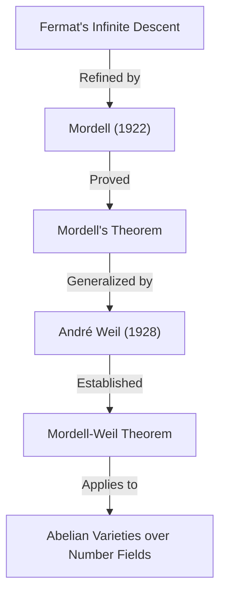

## 1. 引言

在20世紀的數學界，尤其是在 **數論** 領域留下輝煌足跡的數學家之一，便是路易斯·喬爾·莫德爾（Louis Joel Mordell, 1888–1972）。他在[丟番圖](https://kenji.blog/zh-tw/p/diophantus/)方程的研究中取得了突破性成果，並為現代代數幾何與數論交叉領域的許多重要理論奠定了基礎。在本文中，我們將詳細探討莫德爾的生平、以他名字命名的重要定理與猜想，以及他對數學界產生的深遠影響。

許多聽說過莫德爾名字的人，大概都是透過 **莫德爾定理** （Mordell's Theorem）或 **莫德爾猜想** （Mordell Conjecture）認識他的。這些成就不僅僅是證明了某個單一定理，更成為了後來通向證明 **[費馬最後定理](https://kenji.blog/zh-tw/p/fermats-last-theorem/)** （[Fermat's Last Theorem](https://kenji.blog/zh-tw/p/fermats-last-theorem/)）那場宏大數學戲劇的重要伏筆。

## 2. 早年的莫德爾：從自學到劍橋

路易斯·喬爾·莫德爾於1888年1月28日出生在美國賓夕法尼亞州的費城。他的父母是從立陶宛移居的猶太裔移民，家庭條件絕不富裕。然而，莫德爾從年輕時起就對數學展現出了異乎尋常的天賦與熱情。

他在二手書店收集數學專業書籍，幾乎完全透過 **自學** 掌握了高等數學。特別是，他偶然接觸到了劍橋大學數學畢業考試—— **Tripos** （Mathematical Tripos）的歷年考古題集，並沉迷於解題。這段經歷讓他萌生了前往英國劍橋大學求學的強烈志向。

1906年，18歲的莫德爾為了參加獎學金考試，帶著微薄的資金隻身前往英國。他出色地贏得了獎學金，進入了劍橋大學聖約翰學院。在1909年的Tripos考試中，他取得了總成績第三名的優異成績，榮獲 **Third Wrangler** 的稱號。

## 3. 對[丟番圖](https://kenji.blog/zh-tw/p/diophantus/)方程的熱情

莫德爾研究的中心始終是 **[丟番圖](https://kenji.blog/zh-tw/p/diophantus/)方程** （Diophantine equations）。丟番圖方程是指在具有整數係數的多項式方程中，求解整數解或有理數解的問題。它以古希臘數學家[丟番圖](https://kenji.blog/zh-tw/p/diophantus/)的名字命名。

最著名的[丟番圖](https://kenji.blog/zh-tw/p/diophantus/)方程例子是與畢氏定理相關的方程：

$$ x^2 + y^2 = z^2 $$

這個方程的整數解被稱為畢氏三元數，已知它們是無限存在的。然而，隨著次數的升高，問題瞬間變得極其困難。因[費馬最後定理](https://kenji.blog/zh-tw/p/fermats-last-theorem/)而聞名的以下方程便是一個典型例子：

$$ x^n + y^n = z^n \quad (n \ge 3) $$

莫德爾對這類方程解的性質進行了深入探索。他相比於建構抽象理論，更強烈地偏好於解決具體的方程問題。

## 4. 莫德爾方程

莫德爾特別關注的是現在被稱為 **莫德爾方程** （Mordell's Equation）的以下形式的方程：

$$ y^2 = x^3 + k $$

這裡 $k$ 是非零整數。這個方程是橢圓曲線（Elliptic curve）最簡單的形式之一。自從17世紀[皮埃爾·德·費馬](https://kenji.blog/zh-tw/p/fermat/)（[Pierre de Fermat](https://kenji.blog/zh-tw/p/fermat/)）證明了在 $k = -2$ 的情況下，即 $y^2 = x^3 - 2$ 的整數解僅有 $(x, y) = (3, \pm 5)$ 以來，這類方程得到了廣泛的研究。

莫德爾深入研究了求解該方程整數解的一般方法以及解的有限性。他的方法應用了代數數論中的理想類理論，使傳統的古典方法實現了重大飛躍。

## 5. 莫德爾定理：橢圓曲線上的有理點

莫德爾最偉大的數學成就之一，是1922年發表的 **莫德爾定理** 。該定理斷言，定義在有理數體 $\mathbb{Q}$ 上的橢圓曲線的所有有理點集合，作為一個加法群是 **有限生成的** （finitely generated）。

當時已經知道，橢圓曲線 $E$ 的有理點集合 $E(\mathbb{Q})$ 透過「弦切法」（chord-and-tangent method）具有群的結構。莫德爾證明了該群具有以下結構：

$$ E(\mathbb{Q}) \cong E(\mathbb{Q})_{\text{tors}} \oplus \mathbb{Z}^r $$

其中，$E(\mathbb{Q})_{\text{tors}}$ 是由有限個點組成的 **扭子群** （torsion subgroup），$r$ 是非負整數，被稱為 **秩** （rank）。

這一定理意味著，為了找到橢圓曲線上無限多個有理點，只需找到有限個「基底」點即可，它是算術幾何中的一座豐碑。莫德爾的證明是對費馬的「無限遞降法」（Method of infinite descent）進行現代洗練後的結果。

此後，1928年法國數學家[安德烈·韋伊](https://kenji.blog/zh-tw/p/weil/)（[André Weil](https://kenji.blog/zh-tw/p/weil/)）將該定理推廣到一般的代數數體和阿貝爾簇，因此現在通常被稱為 **莫德爾-韋伊定理** （Mordell-Weil Theorem）。

## 6. 莫德爾猜想：代數幾何與數論的交叉點

1922年，在發表定理的同時，莫德爾提出了一個更為宏大的猜想。這就是 **莫德爾猜想** （Mordell Conjecture）。該猜想提出了一個令人震驚的主張：方程式有理數解的個數，取決於該方程式所定義的圖形的拓撲性質——「虧格」（genus）。

如果在複數體上考慮，代數曲線 $C$ 會形成一個類似帶洞甜甜圈的曲面。這個洞的數量就是虧格 $g$。莫德爾將其分類如下：

- 當 $g = 0$ 時（例如：圓錐曲線）：如果存在有理點，則有無限多個。
- 當 $g = 1$ 時（例如：橢圓曲線）：根據莫德爾定理，有理點構成一個有限生成的群（可能是有限個，也可能是無限個）。
- 當 $g \ge 2$ 時： **有理點始終只有有限個。**

這個關於 $g \ge 2$ 時的論斷即為莫德爾猜想。該猜想暗示了代數方程的解這種「數論」對象，完全被圖形的洞數這種「幾何」對象所控制，給當時的數學家們帶來了巨大的衝擊。

$$ \text{If } g \ge 2 \text{, then } |C(\mathbb{Q})| < \infty $$

這個猜想在60多年的時間裡一直懸而未決。然而，在1983年，它終於被德國數學家[格爾德·法爾廷斯](https://kenji.blog/zh-tw/p/faltings/)（[Gerd Faltings](https://kenji.blog/zh-tw/p/faltings/)）證明，成為了 **法爾廷斯定理** （Faltings's Theorem）。憑藉這一成就，法尔廷斯在1986年榮獲了菲爾茲獎。

此外，[費馬最後定理](https://kenji.blog/zh-tw/p/fermats-last-theorem/)的方程 $x^n + y^n = z^n$ ，當 $n \ge 4$ 時，虧格大於等於3。因此，由莫德爾猜想（法爾廷斯定理）可以直接推導出，對於每一個 $n$，費馬方程的有理數解至多只有有限個。

## 7. 與拉馬努金的交集及模形式

莫德爾的成就並不僅限於[丟番圖](https://kenji.blog/zh-tw/p/diophantus/)方程。他對天才數學家斯里尼瓦薩·拉馬努金（[Srinivasa Ramanujan](https://kenji.blog/zh-tw/p/ramanujan/)）留下的未解問題也做出了巨大貢獻。

拉馬努金對如下定義的拉馬努金 $\tau$ 函數 $\tau(n)$ 提出了幾個令人驚嘆的性質猜想：

$$ \sum_{n=1}^{\infty} \tau(n) q^n = q \prod_{n=1}^{\infty} (1 - q^n)^{24} $$

拉馬努金猜想，當 $\gcd(m, n) = 1$ 時， $\tau(mn) = \tau(m)\tau(n)$ （積性）。1917年，莫德爾漂亮地證明了這個猜想。他證明的方法，成為了如今被稱為 **赫克算子** （Hecke operators）的模形式理論中基本工具的先驅。莫德爾的這一發現在後來數論中自守形式理論的發展中發揮了極其重要的作用。

## 8. 曼徹斯特學派的形成與難民援助

20世紀20年代，莫德爾就任曼徹斯特大學教授。在那裡，他建立了一個強大的數學學派，將曼徹斯特大學推升為英國數論的中心地帶。

莫德爾不僅以研究者的卓越著稱，還以其人性光輝為人熟知。在20世紀30年代，隨著納粹德國的崛起，許多猶太裔科學家失去了工作，被迫逃離歐洲。莫德爾積極援助他們，並接納他們來到曼徹斯特大學。

在他援助的數學家中，包括後來成為20世紀最偉大數學家之一的保羅·艾狄胥（Paul Erdős）以及超越數論權威庫爾特·馬勒（Kurt Mahler）等人。莫德爾的努力，不僅在英國數學界的發展上，更在拯救受迫害人才的人道主義層面上獲得了高度評價。

## 9. 作為哈代的繼任者：在劍橋的晚年

1945年，隨著G.H.哈代（G. H. Hardy）的退休，莫德爾被選為劍橋大學的 **薩德萊純粹數學教授** （Sadleirian Professor of Pure Mathematics）。這是英國數學界最具權威的職位之一。

回到劍橋的莫德爾指導了眾多學生，致力於數論的發展。他的講義充滿激情，不斷向學生傳達解決具體問題的樂趣與重要性。直到1953年退休為止，他一直作為英國數學界的領軍人物發揮著重要作用。

## 10. 人物形象與對教育的貢獻

莫德爾非常坦率，有時也以毫不留情的言辭而聞名。儘管長期居住在英國，他一生都在使用帶有濃厚美國口音的英語交流。

比起為了理論而建構抽象理論，他更喜歡解決具體問題。「數學是為了解決問題的」這一哲學，深深地烙印在他撰寫的名著《[丟番圖](https://kenji.blog/zh-tw/p/diophantus/)方程》（Diophantine Equations）中。這本書是他一生研究的集大成之作，啟發了許多年輕數學家。

莫德爾還非常善於發現他人的才華。培養出諸如J.W.S.卡塞爾斯（J. W. S. Cassels）等日後扛起英國數論界大旗的數學家們，也是他的一大功績。

## 11. 留給現代數學的遺產

[路易斯·莫德爾](https://kenji.blog/zh-tw/p/mordell/)在數學界留下的遺產，深深紮根於現代數學的根基之中。

1. **算術幾何的基礎** ：莫德爾定理與莫德爾猜想，強烈地推動了從幾何視角審視數論對象的「算術幾何」（Arithmetic Geometry）的發展。
2. **模形式論** ：在證明拉馬努金猜想時使用的方法，成為了延續至現代朗蘭茲綱領（Langlands Program）的宏大理論的出發點。
3. **[丟番圖](https://kenji.blog/zh-tw/p/diophantus/)方程的解法** ：他具體的解題路徑與大量論文，至今仍是使用計算機求解方程的算法基礎。

當[費馬最後定理](https://kenji.blog/zh-tw/p/fermats-last-theorem/)被安德魯·懷爾斯（[Andrew Wiles](https://kenji.blog/zh-tw/p/wiles/)）證明時，其理論背景中同樣離不開橢圓曲線和模形式這些與莫德爾有著深厚淵源的概念。

## 12. 結論

[路易斯·莫德爾](https://kenji.blog/zh-tw/p/mordell/)，從一個充滿熱情的自學青年，登上了代表20世紀數論巨星的寶座。他的名字以 **莫德爾定理** 和 **莫德爾猜想** 的形式，永遠銘刻在了數學的歷史中。

對解決具體問題的強烈執著，以及拯救難民數學家的溫暖人性。莫德爾的生平與成就，向我們展示了數學這門學問是如何發展的，以及人們是如何為這種發展做出貢獻的，堪稱絕佳的楷模。他所探索的[丟番圖](https://kenji.blog/zh-tw/p/diophantus/)方程的世界，至今依然吸引著無數數學家。
