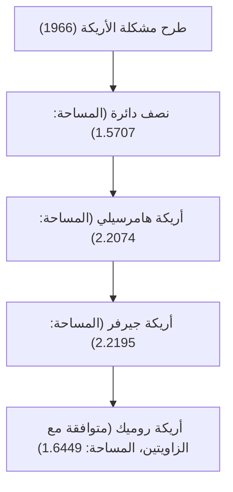

# 1. مقدمة: المعضلة النهائية التي نشأت من الحياة اليومية

"ما هو الشكل ذو المساحة الأكبر الذي يمكنه الالتفاف حول زاوية ممر على شكل حرف L؟"
هذه مشكلة واقعية يواجهها كل من سبق له نقل أريكة أثناء الانتقال، ولكن في عالم الرياضيات، تُعرف باسم "مشكلة الأريكة المتحركة (Moving sofa problem)"، وهي معضلة فائقة الصعوبة لم تُحل منذ عام 1966.

هذه المشكلة، التي طرحها رسميًا عالم الرياضيات النمساوي الكندي ليو موسر (Leo Moser)، تبدو بسيطة جدًا لدرجة أن طالبًا في المدرسة الإعدادية يمكنه فهمها للوهلة الأولى، لكنها استمرت في صد تحديات علماء الرياضيات العباقرة في جميع أنحاء العالم لأكثر من نصف قرن.

في هذا المقال، سنشرح بالتفصيل تاريخ هذه المشكلة الهندسية الرائعة، والأساليب المختلفة التي تم اقتراحها حتى الآن، ولماذا تعتبر هذه المشكلة صعبة للغاية، مع تضمين الصيغ والرسوم التوضيحية.

# 2. الصياغة الرياضية للمشكلة

التعريف الرياضي الدقيق لمشكلة الأريكة هو كما يلي:

لنفترض أن L هي منطقة على شكل حرف L حيث يتقاطع ممران عرض كل منهما 1 بزاوية قائمة. لنفترض أن المنطقة المغلقة المتصلة S في المستوى (وهي الأريكة) يمكن أن تتحرك عبر الجزء الداخلي من L من أحد الممرات إلى الآخر بواسطة عائلة بارامترية مستمرة من التحويلات المتطابقة (الانسحاب والدوران).

في هذه الحالة، جوهر المشكلة هو إيجاد القيمة القصوى لمساحة S (والتي تسمى "ثابت الأريكة") والشكل الممكن تنفيذه في تلك العملية.

### 2.1 توضيح القيود
- **الجسم الصلب**: يجب ألا تتشوه الأريكة أثناء الحركة.
- **الحركة المستمرة**: من وضع البداية إلى وضع النهاية، يجب أن تكون الأريكة دائمًا بالكامل داخل الممر.
- **مشكلة ثنائية الأبعاد**: لا يتم أخذ الارتفاع في الاعتبار، ويتم التعامل معها على أنها مشكلة في مستوى ثنائي الأبعاد.

# 3. استكشاف ثابت الأريكة: التطور التاريخي وتحديثات الحد الأدنى

### 3.1 التحديات المبكرة: نصف الدائرة والمربع
كأبسط شكل، يمكن التفكير في نصف دائرة نصف قطرها 1. هذه المساحة تبلغ حوالي 1.5707.
أيضًا، المربع 1 × 1 يمكنه الالتفاف حول الزاوية (المساحة 1).

### 3.2 قفزة جون هامرسيلي (1968)
اقترح عالم الرياضيات البريطاني جون هامرسيلي فكرة ثورية تتمثل في فصل نصف الدائرة، وإدخال مستطيل بينهما، وتجويف الجزء الداخلي. مساحة "أريكة هامرسيلي" هذه هي $2/\pi + \pi/2 \approx 2.2074$، مما أدى إلى رفع الحد الأدنى بشكل كبير.

### 3.3 تحسين جوزيف جيرفر (1992)
قام جوزيف جيرفر بتوسيع المساحة بشكل أكبر من خلال استبدال الحدود المستقيمة لأريكة هامرسيلي بمنحنيات ناعمة. المساحة التي استنتجها تبلغ حوالي 2.2195، والتي ظلت لفترة طويلة تعتبر أكبر مساحة معروفة (الحد الأدنى).

# 4. استكشاف الحد الأقصى: إلى أي مدى يمكن ألا تكبر الأريكة؟

في تناقض مع تحديثات الحد الأدنى، أثبتت محاولات برهنة الحد الأقصى، أي "من المستحيل تمامًا وجود مساحة أكبر من ذلك"، أنها صعبة للغاية.

- **الحد الأقصى الأولي**: أثبت هامرسيلي أن القيمة القصوى للمساحة هي أقل من أو تساوي $2\sqrt{2} \approx 2.8284$.
- **تطورات عام 2017**: بفضل بحث دان روميك ويواف كالوس في جامعة كاليفورنيا في ديفيس، تم خفض الحد الأقصى إلى 2.37.

من المعروف أن ثابت الأريكة الحالي يقع في مكان ما بين 2.2195 و 2.37، ولكن لم يتم تحديد القيمة الدقيقة حتى الآن.

# 5. أريكة روميك ثنائية الاتجاه (2017)

اقترح دان روميك شكلاً جديداً يسمى "الأريكة بكلتا اليدين (ambidextrous sofa)"، والتي يمكنها الالتفاف ليس فقط حول الزاوية التي على شكل حرف L، بل حول كل من الزاويتين اليمنى واليسرى. وقد تم حساب المساحة القصوى في هذه الحالة لتكون حوالي 1.6449، وتم إثبات هذا الشكل أيضًا من خلال نموذج تم إنشاؤه باستخدام طابعة ثلاثية الأبعاد.

# 6. لماذا تعتبر مشكلة الأريكة صعبة؟

### 6.1 درجات حرية لا نهائية
نظرًا لضرورة تحسين كل من الشكل ومسار الحركة في نفس الوقت، تصبح مساحة البحث بواسطة الكمبيوتر لا نهائية.

### 6.2 غياب الحلول التحليلية
يتم التعبير عن حدود الشكل الأمثل المعروف حاليًا (أريكة جيرفر) كحل لمعادلة تفاضلية غير خطية معقدة للغاية، بدلاً من قوس بسيط أو قطع مكافئ. لذلك، من الصعب للغاية التعامل معها بشكل تحليلي.

### 6.3 فخ الحلول المثلى المحلية
عند إجراء التحسين العددي بواسطة الكمبيوتر، من السهل الوقوع في عدد لا يحصى من الحلول المثلى المحلية (الحدود الدنيا المحلية)، ولم يتم إنشاء خوارزمية للعثور على الحل الأمثل الشامل الحقيقي (الحد الأدنى الشامل).

# 7. آفاق المستقبل

في السنوات الأخيرة، بدأت المحاولات لاستكشاف أشكال جديدة باستخدام الذكاء الاصطناعي والتعلم الآلي، ولكنها لم تصل إلى إثبات رياضي صارم. تُعد مشكلة الأريكة مثالاً رائعًا على مدى عدم موثوقية الحدس البشري، ومدى عمق الهندسة البسيطة.

عندما تعلق أريكة في زاوية أثناء انتقالك، يرجى تذكر هذه المشكلة الرياضية غير المحلولة. فمعاناتك لها نفس طبيعة المعضلة الأبدية التي لا يستطيع حتى كبار علماء الرياضيات في العالم حلها.
