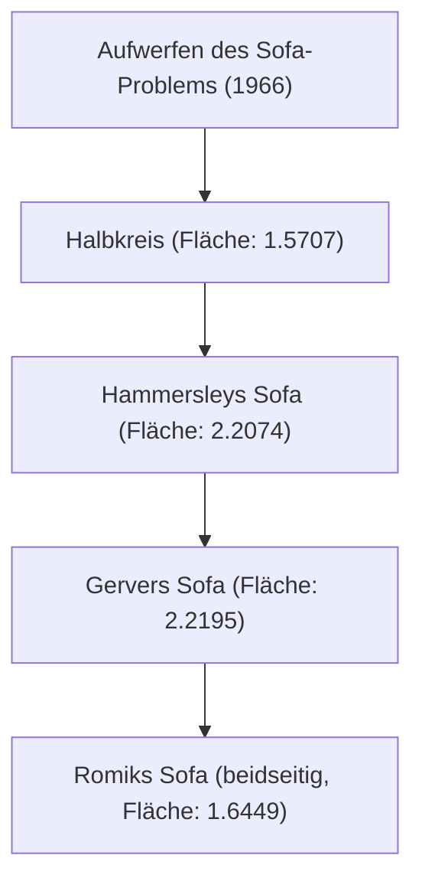

# 1. Einleitung: Ein ultimatives Rätsel aus dem Alltag

"Was ist die flächengrößte Form, die um die Ecke eines L-förmigen Flurs manövriert werden kann?"
Dies ist ein praktisches Problem, mit dem jeder konfrontiert wird, der schon einmal beim Umzug ein Sofa getragen hat, aber in der Welt der Mathematik ist es ein super schwieriges und ungelöstes Problem, das seit 1966 als "Sofa-Problem" (Moving sofa problem) bekannt ist.

Dieses Problem, das offiziell vom österreichisch-kanadischen Mathematiker Leo Moser aufgeworfen wurde, ist auf den ersten Blick so einfach, dass es sogar ein Mittelschüler verstehen kann, wehrt aber seit über einem halben Jahrhundert die Herausforderungen von genialen Mathematikern aus der ganzen Welt ab.

In diesem Artikel werden wir die Geschichte dieses faszinierenden geometrischen Problems, die verschiedenen bisher vorgeschlagenen Ansätze und die Gründe, warum dieses Problem so schwierig ist, anhand von mathematischen Formeln und Diagrammen ausführlich erklären.

# 2. Mathematische Formulierung des Problems

Eine mathematisch strenge Definition des Sofa-Problems sieht wie folgt aus:

Sei L ein L-förmiger Bereich, in dem sich zwei Flure der Breite 1 im rechten Winkel schneiden. Angenommen, ein zusammenhängender, geschlossener Bereich S (das Sofa) in der Ebene kann durch eine kontinuierliche Parameterfamilie von Kongruenzabbildungen (Translationen und Rotationen) durch das Innere von L von einem Flur zum anderen bewegt werden.

Der Kern des Problems besteht dann darin, den Maximalwert der Fläche von S (dies wird als "Sofa-Konstante" bezeichnet) und die in diesem Fall realisierbare Form zu finden.

### 2.1 Klärung der Randbedingungen
- **Starrer Körper**: Das Sofa darf sich während der Bewegung nicht verformen.
- **Kontinuierliche Bewegung**: Von der Anfangsposition bis zur Endposition muss das Sofa immer vollständig innerhalb des Flurs bleiben.
- **2D-Problem**: Die Höhe wird nicht berücksichtigt; es wird als Problem auf einer 2D-Ebene behandelt.

# 3. Die Suche nach der Sofa-Konstante: Historische Entwicklung und Aktualisierung der Untergrenze

### 3.1 Frühe Herausforderungen: Halbkreis und Quadrat
Die einfachste denkbare Form ist ein Halbkreis mit Radius 1. Dessen Fläche beträgt etwa 1.5707.
Ein 1x1 Quadrat kann sich ebenfalls um die Ecke bewegen (Fläche 1).

### 3.2 John Hammersleys Durchbruch (1968)
Der britische Mathematiker John Hammersley schlug eine bahnbrechende Idee vor: Er zerschnitt den Halbkreis, fügte dazwischen ein Rechteck ein und höhlte die Innenseite aus. Die Fläche dieses "Hammersley-Sofas" beträgt $2/\pi + \pi/2 \approx 2.2074$, was die Untergrenze deutlich anhob.

### 3.3 Joseph Gervers Optimierung (1992)
Joseph Gerver vergrößerte die Fläche weiter, indem er die geraden Ränder von Hammersleys Sofa durch glatte Kurven ersetzte. Die von ihm abgeleitete Fläche betrug etwa 2.2195, was lange Zeit als die bekannte Maximalfläche (Untergrenze) galt.

# 4. Die Suche nach der Obergrenze: Wie groß kann das Sofa maximal werden?

Im Gegensatz zur Aktualisierung der Untergrenze hat sich der Beweis der Obergrenze – dass "eine größere Fläche absolut unmöglich ist" – als äußerst schwierig erwiesen.

- **Frühe Obergrenze**: Hammersley bewies, dass die maximale Fläche höchstens $2\sqrt{2} \approx 2.8284$ beträgt.
- **Fortschritt im Jahr 2017**: Durch Forschungen von Dan Romik und Yoav Kallus (UC Davis) wurde die Obergrenze auf 2.37 gesenkt.

Wir wissen heute, dass die Sofa-Konstante irgendwo zwischen 2.2195 und 2.37 liegt, aber der genaue Wert ist bis heute nicht bestimmt worden.

# 5. Romiks beidseitiges Sofa (2017)

Dan Romik schlug eine neue Variation vor: das "beidhändige (Ambidextrous) Sofa", das nicht nur um eine, sondern um rechte und linke Ecken manövriert werden kann. Es wurde berechnet, dass die maximale Fläche in diesem Fall etwa 1.6449 beträgt, und diese Form wurde auch durch ein mit einem 3D-Drucker erstelltes Modell demonstriert.

# 6. Warum ist das Sofa-Problem so schwierig?

### 6.1 Unendliche Freiheitsgrade
Da sowohl die Form als auch der Bewegungspfad gleichzeitig optimiert werden müssen, wird der Suchraum für Berechnungen unendlich groß.

### 6.2 Fehlen einer analytischen Lösung
Die Ränder der derzeit besten bekannten Form (Gervers Sofa) sind keine einfachen Kreisbögen oder Parabeln, sondern werden als Lösung hochkomplexer nichtlinearer Differentialgleichungen dargestellt. Daher ist es extrem schwierig, sie analytisch zu behandeln.

### 6.3 Die Falle lokaler Optima
Wenn man numerische Optimierungen per Computer durchführt, gerät man leicht in eine von unzähligen lokal optimalen Lösungen (lokale Minima), und es wurde noch kein Algorithmus etabliert, der die wahre globale optimale Lösung (globales Minimum) findet.

# 7. Zukunftsausblick

In den letzten Jahren hat man begonnen, KI und maschinelles Lernen einzusetzen, um neue Formen zu erforschen, was jedoch nicht zu einem strengen mathematischen Beweis geführt hat. Das Sofa-Problem ist ein wunderbares Beispiel dafür, wie unzuverlässig die menschliche Intuition ist und wie tiefgründig einfache Geometrie sein kann.

Wenn Ihr Sofa beim nächsten Umzug in der Ecke stecken bleibt, erinnern Sie sich bitte an dieses ungelöste mathematische Problem. Ihre Mühen sind von derselben Natur wie dieses ewige Rätsel, das selbst von den weltbesten Mathematikern nicht gelöst werden kann.
