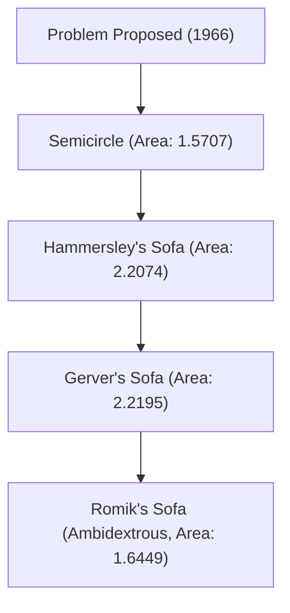

# 1. Introduction: The Ultimate Difficult Problem Born from Everyday Life

"What is the shape with the largest area that can maneuver through an L-shaped corridor corner?"
This is a practical problem that anyone who has ever moved a sofa has faced, but in the world of mathematics, it is called the "Moving sofa problem," an ultra-difficult problem that has remained unsolved since 1966.

Officially posed by the Austrian-Canadian mathematician Leo Moser, this problem seems simple enough for a middle school student to understand at first glance, but it has continued to repel the challenges of genius mathematicians around the world for over half a century.

In this article, we will thoroughly explain the history of this fascinating geometric problem, the various approaches proposed so far, and why this problem is so difficult, using mathematical formulas and diagrams.

# 2. Mathematical Formulation of the Problem

When the sofa problem is strictly defined mathematically, it is as follows.

Let L be an L-shaped region where two corridors of width 1 intersect at right angles. Suppose a connected closed region S in a plane (this is the sofa) can be moved from one corridor to the other through the interior of L by a continuous parameter family of congruent transformations (translation and rotation).

At this time, the core of the problem is to find the maximum value of the area of S (called the "sofa constant") and the shape that can be implemented at that time.

### 2.1 Clarification of Constraints
- **Rigid body**: The sofa must not deform during movement.
- **Continuous movement**: From the initial position to the final position, the sofa must always be contained within the interior of the corridor.
- **2D problem**: Height is not considered; it is treated as a problem on a 2D plane.

# 3. Quest for the Sofa Constant: Historical Changes and Lower Bound Updates

### 3.1 Early Challenges: Semicircles and Squares
As the simplest shape, a semicircle with a radius of 1 can be considered. Its area is about 1.5707.
Also, a 1x1 square can turn the corner (area 1).

### 3.2 John Hammersley's Breakthrough (1968)
British mathematician John Hammersley proposed the groundbreaking idea of cutting the semicircle apart, inserting a rectangle in between, and hollowing out the inside. The area of this "Hammersley's sofa" is $2/\pi + \pi/2 \approx 2.2074$, significantly raising the lower bound.

### 3.3 Joseph Gerver's Optimization (1992)
Joseph Gerver further expanded the area by replacing the straight boundaries of Hammersley's sofa with smooth curves. The area he derived was about 2.2195, which has long reigned as the known maximum area (lower bound).

# 4. Quest for the Upper Bound: How Large Can the Sofa Not Be?

In contrast to updating the lower bound, proving the upper bound that "a larger area is absolutely impossible" is extremely difficult.

- **Initial upper bound**: Hammersley proved that the maximum area is less than or equal to $2\sqrt{2} \approx 2.8284$.
- **2017 progress**: Research by Dan Romik and Yoav Kallus of the University of California, Davis lowered the upper bound to 2.37.

It is currently known that the sofa constant exists somewhere between 2.2195 and 2.37, but the exact value has not yet been determined.

# 5. Romik's Ambidextrous Sofa (2017)

Dan Romik proposed a new variation called the "ambidextrous sofa" that can maneuver not only through an L-shaped corner but also through both left and right corners. The maximum area in this case has been calculated to be about 1.6449, and this shape has also been demonstrated by a model created with a 3D printer.

# 6. Why is the Sofa Problem Difficult?

### 6.1 Infinite Degrees of Freedom
Because it is necessary to simultaneously optimize both the shape and the movement path, the search space for a computer becomes infinite.

### 6.2 Absence of Analytical Solutions
The boundary of the optimal shape currently known (Gerver's sofa) is not a simple arc or parabola, but is expressed as a solution to a very complex nonlinear differential equation. Therefore, it is extremely difficult to handle analytically.

### 6.3 Trap of Local Optima
When performing numerical optimization with a computer, it is easy to fall into countless local optima (local minimums), and no algorithm has been established to find the true global optimum (global minimum).

# 7. Future Prospects

In recent years, attempts have begun to explore new shapes using AI and machine learning, but they have not led to strict mathematical proofs. The sofa problem is an excellent example showing how unreliable human intuition can be, and how deep simple geometry can be.

When a sofa gets stuck at a corner during a move, please remember this unsolved problem in mathematics. Your struggle has the same nature as an eternal difficult problem that even the world's top mathematicians cannot solve.
