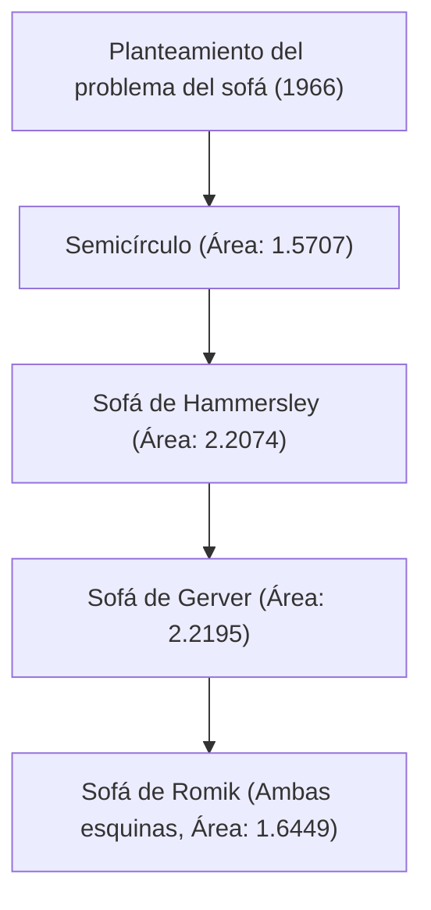

# 1. Introducción: El enigma definitivo que nace de la vida cotidiana

"¿Cuál es la figura de mayor área que puede doblar la esquina de un pasillo en forma de L?"
Este es un problema práctico al que se enfrenta cualquiera que haya transportado un sofá en una mudanza, pero en el mundo de las matemáticas es un problema superdifícil sin resolver desde 1966, conocido como el "problema del sofá en movimiento" (Moving sofa problem).

Planteado oficialmente por el matemático austríaco-canadiense Leo Moser, este problema parece lo suficientemente simple como para que lo entienda un estudiante de secundaria a primera vista, pero ha seguido rechazando los desafíos de matemáticos geniales de todo el mundo durante más de medio siglo.

En este artículo, explicaremos a fondo la historia de este fascinante problema geométrico, los diversos enfoques que se han propuesto hasta la fecha, y por qué este problema es tan difícil, acompañándolo de fórmulas matemáticas y diagramas.

# 2. Formulación matemática del problema

El problema del sofá definido de manera matemática y rigurosa es el siguiente.

Sea L una región en forma de L donde dos pasillos de ancho 1 se cruzan en ángulo recto. Supongamos que una región cerrada conexa S en el plano (este es el sofá) puede moverse por el interior de L desde un pasillo al otro mediante una familia de parámetros continuos de transformaciones congruentes (traslación y rotación).

Entonces, el núcleo del problema es encontrar el valor máximo del área de S (esto se llama la "constante del sofá") y la forma implementable en ese momento.

### 2.1 Aclaración de las restricciones
- **Cuerpo rígido**: El sofá no debe deformarse durante el movimiento.
- **Movimiento continuo**: Desde la posición inicial hasta la posición final, el sofá debe estar siempre contenido dentro del pasillo.
- **Problema bidimensional**: No se considera la altura, se trata como un problema en un plano bidimensional.

# 3. La búsqueda de la constante del sofá: Evolución histórica y actualización del límite inferior

### 3.1 Los primeros desafíos: Semicírculo y cuadrado
Como la forma más simple, se puede considerar un semicírculo de radio 1. Su área es de aproximadamente 1.5707.
Además, un cuadrado de 1×1 también puede girar (área 1).

### 3.2 El salto de John Hammersley (1968)
El matemático británico John Hammersley propuso una idea innovadora de separar un semicírculo, insertar un rectángulo en el medio y ahuecar el interior. El área de este "sofá de Hammersley" es $2/\pi + \pi/2 \approx 2.2074$, elevando enormemente el límite inferior.

### 3.3 La optimización de Joseph Gerver (1992)
Joseph Gerver amplió aún más el área reemplazando el límite recto del sofá de Hammersley con una curva suave. El área que derivó fue de aproximadamente 2.2195, y durante mucho tiempo esta ha reinado como el área máxima conocida (límite inferior).

# 4. La búsqueda del límite superior: ¿Hasta qué punto el sofá no puede ser más grande?

En contraste con la actualización del límite inferior, la demostración del límite superior, es decir, que "es absolutamente imposible un área mayor que esta", ha sido extremadamente difícil.

- **Límite superior inicial**: Hammersley demostró que el valor máximo del área es igual o inferior a $2\sqrt{2} \approx 2.8284$.
- **Avance de 2017**: Gracias a la investigación de Dan Romik y Yoav Kallus de la Universidad de California, Davis, el límite superior se redujo a 2.37.

Se sabe que la constante del sofá actual existe en algún lugar entre 2.2195 y 2.37, pero el valor exacto aún no se ha determinado.

# 5. El sofá bidireccional de Romik (2017)

Dan Romik propuso una nueva variación, el "sofá ambidiestro", que puede doblar no solo una esquina en forma de L, sino ambas esquinas (izquierda y derecha). Se ha calculado que el área máxima en este caso es de aproximadamente 1.6449, y esta forma también se ha demostrado mediante un modelo creado con una impresora 3D.

# 6. ¿Por qué es difícil el problema del sofá?

### 6.1 Grados de libertad infinitos
Dado que es necesario optimizar tanto la forma como la ruta de movimiento al mismo tiempo, el espacio de búsqueda por computadora se vuelve infinito.

### 6.2 Ausencia de soluciones analíticas
El límite de la forma óptima conocida actualmente (el sofá de Gerver) no se expresa como un simple arco o parábola, sino como la solución de una ecuación diferencial no lineal muy compleja. Por lo tanto, es extremadamente difícil tratarlo analíticamente.

### 6.3 La trampa de las soluciones óptimas locales
Cuando se realiza una optimización numérica por computadora, es fácil caer en innumerables soluciones óptimas locales (mínimos locales), y no se ha establecido ningún algoritmo para encontrar la verdadera solución óptima global (mínimo global).

# 7. Perspectivas futuras

En los últimos años, también han comenzado los intentos de explorar nuevas formas utilizando IA y aprendizaje automático, pero no se ha llegado a una demostración matemática rigurosa. El problema del sofá es un excelente ejemplo de cuán poco confiable es la intuición humana y cuán profunda es la geometría simple.

Cuando su sofá se atasque en una esquina durante una mudanza, recuerde este problema matemático no resuelto. Su lucha tiene la misma naturaleza que el eterno enigma que ni siquiera los mejores matemáticos del mundo pueden resolver.
