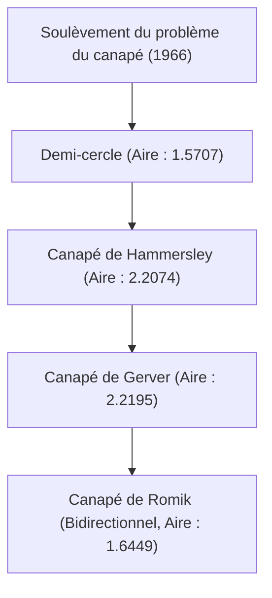

# 1. Introduction : L'ultime casse-tête né de la vie quotidienne

« Quelle est la figure d'aire maximale qui peut tourner dans un coin d'un couloir en forme de L ? »
C'est un problème pratique auquel toute personne ayant déjà déplacé un canapé lors d'un déménagement a été confrontée, mais dans le monde des mathématiques, il s'agit d'un problème extrêmement difficile et non résolu depuis 1966, connu sous le nom de « problème du canapé » (Moving sofa problem).

Officiellement soulevé par le mathématicien austro-canadien Leo Moser, ce problème semble à première vue si simple qu'un collégien pourrait le comprendre, mais il a repoussé les tentatives des mathématiciens de génie du monde entier pendant plus d'un demi-siècle.

Dans cet article, nous expliquerons en détail l'histoire de ce problème géométrique fascinant, les différentes approches proposées jusqu'à présent, et pourquoi ce problème est si difficile, avec des formules et des diagrammes.

# 2. Formulation mathématique du problème

La définition mathématique stricte du problème du canapé est la suivante.

Soit L une région en forme de L où deux couloirs de largeur 1 se croisent à angle droit. Supposons qu'une région fermée et connexe S dans le plan (c'est le canapé) puisse se déplacer d'un couloir à l'autre à travers l'intérieur de L par une famille continue à un paramètre de transformations isométriques (translations et rotations).

Le cœur du problème est de trouver la valeur maximale de l'aire de S (appelée « constante du canapé ») et la forme réalisable correspondante.

### 2.1 Clarification des contraintes
- **Corps rigide** : Le canapé ne doit pas se déformer pendant le déplacement.
- **Déplacement continu** : De la position initiale à la position finale, le canapé doit toujours être contenu à l'intérieur du couloir.
- **Problème en 2D** : La hauteur n'est pas prise en compte, et il est traité comme un problème sur un plan bidimensionnel.

# 3. La quête de la constante du canapé : Évolution historique et mise à jour de la limite inférieure

### 3.1 Premières tentatives : Demi-cercle et carré
La forme la plus simple envisagée est un demi-cercle de rayon 1. Son aire est d'environ 1,5707.
Un carré de 1×1 peut également tourner (aire de 1).

### 3.2 La percée de John Hammersley (1968)
Le mathématicien britannique John Hammersley a proposé une idée révolutionnaire : séparer un demi-cercle, insérer un rectangle entre les deux parties et évider l'intérieur. L'aire de ce « canapé de Hammersley » est de $2/\pi + \pi/2 \approx 2,2074$, augmentant considérablement la limite inférieure.

### 3.3 L'optimisation de Joseph Gerver (1992)
Joseph Gerver a encore augmenté l'aire en remplaçant les frontières droites du canapé de Hammersley par des courbes lisses. L'aire qu'il a dérivée est d'environ 2,2195, et cela a longtemps régné comme l'aire maximale connue (limite inférieure).

# 4. La quête de la limite supérieure : Jusqu'où le canapé ne peut-il pas s'agrandir ?

Contrairement à la mise à jour de la limite inférieure, prouver la limite supérieure, c'est-à-dire que « toute aire plus grande est absolument impossible », s'est avéré extrêmement difficile.

- **Limite supérieure initiale** : Hammersley a prouvé que la valeur maximale de l'aire est inférieure ou égale à $2\sqrt{2} \approx 2,8284$.
- **Progrès en 2017** : Les recherches de Dan Romik et Yoav Kallus de l'Université de Californie à Davis ont abaissé la limite supérieure à 2,37.

On sait que la constante du canapé actuelle se situe quelque part entre 2,2195 et 2,37, mais la valeur exacte n'a pas encore été déterminée.

# 5. Le canapé bidirectionnel de Romik (2017)

Dan Romik a proposé une nouvelle variante appelée « canapé ambidextre (ambidextre) » qui peut tourner non seulement dans les coins en forme de L, mais dans les coins à la fois gauche et droit. L'aire maximale calculée dans ce cas est d'environ 1,6449, et cette forme a également été démontrée par un modèle créé avec une imprimante 3D.

# 6. Pourquoi le problème du canapé est-il difficile ?

### 6.1 Degrés de liberté infinis
Puisqu'il faut optimiser à la fois la forme et la trajectoire de déplacement, l'espace de recherche par ordinateur devient infini.

### 6.2 Absence de solution analytique
Les frontières de la forme optimale actuellement connue (le canapé de Gerver) ne sont pas de simples arcs ou paraboles, mais sont exprimées comme des solutions à des équations différentielles non linéaires très complexes. Par conséquent, il est extrêmement difficile de les traiter analytiquement.

### 6.3 Le piège des optima locaux
Lors de l'optimisation numérique par ordinateur, il est facile de tomber dans d'innombrables optima locaux (minima locaux), et aucun algorithme n'a été établi pour trouver le véritable optimum global (minimum global).

# 7. Perspectives d'avenir

Ces dernières années, des tentatives de recherche de nouvelles formes à l'aide de l'IA et de l'apprentissage automatique ont commencé, mais elles n'ont pas encore abouti à des preuves mathématiques rigoureuses. Le problème du canapé est un merveilleux exemple de la façon dont l'intuition humaine peut être peu fiable et dont la géométrie simple peut être profonde.

Si votre canapé reste coincé dans un coin lors de votre prochain déménagement, n'hésitez pas à repenser à ce problème mathématique non résolu. Vos difficultés partagent la même nature qu'une énigme éternelle que même les plus grands mathématiciens du monde ne peuvent résoudre.
