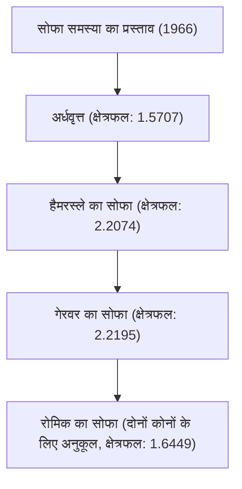

# 1. परिचय: रोजमर्रा की जिंदगी से पैदा हुई एक अत्यंत कठिन समस्या

"सबसे बड़ा क्षेत्रफल वाला वह कौन सा आकार है, जिसे L-आकार के गलियारे के कोने के चारों ओर ले जाया जा सकता है?"
यह एक व्यावहारिक समस्या है जिसका सामना उस हर व्यक्ति ने किया होगा जिसने कभी घर बदलते समय सोफा ले जाया है, लेकिन गणित की दुनिया में इसे "मूविंग सोफा प्रॉब्लम (Moving sofa problem)" कहा जाता है, जो 1966 से एक अनसुलझी और अत्यंत कठिन समस्या है।

ऑस्ट्रियाई-कनाडाई गणितज्ञ लियो मोजर (Leo Moser) द्वारा आधिकारिक तौर पर प्रस्तुत की गई यह समस्या पहली नज़र में इतनी सरल लगती है कि एक मिडिल स्कूल का छात्र भी इसे समझ सकता है, लेकिन आधी सदी से भी अधिक समय से इसने दुनिया भर के प्रतिभाशाली गणितज्ञों की चुनौतियों को विफल किया है।

इस लेख में, हम इस आकर्षक ज्यामितीय समस्या के इतिहास, अब तक प्रस्तावित विभिन्न दृष्टिकोणों और सूत्रों तथा आरेखों के साथ यह बताएंगे कि यह समस्या इतनी कठिन क्यों है।

# 2. समस्या का गणितीय निरूपण

सोफा समस्या को गणितीय रूप से कड़ाई से परिभाषित करने पर, यह इस प्रकार है:

मान लें कि L, 1 चौड़ाई वाले दो गलियारों के समकोण पर प्रतिच्छेद करने वाला एक L-आकार का क्षेत्र है। मान लें कि समतल में एक जुड़ा हुआ बंद क्षेत्र S (यह सोफा है) है, जिसे कांग्रुएंस ट्रांसफ़ॉर्मेशन (अनुवाद और रोटेशन) के एक सतत पैरामीटर परिवार द्वारा, L के अंदर से एक गलियारे से दूसरे गलियारे में ले जाया जा सकता है।

इस समय, समस्या का मूल यह है कि S के क्षेत्रफल का अधिकतम मान (इसे "सोफा स्थिरांक" कहा जाता है) और उस समय कार्यान्वित किए जा सकने वाले आकार को खोजें।

### 2.1 बाधाओं का स्पष्टीकरण
- **कठोर पिंड होना**: सोफे को हिलाते समय विकृत नहीं होना चाहिए।
- **सतत गति**: अपनी प्रारंभिक स्थिति से अंतिम स्थिति तक, सोफे को हमेशा गलियारे के अंदर रहना चाहिए।
- **2D समस्या**: ऊंचाई पर विचार नहीं किया जाता है, और इसे 2D समतल पर एक समस्या के रूप में माना जाता है।

# 3. सोफा स्थिरांक की खोज: ऐतिहासिक परिवर्तन और निचली सीमा का अद्यतनीकरण

### 3.1 शुरुआती चुनौतियाँ: अर्धवृत्त और वर्ग
सबसे सरल आकार के रूप में, 1 त्रिज्या वाले अर्धवृत्त पर विचार किया जा सकता है। इसका क्षेत्रफल लगभग 1.5707 है।
इसके अलावा, एक 1x1 वर्ग भी कोने को मुड़ सकता है (क्षेत्रफल 1)।

### 3.2 जॉन हैमरस्ले की छलांग (1968)
ब्रिटिश गणितज्ञ जॉन हैमरस्ले ने एक अभिनव विचार प्रस्तावित किया: अर्धवृत्त को काटना, उनके बीच एक आयत डालना, और अंदर के हिस्से को खोखला करना। इस "हैमरस्ले के सोफे" का क्षेत्रफल $2/\pi + \pi/2 \approx 2.2074$ हो गया, जिसने निचली सीमा को काफी बढ़ा दिया।

### 3.3 जोसेफ गेरवर का अनुकूलन (1992)
जोसेफ गेरवर ने हैमरस्ले के सोफे की सीधी सीमाओं को चिकने वक्रों से बदलकर क्षेत्रफल को और बढ़ा दिया। उनके द्वारा निकाला गया क्षेत्रफल लगभग 2.2195 है, और यह लंबे समय से ज्ञात अधिकतम क्षेत्रफल (निचली सीमा) के रूप में कायम है।

# 4. ऊपरी सीमा की खोज: सोफा कितना बड़ा नहीं हो सकता?

निचली सीमा के अद्यतनीकरण के विपरीत, यह साबित करना कि "इससे बड़ा क्षेत्रफल बिल्कुल असंभव है" (ऊपरी सीमा का प्रमाण) अत्यंत कठिन है।

- **प्रारंभिक ऊपरी सीमा**: हैमरस्ले ने साबित किया कि क्षेत्रफल का अधिकतम मान $2\sqrt{2} \approx 2.8284$ या उससे कम है।
- **2017 की प्रगति**: कैलिफोर्निया विश्वविद्यालय, डेविस के डैन रोमिक और योव कलास के शोध ने ऊपरी सीमा को घटाकर 2.37 कर दिया।

वर्तमान सोफा स्थिरांक को 2.2195 और 2.37 के बीच कहीं माना जाता है, लेकिन सटीक मान अभी तक निर्धारित नहीं किया गया है।

# 5. रोमिक का द्विदिश सोफा (2017)

डैन रोमिक ने एक नया रूप प्रस्तावित किया जिसे "एम्बिडेक्सट्रस (दोनों हाथों का उपयोग करने में सक्षम) सोफा" कहा जाता है, जो न केवल L-आकार के एक कोने को बल्कि बाएं और दाएं दोनों कोनों को मुड़ सकता है। इस मामले में अधिकतम क्षेत्रफल लगभग 1.6449 होने की गणना की गई है, और यह आकार 3D प्रिंटर से बनाए गए मॉडल द्वारा भी सिद्ध किया गया है।

# 6. सोफा समस्या इतनी कठिन क्यों है?

### 6.1 अनंत स्वतंत्रता
चूंकि एक ही समय में आकार और गति पथ दोनों को अनुकूलित करना आवश्यक है, इसलिए कंप्यूटर द्वारा खोजा जाने वाला स्थान अनंत हो जाता है।

### 6.2 विश्लेषणात्मक समाधान का अभाव
वर्तमान में ज्ञात इष्टतम आकार (गेरवर का सोफा) की सीमा साधारण गोलाकार चाप या परवलय नहीं है, बल्कि एक बहुत ही जटिल अरेखीय अवकल समीकरण (non-linear differential equation) के समाधान के रूप में व्यक्त की गई है। इसलिए इसे विश्लेषणात्मक रूप से संभालना अत्यंत कठिन है।

### 6.3 स्थानीय इष्टतम समाधानों का जाल
जब कंप्यूटर द्वारा संख्यात्मक अनुकूलन किया जाता है, तो अनगिनत स्थानीय इष्टतम (local minima) में फंसना आसान होता है, और वास्तविक वैश्विक इष्टतम (global minimum) खोजने के लिए कोई एल्गोरिथ्म स्थापित नहीं किया गया है।

# 7. भविष्य की संभावनाएं

हाल के वर्षों में, एआई (AI) और मशीन लर्निंग का उपयोग करके नए आकारों को खोजने के प्रयास भी शुरू हुए हैं, लेकिन अभी तक कोई गणितीय रूप से कठोर प्रमाण नहीं मिला है। सोफा समस्या इसका एक बेहतरीन उदाहरण है कि कैसे मानवीय अंतर्ज्ञान अविश्वसनीय हो सकता है, और सरल ज्यामिति कितनी गहरी हो सकती है।

जब आप घर बदलते हैं और आपका सोफा कोने में फंस जाता है, तो कृपया इस अनसुलझी गणितीय समस्या को याद करें। आपके संघर्ष में वही विशेषता है जो उस शाश्वत कठिन समस्या में है जिसे दुनिया के सर्वश्रेष्ठ गणितज्ञ भी हल नहीं कर सकते।
