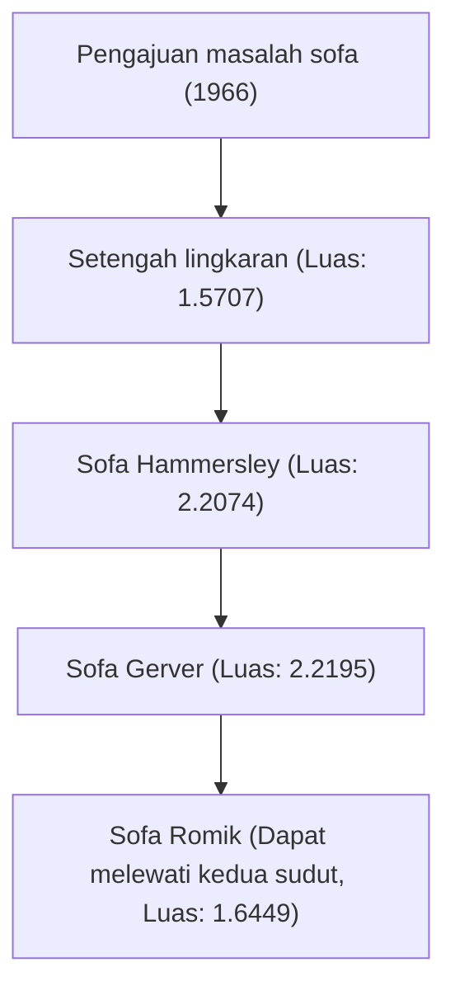

# 1. Pendahuluan: Masalah Tersulit yang Lahir dari Kehidupan Sehari-hari

"Apa bentuk dengan luas terbesar yang dapat melewati sudut lorong berbentuk L?"
Ini adalah masalah realistis yang dihadapi oleh siapa pun yang pernah memindahkan sofa saat pindahan, tetapi dalam dunia matematika, ini disebut "Masalah memindahkan sofa (Moving sofa problem)", sebuah teka-teki super sulit yang belum terpecahkan sejak tahun 1966.

Diusulkan secara resmi oleh matematikawan Austria-Kanada Leo Moser, masalah ini sekilas tampak cukup sederhana untuk dipahami oleh siswa sekolah menengah, tetapi telah menolak tantangan para matematikawan jenius di seluruh dunia selama lebih dari setengah abad.

Dalam artikel ini, kami akan menjelaskan secara menyeluruh sejarah masalah geometri yang menarik ini, berbagai pendekatan yang telah diusulkan hingga saat ini, dan mengapa masalah ini begitu sulit, disertai dengan rumus dan ilustrasi.

# 2. Formulasi Masalah Secara Matematis

Jika kita mendefinisikan masalah sofa secara matematis, jadinya seperti ini:

Misalkan L adalah wilayah berbentuk L tempat dua lorong dengan lebar 1 berpotongan tegak lurus. Misalkan area tertutup terhubung S (ini adalah sofa) di bidang dapat bergerak dari satu lorong ke lorong lain melalui bagian dalam L oleh keluarga parameter kontinu dari transformasi kongruen (translasi dan rotasi).

Pada saat ini, inti masalahnya adalah mencari nilai maksimum luas S (yang disebut "konstanta sofa") dan bentuk yang dapat diimplementasikan saat itu.

### 2.1 Klarifikasi Batasan
- **Benda tegar**: Sofa tidak boleh berubah bentuk saat bergerak.
- **Pergerakan kontinu**: Dari posisi awal hingga posisi akhir, sofa harus selalu berada di dalam lorong.
- **Masalah 2 dimensi**: Tinggi tidak dipertimbangkan, ini diperlakukan sebagai masalah pada bidang 2 dimensi.

# 3. Pencarian Konstanta Sofa: Perubahan Historis dan Pembaruan Batas Bawah

### 3.1 Tantangan Awal: Setengah Lingkaran dan Persegi
Bentuk paling sederhana yang bisa dibayangkan adalah setengah lingkaran dengan jari-jari 1. Luasnya sekitar 1.5707.
Selain itu, persegi 1x1 juga bisa melewati sudut (luas 1).

### 3.2 Lompatan John Hammersley (1968)
Matematikawan Inggris John Hammersley mengusulkan ide inovatif dengan membelah setengah lingkaran, memasukkan persegi panjang di antaranya, dan melubangi bagian dalamnya. Luas "Sofa Hammersley" ini adalah $2/\pi + \pi/2 \approx 2.2074$, yang secara signifikan meningkatkan batas bawah.

### 3.3 Optimisasi Joseph Gerver (1992)
Joseph Gerver semakin memperluas luasnya dengan mengganti batas lurus dari sofa Hammersley dengan kurva halus. Luas yang diturunkannya adalah sekitar 2.2195, yang telah lama bertahan sebagai luas maksimum yang diketahui (batas bawah).

# 4. Pencarian Batas Atas: Seberapa Besar Sofa Tidak Bisa Tumbuh?

Berbeda dengan pembaruan batas bawah, membuktikan batas atas bahwa "luas yang lebih besar dari ini benar-benar tidak mungkin" sangatlah sulit.

- **Batas atas awal**: Hammersley membuktikan bahwa nilai maksimum luasnya kurang dari atau sama dengan $2\sqrt{2} \approx 2.8284$.
- **Kemajuan tahun 2017**: Melalui penelitian oleh Dan Romik dan Yoav Kallus dari University of California, Davis, batas atas diturunkan menjadi 2.37.

Diketahui bahwa konstanta sofa saat ini berada di suatu tempat antara 2.2195 dan 2.37, tetapi nilai pastinya belum diidentifikasi.

# 5. Sofa Dua Arah Romik (2017)

Dan Romik mengusulkan variasi baru yang disebut "sofa ambidextrous", yang dapat melewati sudut kiri maupun kanan, bukan hanya sudut berbentuk L biasa. Luas maksimum dalam kasus ini dihitung menjadi sekitar 1.6449, dan bentuk ini juga telah didemonstrasikan dengan model yang dibuat oleh printer 3D.

# 6. Mengapa Masalah Sofa Sangat Sulit?

### 6.1 Derajat Kebebasan Tak Terbatas
Karena perlu mengoptimalkan bentuk dan lintasan pergerakan secara bersamaan, ruang pencarian oleh komputer menjadi tidak terbatas.

### 6.2 Ketiadaan Solusi Analitis
Batas dari bentuk optimal yang diketahui saat ini (Sofa Gerver) tidak direpresentasikan oleh busur sederhana atau parabola, melainkan sebagai solusi dari persamaan diferensial nonlinier yang sangat kompleks. Oleh karena itu, sangat sulit untuk menanganinya secara analitis.

### 6.3 Jebakan Solusi Optimal Lokal
Saat melakukan optimisasi numerik menggunakan komputer, mudah untuk jatuh ke dalam solusi optimal lokal yang tak terhitung jumlahnya, dan algoritma untuk menemukan solusi optimal global yang sebenarnya belum ditetapkan.

# 7. Prospek Masa Depan

Dalam beberapa tahun terakhir, upaya untuk mencari bentuk-bentuk baru menggunakan AI dan pembelajaran mesin telah dimulai, tetapi belum mencapai pembuktian matematis yang ketat. Masalah sofa adalah contoh bagus yang menunjukkan betapa tidak dapat diandalkannya intuisi manusia, dan betapa dalamnya geometri sederhana.

Saat Anda memindahkan sofa dan terjebak di sudut, pastikan untuk mengingat masalah matematika yang belum terpecahkan ini. Kesulitan yang Anda alami memiliki sifat yang sama dengan teka-teki abadi yang bahkan matematikawan top dunia pun tidak dapat memecahkannya.
