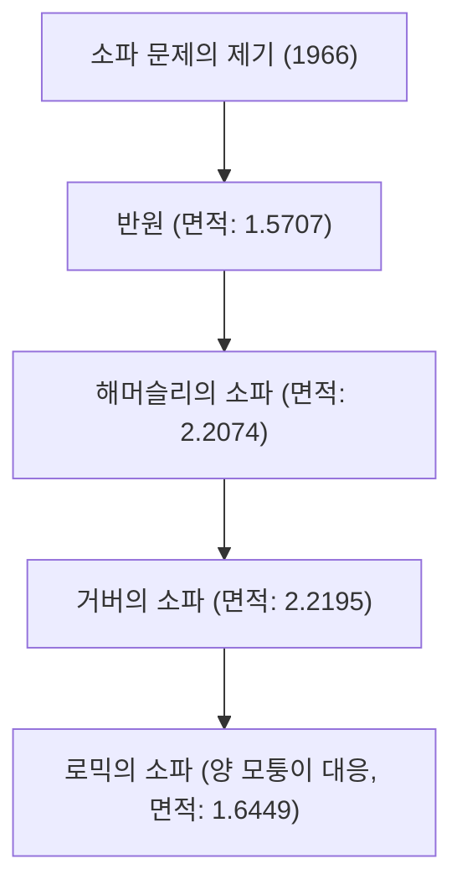

# 1. 인트로덕션: 일상에서 생겨나는 궁극의 난제

"L자형 복도의 모퉁이를 돌 수 있는, 가장 큰 면적을 가진 도형은 무엇인가?"
이것은 이사를 하면서 소파를 옮겨본 경험이 있는 사람이라면 누구나 직면하는 현실적인 문제이지만, 수학의 세계에서는 '소파 문제(Moving sofa problem)'라고 불리는 1966년부터 미해결된 초난제입니다.

오스트리아-캐나다의 수학자 레오 모저(Leo Moser)에 의해 공식적으로 제기된 이 문제는 언뜻 보면 중학생도 이해할 수 있을 만큼 간단하지만, 반세기 이상에 걸쳐 전 세계 천재 수학자들의 도전을 계속 물리치고 있습니다.

본 기사에서는 이 매혹적인 기하학 문제의 역사, 현재까지 제안된 다양한 접근법, 그리고 이 문제가 왜 이렇게까지 어려운지를 수식과 도해를 곁들여 철저하게 해설합니다.

# 2. 문제의 수학적 공식화

소파 문제를 수학적으로 엄밀하게 정의하면 다음과 같습니다.

폭이 1인 두 개의 복도가 직각으로 교차하는 L자형 영역을 L이라고 합니다. 평면 내의 연결된 닫힌 영역 S(이것이 소파입니다)가 합동 변환(평행 이동과 회전)의 연속적인 매개변수 족에 의해 L의 내부를 통과하여 한 복도에서 다른 복도로 이동할 수 있다고 가정합니다.

이때, S의 면적의 최댓값(이것을 '소파 상수'라고 부릅니다)과 그때 구현 가능한 모양을 구하라는 것이 문제의 핵심입니다.

### 2.1 제약 조건의 명확화
- **강체일 것**: 소파는 이동 중에 변형되어서는 안 됩니다.
- **연속적인 이동**: 초기 위치에서 종료 위치까지 소파는 항상 복도의 내부에 포함되어 있어야 합니다.
- **2차원 문제**: 높이는 고려하지 않고 2차원 평면상의 문제로 다룹니다.

# 3. 소파 상수의 탐구: 역사적 변천과 하한의 갱신

### 3.1 초기의 도전: 반원과 정사각형
가장 단순한 형태로서 반지름이 1인 반원을 생각할 수 있습니다. 이 면적은 약 1.5707입니다.
또한, 1×1 크기의 정사각형도 모퉁이를 돌 수 있습니다 (면적 1).

### 3.2 존 해머슬리의 도약 (1968년)
영국의 수학자 존 해머슬리는 반원을 잘라내어 사이에 직사각형을 삽입하고 안쪽을 파내는 획기적인 아이디어를 제안했습니다. 이 '해머슬리의 소파'의 면적은 $2/\pi + \pi/2 \approx 2.2074$가 되어 하한을 크게 끌어올렸습니다.

### 3.3 조지프 거버의 최적화 (1992년)
조지프 거버는 해머슬리의 소파의 직선 경계를 매끄러운 곡선으로 대체함으로써 면적을 더욱 확대했습니다. 그가 도출한 면적은 약 2.2195이며, 오랫동안 이것이 알려진 최대 면적(하한)으로 군림했습니다.

# 4. 상한의 탐구: 소파는 어디까지 커지지 않는가?

하한의 갱신과는 대조적으로 '이보다 큰 면적은 절대 불가능하다'는 상한의 증명은 매우 극심한 어려움을 겪고 있습니다.

- **초기의 상한**: 해머슬리는 면적의 최댓값이 $2\sqrt{2} \approx 2.8284$ 이하임을 증명했습니다.
- **2017년의 진전**: 캘리포니아 대학교 데이비스 캠퍼스의 댄 로믹과 요아브 칼라스의 연구에 의해 상한은 2.37까지 낮아졌습니다.

현재의 소파 상수는 2.2195에서 2.37 사이의 어딘가에 존재한다는 것은 알려져 있지만, 정확한 값은 아직 특정되지 않았습니다.

# 5. 로믹의 양방향 소파 (2017년)

댄 로믹은 L자 복도의 한쪽 모퉁이뿐만 아니라 좌우 양쪽 모퉁이를 모두 돌 수 있는 '앰비덱스트러스(양손잡이) 소파'라는 새로운 변형을 제안했습니다. 이 경우의 최대 면적은 약 1.6449인 것으로 계산되었으며, 이 형태는 3D 프린터로 제작된 모델을 통해서도 입증되었습니다.

# 6. 왜 소파 문제는 어려운가?

### 6.1 무한한 자유도
형태와 이동 경로를 동시에 최적화해야 하므로 컴퓨터에 의한 탐색 공간이 무한대가 되어버립니다.

### 6.2 해석적인 해의 부재
현재 알려진 최적의 형태(거버의 소파)의 경계는 단순한 원호나 포물선이 아니라 매우 복잡한 비선형 미분방정식의 해로 표현됩니다. 따라서 해석적으로 다루는 것이 지극히 어렵습니다.

### 6.3 국소적 최적해의 함정
컴퓨터에 의한 수치 최적화를 수행하면 무수한 국소적 최적해(로컬 미니멈)에 빠지기 쉽고, 진정한 전체 최적해(글로벌 미니멈)를 찾아내는 알고리즘은 확립되어 있지 않습니다.

# 7. 향후 전망

최근에는 AI나 기계학습을 활용하여 새로운 형태를 탐색하려는 시도도 시작되고 있지만, 수학적인 엄밀한 증명에는 이르지 못하고 있습니다. 소파 문제는 인간의 직관이 얼마나 믿음직하지 못한지, 그리고 단순한 기하학이 얼마나 심오한지를 보여주는 훌륭한 사례입니다.

이사를 할 때 소파가 모퉁이에 걸렸다면, 부디 이 수학의 미해결 문제를 떠올려 보시기 바랍니다. 여러분의 그 고생은 세계 최고봉의 수학자들도 해결하지 못하는 영원한 난제와 같은 성질을 가지고 있으니까요.
