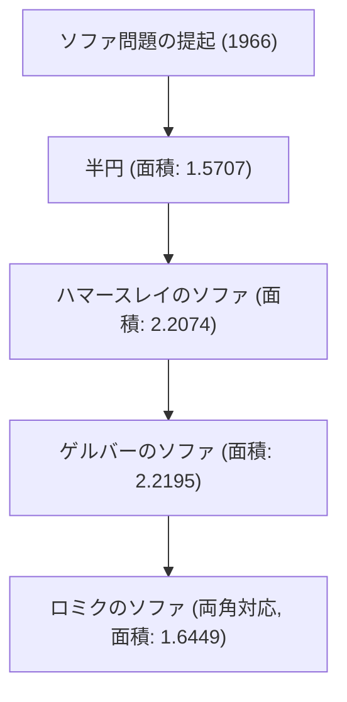

# 1. イントロダクション：日常から生まれる究極の難問

「L字型の廊下の角を曲がることができる、最大の面積を持つ図形は何か？」
これは、引越しでソファを運んだ経験がある人なら誰もが直面する現実的な問題ですが、数学の世界では「ソファ問題（Moving sofa problem）」と呼ばれる、1966年から未解決の超難問です。

オーストリア・カナダの数学者レオ・モーザー（Leo Moser）によって公式に提起されたこの問題は、一見すると中学生でも理解できるほどシンプルですが、半世紀以上にわたって世界中の天才数学者たちの挑戦を退け続けています。

本記事では、この魅惑的な幾何学問題の歴史、現在までに提案されている様々なアプローチ、そしてこの問題がなぜこれほどまでに難しいのかを、数式や図解を交えながら徹底的に解説します。

# 2. 問題の数学的定式化

ソファ問題を数学的に厳密に定義すると、以下のようになります。

幅1の2つの廊下が直角に交わるL字型の領域を L とします。平面内の連結な閉領域 S（これがソファです）が、合同変換（平行移動と回転）の連続的なパラメータ族によって、L の内部を通って一方の廊下から他方の廊下へ移動できるとします。

このとき、S の面積の最大値（これを「ソファ定数」と呼びます）とその際の実装可能な形状を求めよ、というのが問題の核心です。

### 2.1 制約条件の明確化
- **剛体であること**: ソファは移動中に変形してはいけません。
- **連続的な移動**: 初期位置から終了位置まで、ソファは常に廊下の内部に含まれていなければなりません。
- **2次元問題**: 高さは考慮せず、2次元平面上の問題として扱います。

# 3. ソファ定数の探求：歴史的変遷と下限の更新

### 3.1 初期の挑戦：半円と正方形
最も単純な形状として、半径1の半円が考えられます。この面積は約1.5707です。
また、1×1の正方形も曲がることができます（面積1）。

### 3.2 ジョン・ハマースレイの飛躍 (1968年)
イギリスの数学者ジョン・ハマースレイは、半円を切り離して間に長方形を挿入し、内側をくり抜くという画期的なアイデアを提案しました。この「ハマースレイのソファ」の面積は $2/\pi + \pi/2 \approx 2.2074$ となり、下限を大きく引き上げました。

### 3.3 ジョセフ・ゲルバーの最適化 (1992年)
ジョセフ・ゲルバーは、ハマースレイのソファの直線の境界を滑らかな曲線に置き換えることで、面積をさらに拡大しました。彼が導き出した面積は約2.2195であり、長らくこれが既知の最大面積（下限）として君臨しました。

# 4. 上限の探求：ソファはどこまで大きくならないか？

下限の更新とは対照的に、「これ以上大きな面積は絶対に不可能である」という上限の証明は非常に困難を極めています。

- **初期の上限**: ハマースレイは面積の最大値が $2\sqrt{2} \approx 2.8284$ 以下であることを証明しました。
- **2017年の進展**: カリフォルニア大学デービス校のダン・ロミクとヨーヴ・カラスの研究により、上限は 2.37 にまで引き下げられました。

現在のソファ定数は、2.2195 から 2.37 の間のどこかに存在することが分かっていますが、正確な値は未だに特定されていません。

# 5. ロミクの双方向ソファ (2017年)

ダン・ロミクは、L字の角だけでなく、左右両方の角を曲がることができる「アンビデクストラス（両利き）ソファ」という新たなバリエーションを提案しました。この場合の最大面積は約1.6449であることが計算されており、この形状は3Dプリンターで作成されたモデルによっても実証されています。

# 6. なぜソファ問題は難しいのか？

### 6.1 無限の自由度
形状と移動経路の両方を同時に最適化する必要があるため、計算機による探索空間が無限大になってしまいます。

### 6.2 解析的な解の不在
現在知られている最適な形状（ゲルバーのソファ）の境界は、単純な円弧や放物線ではなく、非常に複雑な非線形微分方程式の解として表されます。そのため、解析的に取り扱うことが極めて困難です。

### 6.3 局所的最適解の罠
コンピュータによる数値最適化を行うと、無数の局所的最適解（ローカルミニマム）に陥りやすく、真の全体最適解（グローバルミニマム）を見つけ出すアルゴリズムは確立されていません。

# 7. 今後の展望

近年では、AIや機械学習を用いて新たな形状を探索する試みも始まっていますが、数学的な厳密証明には至っていません。ソファ問題は、人間の直感がいかに頼りないか、そして単純な幾何学がいかに奥深いかを示す素晴らしい例です。

引越しの際にソファが角につっかえた時は、ぜひこの数学の未解決問題を思い出してみてください。あなたのその苦労は、世界最高峰の数学者たちでも解決できない永遠の難問と同じ性質を持っているのですから。
