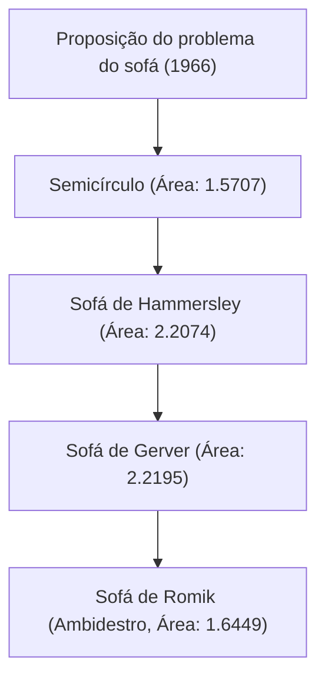

# 1. Introdução: O último dilema nascido da vida cotidiana

"Qual é a forma de maior área que pode manobrar através de uma curva em L num corredor?"
Este é um problema prático que qualquer pessoa que já tenha mudado um sofá experimentou, mas no mundo da matemática, é chamado de "Problema do Sofá", um problema super difícil não resolvido desde 1966.

Proposto oficialmente pelo matemático austro-canadense Leo Moser, o problema é à primeira vista simples o suficiente para um estudante do ensino médio entender, mas há mais de meio século tem resistido aos desafios de matemáticos geniais em todo o mundo.

Neste artigo, explicaremos detalhadamente a história deste fascinante problema geométrico, as diversas abordagens propostas até agora e o motivo pelo qual este problema é tão difícil, usando fórmulas matemáticas e diagramas.

# 2. Formulação Matemática do Problema

O problema do sofá pode ser estritamente definido matematicamente da seguinte forma.

Seja L a região em forma de L onde dois corredores de largura 1 se cruzam em um ângulo reto. Suponha que uma região fechada e conectada S (este é o sofá) no plano pode se mover de um corredor para o outro através do interior de L por uma família de parâmetros contínuos de transformações rígidas (translação e rotação).

O cerne do problema é encontrar o valor máximo da área de S (chamado de "constante do sofá") e a forma realizável nesse momento.

### 2.1 Esclarecimento das Restrições
- **Corpo rígido**: O sofá não deve deformar durante o movimento.
- **Movimento contínuo**: Da posição inicial à posição final, o sofá deve estar sempre contido no corredor.
- **Problema 2D**: A altura não é considerada, sendo tratado como um problema num plano 2D.

# 3. A Busca pela Constante do Sofá: Mudanças Históricas e Atualizações do Limite Inferior

### 3.1 Desafios iniciais: Semicírculo e Quadrado
A forma mais simples a ser considerada é um semicírculo com raio 1. Esta área é de cerca de 1.5707.
Além disso, um quadrado 1x1 também pode virar a esquina (área 1).

### 3.2 O Salto de John Hammersley (1968)
O matemático britânico John Hammersley propôs a ideia inovadora de cortar o semicírculo ao meio, inserindo um retângulo entre as metades e escavando o interior. A área deste "sofá de Hammersley" é $2/\pi + \pi/2 \approx 2.2074$, o que elevou consideravelmente o limite inferior.

### 3.3 A Otimização de Joseph Gerver (1992)
Joseph Gerver expandiu ainda mais a área ao substituir a fronteira reta do sofá de Hammersley por curvas suaves. A área que ele derivou foi de aproximadamente 2.2195, que reinou como a área máxima conhecida (limite inferior) por um longo tempo.

# 4. A Busca pelo Limite Superior: Quão Grande um Sofá Não Pode Ficar?

Em contraste com as atualizações no limite inferior, provar o limite superior de que "uma área maior é absolutamente impossível" tem sido extremamente difícil.

- **Limite Superior Inicial**: Hammersley provou que a área máxima não é superior a $2\sqrt{2} \approx 2.8284$.
- **Progresso em 2017**: A pesquisa de Dan Romik e Yoav Kallus da Universidade da Califórnia, Davis, reduziu o limite superior para 2.37.

Sabe-se que a constante do sofá atual existe em algum lugar entre 2.2195 e 2.37, mas o valor exato ainda não foi determinado.

# 5. O Sofá Ambidestro de Romik (2017)

Dan Romik propôs uma nova variação chamada "sofá ambidestro", que pode virar não apenas uma esquina em forma de L, mas também ambas as esquinas esquerda e direita. A área máxima para este caso foi calculada como cerca de 1.6449, e esta forma também foi demonstrada com um modelo criado em impressora 3D.

# 6. Por Que o Problema do Sofá É Tão Difícil?

### 6.1 Graus Infinitos de Liberdade
Como tanto a forma quanto a trajetória de movimento precisam ser otimizadas simultaneamente, o espaço de busca computacional torna-se infinito.

### 6.2 Ausência de Solução Analítica
Os limites da forma ótima atualmente conhecida (o sofá de Gerver) não são simples arcos ou parábolas, mas são expressos como a solução de equações diferenciais não lineares altamente complexas. Portanto, é extremamente difícil lidar analiticamente.

### 6.3 Armadilha dos Ótimos Locais
Quando a otimização numérica em computador é realizada, ela tende a cair em inumeráveis soluções ótimas locais (mínimos locais), e não há um algoritmo estabelecido para encontrar a verdadeira solução ótima global (mínimo global).

# 7. Perspectivas Futuras

Nos últimos anos, foram iniciadas tentativas de explorar novas formas usando IA e aprendizado de máquina, mas provas matemáticas rigorosas ainda não foram alcançadas. O problema do sofá é um excelente exemplo de quão não confiável pode ser a intuição humana e o quão profunda pode ser a geometria simples.

Da próxima vez que o seu sofá ficar preso numa esquina ao se mudar, lembre-se deste problema matemático não resolvido. Afinal, a sua luta tem a mesma natureza que um enigma eterno que até os melhores matemáticos do mundo não conseguem resolver.
