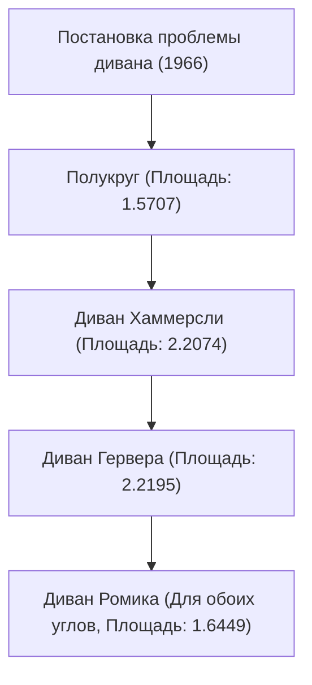

# 1. Введение: сложнейшая задача, рожденная из повседневности

«Какова максимальная площадь фигуры, способной пройти поворот Г-образного коридора под прямым углом?»
Это практическая проблема, с которой сталкивался каждый, кому приходилось переносить диван при переезде. Однако в мире математики это известная с 1966 года нерешенная сверхсложная задача, получившая название «Проблема перемещения дивана» (Moving sofa problem).

Официально сформулированная австро-канадским математиком Лео Мозером (Leo Moser), эта задача на первый взгляд кажется настолько простой, что ее может понять даже школьник. Тем не менее на протяжении более полувека она продолжает отвергать попытки решения со стороны гениальных математиков со всего мира.

В этой статье мы подробно, с использованием формул и иллюстраций, разберем историю этой увлекательной геометрической задачи, различные подходы, предложенные до настоящего времени, и причины, по которым она оказывается столь сложной.

# 2. Математическая формулировка проблемы

Строгое математическое определение проблемы дивана выглядит следующим образом.

Пусть $L$ — Г-образная область, образованная пересечением под прямым углом двух коридоров шириной 1. Предположим, что связная замкнутая область $S$ на плоскости (которая и является диваном) может перемещаться внутри $L$ из одного коридора в другой с помощью непрерывного однопараметрического семейства движений (параллельных переносов и вращений).

Суть задачи заключается в том, чтобы найти максимальное значение площади $S$ (называемое «константой дивана») и соответствующую форму, которую можно реализовать.

### 2.1 Уточнение ограничений
- **Твердое тело**: Диван не должен деформироваться во время перемещения.
- **Непрерывное перемещение**: От начального до конечного положения диван должен всегда находиться внутри коридора.
- **Двумерная задача**: Высота не учитывается, задача рассматривается на двумерной плоскости.

# 3. Поиск константы дивана: историческое развитие и обновление нижней границы

### 3.1 Ранние попытки: полукруг и квадрат
Самой простой формой является полукруг радиуса 1. Его площадь составляет около 1.5707.
Квадрат размером 1×1 также может пройти поворот (площадь 1).

### 3.2 Прорыв Джона Хаммерсли (1968 год)
Британский математик Джон Хаммерсли предложил революционную идею: разрезать полукруг на две четверти, вставить между ними прямоугольник и вырезать внутреннюю часть. Площадь этого «дивана Хаммерсли» составляет $2/\pi + \pi/2 \approx 2.2074$, что значительно повысило нижнюю границу.

### 3.3 Оптимизация Джозефа Гервера (1992 год)
Джозеф Гервер еще больше увеличил площадь, заменив прямолинейные границы дивана Хаммерсли гладкими кривыми. Полученная им площадь составила около 2.2195, и долгое время это значение оставалось максимальной известной площадью (нижней границей).

# 4. Поиск верхней границы: насколько большим не может быть диван?

В отличие от обновления нижней границы, доказательство верхней границы — утверждения, что «большая площадь абсолютно невозможна» — оказалось чрезвычайно сложным.

- **Ранняя верхняя граница**: Хаммерсли доказал, что максимальная площадь не превышает $2\sqrt{2} \approx 2.8284$.
- **Прогресс 2017 года**: Благодаря исследованиям Дана Ромика и Йоава Калласа из Калифорнийского университета в Дэвисе верхняя граница была снижена до 2.37.

В настоящее время известно, что константа дивана находится где-то между 2.2195 и 2.37, но точное значение до сих пор не установлено.

# 5. Двусторонний диван Ромика (2017 год)

Дан Ромик предложил новую вариацию — «двусторонний (амбидекстр) диван», который может проходить не только обычный Г-образный угол, но и углы как налево, так и направо. Вычислено, что максимальная площадь в этом случае составляет около 1.6449, и эта форма была также продемонстрирована с помощью модели, созданной на 3D-принтере.

# 6. Почему проблема дивана так сложна?

### 6.1 Бесконечные степени свободы
Поскольку необходимо одновременно оптимизировать как форму, так и траекторию движения, пространство поиска для компьютера становится бесконечным.

### 6.2 Отсутствие аналитического решения
Границы наилучшей известной на данный момент формы (дивана Гервера) описываются не простыми дугами или параболами, а как решения очень сложных нелинейных дифференциальных уравнений. Из-за этого аналитическая работа с ними крайне затруднена.

### 6.3 Ловушка локальных оптимумов
При численной оптимизации с помощью компьютера легко попасть в бесчисленные локальные оптимумы (локальные минимумы), и до сих пор не создан алгоритм, способный гарантированно находить истинный глобальный оптимум.

# 7. Перспективы на будущее

В последние годы начались попытки поиска новых форм с использованием искусственного интеллекта и машинного обучения, однако к строгим математическим доказательствам это пока не привело. Проблема дивана — прекрасный пример того, насколько ненадежной может быть человеческая интуиция и насколько глубокой может оказаться простая геометрия.

Когда в следующий раз при переезде ваш диван застрянет на углу, вспомните об этой нерешенной математической задаче. Ваша борьба имеет ту же природу, что и вечная загадка, которую не могут решить даже величайшие математики мира.
